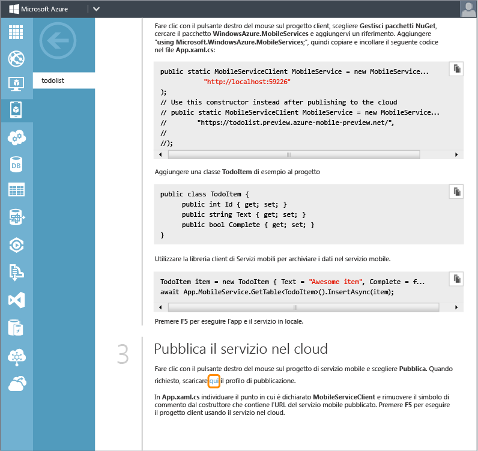

<properties linkid="mobile-services-dotnet-backend-windows-store-dotnet-get-started-data" urlDisplayName="Get Started with Data" pageTitle="Get started with data (Windows Store) | Mobile Dev Center" metaKeywords="" description="Learn how to get started using Mobile Services to leverage data in your Windows Store app." metaCanonical="" services="mobile-services" documentationCenter="Mobile" title="Get started with data in Mobile Services" authors="wesmc" solutions="" manager="dwrede" editor="" />

<tags ms.service="mobile-services" ms.workload="mobile" ms.tgt_pltfrm="mobile-windows-store" ms.devlang="dotnet" ms.topic="article" ms.date="09/23/2014" ms.author="wesmc"></tags>

# Introduzione ai dati in Servizi mobili

[WACOM.INCLUDE [mobile-services-selector-get-started-data-legacy](../includes/mobile-services-selector-get-started-data-legacy.md)]

    <a href="/it-it/documentation/articles/mobile-services-dotnet-backend-windows-store-dotnet-get-started-data/" title=".NET backend" class="current">Back-end .NET</a> | 
    <a href="/it-it/documentation/articles/mobile-services-windows-store-dotnet-get-started-data/" title="JavaScript backend">Back-end JavaScript</a>

Questo argomento illustra come usare Servizi mobili di Azure come origine dati back-end per un'app di Windows Store. Questa esercitazione consente di scaricare un progetto di Visual Studio 2013 per un'app che archivia dati in memoria, di creare un nuovo servizio mobile e integrarlo con l'app e quindi di visualizzare le modifiche apportate ai dati durante l'esecuzione dell'app.

Il servizio mobile creato in questa esercitazione è un servizio mobile back-end .NET. Il back-end .NET consente di usare linguaggi .NET e Visual Studio per la logica di business sul lato server nel servizio mobile, che può essere eseguito e sottoposto a debug sul computer locale. Per creare un servizio mobile che consenta di scrivere la logica di business sul lato server in JavaScript, vedere la versione per back-end JavaScript di questo argomento.

> [WACOM.NOTE]Questo argomento illustra come aggiungere Servizi mobili di Azure a un progetto di Windows Store. È possibile usare gli strumenti di Visual Studio 2013 per aggiungere lo stesso servizio mobile back-end .NET a un progetto di app Windows universale. Per altre informazioni, vedere la [versione di app Windows universale][versione di app Windows universale] di questa esercitazione.

In questa esercitazione vengono descritte le operazioni di base seguenti:

1.  [Download del progetto dell'app di Windows Store][Download del progetto dell'app di Windows Store]
2.  [Creazione di un nuovo servizio mobile][Creazione di un nuovo servizio mobile]
3.  [Download del servizio mobile in locale][Download del servizio mobile in locale]
4.  [Aggiornamento dell'app di Windows Store per l'uso del servizio mobile][Aggiornamento dell'app di Windows Store per l'uso del servizio mobile]
5.  [Test dell'app di Windows Store con il servizio ospitato in locale][Test dell'app di Windows Store con il servizio ospitato in locale]
6.  [Pubblicazione del servizio mobile in Azure][Pubblicazione del servizio mobile in Azure]
7.  [Test dell'app di Windows Store con il servizio ospitato in Azure][Test dell'app di Windows Store con il servizio ospitato in Azure]

Per completare l'esercitazione, sono necessari gli elementi seguenti:

-   Un account Azure attivo. Se non si dispone di un account, è possibile creare un account di valutazione gratuita in pochi minuti. Per informazioni dettagliate, vedere la pagina relativa alla [versione di valutazione gratuita di Azure][versione di valutazione gratuita di Azure].
-   [Visual Studio Professional 2013][Visual Studio Professional 2013]. È disponibile una versione di valutazione gratuita.

## Scaricare il progetto GetStartedWithData

Questa esercitazione è basata sull'[app GetStartedWithMobileServices][app GetStartedWithMobileServices], ovvero un progetto di app di Windows Store disponibile in Visual Studio 2013. L'interfaccia utente di questa app è simile a quella dell'app generata dalla guida introduttiva di Servizi mobili, ma in questo caso gli elementi aggiunti vengono archiviati nella memoria locale.

1.  Scaricare la versione in C# dell'app di esempio GetStartedWithMobileServices dal [sito degli esempi di codice di Developer Network][app GetStartedWithMobileServices].

2.  Eseguire Visual Studio 2013 con privilegi amministrativi facendo clic con il pulsante destro del mouse su Visual Studio e scegliendo **Esegui come amministratore**.

3.  In Visual Studio 2013 aprire il progetto scaricato ed esaminare il file MainPage.xaml.cs.

    Si noti che gli oggetti **TodoItem** aggiunti sono archiviati in un oggetto **ObservableCollection\<TodoItem\>** in memoria.

4.  Premere **F5** per ricompilare il progetto e avviare l'app.

5.  Nell'app digitare un testo in **Insert a TodoItem**, quindi fare clic su **Save**.

    ![][0]

    Si noti che il testo salvato viene visualizzato nella seconda colonna sotto **Query and update data**.

## Creazione di un nuovo servizio mobile

[WACOM.INCLUDE [mobile-services-dotnet-backend-create-new-service](../includes/mobile-services-dotnet-backend-create-new-service.md)]

## Download del progetto di servizio mobile e aggiunta del progetto alla soluzione

1.  Nel [portale di gestione di Azure][portale di gestione di Azure] fare clic sul nuovo servizio mobile o sulla scheda della relativa icona per passare alla pagina di panoramica.

    ![][1]

2.  Fare clic sulla piattaforma **Windows Store**. Nella sezione **Get Started** espandere **Connect an existing Windows Store app** e fare clic sul pulsante **Download** per scaricare un progetto iniziale personalizzato per il servizio mobile.

    ![][2]

3.  Scorrere verso il basso nella sezione **Get Started** fino al passaggio **Publish your service to the cloud**. Fare clic sul collegamento visualizzato nella schermata in basso per scaricare un file del profilo di pubblicazione per il servizio mobile appena scaricato.

    > [WACOM.NOTE] Salvare il file in una posizione sicura, in quanto contiene informazioni sensibili relative all'account Azure. Il file verrà eliminato dopo la pubblicazione del servizio mobile, più avanti in questo argomento.

    

4.  Decomprimere il progetto iniziale personalizzato del servizio scaricato in precedenza. Copiare le cartelle estratte dal file ZIP nella stessa directory **C#** in cui si trova il file della soluzione GetStartedWithData (con estensione sln). In questo modo, per il componente Gestione pacchetti NuGet sarà più semplice mantenere sincronizzati tutti i pacchetti.

    ![][4]

5.  In Esplora soluzioni di Visual Studio fare clic con il pulsante destro del mouse sulla soluzione per l'app di Windows Store GetStartedWithData. Scegliere **Aggiungi**, quindi **Progetto esistente**.

    ![][5]

6.  Nella finestra di dialogo Aggiungi progetto esistente passare alla cartella del progetto di servizio mobile che è stata precedentemente spostata nella directory **C#**. Selezionare il file di progetto di C# (con estensione csproj) nella sottodirectory del servizio. Fare clic su **Apri** per aggiungere il progetto alla soluzione.

    ![][6]

7.  In Visual Studio, in Esplora soluzioni fare clic con il pulsante destro del mouse sul progetto di servizio appena aggiunto e quindi scegliere **Compila** per verificare che venga compilato senza errori. Durante la compilazione, è possibile che Gestione pacchetti NuGet debba ripristinare alcuni pacchetti NuGet a cui viene fatto riferimento nel progetto.

    ![][7]

8.  Fare di nuovo clic con il pulsante destro del mouse sul progetto di servizio. Questa volta, scegliere **Avvia nuova istanza** nel menu di scelta rapida **Debug**.

    ![][8]

    Visual Studio aprirà la pagina Web predefinita per il servizio. È possibile fare clic su **try it now** per testare i metodi del servizio mobile dalla pagina Web predefinita.

    ![][9]

    Per impostazione predefinita, Visual Studio ha ospitato il servizio mobile localmente in IIS Express. Questo è facilmente verificabile facendo clic con il pulsante destro del mouse sull'icona di IIS Express sulla barra delle applicazioni.

    ![][10]

# Aggiornamento dell'app di Windows Store per l'uso del servizio mobile

In questa sezione l'app di Windows Store verrà aggiornata per l'utilizzo del servizio mobile come servizio back-end.

1.  In Visual Studio, in Esplora soluzioni fare clic con il pulsante destro del mouse sul progetto di app di Windows Store e quindi scegliere **Manage NuGet Packages**.

    ![][11]

2.  Nella finestra di dialogo Manage NuGet Packages cercare **WindowsAzure.MobileServices** nella raccolta di pacchetti online e fare clic per installare il pacchetto NuGet per Servizi mobili di Azure. Chiudere la finestra di dialogo.

    ![][12]

3.  Tornare al portale di gestione di Azure e individuare il passaggio **Connect your app and store data in your service**. Assicurarsi che sia selezionato il linguaggio **C#**. Copiare il frammento di codice che crea la connessione `MobileServiceClient`.

    ![][13]

4.  In Visual Studio aprire il file App.xaml.cs. Incollare il frammento di codice all'inizio della definizione di classe `App`. Aggiungere inoltre l'istruzione `using` seguente all'inizio del file e salvare il file.

        using Microsoft.WindowsAzure.MobileServices;

    ![][14]

5.  In Visual Studio aprire il file MainPage.xaml.cs e aggiungere l'istruzione using:

        using Microsoft.WindowsAzure.MobileServices;

6.  In Visual Studio, nel file MainPage.xaml.cs sostituire la definizione di classe `MainPage` con la definizione seguente e salvare il file.

    Questo codice utilizza Mobile Services SDK per abilitare l'archiviazione dei dati dell'app in una tabella fornita dal servizio anziché nella memoria locale. I tre metodi principali sono `InsertTodoItem`, `RefreshTodoItems` e `UpdateCheckedTodoItem`. Questi tre metodi consentono di eseguire operazioni asincrone di inserimento, aggiornamento o query sulla raccolta dati con una tabella in Azure.

        public sealed partial class MainPage : Page
        {
            private MobileServiceCollection<TodoItem, TodoItem> items;
            private IMobileServiceTable<TodoItem> todoTable = 
                App.MobileService.GetTable<TodoItem>();            
            public MainPage()
            {
                this.InitializeComponent();
            }
            private async void InsertTodoItem(TodoItem todoItem)
            {
                await todoTable.InsertAsync(todoItem); 
                items.Add(todoItem);
            }
            private async void RefreshTodoItems()
            {
                items = await todoTable.ToCollectionAsync(); 
                ListItems.ItemsSource = items;
            }
            private async void UpdateCheckedTodoItem(TodoItem item)
            {
                await todoTable.UpdateAsync(item);      
            }
            private void ButtonRefresh_Click(object sender, RoutedEventArgs e)
            {
                RefreshTodoItems();
            }
            private void ButtonSave_Click(object sender, RoutedEventArgs e)
            {
                var todoItem = new TodoItem { Text = TextInput.Text };
                InsertTodoItem(todoItem);
            }
            private void CheckBoxComplete_Checked(object sender, RoutedEventArgs e)
            {
                CheckBox cb = (CheckBox)sender;
                TodoItem item = cb.DataContext as TodoItem;
                UpdateCheckedTodoItem(item);
            }
            protected override void OnNavigatedTo(NavigationEventArgs e)
            {
                RefreshTodoItems();
            }
        }

## Test dell'app di Windows Store con il servizio ospitato in locale

[WACOM.INCLUDE [mobile-services-dotnet-backend-test-local-service-data](../includes/mobile-services-dotnet-backend-test-local-service-data.md)]

## Pubblicazione del servizio mobile in Azure

[WACOM.INCLUDE [mobile-services-dotnet-backend-publish-service](../includes/mobile-services-dotnet-backend-publish-service.md)]

## Test del servizio mobile pubblicato in Azure

1.  In Visual Studio aprire il file App.xaml.cs. Impostare come commento il codice per la creazione dell'oggetto `MobileServiceClient` che esegue la connessione al servizio mobile ospitato localmente. Rimuovere i simboli di commento dal codice per la creazione dell'oggetto `MobileServiceClient` che esegue la connessione al servizio in Azure. Salvare le modifiche al file.

        sealed partial class App : Application
        {
            //public static MobileServiceClient MobileService = new MobileServiceClient(
            //          "http://localhost:59226"
            //);
            // Use this constructor instead after publishing to the cloud
            public static MobileServiceClient MobileService = new MobileServiceClient(
                 "https://todolist.preview.azure-mobile-preview.net/",
                 "XXXXXXXXXXXXXXXXXXXXXXXXXXXXXXXX"
            );        
            ....

2.  In Visual Studio premere F5 o scegliere **Avvia debug** dal menu Debug. In questo modo, prima dell'esecuzione, l'app di Windows Store verrà ricompilata con la modifica precedente, per effettuare la connessione al servizio mobile ospitato in remoto in Azure.

3.  Immettere nuovi elementi todoitem e fare clic su **Salva** per ognuno di essi. Fare clic sulla casella di controllo per completare alcuni dei nuovi elementi. Ogni nuovo elemento TodoItem verrà archiviato e aggiornato nel database SQL precedentemente configurato per il servizio mobile nel portale di gestione di Azure.

    ![][15]

    È possibile riavviare l'app per verificare che le modifiche siano state salvate in modo permanente nel database in Azure.

## Visualizzazione dei dati archiviati nel database SQL

[WACOM.INCLUDE [mobile-services-dotnet-backend-view-sql-data](../includes/mobile-services-dotnet-backend-view-sql-data.md)]

L'esercitazione **Introduzione ai dati** è terminata.

## Passaggi successivi

In questa esercitazione vengono illustrate le nozioni di base per consentire a un'app di Windows Store di utilizzare dati in Servizi mobili. In seguito, è consigliabile eseguire una delle esercitazioni seguenti, basate sull'app GetStartedWithData creata in questa esercitazione:

-   [Utilizzo di script per la convalida e la modifica di dati][Utilizzo di script per la convalida e la modifica di dati]
    Ulteriori informazioni sull'utilizzo di script del server in Servizi mobili per convalidare e modificare i dati inviati dall'app.

-   [Utilizzo del paging per ridefinire le query][Utilizzo del paging per ridefinire le query]
    Ulteriori informazioni su come utilizzare il paging nelle query per controllare la quantità di dati gestiti in un'unica richiesta.

Una volta completata la serie relativa ai dati, provare a eseguire una delle esercitazioni seguenti:

-   [Introduzione all'autenticazione][Introduzione all'autenticazione]
    Informazioni sull'autenticazione degli utenti dell'app.

-   [Introduzione alle notifiche push][Introduzione alle notifiche push]
    Informazioni sull'invio di una notifica push di base all'app.

-   [Riferimento per i concetti e le procedure di Servizi mobili con .NET][Riferimento per i concetti e le procedure di Servizi mobili con .NET]
    Ulteriori informazioni su come utilizzare Servizi mobili con .NET.

<!-- Anchors. -->
<!-- Images. -->
<!-- URLs. -->

  [Back-end .NET]: /it-it/documentation/articles/mobile-services-dotnet-backend-windows-store-dotnet-get-started-data/ ".NET backend"
  [Back-end JavaScript]: /it-it/documentation/articles/mobile-services-windows-store-dotnet-get-started-data/ "JavaScript backend"
  [versione di app Windows universale]: /it-it/documentation/articles/mobile-services-dotnet-backend-windows-universal-dotnet-get-started-data
  [Download del progetto dell'app di Windows Store]: #download-app
  [Creazione di un nuovo servizio mobile]: #create-service
  [Download del servizio mobile in locale]: #download-the-service-locally
  [Aggiornamento dell'app di Windows Store per l'uso del servizio mobile]: #update-app
  [Test dell'app di Windows Store con il servizio ospitato in locale]: #test-locally-hosted
  [Pubblicazione del servizio mobile in Azure]: #publish-mobile-service
  [Test dell'app di Windows Store con il servizio ospitato in Azure]: #test-azure-hosted
  [versione di valutazione gratuita di Azure]: http://azure.microsoft.com/it-it/pricing/free-trial/?WT.mc_id=A0E0E5C02&returnurl=http%3A%2F%2Fazure.microsoft.com%2Fit-it%2Fdocumentation%2Farticles%2Fmobile-services-dotnet-backend-windows-store-dotnet-get-started-data%2F
  [Visual Studio Professional 2013]: https://go.microsoft.com/fwLink/p/?LinkID=257546
  [app GetStartedWithMobileServices]: http://go.microsoft.com/fwlink/p/?LinkId=328660
  [0]: ./media/mobile-services-dotnet-backend-windows-store-dotnet-get-started-data/app-view.png
  [portale di gestione di Azure]: https://manage.windowsazure.com/
  [1]: ./media/mobile-services-dotnet-backend-windows-store-dotnet-get-started-data/mobile-service-overview-page.png
  [2]: ./media/mobile-services-dotnet-backend-windows-store-dotnet-get-started-data/download-service-project.png
  [4]: ./media/mobile-services-dotnet-backend-windows-store-dotnet-get-started-data/copy-service-and-packages-folder.png
  [5]: ./media/mobile-services-dotnet-backend-windows-store-dotnet-get-started-data/add-service-project-to-solution.png
  [6]: ./media/mobile-services-dotnet-backend-windows-store-dotnet-get-started-data/add-existing-project-dialog.png
  [7]: ./media/mobile-services-dotnet-backend-windows-store-dotnet-get-started-data/vs-build-service-project.png
  [8]: ./media/mobile-services-dotnet-backend-windows-store-dotnet-get-started-data/vs-start-debug-service-project.png
  [9]: ./media/mobile-services-dotnet-backend-windows-store-dotnet-get-started-data/service-welcome-page.png
  [10]: ./media/mobile-services-dotnet-backend-windows-store-dotnet-get-started-data/iis-express-tray.png
  [11]: ./media/mobile-services-dotnet-backend-windows-store-dotnet-get-started-data/vs-manage-nuget-packages.png
  [12]: ./media/mobile-services-dotnet-backend-windows-store-dotnet-get-started-data/manage-nuget-packages.png
  [13]: ./media/mobile-services-dotnet-backend-windows-store-dotnet-get-started-data/copy-mobileserviceclient-snippet.png
  [14]: ./media/mobile-services-dotnet-backend-windows-store-dotnet-get-started-data/vs-pasted-mobileserviceclient.png
  [15]: ./media/mobile-services-dotnet-backend-windows-store-dotnet-get-started-data/azure-items.png
  [Utilizzo di script per la convalida e la modifica di dati]: /it-it/develop/mobile/tutorials/validate-modify-and-augment-data-dotnet
  [Utilizzo del paging per ridefinire le query]: /it-it/develop/mobile/tutorials/add-paging-to-data-dotnet
  [Introduzione all'autenticazione]: /it-it/documentation/articles/mobile-services-dotnet-backend-windows-store-dotnet-get-started-users/
  [Introduzione alle notifiche push]: /it-it/documentation/articles/mobile-services-dotnet-backend-windows-store-dotnet-get-started-push/
  [Riferimento per i concetti e le procedure di Servizi mobili con .NET]: /it-it/documentation/articles/mobile-services-windows-dotnet-how-to-use-client-library/
