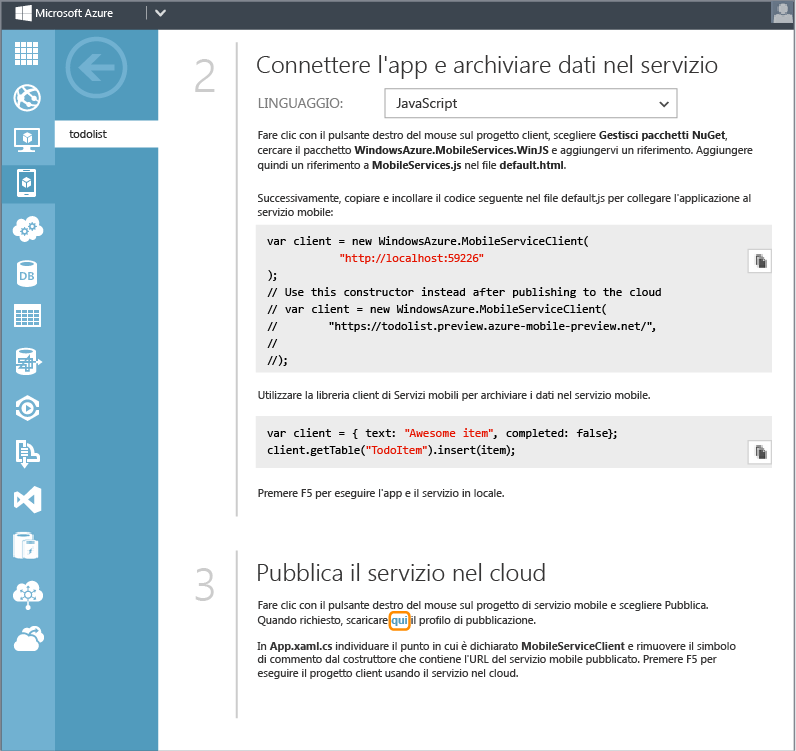
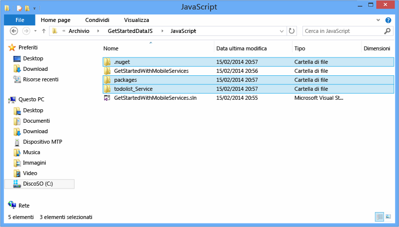
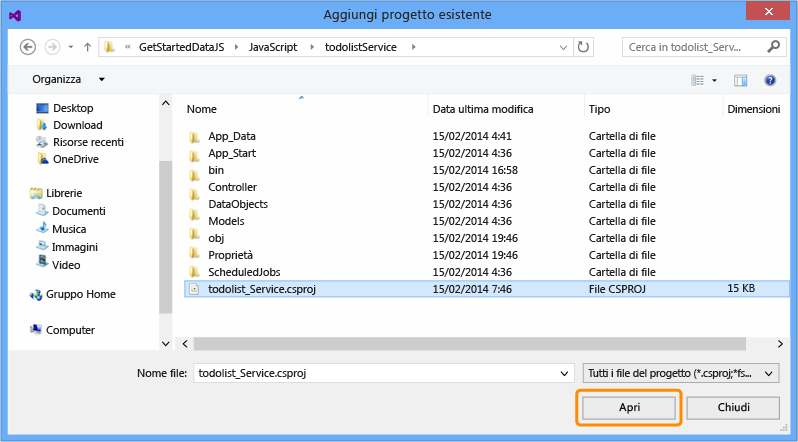
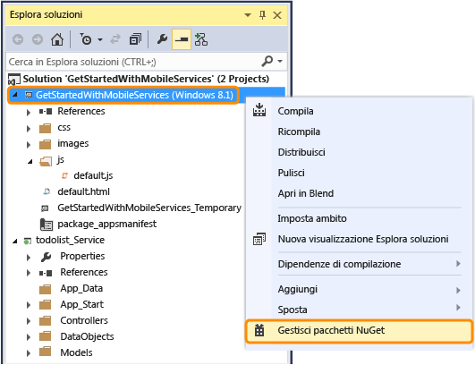
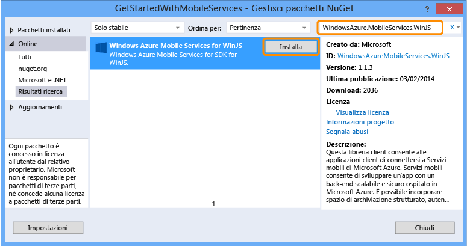
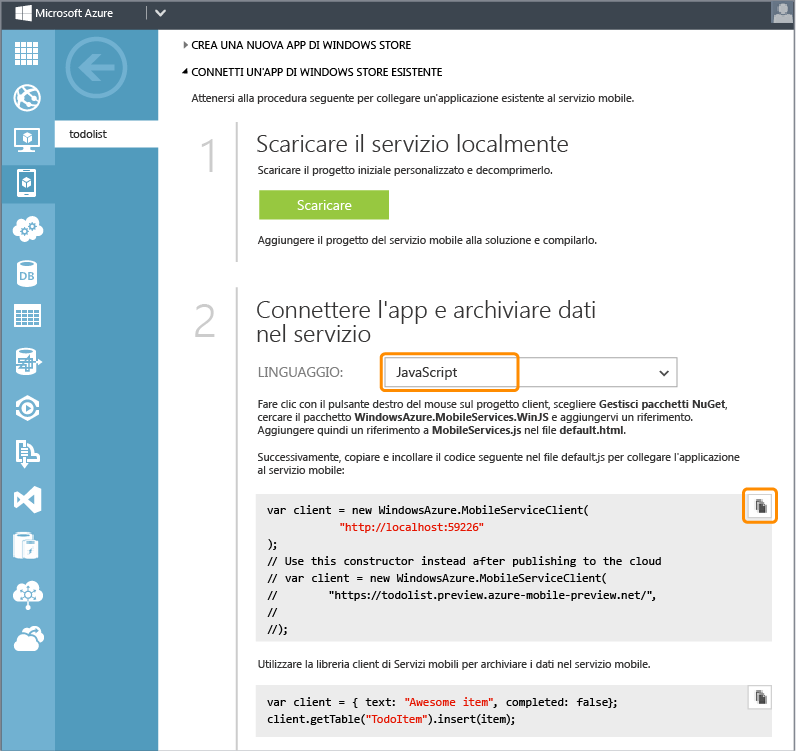
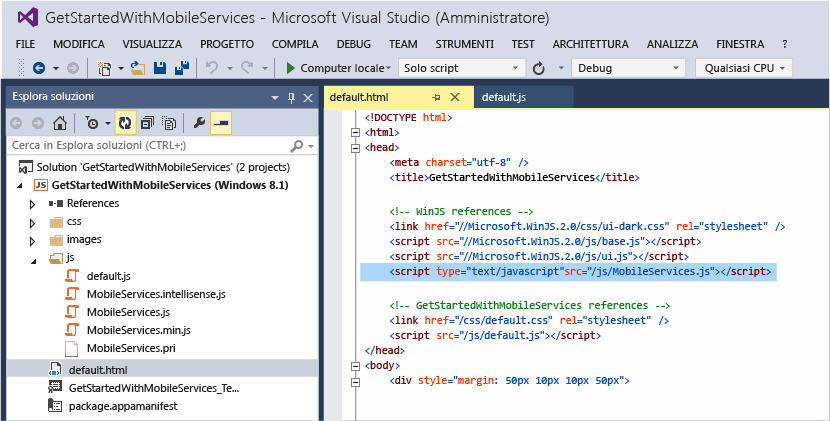
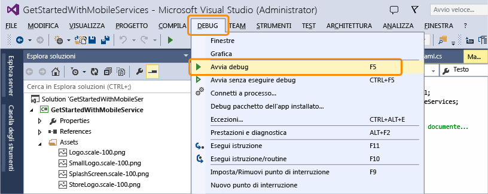
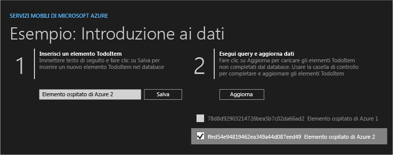

<properties linkid="develop-mobile-tutorials-dotnet-backend-get-started-with-data-javascript-vs2013" urlDisplayName="Get Started with Data" pageTitle="Get started with data (Windows Store) | Mobile Dev Center" metaKeywords="" description="Learn how to get started using Mobile Services to leverage data in your Windows Store app." metaCanonical="" services="" documentationCenter="Mobile" title="Get started with data in Mobile Services" authors="wesmc" solutions="" manager="" editor="" />

Introduzione ai dati in Servizi mobili
======================================

[Windows Store C\#](/it-it/documentation/articles/mobile-services-dotnet-backend-windows-store-dotnet-get-started-data/ "Windows Store C#") [Windows Store JavaScript](/it-it/documentation/articles/mobile-services-dotnet-backend-windows-store-javascript-get-started-data/ "Windows Store JavaScript") [Windows Phone](/it-it/documentation/articles/mobile-services-dotnet-backend-windows-phone-get-started-data/ "Windows Phone")
[Back-end .NET](/it-it/documentation/articles/mobile-services-dotnet-backend-windows-store-javascript-get-started-data/ "Back-end .NET") | [Back-end JavaScript](/it-it/documentation/articles/mobile-services-windows-store-javascript-get-started-data/ "Back-end JavaScript")

In questo argomento viene illustrato come utilizzare Servizi mobili di Azure come origine dati di back-end per un'app di Windows Store. In questa esercitazione si scaricherà un progetto di Visual Studio 2013 per un'app che archivia dati in memoria, si creerà un nuovo servizio mobile e lo si integrerà con l'app e quindi si visualizzeranno le modifiche apportate ai dati durante l'esecuzione dell'app.

Il servizio mobile creato in questa esercitazione supporterà il runtime .NET. Questo consentirà di utilizzare linguaggi .NET e Visual Studio per la logica di business sul lato server nel servizio mobile. Per creare un servizio mobile che consenta di scrivere la logica di business sul lato server in JavaScript, vedere la [versione per back-end JavaScript](/en-us/develop/mobile/tutorials/get-started-with-data-js) di questo argomento.
**Nota**

Per completare questa esercitazione, è necessario disporre di Visual Studio 2013.

In questa esercitazione vengono descritte le operazioni di base seguenti:

1.  [Download del progetto dell'app di Windows Store](#download-app)
2.  [Creazione di un nuovo servizio mobile](#create-service)
3.  [Download del servizio mobile in locale](#download-the-service-locally)
4.  [Aggiornamento dell'app di Windows Store per l'utilizzo del servizio mobile](#update-app)
5.  [Test dell'app di Windows Store con il servizio ospitato in locale](#test-locally-hosted)
6.  [Pubblicazione del servizio mobile in Azure](#publish-mobile-service)
7.  [Test dell'app di Windows Store con il servizio ospitato in Azure](#test-azure-hosted)

**Nota**

Per completare l'esercitazione, è necessario un account Azure. Se non si dispone di un account, è possibile creare un account di valutazione gratuita in pochi minuti. Per informazioni dettagliate, vedere la pagina relativa alla [versione di valutazione gratuita di Azure](http://www.windowsazure.com/it-it/pricing/free-trial/?WT.mc_id=AE564AB28&returnurl=http%3A%2F%2Fwww.windowsazure.com%2Fen-us%2Fdocumentation%2Farticles%2Fmobile-services-dotnet-backend-windows-store-javascript-get-started-data%2F).

Download del progettoDownload del progetto GetStartedWithData
-------------------------------------------------------------

Questa esercitazione è basata sull'[app GetStartedWithMobileServices](http://go.microsoft.com/fwlink/p/?LinkId=328660), ovvero un progetto di app di Windows Store disponibile in Visual Studio 2013. L'interfaccia utente di questa app è simile a quella dell'app generata dalla guida introduttiva di Servizi mobili, ma in questo caso gli elementi aggiunti vengono archiviati nella memoria locale.

1.  Scaricare la versione in JavaScript dell'app di esempio GetStartedWithMobileServices dal [sito degli esempi di codice di Developer Network](http://go.microsoft.com/fwlink/p/?LinkId=328660).

    ![][1]

2.  Eseguire Visual Studio 2013 con privilegi amministrativi facendo clic con il pulsante destro del mouse su Visual Studio e scegliendo **Esegui come amministratore**.

3.  In Visual Studio 2013 aprire il progetto scaricato. Espandere la cartella js in Esplora soluzioni ed esaminare il file default.js.

    Si noti che gli oggetti **TodoItem** aggiunti sono archiviati in un oggetto `WinJS.Binding.List` in memoria.

4.  Premere **F5** per ricompilare il progetto e avviare l'app.

5.  Nell'app digitare un testo nella casella sotto **Insert a TodoItem**, quindi fare clic su **Save**.

    ![][0]  

    Si noti che il testo salvato viene visualizzato nella seconda colonna sotto **Query and Update Data**.

Creazione di un nuovo servizio mobileCreazione di un nuovo servizio mobile
--------------------------------------------------------------------------

[WACOM.INCLUDE [mobile-services-dotnet-backend-create-new-service](../includes/mobile-services-dotnet-backend-create-new-service.md)]

Download del servizio in localeDownload del progetto di servizio mobile e aggiunta alla soluzione
-------------------------------------------------------------------------------------------------

1.  Nel [portale di gestione di Azure](https://manage.windowsazure.com/) fare clic sul nuovo servizio mobile o sulla scheda della relativa icona per passare alla pagina di panoramica.

    

2.  Fare clic sulla piattaforma **Windows Store**. Nella sezione **Get Started** espandere **Connect an existing Windows Store app** e fare clic sul pulsante **Download** per scaricare un progetto iniziale personalizzato per il servizio mobile.

    

3.  Scorrere verso il basso nella sezione **Get Started** fino al passaggio **Publish your service to the cloud**. Fare clic sul collegamento visualizzato nella schermata in basso per scaricare un file del profilo di pubblicazione per il servizio mobile appena scaricato.

    > [WACOM.NOTE] Salvare il file in una posizione sicura, in quanto contiene informazioni sensibili relative all'account Azure. Il file verrà eliminato dopo la pubblicazione del servizio mobile, più avanti in questo argomento.

    

4.  Decomprimere il progetto iniziale personalizzato del servizio scaricato in precedenza. Copiare le cartelle estratte dal file ZIP nella stessa directory **JavaScript** in cui si trova il file della soluzione GetStartedWithData ( con estensione sln). In questo modo, per il componente Gestione pacchetti NuGet sarà più semplice mantenere sincronizzati tutti i pacchetti.

    

5.  In Esplora soluzioni di Visual Studio fare clic con il pulsante destro del mouse sulla soluzione per l'applicazione di Windows Store GetStartedWithData. Scegliere **Aggiungi**, quindi **Progetto esistente**.

    

6.  Nella finestra di dialogo Aggiungi progetto esistente passare alla cartella del progetto di servizio mobile che è stata precedentemente spostata nella directory **JavaScript**. Selezionare il file di progetto di C\# (con estensione csproj) nella sottodirectory del servizio. Fare clic su **Apri** per aggiungere il progetto alla soluzione.

    

7.  In Visual Studio, in Esplora soluzioni fare clic con il pulsante destro del mouse sul progetto di servizio appena aggiunto e quindi scegliere **Compila** per verificare che venga compilato senza errori. Durante la compilazione, è possibile che Gestione pacchetti NuGet debba ripristinare alcuni pacchetti NuGet a cui viene fatto riferimento nel progetto.

    

8.  Fare di nuovo clic con il pulsante destro del mouse sul progetto di servizio. Questa volta, scegliere **Avvia nuova istanza** nel menu di scelta rapida **Debug**.

    

    Visual Studio aprirà la pagina Web predefinita per il servizio. È possibile fare clic su **try it now** per testare i metodi del servizio mobile dalla pagina Web predefinita.

    

    Per impostazione predefinita, Visual Studio ha ospitato il servizio mobile localmente in IIS Express. Questo è facilmente verificabile facendo clic con il pulsante destro del mouse sull'icona di IIS Express sulla barra delle applicazioni.

    

Aggiornamento dell'app di Windows StoreAggiornamento dell'app di Windows Store per l'utilizzo del servizio mobile
-----------------------------------------------------------------------------------------------------------------

In questa sezione l'app di Windows Store verrà aggiornata per l'utilizzo del servizio mobile come servizio back-end.

1.  In Visual Studio, in Esplora soluzioni fare clic con il pulsante destro del mouse sul progetto di app di Windows Store e quindi scegliere **Manage NuGet Packages**.

    

2.  Nella finestra di dialogo Manage NuGet Packages cercare **WindowsAzure.MobileServices.WinJS** nella raccolta di pacchetti online e fare clic per installare il pacchetto NuGet Azure Mobile Services. Chiudere la finestra di dialogo.

    

3.  Tornare alla pagina di panoramica del servizio mobile nel portale di gestione di Azure e individuare il passaggio **Connect your app and store data in your service**. Selezionare il linguaggio **JavaScript** e copiare il frammento di codice per creare il client `MobileServiceClient`.

    

4.  In Visual Studio, in Esplora soluzioni espandere la cartella **js** e aprire default.js. Incollare il frammento di codice copiato nel gestore eventi `app.onactivated`, immediatamente prima della definizione della variabile `todoItems`. Si noti che il frammento di codice include un costruttore impostato come commento per la connessione del servizio mobile in Azure mediante la chiave applicazione. I simboli di commento verranno rimossi in un passaggio successivo.

    

5.  Nel file default.js sostituire il resto del codice per il gestore eventi `app.onactiviated` con il codice seguente, che definisce gli oggetti `todoItem` e le operazioni che verranno testate con il servizio mobile. Salvare il file.

    Questo codice utilizza Mobile Services SDK per JavaScript per abilitare l'archiviazione dei dati dell'app in una tabella fornita dal servizio anziché nella memoria locale. I tre metodi principali sono `insertTodoItem`, `refreshTodoItems` e `updateCheckedTodoItem`. Questi tre metodi consentono di eseguire operazioni asincrone di inserimento, aggiornamento o query sulla raccolta dati con una tabella in Azure.

             var todoTable = client.getTable('TodoItem');
             var todoItems = new WinJS.Binding.List();
             var insertTodoItem = function (todoItem) {
                 // This code inserts a new TodoItem into the database. 
                 // Mobile Services assigns each item an id and the 
                 // item is added to the Binding List
                 todoTable.insert(todoItem).done(function (item) {
                     todoItems.push(item);
                 });
             };
             var refreshTodoItems = function () {
                 // This code refreshes the entries in the list view 
                 // by querying the TodoItems table.
                 todoTable.where()
                     .read()
                     .done(function (results) {
                         todoItems = new WinJS.Binding.List(results);
                         listItems.winControl.itemDataSource = todoItems.dataSource;
                     });
             };
             var updateCheckedTodoItem = function (todoItem) {
                 // This code updates the database. 
                 // When the MobileService responds, 
                 // the item is removed from the list 
                 todoTable.update(todoItem).done(function (item) {
                     todoItems.splice(todoItems.indexOf(item), 1);
                 });
             };
             buttonSave.addEventListener("click", function () {
                 insertTodoItem({
                     text: textInput.value,
                     complete: false
                 });
             });
             buttonRefresh.addEventListener("click", function () {
                 refreshTodoItems();
             });
             listItems.addEventListener("change", function (eventArgs) {
                 var todoItem = eventArgs.target.dataContext.backingData;
                 todoItem.complete = eventArgs.target.checked;
                 updateCheckedTodoItem(todoItem);
             });
             refreshTodoItems();

6.  In Visual Studio, in Esplora soluzioni aprire il file default.html. Nella parte superiore del file aggiungere un nuovo riferimento allo script WinJS per MobileServices.js, quindi salvare il file.

         

    

Test dell'app di Windows Store in localeTest dell'app di Windows Store con il servizio ospitato in locale
---------------------------------------------------------------------------------------------------------

In questa sezione si utilizzerà Visual Studio per ospitare il servizio mobile in locale nella workstation di sviluppo in IIS Express. Si eseguirà quindi il test dell'app e del servizio back-end.

1.  In Visual Studio premere F7 o scegliere **Compila soluzione** dal menu Compila per compilare sia l'app di Windows Store che il servizio mobile. Verificare che entrambi i progetti vengano compilati senza errori nella finestra di output di Visual Studio

    

2.  In Visual Studio premere F5 o scegliere **Avvia debug** dal menu Debug per eseguire l'app e ospitare il servizio localmente in IIS Express.

    

3.  Immettere il testo di un nuovo oggetto todoitem. Fare quindi clic su **Salva**. Un nuovo elemento TodoItem verrà inserito nel database creato dal servizio mobile ospitato localmente in IIS Express.

    

4.  Fare clic sulla casella di controllo relativa a uno degli elementi per contrassegnarlo come completato.

    

5.  In Visual Studio è possibile visualizzare le modifiche nel database creato per il servizio back-end aprendo Esplora server ed espandendo Connessioni dati. Fare clic con il pulsante destro del mouse sulla tabella TodoItems in **MS\_TableConnectionString** e scegliere **Mostra dati tabella**

    

Pubblicazione del servizio mobile in AzurePubblicazione del servizio mobile in Azure
------------------------------------------------------------------------------------

[WACOM.INCLUDE [mobile-services-dotnet-backend-publish-service](../includes/mobile-services-dotnet-backend-publish-service.md)]

Esecuzione del test del servizio mobile in AzureEsecuzione del test del servizio mobile pubblicato in Azure
-----------------------------------------------------------------------------------------------------------

1.  In Visual Studio, in Esplora soluzioni espandere la cartella **js** e aprire il file default.js. Impostare come commento il codice che crea il client `MobileServiceClient` che esegue la connessione al servizio mobile ospitato localmente. Rimuovere i simboli di commento dal codice che crea il client `MobileServiceClient` che esegue la connessione al servizio in Azure. Salvare le modifiche al file.

         //var client = new WindowsAzure.MobileServiceClient(
         //          "http://localhost:59226"
         //);
         // Use this constructor instead after publishing to the cloud
         var client = new WindowsAzure.MobileServiceClient(
             "https://todolist.preview.azure-mobile-preview.net/",
             "XXXXXXXXXXXXXXXXXXXXXXXXXXXXXXXX");

2.  In Visual Studio premere F5 o scegliere **Avvia debug** dal menu Debug. In questo modo, prima dell'esecuzione, l'app di Windows Store verrà ricompilata con la modifica precedente, per effettuare la connessione al servizio mobile ospitato in remoto in Azure.

    

3.  Immettere nuovi elementi todoitem e fare clic su **Salva** per ognuno di essi. Fare clic sulla casella di controllo per completare alcuni dei nuovi elementi. Ogni nuovo elemento TodoItem verrà archiviato e aggiornato nel database SQL precedentemente configurato per il servizio mobile nel portale di gestione di Azure.

    

    È possibile riavviare l'app per verificare che le modifiche siano state salvate in modo permanente nel database in Azure. È inoltre possibile esaminare il database utilizzando il portale di gestione di Azure oppure il comando Esplora oggetti di SQL Server in Visual Studio. I due passaggi successivi illustrano come utilizzare il portale di gestione di Azure per visualizzare le modifiche nel database.

4.  Nel portale di gestione di Azure fare clic su Manage per il database associato al servizio mobile.

    

5.  Nel portale di gestione eseguire una query per visualizzare le modifiche apportate dall'app di Windows Store. La query da utilizzare sarà simile alla seguente, ma anziché `todolist` conterrà il nome del database.

         SELECT * FROM [todolist].[todoitems]

    

L'esercitazione **Introduzione ai dati** è terminata.

Passaggi successivi
-------------------

In questa esercitazione vengono illustrate le nozioni di base per consentire a un'app di Windows Store di utilizzare dati in Servizi mobili. In seguito, è consigliabile eseguire una delle esercitazioni seguenti, basate sull'app GetStartedWithData creata in questa esercitazione:

-   [Utilizzo di script per la convalida e la modifica di dati](/en-us/develop/mobile/tutorials/validate-modify-and-augment-data-js)  
    Ulteriori informazioni sull'utilizzo di script del server in Servizi mobili per convalidare e modificare i dati inviati dall'app.

-   [Utilizzo del paging per ridefinire le query](/en-us/develop/mobile/tutorials/add-paging-to-data-js)  
    Ulteriori informazioni su come utilizzare il paging nelle query per controllare la quantità di dati gestiti in un'unica richiesta.

Una volta completata la serie relativa ai dati, provare a eseguire una delle esercitazioni seguenti:

-   [Introduzione all'autenticazione](/it-it/documentation/articles/mobile-services-dotnet-backend-windows-store-javascript-get-started-users/)  
    Informazioni sull'autenticazione degli utenti dell'app.

-   [Introduzione alle notifiche push](/it-it/documentation/articles/mobile-services-dotnet-backend-windows-store-javascript-get-started-push/)  
    Informazioni sull'invio di una notifica push di base all'app.

-   [Riferimento per i concetti e le procedure di .NET per Servizi mobili](/en-us/develop/mobile/how-to-guides/work-with-html-js-client/)  
    Ulteriori informazioni su come utilizzare Servizi mobili con HTML e JavaScript.

<!-- Anchors. -->

[Download the Windows Store app project]: #download-app
[Create a new mobile service]: #create-service
[Download the mobile service locally]: #download-the-service-locally
[Update the Windows Store app to use the Mobile Service]: #update-app
[Test the Windows Store App against the service hosted locally]: #test-locally-hosted
[Publish the mobile service to Azure]: #publish-mobile-service
[Test the Windows Store App against the service hosted in Azure]: #test-azure-hosted
[Next Steps]:#next-steps

<!-- Images. -->
[0]: ./media/mobile-services-dotnet-backend-windows-store-javascript-get-started-data/app-view.png
[1]: ./media/mobile-services-dotnet-backend-windows-store-javascript-get-started-data/mobile-data-sample-download-javascript-vs13.png
[2]: ./media/mobile-services-dotnet-backend-windows-store-javascript-get-started-data/mobile-service-overview-page.png
[3]: ./media/mobile-services-dotnet-backend-windows-store-javascript-get-started-data/download-service-project.png
[4]: ./media/mobile-services-dotnet-backend-windows-store-javascript-get-started-data/add-service-project-to-solution.png
[5]: ./media/mobile-services-dotnet-backend-windows-store-javascript-get-started-data/download-publishing-profile.png
[6]: ./media/mobile-services-dotnet-backend-windows-store-javascript-get-started-data/add-existing-project-dialog.png
[7]: ./media/mobile-services-dotnet-backend-windows-store-javascript-get-started-data/vs-manage-nuget-packages.png
[8]: ./media/mobile-services-dotnet-backend-windows-store-javascript-get-started-data/manage-nuget-packages.png
[9]: ./media/mobile-services-dotnet-backend-windows-store-javascript-get-started-data/copy-mobileserviceclient-snippet.png
[10]: ./media/mobile-services-dotnet-backend-windows-store-javascript-get-started-data/vs-pasted-mobileserviceclient.png
[11]: ./media/mobile-services-dotnet-backend-windows-store-javascript-get-started-data/vs-build-solution.png
[12]: ./media/mobile-services-dotnet-backend-windows-store-javascript-get-started-data/vs-run-solution.png
[13]: ./media/mobile-services-dotnet-backend-windows-store-javascript-get-started-data/new-local-todoitem.png
[14]: ./media/mobile-services-dotnet-backend-windows-store-javascript-get-started-data/vs-show-local-table-data.png
[15]: ./media/mobile-services-dotnet-backend-windows-store-javascript-get-started-data/local-item-checked.png
[16]: ./media/mobile-services-dotnet-backend-windows-store-javascript-get-started-data/azure-items.png
[17]: ./media/mobile-services-dotnet-backend-windows-store-javascript-get-started-data/manage-sql-azure-database.png
[18]: ./media/mobile-services-dotnet-backend-windows-store-javascript-get-started-data/sql-azure-query.png
[19]: ./media/mobile-services-dotnet-backend-windows-store-javascript-get-started-data/vs-mobileservices-script-reference.png
[20]: ./media/mobile-services-dotnet-backend-windows-store-javascript-get-started-data/vs-build-service-project.png
[21]: ./media/mobile-services-dotnet-backend-windows-store-javascript-get-started-data/vs-start-debug-service-project.png
[22]: ./media/mobile-services-dotnet-backend-windows-store-javascript-get-started-data/service-welcome-page.png
[23]: ./media/mobile-services-dotnet-backend-windows-store-javascript-get-started-data/iis-express-tray.png

[26]: ./media/mobile-services-dotnet-backend-windows-store-javascript-get-started-data/copy-service-and-packages-folder.png

<!-- URLs. -->
[Validate and modify data with scripts]: /en-us/develop/mobile/tutorials/validate-modify-and-augment-data-js
[Refine queries with paging]: /en-us/develop/mobile/tutorials/add-paging-to-data-js
[Get started with Mobile Services]: /it-it/documentation/articles/mobile-services-dotnet-backend-windows-store-javascript-get-started/
[Get started with data]: /it-it/documentation/articles/mobile-services-dotnet-backend-windows-store-javascript-get-started-data/
[Get started with authentication]: /it-it/documentation/articles/mobile-services-dotnet-backend-windows-store-javascript-get-started-users/
[Get started with push notifications]: /it-it/documentation/articles/mobile-services-dotnet-backend-windows-store-javascript-get-started-push/
[JavaScript and HTML]: /en-us/develop/mobile/tutorials/get-started-with-data-js
[JavaScript backend version]: /en-us/develop/mobile/tutorials/get-started-with-data-js

[Azure Management Portal]: https://manage.windowsazure.com/
[Management Portal]: https://manage.windowsazure.com/
[Mobile Services SDK]: http://go.microsoft.com/fwlink/p/?LinkId=257545
[Developer Code Samples site]:  http://go.microsoft.com/fwlink/p/?LinkId=328660
[Mobile Services .NET How-to Conceptual Reference]: /en-us/develop/mobile/how-to-guides/work-with-html-js-client/
[MobileServiceClient class]: http://go.microsoft.com/fwlink/p/?LinkId=302030