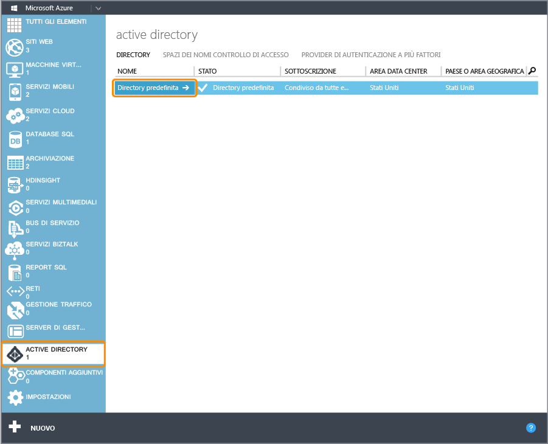
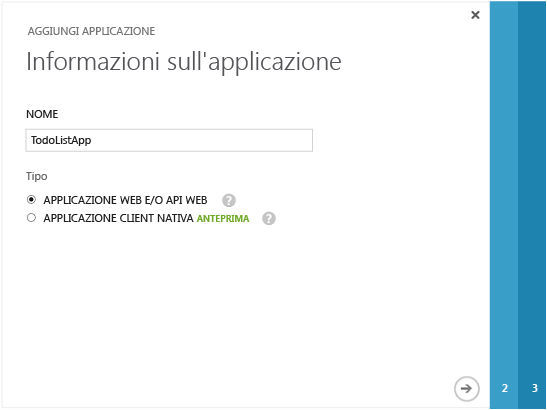
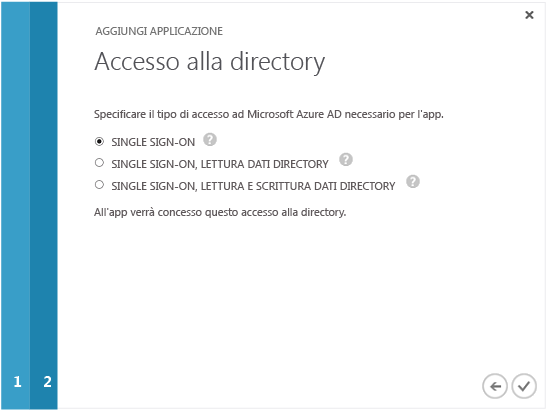
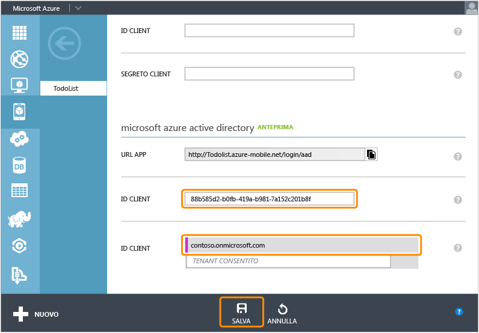

<properties linkid="develop-mobile-how-to-guides-register-for-active-directory-authentication" urlDisplayName="Register for Azure Active Directory Authentication" pageTitle="Register for Azure Active Directory authentication - Mobile Services" metaKeywords="Azure registering application, Azure Active Directory authentication, application authenticate, authenticate mobile services" description="Learn how to register for Azure Active Directory authentication in your Mobile Services application." title="Register your account to use an Azure Active Directory account login" authors="" />

Registrazione delle app per l'utilizzo delle credenziali di accesso di un account Azure Active Directory
========================================================================================================

In questo argomento viene illustrato come registrare le app in modo da utilizzare Azure Active Directory come provider di autenticazione per Servizi mobili di Azure.

> [WACOM.NOTE] Il provider di autenticazione di Azure Active Directory per Servizi mobili è attualmente disponibile in anteprima. Per partecipare alla fase di anteprima, contattare <mobileservices@microsoft.com>. In caso contrario, il provider di autenticazione non sarà visibile nella scheda `Identity` del servizio mobile.

> [WACOM.NOTE] Se si intende fornire anche l'autenticazione basata su client per Single Sign-On (SSO) o per le notifiche push di un'app di Windows Store, è consigliabile registrare l'app anche con Windows Store. Per ulteriori informazioni, vedere [Registrazione delle app di Windows Store per l'autenticazione con Windows Live Connect](/en-us/develop/mobile/how-to-guides/register-for-single-sign-on).

1.  Accedere al [portale di gestione di Azure](https://manage.windowsazure.com/), fare clic su **Mobile Services** e quindi sul servizio mobile.

    

2.  Fare clic sulla scheda **Identity** per il servizio mobile.

    

3.  Scorrere fino alla sezione relativa al provider di identità **Azure Active Directory** e copiare il valore **APP URL** elencato in tale punto.

    

4.  Passare a **Active Directory** nel portale di gestione, quindi fare clic sulla directory.

    

5.  Fare clic sulla scheda **Applications** nella parte superiore, quindi fare clic su **ADD** per aggiungere un'app.

    

6.  Fare clic su **Add an application my organization is developing**.

7.  Nella procedura guidata di aggiunta applicazione immettere un nome per l'applicazione in **Name** e fare clic sul tipo **Web Application And/Or Web API**. Fare quindi clic per continuare.

    

8.  Nella casella **SIGN-ON URL** incollare l'ID dell'app copiato dalle impostazioni relative al provider di identità Active Directory del servizio mobile. Immettere anche un URI (Uniform Resource Identifier) nella casella **App ID URI**. L'applicazione utilizzerà l'URI per inviare richieste Single Sign-On ad Azure Active Directory. Fare quindi clic per continuare.

    

9.  Fare clic per abilitare il tipo di accesso **Single Sign-On** per l'applicazione. Fare clic per concludere la procedura guidata di aggiunta applicazione.

    

10. Quando l'applicazione è stata aggiunta, scorrere verso il basso. Fare quindi clic sulla sezione **Enable your app to read or write directory data** per espanderla. Fare clic per copiare il valore **Client ID** per l'app.

    

11. Tornare alla scheda **Identity** del servizio mobile. Nella parte inferiore incollare l'impostazione **Client ID** per il provider di identità Azure Active Directory. Fare quindi clic su **Salva**.

    

È ora possibile utilizzare Azure Active Directory per l'autenticazione nell'app.

