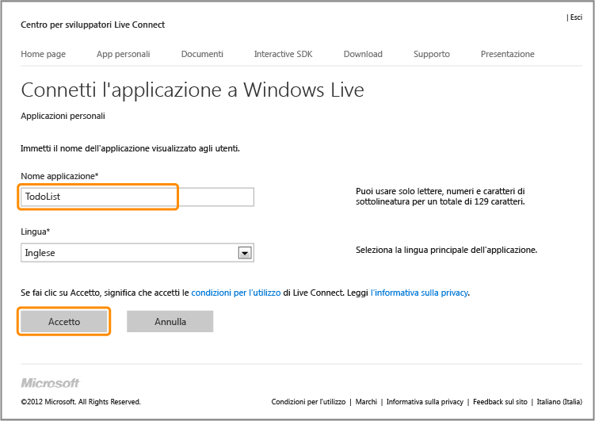
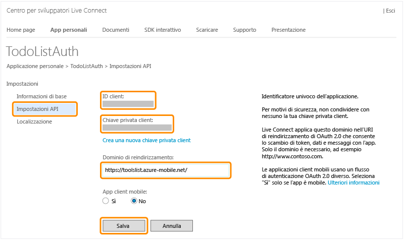

<properties pageTitle="Register for Microsoft authentication - Mobile Services" metaKeywords="Azure registering application, Azure Microsoft authentication, application authenticate, authenticate mobile services" description="Learn how to register for Microsoft authentication in your Azure Mobile Services application." metaCanonical="" disqusComments="0" umbracoNaviHide="1" title="Register your apps to use a Microsoft Account login" authors="" />

Registrazione delle app per l'utilizzo delle credenziali di accesso di un account Microsoft
===========================================================================================

In questo argomento viene illustrato come registrare le app in modo da utilizzare Live Connect come provider di autenticazione per Servizi mobili di Microsoft Azure.

> [WACOM.NOTE]Se si intende fornire anche l'autenticazione basata su client per Single Sign-On (SSO) o per le notifiche push di un'app di Windows Store, è consigliabile registrare l'app anche con Windows Store. Per ulteriori informazioni, vedere [Registrazione delle app di Windows Store per l'autenticazione con Windows Live Connect](/en-us/develop/mobile/how-to-guides/register-for-single-sign-on).

1.  Passare alla pagina [Applicazioni personali](http://go.microsoft.com/fwlink/p/?LinkId=262039) nel Centro sviluppatori Live Connect e, se necessario, accedere con il proprio account Microsoft.

2.  Fare clic su **Crea applicazione**, quindi digitare un nome in **Nome applicazione** e fare clic su **Accetto**.

   	 

   	L'applicazione verrà registrata con Live Connect.

3.  Fare clic sulla pagina **Impostazioni applicazione**, quindi su **Impostazioni API** e prendere nota dei valori di **ID client** e **Chiave privata client**.

   	

    
<b>Nota sulla sicurezza</b>
	
Il segreto client è un'importante credenziale di sicurezza. Non condividere questo valore con altri né distribuirlo con l'app.

    

1.  In **Dominio di reindirizzamento** immettere l'URL del servizio mobile e quindi fare clic su **Salva**.

È ora possibile utilizzare un account Microsoft per l'autenticazione nell'app fornendo i valori dell'ID e della chiave privata client a Servizi mobili.

