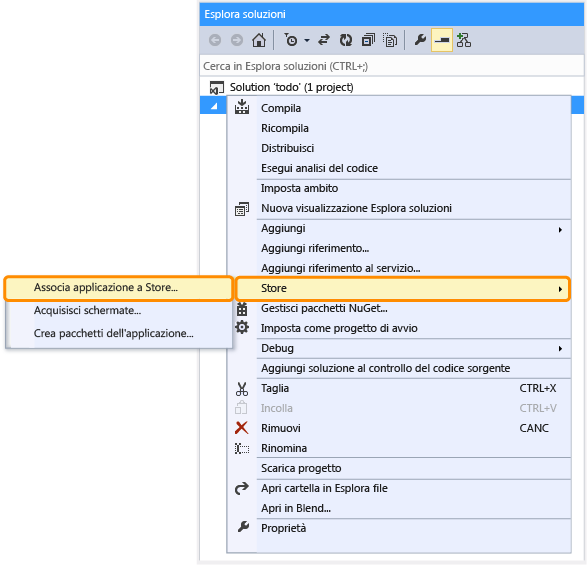

<properties linkid="develop-mobile-how-to-guides-register-for-single-sign-on" urlDisplayName="Register for single sign on" pageTitle="Register for single sign-on - Azure Mobile Services" metaKeywords="" description="Learn how to register for single sign-on authentication in your Azure Mobile Services application." metaCanonical="" services="" documentationCenter="" title="Register your Windows Store apps to use Windows Live Connect single sign-on" authors="" solutions="" manager="" editor="" />

Registrazione delle app di Windows Store per l'utilizzo dell'accesso Single Sign-On di Windows Live Connect
===========================================================================================================

In questo argomento viene illustrato come registrare un'app con Windows Store in modo che possa utilizzare Live Connect per l'accesso Single Sign-On come provider di identità per Servizi mobili di Azure. In questo passaggio è inoltre richiesto l'utilizzo delle notifiche push.

**Nota**

Non è necessario registrare l'app con Windows Store per utilizzare l'account Microsoft per l'autenticazione prima di pubblicare l'app. Quando l'app di Windows Store non richiede l'accesso Single Sign-On o le notifiche push, è sufficiente registrare l'app con Live Connect per utilizzare un accesso con account Microsoft. Per ulteriori informazioni, vedere [Registrazione delle app di Windows Store per l'utilizzo delle credenziali di accesso di un account Microsoft](/en-us/develop/mobile/how-to-guides/register-for-microsoft-authentication).

1.  Se l'app non è ancora stata registrata, passare alla pagina relativa all'[invio di app](http://go.microsoft.com/fwlink/p/?LinkID=266582) nel Centro per sviluppatori di app di Windows Store, accedere con il proprio account Microsoft e quindi fare clic su **App name**.

   	![][0]

2.  Immettere un nome per l'app in **Nome app**, fare clic su **Riserva nome applicazione** e quindi su **Salva**.

   	![][1]

   	Verrà creata una nuova registrazione a Windows Store per l'app.

3.  In Visual Studio 2012 Express per Windows 8 aprire il progetto creato dopo aver completato l'esercitazione [Introduzione a Servizi mobili](/en-us/develop/mobile/tutorials/get-started).

4.  In Esplora soluzioni fare clic con il pulsante destro del mouse sul progetto, scegliere **Store** e quindi fare clic su **Associa applicazione a Store**.

  	

  	 Verrà visualizzata la procedura guidata **Associa l'applicazione con Windows Store**.

1.  Nella procedura guidata fare clic su **Accedi** e quindi accedere con il proprio account Microsoft.

2.  Selezionare l'app registrata nel passaggio 2, fare clic su **Avanti** e quindi su **Associa**.

   	![][3]

   	Le necessarie informazioni di registrazione a Windows Store verranno aggiunte al manifesto dell'applicazione.    

3.  Passare alla pagina [Applicazioni personali](http://go.microsoft.com/fwlink/p/?LinkId=262039) nel Centro sviluppatori Live Connect e fare clic sull'app nell'elenco **Applicazioni personali**.

   	![][6] 

4.  Fare clic su **Modifica impostazioni**, quindi su **Impostazioni API** e prendere nota del valore di **Segreto client**.

   	

    
<b>Nota sulla sicurezza</b>
    
Il segreto client è un'importante credenziale di sicurezza. Non condividere questo valore con altri né distribuirlo con l'app.

    

1.  In **Dominio di reindirizzamento** immettere l'URL del servizio mobile indicato nel passaggio 8 e quindi fare clic su **Salva**.

È ora possibile integrare l'autenticazione mediante Live Connect nell'app. Servizi mobili fornisce i seguenti due metodi per l'autenticazione degli utenti mediante:

-   Single Sign-On per le app di Windows Store. Questo metodo prevede che gli utenti autorizzino una volta l'autenticazione nell'applicazione tramite Live Connect e in seguito le credenziali vengano gestite da Windows, in base alle preferenze utente. Per ulteriori informazioni, vedere [Single Sign-On per app di Windows Store tramite Live Connect](/en-us/develop/mobile/tutorials/single-sign-on-windows-8-dotnet).

-   Autenticazione di base. Questo metodo, che supporta diversi provider di autenticazione, richiede che gli utenti eseguano l'accesso ogni volta che l'app viene avviata. Per ulteriori informazioni, vedere [Introduzione all'autenticazione in Servizi mobili](/en-us/develop/mobile/tutorials/get-started-with-users-dotnet).

<!-- Images. -->
[0]: ./media/mobile-services-how-to-register-windows-live-connect-single-sign-on/mobile-services-submit-win8-app.png
[1]: ./media/mobile-services-how-to-register-windows-live-connect-single-sign-on/mobile-services-win8-app-name.png
[2]: ./media/mobile-services-how-to-register-windows-live-connect-single-sign-on/mobile-services-store-association.png
[3]: ./media/mobile-services-how-to-register-windows-live-connect-single-sign-on/mobile-services-select-app-name.png

[6]: ./media/mobile-services-how-to-register-windows-live-connect-single-sign-on/mobile-live-connect-apps-list.png
[7]: ./media/mobile-services-how-to-register-windows-live-connect-single-sign-on/mobile-live-connect-app-api-settings.png
