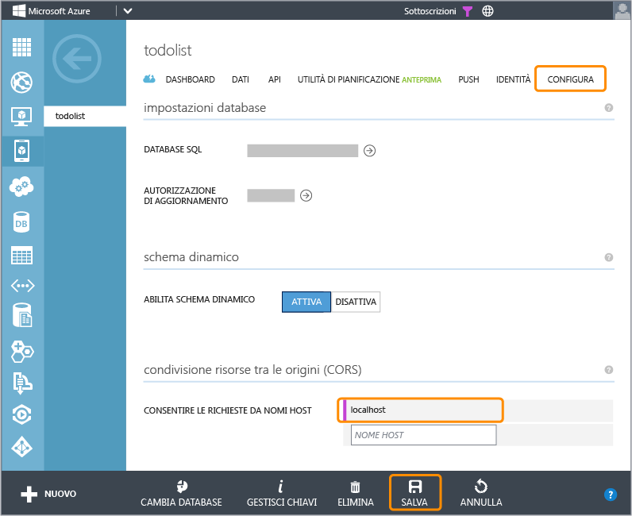

<properties linkid="develop-mobile-tutorials-get-started-with-data-html" urlDisplayName="Get Started with Data (HTML5)" pageTitle="Get started with data (HTML 5) | Mobile Dev Center" metaKeywords="" description="Learn how to get started using Mobile Services to leverage data in your HTML app." metaCanonical="" services="" documentationCenter="Mobile" title="Get started with data in Mobile Services" authors="glenga" solutions="" manager="" editor="" />

Introduzione ai dati in Servizi mobili
======================================

[Windows Store C\#](/en-us/develop/mobile/tutorials/get-started-with-data-dotnet "Windows Store C#")[Windows Store JavaScript](/en-us/develop/mobile/tutorials/get-started-with-data-js "Windows Store JavaScript")[Windows Phone](/en-us/develop/mobile/tutorials/get-started-with-data-wp8 "Windows Phone")[iOS](/en-us/develop/mobile/tutorials/get-started-with-data-ios "iOS")[Android](/en-us/develop/mobile/tutorials/get-started-with-data-android "Android")[HTML](/en-us/develop/mobile/tutorials/get-started-with-data-html "HTML")[Xamarin.iOS](/en-us/develop/mobile/tutorials/get-started-with-data-xamarin-ios "Xamarin.iOS")[Xamarin.Android](/en-us/develop/mobile/tutorials/get-started-with-data-xamarin-android "Xamarin.Android")

In questo argomento viene illustrato come utilizzare Servizi mobili di Azure per sfruttare i dati in un'app HTML. In questa esercitazione si scaricherà un'app che archivia dati in memoria, si creerà un nuovo servizio mobile e lo si integrerà con l'app e quindi si effettuerà l'accesso al portale di gestione di Azure per visualizzare le modifiche apportate ai dati durante l'esecuzione dell'app.

**Nota**

In questa esercitazione viene descritto come è possibile utilizzare Servizi mobili di Azure per archiviare e recuperare i dati da un'app HTML e vengono pertanto riproposte molte delle procedure già completate nella guida introduttiva a Servizi mobili. Se si tratta della prima esperienza con Servizi mobili, è consigliabile iniziare dall'esercitazione [Introduzione a Servizi mobili](/en-us/develop/mobile/tutorials/get-started-html).

In questa esercitazione vengono descritte le operazioni di base seguenti:

1.  [Download del progetto dell'app HTML](#download-app)
2.  [Creazione del servizio mobile](#create-service)
3.  [Aggiunta di una tabella dati per l'archiviazione](#add-table)
4.  [Aggiornamento dell'app per l'utilizzo di Servizi mobili](#update-app)
5.  [Test dell'app in Servizi mobili](#test-app)

**Nota**

Per completare l'esercitazione, è necessario un account Azure. Se non si dispone di un account, è possibile creare un account di valutazione gratuita in pochi minuti. Per informazioni dettagliate, vedere la pagina relativa alla [versione di valutazione gratuita di Azure](http://www.windowsazure.com/en-us/pricing/free-trial/?WT.mc_id=A756A2826&returnurl=http%3A%2F%2Fwww.windowsazure.com%2Fen-us%2Fdevelop%2Fmobile%2Ftutorials%2Fget-started-with-data-html%2F).

### Requisiti aggiuntivi

È possibile ospitare l'app GetStartedWithData in qualsiasi server Web. Per semplicità, tuttavia, sono stati forniti script che consentono di eseguire l'app in `http://localhost:8000`.

-   Per completare questa esercitazione e utilizzare localhost, è necessario che nel computer locale sia in esecuzione uno dei server Web seguenti:

    -   **In Windows**: IIS Express. IIS Express viene installato tramite l'[Installazione guidata piattaforma Web Microsoft].
    -   **In MacOS X**: Python, che dovrebbe essere già installato.
    -   **In Linux**: Python. È necessario installare la [versione più recente di Python].

    È possibile utilizzare qualsiasi server Web per ospitare l'app, tuttavia quelli indicati sono i server Web supportati dagli script scaricati.

-   Un Web browser che supporta HTML5.

Download del progettoDownload del progetto GetStartedWithData
-------------------------------------------------------------

Questa esercitazione è basata sull'[app GetStartedWithData](http://go.microsoft.com/fwlink/?LinkID=286345) che è un'app HTML5. L'interfaccia utente di questa app è identica a quella dell'app generata dalla guida introduttiva di Servizi mobili, ma in questo caso gli elementi aggiunti vengono archiviati nella memoria locale.

1.  [Download dei file di progetto dell'app HTML](http://go.microsoft.com/fwlink/?LinkID=286345).

2.  In un editor HTML aprire il progetto scaricato ed esaminare il file app.js.

	Si noti che gli elementi aggiunti vengono archiviati in un oggetto **Array** in memoria (**staticItems**). Aggiornare la pagina. I dati scompariranno dalla visualizzazione perché non sono persistenti.

3.  Avviare uno dei file di comando seguenti dalla sottocartella **server**.

    -   **launch-windows** (computer Windows)
    -   **launch-mac.command** (computer Mac OS X)
    -   **launch-linux.sh** (computer Linux)

	**Nota**

	In un computer Windows, digitare 'R' quando PowerShell chiede di confermare che si desidera eseguire lo script. Il Web browser potrebbe visualizzare un avviso in cui si consiglia di non eseguire lo script in quanto scaricato da Internet. In questo caso, è necessario richiedere che il browser proceda nel caricamento dello script.

	Verrà quindi avviato un server Web nel computer locale per ospitare la nuova app.

4.  Aprire l'URL <http://localhost:8000/> in un Web browser per avviare l'app.

5.  Nell'app digitare un testo significativo, ad esempio *Complete the tutorial*, in **Enter new task** e quindi fare clic su **Add**.

	![][0]  

 	Si noti che il testo salvato viene aggiunto alla matrice **staticItems** e la pagina viene aggiornata per visualizzare il nuovo elemento.

Creazione del servizio mobileCreazione di un nuovo servizio mobile nel portale di gestione
------------------------------------------------------------------------------------------

[WACOM.INCLUDE [mobile-services-create-new-service-data](../includes/mobile-services-create-new-service-data.md)]

Aggiunta di una nuova tabellaAggiunta di una nuova tabella al servizio mobile
-----------------------------------------------------------------------------

Prima di poter archiviare i dati dell'app nel nuovo servizio mobile, è necessario creare una nuova tabella nell'istanza di database SQL associata.

1.  Nel portale di gestione fare clic su **Mobile Services** e quindi sul servizio mobile appena creato.

2.  Fare clic sulla scheda **Data** e quindi su **+Create**.

	![][5]

	Verrà visualizzata la finestra di dialogo **Create new table**.

3.  In **Table name** digitare *TodoItem*, quindi fare clic sul segno di spunta.

	

	Verrà creata una nuova tabella di archiviazione, **TodoItem**, con le autorizzazioni predefinite impostate. Questo significa che chiunque disponga della chiave dell'applicazione, che viene distribuita con l'app, potrà accedere alla tabella e modificare i dati.

    
 
    <b>Nota</b> 
    
Nella Guida introduttiva di Servizi mobili viene utilizzato lo stesso nome di tabella. Tuttavia, ogni tabella viene creata in uno schema specifico per un determinato servizio mobile. In questo modo è possibile evitare conflitti di dati quando più servizi mobili utilizzano lo stesso database.
 
    

1.  Fare clic sulla nuova tabella **TodoItem** e verificare che non siano presenti righe di dati.

2.  Fare clic sulla scheda **Columns**. Verificare che siano state create automaticamente le colonne predefinite seguenti:

    <table  border="1" cellpadding="10">
     	<tr>
     	<th>Nome colonna</th>
    
     	<th>Tipo</th>
    
     	<th>Indice</th>
    
     	</tr>
    
     	<tr>
     	<td>id</td>
    
     	<td>stringa</td>
    
     	<td>Indicizzata</td>
    
     	</tr>
    
     	<tr>
     	<td>__createdAt</td>
    
     	<td>data</td>
    
     	<td>Indicizzata</td>
    
     	</tr>
    
     	<tr>
     	<td>__updatedAt</td>
    
     	<td>data</td>
    
     	<td>-
    </td>
    
     	</tr>
    
     	<tr>
     	<td>__version</td>
    
     	<td>timestamp (MSSQL)</td>
    
     	<td>-
    </td>
    
     	</tr>
     	
     	</table>

	Questo è il requisito minimo per le tabelle in Servizi mobili.

    
<b>Nota</b>
    
Se nel servizio mobile è abilitato lo schema dinamico, vengono automaticamente create nuove colonne quando al servizio mobile vengono inviati oggetti JSON mediante un'operazione di inserimento o aggiornamento.

    

1.  Nella scheda **Configure** verificare che `localhost` sia presente nell'elenco **Allow requests from host names** in **Cross-Origin Resource Sharing (CORS)**. In caso contrario, digitare `localhost` nel campo **Host name** e quindi fare clic su **Save**.

	

    
<b>Nota</b>
        
Se si distribuisce l'app di guida introduttiva in un server Web diverso da localhost, è necessario aggiungere il nome host del server Web all'elenco <strong>Allow requests from host names</strong>. Per ulteriori informazioni, vedere <a href="http://msdn.microsoft.com/en-us/library/windowsazure/dn155871.aspx" target="_blank">Condivisione risorse tra le origini</a>.

    

È ora possibile utilizzare il nuovo servizio mobile come archivio dati per l'app.

Aggiornamento dell'appAggiornamento dell'app per l'utilizzo del servizio mobile per l'accesso ai dati
-----------------------------------------------------------------------------------------------------

Ora che il servizio mobile è pronto, è possibile aggiornare l'app in modo che gli elementi vengano archiviati in Servizi mobili anziché nella raccolta locale.

1.  Nel portale di gestione fare clic su **Mobile Services** e quindi sul servizio mobile appena creato.

2.  Fare clic sulla scheda **Dashboard** e prendere nota del valore di **Site URL**, quindi fare clic su **Manage keys** e prendere nota del valore di **Application key**.

	![][8]

Questi valori sono necessari per accedere al servizio mobile dal codice dell'app.

1.  Nell'editor Web aprire il file di progetto index.html e aggiungere il codice seguente ai riferimenti allo script per la pagina:

         

2.  Nell'editor aprire il file app.js, rimuovere i simboli di commento dal codice seguente che definisce la variabile **MobileServiceClient**, infine specificare l'URL e la chiave dell'applicazione indicati nel servizio mobile nel costruttore **MobileServiceClient**, senza modificare l'ordine.

         var MobileServiceClient = WindowsAzure.MobileServiceClient,
             client = new MobileServiceClient('AppUrl', 'AppKey'),              

	Verrà creata una nuova istanza di MobileServiceClient utilizzata per accedere al servizio mobile.

1.  Rimuovere quindi i simboli di commento dalle righe di codice seguenti:

         var itemCount = 0;
         var staticItems = [];

    I dati verranno archiviati nel servizio mobile e non in una matrice in memoria.

2.  Rimuovere quindi i simboli di commento dalla riga di codice seguente:

         todoItemTable = client.getTable('todoitem');

	Questo codice crea un oggetto proxy (**todoItemTable**) per l'elemento **TodoItem** di database SQL. 

3.  Sostituire il gestore di eventi **\$('\#add-item').submit** con il codice seguente:

         $('#add-item').submit(function(evt) {
             var textbox = $('#new-item-text'),
                 itemText = textbox.val();
             if (itemText !== '') {
                 todoItemTable.insert({ text: itemText, complete: false })
                     .then(refreshTodoItems);
             }
             textbox.val('').focus();
             evt.preventDefault();
         });

	Questo codice consente di inserire un nuovo elemento nella tabella.

1.  Sostituire il metodo **refreshTodoItems** con il codice seguente:

         function refreshTodoItems() {

             var query = todoItemTable;

             query.read().then(function(todoItems) {
                 listItems = $.map(todoItems, function(item) {
                     return $('<li>')
                         .attr('data-todoitem-id', item.id)
                         .append($('<button class="item-delete">Delete</button>'))
                         .append($('<input type="checkbox" class="item-complete">').prop('checked', item.complete))
                         .append($('
').append($('<input class="item-text">').val(item.text)));
                 });
                           
                 $('#todo-items').empty().append(listItems).toggle(listItems.length > 0);
                 $('#summary').html('<strong>' + todoItems.length + '</strong> item(s)');
             });
         }

    Verrà inviata al servizio mobile una query che restituisce tutti gli elementi. I risultati vengono scorsi e i dati vengono visualizzati nella pagina.

2.  Sostituire i gestori di eventi **\$(document.body).on('change', '.item-text')** e **\$(document.body).on('change', '.item-complete')** con il codice seguente:

         $(document.body).on('change', '.item-text', function() {
             var newText = $(this).val();
             todoItemTable.update({ id: getTodoItemId(this), text: newText });
         });

         $(document.body).on('change', '.item-complete', function() {
             var isComplete = $(this).prop('checked');
             todoItemTable.update({ id: getTodoItemId(this), complete: isComplete })
                 .then(refreshTodoItems);
         });
         
	Verrà inviato un aggiornamento dell'elemento al servizio mobile quando viene modificato il testo o selezionata la casella.

3.  Sostituire il gestore di eventi **\$(document.body).on('click', '.item-delete')** con il codice seguente:

        $(document.body).on('click', '.item-delete', function () {
            todoItemTable.del({ id: getTodoItemId(this) }).then(refreshTodoItems);
            });

    Verrà inviata una richiesta di eliminazione al servizio mobile quando si fa clic sul pulsante **Delete**.

Una volta aggiornata l'app per consentire l'utilizzo di Servizi mobili per l'archiviazione back-end, è possibile verificarne il funzionamento in Servizi mobili.

Test dell'appTest dell'app nel nuovo servizio mobile
----------------------------------------------------

1.  Ricaricare <http://localhost:8000/> in un Web browser per avviare l'app.

    **Nota**

    Se è necessario riavviare il server Web, ripetere la procedura illustrata nella prima sezione.

2.  Come in precedenza, digitare un testo in **Enter new task** e quindi fare clic su **Add**.

	Un nuovo elemento verrà inviato come inserimento al servizio mobile.

3.  Nel [portale di gestione](https://manage.windowsazure.com/) fare clic su **Mobile Services** e quindi sul servizio mobile.

4.  Fare clic sulla scheda **Data** e quindi su **Browse**.

	![][9]
          
	Si noti che la tabella **TodoItem** ora contiene dati, con valori ID generati da Servizi mobili, e che alla tabella sono state aggiunte automaticamente colonne per garantire la corrispondenza con la classe TodoItem nell'app.

5.  Nell'app selezionare uno degli elementi nell'elenco, quindi tornare alla scheda Browse nel portale e fare clic su **Refresh**.

	Si noti che il valore di complete è cambiato da **false** a **true**.

1.  Nel file di progetto app.js individuare il metodo **RefreshTodoItems** e sostituire la riga di codice che definisce la `query` con il codice seguente:

         var query = todoItemTable.where({ complete: false });

2.  Caricare di nuovo la pagina e selezionare un altro elemento nell'elenco.

	Si noti che l'elemento selezionato non è più presente nell'elenco. Ogni aggiornamento comporta un round trip al servizio mobile, che ora restituisce i dati filtrati.

L'esercitazione **Introduzione ai dati** è terminata.

Passaggi successivi
-------------------

In questa esercitazione sono state illustrate le nozioni di base per consentire a un'app HTML di utilizzare dati in Servizi mobili. In seguito, è consigliabile eseguire una delle esercitazioni seguenti, basate sull'app GetStartedWithData creata in questa esercitazione:

-   [Utilizzo di script per la convalida e la modifica di dati](/en-us/develop/mobile/tutorials/validate-modify-and-augment-data-html)
    Ulteriori informazioni sull'utilizzo di script del server in Servizi mobili per convalidare e modificare i dati inviati dall'app.

-   [Utilizzo del paging per ridefinire le query](/en-us/develop/mobile/tutorials/add-paging-to-data-html)
    Ulteriori informazioni su come utilizzare il paging nelle query per controllare la quantità di dati gestiti in un'unica richiesta.

Dopo avere completato la serie di esercitazioni relative ai dati, è possibile passare alle esercitazioni che illustrano come autenticare gli utenti dell'app, iniziando da [Introduzione all'autenticazione](/en-us/develop/mobile/tutorials/get-started-with-users-html).

<!-- Anchors. -->
[Download the HTML app project]: #download-app
[Create the mobile service]: #create-service
[Add a data table for storage]: #add-table
[Update the app to use Mobile Services]: #update-app
[Test the app against Mobile Services]: #test-app
[Next Steps]:#next-steps

<!-- Images. -->
[0]: ./media/mobile-services-html-get-started-data/mobile-quickstart-startup-html.png

[5]: ./media/mobile-services-html-get-started-data/mobile-data-tab-empty.png
[6]: ./media/mobile-services-html-get-started-data/mobile-create-todoitem-table.png

[8]: ./media/mobile-services-html-get-started-data/mobile-dashboard-tab.png
[9]: ./media/mobile-services-html-get-started-data/mobile-todoitem-data-browse.png

[11]: ./media/mobile-services-html-get-started-data/mobile-services-set-cors-localhost.png

<!-- URLs. -->
[Validate and modify data with scripts]: /en-us/develop/mobile/tutorials/validate-modify-and-augment-data-html
[Refine queries with paging]: /en-us/develop/mobile/tutorials/add-paging-to-data-html
[Get started with Mobile Services]: /en-us/develop/mobile/tutorials/get-started
[Get started with authentication]: /en-us/develop/mobile/tutorials/get-started-with-users-html

[Azure Management Portal]: https://manage.windowsazure.com/
[Management Portal]: https://manage.windowsazure.com/
[GetStartedWithData app]:  http://go.microsoft.com/fwlink/?LinkID=286345

[Mobile Services HTML/JavaScript How-to Conceptual Reference]: /en-us/develop/mobile/how-to-guides/work-with-html-js-client

[Cross-origin resource sharing]: http://msdn.microsoft.com/en-us/library/windowsazure/dn155871.aspx