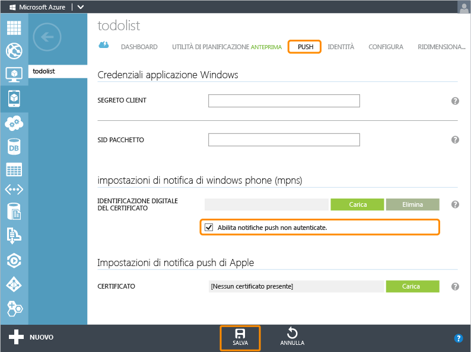

<properties pageTitle="Get started with push notifications (Windows Store) | Mobile Dev Center" metaKeywords="" description="Learn how to use Azure Mobile Services and Notification Hubs to send push notifications to your Windows Store app." metaCanonical="" services="mobile" documentationCenter="Mobile" title="Get started with push notifications in Mobile Services" authors="glenga" solutions="" manager="" editor="" />

Introduzione alle notifiche push in Servizi mobili
==================================================

[Windows Store C\#](/en-us/documentation/articles/mobile-services-javascript-backend-windows-store-dotnet-get-started-push "Windows Store C#")[Windows Store JavaScript](/en-us/documentation/articles/mobile-services-javascript-backend-windows-store-javascript-get-started-push "Windows Store JavaScript")[Windows Phone](/en-us/documentation/articles/mobile-services-javascript-backend-windows-phone-get-started-push "Windows Phone")[iOS](/en-us/documentation/articles/mobile-services-ios-get-started-push "iOS")[Android](/en-us/documentation/articles/mobile-services-javascript-backend-android-get-started-push "Android")
[Back-end .NET](/en-us/documentation/articles/mobile-services-dotnet-backend-windows-phone-get-started-push/ "Back-end .NET") | [Back-end JavaScript](/en-us/documentation/articles/mobile-services-javascript-backend-windows-phone-get-started-push/ "Back-end JavaScript")

In questo argomento viene illustrato come utilizzare Servizi mobili di Azure per inviare notifiche push a un'app di Windows Store. In questa esercitazione si utilizzerà Hub di notifica di Azure per abilitare le notifiche push nel progetto di guida introduttiva. Al termine dell'esercitazione, il servizio mobile invierà una notifica push utilizzando Hub di notifica ogni volta che viene inserito un record. L'hub di notifica creato può essere utilizzato gratuitamente con il servizio mobile, può essere gestito indipendentemente da quest'ultimo e può essere utilizzato da altri servizi e applicazioni.

> [WACOM.NOTE]In questa esercitazione viene illustrata l'integrazione di Servizi mobili con Hub di notifica, attualmente in versione di anteprima. Per impostazione predefinita, l'invio di notifiche push mediante Hub di notifica non è abilitata da un back-end JavaScript. Dopo aver creato il nuovo hub di notifica, non è possibile annullare il processo di integrazione. Attualmente le notifiche push per iOS e Android sono disponibili solo utilizzando il supporto push predefinito descritto in [questa versione dell'argomento](/en-us/documentation/articles/mobile-services-windows-phone-get-started-push/).

In questa esercitazione vengono descritte le operazioni di base per abilitare le notifiche push:

1.  [Aggiornamento dell'app per la registrazione per le notifiche](#update-app)
2.  [Aggiornamento degli script del server per l'invio di notifiche push](#update-scripts)
3.  [Inserimento di dati per la ricezione di notifiche push](#test)

Questa esercitazione è basata sul progetto di guida introduttiva per Servizi mobili. Prima di iniziare l'esercitazione, è necessario completare [Introduzione a Servizi mobili](/en-us/documentation/articles/mobile-services-windows-phone-get-started) o [Introduzione ai dati](/en-us/documentation/articles/mobile-services-windows-phone-get-started-data) per collegare il progetto al servizio mobile. Se non è stato collegato alcun servizio mobile, la procedura guidata Aggiungi notifica push crea automaticamente la connessione.

Aggiornamento dell'app per la registrazione per le notifiche
------------------------------------------------------------

Prima che l'app possa ricevere notifiche push, è necessario registrare un canale di notifica.

1.  In Visual Studio aprire il file App.xaml.cs e aggiungere l'istruzione `using` seguente:

         using Microsoft.Phone.Notification;

2.  Aggiungere il codice seguente al file App.xaml.cs:

         public static HttpNotificationChannel CurrentChannel { get; private set; }

         private void AcquirePushChannel()
         {
             CurrentChannel = HttpNotificationChannel.Find("MyPushChannel");

             if (CurrentChannel == null)
             {
                 CurrentChannel = new HttpNotificationChannel("MyPushChannel");
                 CurrentChannel.Open();
                 CurrentChannel.BindToShellToast();
             }

             CurrentChannel.ChannelUriUpdated +=
                 new EventHandler<NotificationChannelUriEventArgs>(async (o, args) =>
                 {

                     // Register for notifications using the new channel
                     await MobileService.GetPush()
                         .RegisterNativeAsync(CurrentChannel.ChannelUri.ToString());
                 });
         }

    Questo codice consente di recuperare il valore di ChannelURI per l'app da Servizi notifica Push Windows e quindi di registrarlo per le notifiche push.

    > [WACOM.NOTE]In questa esercitazione il servizio mobile invia una notifica di tipo avviso popup al dispositivo. Quando si invia una notifica di tipo riquadro, è invece necessario chiamare il metodo **BindToShellTile** sul canale.

3.  All'inizio del gestore dell'evento **Application\_Launching** in App.xaml.cs, aggiungere la chiamata seguente al nuovo metodo **AcquirePushChannel**:

         AcquirePushChannel();

    In questo modo la registrazione verrà richiesta ogni volta che viene caricata la pagina. Nell'app dell'utente può essere preferibile eseguire la registrazione solo su base periodica, per verificare che sia aggiornata.

4.  Premere **F5** per eseguire l'app. Verrà visualizzata una finestra di dialogo popup con la chiave di registrazione.

5.  In Esplora soluzioni espandere **Proprietà**, aprire il file WMAppManifest.xml, fare clic sulla scheda **Funzionalità** e assicurarsi che la funzionalità **ID\_\_*CAP*\_\_PUSH\_NOTIFICATION** sia selezionata.

	 

	In questo modo si garantirà che l'app sia in grado di generare notifiche di tipo avviso popup.

Aggiornamento degli script del server per l'invio di notifiche push
-------------------------------------------------------------------

È infine necessario aggiornare lo script registrato nell'operazione di inserimento nella tabella TodoItem per l'invio di notifiche.

1.  Fare clic su **TodoItem**, quindi su **Script** e selezionare **Insert**.

    ![][10]

2.  Sostituire la funzione insert con il codice seguente, quindi fare clic su **Save**:

         function insert(item, user, request) {
         // Define a payload for the Windows Phone toast notification.
         var payload = '<?xml version="1.0" encoding="utf-8"?>' +
             '<wp:Notification xmlns:wp="WPNotification"><wp:Toast>' +
             '<wp:Text1>New Item</wp:Text1><wp:Text2>' + item.text + 
             '</wp:Text2></wp:Toast></wp:Notification>';
            
         request.execute({
             success: function() {
                 // If the insert succeeds, send a notification.
                push.mpns.send(null, payload, 'toast', 22, {
                     success: function(pushResponse) {
                         console.log("Sent push:", pushResponse);
                         request.respond();
                          },              
                          error: function (pushResponse) {
                             console.log("Error Sending push:", pushResponse);
                             request.respond(500, { error: pushResponse });
                              }
                          });
                      }
                  });      
          }

    Questo script insert invia una notifica push (con il testo dell'elemento inserito) a tutte le app per Windows Phone registrate dopo la corretta esecuzione dell'inserimento.

3.  Fare clic sulla scheda **Push**, selezionare **Enable unauthenticated push notifications**, quindi fare clic su **Save**.

    

    In questo modo il servizio mobile verrà abilitato per la connessione al Servizio di notifica Push di Microsof in modalità senza autenticazione per l'invio di notifiche push.

    > [WACOM.NOTE]In questa esercitazione verrà utilizzato il Servizio di notifica Push di Microsoft in modalità senza autenticazione. In tale modalità, il Servizio di notifica Push di Microsoft limita il numero di notifiche che è possibile inviare a un canale di dispositivo. Per rimuovere questa restrizione è necessario generare e caricare un certificato facendo clic su **Upload** e selezionando il certificato. Per ulteriori informazioni sulla generazione del certificato, vedere [Configurazione di un servizio Web autenticato per l'invio di notifiche push per Windows Phone](http://msdn.microsoft.com/en-us/library/windowsphone/develop/ff941099(v=vs.105).aspx).

Esecuzione del test delle notifiche push nell'app
-------------------------------------------------

1.  In Visual Studio premere F5 per eseguire l'app.

2.  Nell'app immettere il testo "hello push" nella casella di testo, quindi fare clic su **Save**.

    ![][4]

  Al servizio mobile verrà inviata una richiesta insert per archiviare l'elemento aggiunto. Si noti che l'applicazione riceve una notifica di tipo avviso popup con il testo **hello push**.

Passaggi successivi
-------------------

In questa esercitazione vengono illustrate le nozioni di base per consentire a un'app di Windows Store di utilizzare dati in Servizi mobili. In seguito, è consigliabile eseguire una delle esercitazioni seguenti, basate sull'app GetStartedWithData creata in questa esercitazione:

-   [Introduzione ad Hub di notifica](/en-us/manage/services/notification-hubs/getting-started-windows-dotnet/)  
    Informazioni su come sfruttare Hub di notifica nell'app di Windows Store.

-   [Invio di notifiche ai sottoscrittori](/en-us/manage/services/notification-hubs/breaking-news-dotnet/)  
    Informazioni su come gli utenti possono registrarsi e ricevere notifiche push per le categorie cui sono interessati.

-   [Invio di notifiche agli utenti](/en-us/manage/services/notification-hubs/notify-users/)  
    Informazioni su come inviare notifiche push da un servizio mobile a utenti specifici su qualsiasi dispositivo.

-   [Invio di notifiche su piattaforme diverse agli utenti](/en-us/manage/services/notification-hubs/notify-users-xplat-mobile-services/)  
    Informazioni su come utilizzare i modelli per inviare notifiche push da un servizio mobile, senza che sia necessario creare payload specifici della piattaforma nel back-end.

Per ulteriori informazioni, vedere anche i seguenti argomenti su Servizi mobili:

-   [Introduzione ai dati](/en-us/documentation/articles/mobile-services-windows-phone-get-started-data)  
    Ulteriori informazioni sull'archiviazione e sulle query dei dati mediante Servizi mobili.

-   [Introduzione all'autenticazione](/en-us/documentation/articles/mobile-services-windows-phone-get-started-users)  
    Informazioni sull'autenticazione degli utenti dell'app con l'account Windows.

-   [Riferimento per gli script del server di Servizi mobili](http://go.microsoft.com/fwlink/?LinkId=262293)  
    Ulteriori informazioni sulla registrazione e l'utilizzo di script del server.

-   [Riferimento per i concetti e le procedure di Servizi mobili con .NET](/en-us/documentation/articles/mobile-services-windows-dotnet-how-to-use-client-library)  
    Ulteriori informazioni su come utilizzare Servizi mobili con .NET.

<!-- Images. -->
[1]: ./media/mobile-services-javascript-backend-windows-phone-get-started-push/mobile-app-enable-push-wp8.png
[2]: ./media/mobile-services-javascript-backend-windows-phone-get-started-push/mobile-quickstart-push1-wp8.png
[3]: ./media/mobile-services-javascript-backend-windows-phone-get-started-push/mobile-quickstart-push2-wp8.png
[4]: ./media/mobile-services-javascript-backend-windows-phone-get-started-push/mobile-quickstart-push3-wp8.png
[5]: ./media/mobile-services-javascript-backend-windows-phone-get-started-push/mobile-quickstart-push4-wp8.png
[10]: ./media/mobile-services-javascript-backend-windows-phone-get-started-push/mobile-insert-script-push2.png
[11]: ./media/mobile-services-javascript-backend-windows-phone-get-started-push/mobile-push-tab.png

<!-- URLs. -->
[Submit an app page]: http://go.microsoft.com/fwlink/p/?LinkID=266582
[My Applications]: http://go.microsoft.com/fwlink/p/?LinkId=262039
[Live SDK for Windows]: http://go.microsoft.com/fwlink/p/?LinkId=262253
[Get started with Mobile Services]: /en-us/documentation/articles/mobile-services-windows-phone-get-started
[Get started with data]: /en-us/documentation/articles/mobile-services-windows-phone-get-started-data
[Get started with authentication]: /en-us/documentation/articles/mobile-services-windows-phone-get-started-users
[Get started with push notifications]: /en-us/documentation/articles/mobile-services-windows-phone-get-started-push

[Get started with Notification Hubs]: /en-us/manage/services/notification-hubs/getting-started-windows-dotnet/
[What are Notification Hubs?]: /en-us/develop/net/how-to-guides/service-bus-notification-hubs/
[Send notifications to subscribers]: /en-us/manage/services/notification-hubs/breaking-news-dotnet/
[Send notifications to users]: /en-us/manage/services/notification-hubs/notify-users/
[Send cross-platform notifications to users]: /en-us/manage/services/notification-hubs/notify-users-xplat-mobile-services/
[Mobile Services server script reference]: http://go.microsoft.com/fwlink/?LinkId=262293
[Mobile Services .NET How-to Conceptual Reference]: /en-us/documentation/articles/mobile-services-windows-dotnet-how-to-use-client-library
[Setting up an authenticated web service to send push notifications for Windows Phone]: http://msdn.microsoft.com/en-us/library/windowsphone/develop/ff941099(v=vs.105).aspx