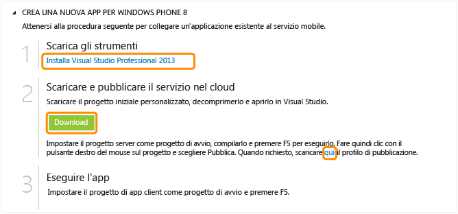

<properties  pageTitle="Get Started with Azure Mobile Services for Windows Phone apps" metaKeywords="" description="Follow this tutorial to get started using Azure Mobile Services for Windows Phone development. " metaCanonical="" services="" documentationCenter="Mobile" title="Get started with Mobile Services" authors="glenga" solutions="" manager="" editor="" />

# Introduzione a Servizi mobili

[Windows Store](/it-it/documentation/articles/mobile-services-windows-store-get-started "Windows Store")[Windows Phone](/it-it/documentation/articles/mobile-services-windows-phone-get-started "Windows Phone")[iOS](/it-it/documentation/articles/mobile-services-ios-get-started "iOS")[Android](/it-it/documentation/articles/mobile-services-android-get-started "Android")[HTML](/it-it/documentation/articles/mobile-services-html-get-started "HTML")[Xamarin.iOS](/it-it/documentation/articles/partner-xamarin-mobile-services-ios-get-started "Xamarin.iOS")[Xamarin.Android](/it-it/documentation/articles/partner-xamarin-mobile-services-android-get-started "Xamarin.Android")[Sencha](/it-it/documentation/articles/partner-sencha-mobile-services-get-started/ "Sencha")[PhoneGap](/it-it/documentation/articles/mobile-services-javascript-backend-phonegap-get-started/ "PhoneGap")
[Back-end .NET](/it-it/documentation/articles/mobile-services-dotnet-backend-windows-phone-get-started/ "Back-end .NET") | [Back-end JavaScript](/it-it/documentation/articles/mobile-services-windows-phone-get-started/ "Back-end JavaScript")

In questa esercitazione viene illustrato come aggiungere un servizio back-end basato su cloud a un'app per Windows Phone 8 mediante Servizi mobili di Azure. In questa esercitazione si creeranno sia un nuovo servizio mobile che una semplice app *To do list* che archivia i dati dell'app nel nuovo servizio mobile. 

Se si preferisce guardare un video, nel clip a destra vengono eseguiti gli stessi passaggi dell'esercitazione. Nel video Nick Harris introduce Servizi mobili ed esamina tutti i passaggi necessari per creare il primo servizio mobile e connettersi ad esso da un'app di Windows Store.

<a href="http://go.microsoft.com/fwlink/?LinkId=290816" target="_blank" class="label">guarda l'esercitazione</a> <a style="background-image: url('/media/devcenter/mobile/videos/mobile-wp8-get-started-180x120.png') !important;" href="http://go.microsoft.com/fwlink/?LinkId=290816" target="_blank" class="dev-onpage-video">Riproduci video</a> 13:18

In questa esercitazione si creeranno sia un nuovo servizio mobile che una semplice app *To do list* che archivia i dati dell'app nel nuovo servizio mobile. Per il servizio mobile creato verrà utilizzato JavaScript per la logica di business sul lato server. Per creare un servizio mobile che consenta di scrivere la logica di business sul lato server nei linguaggi .NET supportati tramite Visual Studio, vedere la [versione per backend .NET](/it-it/documentation/articles/mobile-services-dotnet-backend-windows-phone-get-started) di questo argomento.

Di seguito è riportata una schermata dell'app completata:

<strong>Nota</strong> 
Per completare questa esercitazione, è necessario disporre di un account Azure in cui sia abilitata la funzionalità Servizi mobili di Azure.
 <ul> <li>Se non si dispone di un account, è possibile creare un account di valutazione gratuita in pochi minuti. Per informazioni dettagliate, vedere la pagina relativa alla <a href="http://www.windowsazure.com/it-it/pricing/free-trial/?WT.mc_id=A30A4DDE2&amp;returnurl=http%3A%2F%2FFen-us%2Fdocumentation%2Farticles%2Fmobile-services-windows-phone-get-started%2F" target="_blank">versione di valutazione gratuita di Azure</a></li></ul> 

## Creazione di un nuovo servizio mobile

[WACOM.INCLUDE [mobile-services-create-new-service](../includes/mobile-services-create-new-service.md)]

## Creazione di una nuova appCreazione di una nuova app per Windows Phone

Dopo aver creato il servizio mobile, è possibile seguire una facile guida introduttiva nel portale di gestione per creare una nuova app o modificare un'app esistente per connettersi al servizio mobile.

In questa sezione si creerà una nuova app per Windows Phone 8 connessa al servizio mobile.

1.  Nel portale di gestione fare clic su **Mobile Services** e quindi sul servizio mobile appena creato.

2.  Nella scheda Quickstart fare clic su **Windows Phone 8** in **Choose platform** ed espandere **Create a new Windows Phone 8 app**.
    
      ![][6]
      
       Di seguito sono visualizzati i tre semplici passaggi per creare un'app per Windows Phone connessa al servizio mobile.

       

3.  Se necessario, scaricare e installare [Visual Studio 2012 Express per Windows Phone][3] nel computer locale.

4.  Fare clic su **Create TodoItem table** per creare una tabella in cui archiviare i dati dell'app.

5.  In **Download and run app** fare clic su **Download**.

 Verrà scaricato il progetto per l'applicazione *To do list* di esempio connessa al servizio mobile. Salvare il file del progetto compresso nel computer locale e prendere nota del percorso. 

## Esecuzione dell'app per Windows Phone

La fase finale di questa esercitazione prevede la compilazione e l'esecuzione della nuova app.

1.  Individuare il percorso in cui sono stati salvati i file compressi del progetto ed espanderli sul computer in uso, quindi aprire il file di soluzione in Visual Studio.

2.  Premere **F5** per ricompilare il progetto e avviare l'app.

3.  Nell'app digitare un testo significativo, ad esempio *Complete the tutorial* e quindi fare clic su **Save**.
    
      ![][10]

      Verrà inviata una richiesta POST al nuovo servizio mobile ospitato in Azure. I dati della richiesta vengono inseriti nella tabella TodoItem. Gli elementi archiviati nella tabella vengono restituiti dal servizio mobile e i dati vengono visualizzati nell'elenco.
    
    > [WACOM.NOTE]È possibile esaminare il codice che accede al servizio mobile per eseguire una query e inserire i dati trovati nel file MainPage.xaml.cs.

4.  Nel portale di gestione fare clic sulla scheda **Data** e quindi sulla tabella **TodoItems**.
    
      ![][11]

      In questo modo sarà possibile visualizzare i dati inseriti nella tabella dall'app.

      ![][12]

## Passaggi successivi

Dopo aver completato la guida introduttiva, è possibile eseguire altre importanti attività in Servizi mobili:

* [Introduzione ai dati](/en-us/develop/mobile/tutorials/get-started-with-data-wp8)   
  Ulteriori informazioni sull'archiviazione e sulle query dei dati mediante Servizi mobili.

* [Introduzione all'autenticazione](/en-us/develop/mobile/tutorials/get-started-with-users-wp8)    
  Informazioni sull'autenticazione degli utenti dell'app con un provider di identità.
  
* [Introduzione alle notifiche push](/en-us/develop/mobile/tutorials/get-started-with-push-wp8)   
  Informazioni sull'invio di una notifica push di base all'app.

<!-- Anchors. -->

<!-- Images. -->
[6]: ./media/mobile-services-windows-phone-get-started/mobile-portal-quickstart-wp8.png
[7]: ./media/mobile-services-windows-phone-get-started/mobile-quickstart-steps-wp8.png
[8]: ./media/mobile-services-windows-phone-get-started/mobile-vs-project-wp8.png

[10]: ./media/mobile-services-windows-phone-get-started/mobile-quickstart-startup-wp8.png
[11]: ./media/mobile-services-windows-phone-get-started/mobile-data-tab.png
[12]: ./media/mobile-services-windows-phone-get-started/mobile-data-browse.png
<!-- URLs. -->

[1]: http://go.microsoft.com/fwlink/?LinkId=290816
[2]: "http://www.windowsazure.com/it-it/pricing/free-trial/?WT.mc_id=A30A4DDE2&amp;returnurl=http%3A%2F%2FFen-us%2Fdocumentation%2Farticles%2Fmobile-services-windows-phone-get-started%2F
[3]: https://go.microsoft.com/fwLink/p/?LinkID=268374