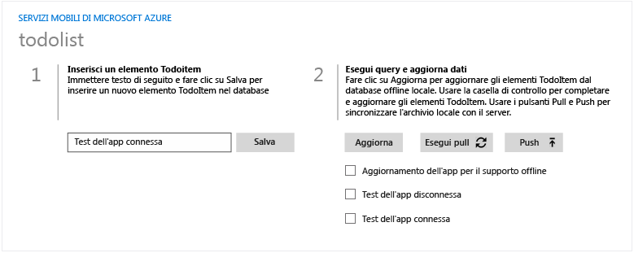
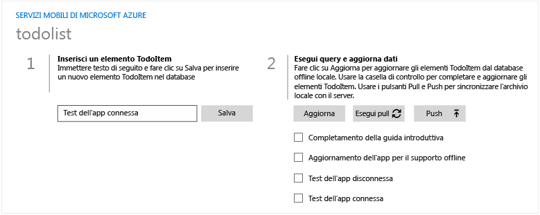
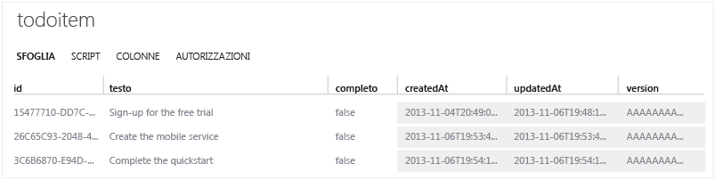
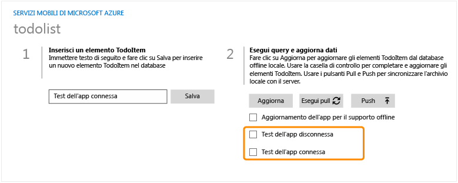
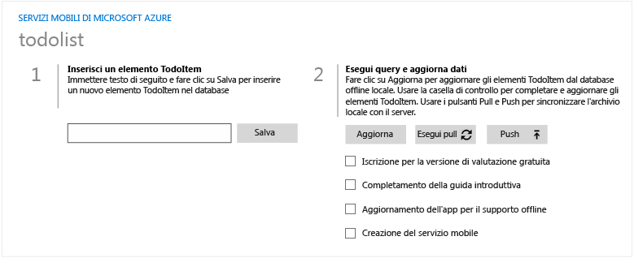
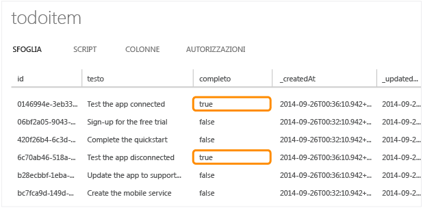

<properties linkid="develop-mobile-tutorials-get-started-offline-data-dotnet" urlDisplayName="Getting Started with Offline Data" pageTitle="Get started with offline data in Mobile Services (Windows Store) | Mobile Dev Center" metaKeywords="" description="Learn how to use offline data in your Windows Store application." metaCanonical="" disqusComments="1" umbracoNaviHide="1" documentationCenter="Mobile" title="Get started with offline data in Mobile Services" authors="wesmc" />

Introduzione ai dati offline in Servizi mobili
==============================================

[Windows Store C\#](/en-us/documentation/articles/mobile-services-windows-store-dotnet-get-started-offline-data "Windows Store C#")

In questo argomento viene illustrato come utilizzare le funzionalità offline di Servizi mobili di Azure. Servizi mobili di Azure consente di interagire con un database locale quando si utilizza un servizio mobile in modalità offline. Le funzionalità offline consentono di sincronizzare le modifiche locali con il servizio mobile utilizzato quando si torna online.

In questa esercitazione verrà aggiornata l'app creata nell'esercitazione [Introduzione a Servizi mobili](/en-us/documentation/articles/mobile-services-windows-store-get-started/) o [Introduzione ai dati](/en-us/documentation/articles/mobile-services-dotnet-backend-windows-store-dotnet-get-started-data/) per supportare le funzionalità offline di Servizi mobili di Azure. Quindi, verranno aggiunti dati in uno scenario offline, verrà effettuata la sincronizzazione di tali elementi con il database online, quindi si effettuerà l'acesso al portale di gestione di Azure per visualizzare le modifiche apportate durate l'esecuzione dell'app.

> [WACOM.NOTE] In questa esercitazione viene descritto come utilizzare Servizi mobili di Azure per archiviare e recuperare i dati da un'app per Windows Store e vengono pertanto riproposte molte delle procedure già completate nella guida introduttiva a Servizi mobili. Se si tratta della prima esperienza con Servizi mobili, è consigliabile iniziare dall'esercitazione [Introduzione a Servizi mobili](/en-us/documentation/articles/mobile-services-windows-store-get-started/).

In questa esercitazione vengono descritte le operazioni di base seguenti:

1.  [Aggiornamento dell'app per supportare le funzionalità offline](#enable-offline-app)
2.  [Test dell'app in uno scenario offline](#test-offline-app)
3.  [Aggiornamento dell'app per la riconnessione al servizio mobile](#update-online-app)
4.  [Test dell'app connessa al servizio mobile](#test-online-app)

Per completare questa esercitazione, è necessario disporre di:

-   Visual Studio 2013 in esecuzione su Windows 8.1.
-   Prima di iniziare questa esercitazione, è necessario completare l'esercitazione [Introduzione a Servizi mobili](/en-us/documentation/articles/mobile-services-windows-store-get-started/) o [Introduzione ai dati](/en-us/documentation/articles/mobile-services-dotnet-backend-windows-store-dotnet-get-started-data/)
-   Pacchetto Azure Mobile Services SDK NuGe 1.3.0 alfa.
-   Pacchetto Azure Mobile Services SQLite Store NuGe 0.1.0 alpha
-   SQLite for Windows 8.1

> [WACOM.NOTE] Per completare l'esercitazione, è necessario un account Azure. Se non si dispone di un account, è possibile creare un account di valutazione gratuita in pochi minuti. Per informazioni dettagliate, vedere la pagina relativa alla [versione di valutazione gratuita di Azure](http://www.windowsazure.com/en-us/pricing/free-trial/?WT.mc_id=AE564AB28).

Aggiornamento dell'app per supportare le funzionalità offline
-------------------------------------------------------------

Servizi mobili di Azure consente di interagire con un database locale quando si utilizza un servizio mobile in modalità offline. Per utilizzare queste funzionalità nell'app, inizializzare `MobileServiceClient.SyncContext` in un archivio locale. Quindi, fare riferimento alla tabella tramite l'interfaccia di `IMobileServiceSyncTable`.

In questa sezione viene utilizzato SQLite come archivio locale per le funzionalità offline.

> [WACOM.NOTE] È possibile ignorare questa sezione e limitarsi a scaricare una versione del progetto introduttivo che dispone già di supporto online. Per scaricare un progetto con il supporto offline abilitato, vedere l'[esempio introduttivo offline](http://go.microsoft.com/fwlink/?LinkId=394777).

1.  Installare SQLite. È possibile installarlo direttamente dal collegamento [SQLite for Windows 8.1](http://go.microsoft.com/fwlink/?LinkId=394776).

    > [WACOM.NOTE] Se si utilizza Internet Explorer, facendo clic sul link di installazione di SQLite potrebbe essere visualizzato un messaggio in cui viene chiesto di scaricare .vsix come file .zip. Salvare il file in un percorso del disco rigido utilizzando l'estensione .vsix invece di .zip. Quindi, fare doppio clic sul file .vsix file in Esplora risorse per eseguire l'installazione.

2.  In Visual Studio aprire il progetto completato nell'esercitazione [Introduzione a Servizi mobili](/en-us/documentation/articles/mobile-services-windows-store-get-started/) o [Introduzione ai dati](/en-us/documentation/articles/mobile-services-dotnet-backend-windows-store-dotnet-get-started-data/). Aggiungere un riferimento di **estensione di Windows** a **SQLite for Windows Runtime (Windows 8.1)**.

    

    > [WACOM.NOTE] SQLite Runtime richiede la modifica dell'architettura del processore per il progetto creato in **x86**, **x64** o **ARM**. **Qualsiasi CPU** non è supportata.

3.  In Esplora soluzioni di Visual Studio fare clic con il pulsante destro del mouse sul progetto di app e scegliere **Gestisci pacchetti NuGet** per eseguire Gestione pacchetti NuGet. Cercare **SQLiteStore** per installare il pacchetto **Azure.MobileServices.SQLiteStore**.

    

4.  In Esplora soluzioni di Visual Studio aprire il file MainPage.xaml.cs. Aggiungere le istruzioni using seguenti all'inizio del file:

         using Microsoft.WindowsAzure.MobileServices.SQLiteStore;
         using Microsoft.WindowsAzure.MobileServices.Sync;
         using Newtonsoft.Json.Linq;

5.  In Mainpage.xaml.cs sostituire la dichiarazione di `todoTable` con una dichiarazione di tipo `IMobileServicesSyncTable` inizializzata mediante la chiamata di `MobileServicesClient.GetSyncTable()`.

         //private IMobileServiceTable<TodoItem> todoTable = App.MobileService.GetTable<TodoItem>();
         private IMobileServiceSyncTable<TodoItem> todoTable = App.MobileService.GetSyncTable<TodoItem>();

6.  In MainPage.xaml.cs aggiornare la classe `TodoItem` in modo che includa la proprietà di sistema **Version** come segue.

         public class TodoItem
         {
           public string Id { get; set; }
           [JsonProperty(PropertyName = "text")]
           public string Text { get; set; }
           [JsonProperty(PropertyName = "complete")]
           public bool Complete { get; set; }
           [Version]
           public string Version { get; set; }
         }

7.  In MainPage.xaml.cs aggiornare il gestore di eventi `OnNavigatedTo` in modo che inizializzi il contesto di sincronizzazione del client con un archivio SQLite. L'archivio SQLite viene creato con una tabella che corrisponde allo schema della tabella di Servizi mobili, ma deve contenere la proprietà di sistema **Version** aggiunta nel passaggio precedente.

         protected async override void OnNavigatedTo(NavigationEventArgs e)
         {
             if (!App.MobileService.SyncContext.IsInitialized)
             {
                 var store = new MobileServiceSQLiteStore("localsync12.db");
                 store.DefineTable<TodoItem>();
                 await App.MobileService.SyncContext.InitializeAsync(store, new MobileServiceSyncHandler());
             }
             RefreshTodoItems();
         }

8.  In Esplora soluzioni di Visual Studio aprire il file MainPage.xaml. Individuare l'elemento Grid che contiene lo StackPanel dal titolo **Query and Update Data**. Aggiungere il codice di interfaccia utente seguente che sostituisce gli elementi delle definizioni delle righe fino al tag iniziale dell'oggetto ListView.

    Questo codice aggiunge definizioni di riga e colonna alla griglia per definire il layout degli elementi. Inoltre, aggiunge due controlli di pulsante con i gestori di eventi clic per le operazioni **Push** e **Pull**. I pulsanti sono posizionati proprio sopra l'oggetto `ListView` denominato ListItems. Salvare il file.

         <Grid.RowDefinitions>
             <RowDefinition Height="Auto" />
             <RowDefinition Height="Auto" />
             <RowDefinition Height="*" />
         </Grid.RowDefinitions>
         <Grid.ColumnDefinitions>
             <ColumnDefinition Width="Auto" />
             <ColumnDefinition Width="*" />
         </Grid.ColumnDefinitions>
         <StackPanel Grid.Row="0" Grid.ColumnSpan="2">
             <local:QuickStartTask Number="2" Title="Query, Update, and Synchronize Data" 
               Description="Use the Pull and Push buttons to synchronize the local store with the server" />
         </StackPanel>
         <Button Grid.Row="1" Grid.Column="0" Margin="5,5,0,0" Name="ButtonPush"
             Click="ButtonPush_Click" Width="80" Height="34">⬆ Push</Button>
         <Button Grid.Row="1" Grid.Column="1" Margin="5,5,0,0"  Name="ButtonPull" 
             Click="ButtonPull_Click" Width="80" Height="34">⬇ Pull</Button>
         <ListView Name="ListItems" SelectionMode="None" Margin="0,10,0,0" Grid.ColumnSpan="2" Grid.Row="2">

9.  In MainPage.xaml.cs aggiungere i gestori di eventi clic per i pulsanti **Push** e**Pull**, quindi salvare il file.

         private async void ButtonPull_Click(object sender, RoutedEventArgs e)
         {
             Exception pullException = null;
             try
             {
                 await todoTable.PullAsync();
                 RefreshTodoItems();
             }
             catch (Exception ex)
             {
                 pullException = ex;
             }
             if (pullException != null) {
                 MessageDialog d = new MessageDialog("Pull failed: " + pullException.Message +
                   "\n\nIf you are in an offline scenario, " + 
                   "try your Pull again when connected with your Mobile Serice.");
                 await d.ShowAsync();
             }
         }
         private async void ButtonPush_Click(object sender, RoutedEventArgs e)
         {
             string errorString = null;
             try
             {
                 await App.MobileService.SyncContext.PushAsync();
                 RefreshTodoItems();
             }
             catch (MobileServicePushFailedException ex)
             {
                 errorString = "Push failed because of sync errors: " + 
                   ex.PushResult.Errors.Count() + ", message: " + ex.Message;
             }
             catch (Exception ex)
             {
                 errorString = "Push failed: " + ex.Message;
             }
             if (errorString != null) {
                 MessageDialog d = new MessageDialog(errorString + 
                   "\n\nIf you are in an offline scenario, " + 
                   "try your Push again when connected with your Mobile Serice.");
                 await d.ShowAsync();
             }
         }

10. Non eseguire ancora l'app. Premere **F7** per ricompilare il progetto. Verificare che non si siano verificati errori di compilazione.

Test dell'app in uno scenario offline
-------------------------------------

In questa sezione verrà interrotta la connessione dell'app al servizio mobile per simulare uno scenario offline. Quindi, verranno aggiunti alcuni elementi di dati che saranno conservati nell'archivio locale.

Si noti che in questa sezione l'app non deve essere connessa ad alcun servizio mobile. Pertanto, se vengono testati, i pulsanti **Push** e **Pull** genereranno eccezioni. Nella sezione successiva verrà effettuata di nuovo la connessione di questa app client al servizio mobile per testare le operazioni **push** e **pull** allo scopo di sincronizzare l'archivio con il database del servizio mobile.

1.  In Esplora soluzioni di Visual Studio aprire App.xaml.cs. Modificare l'inizializzazione di **MobileServiceClient** impostandola su un indirizzo non valido mediante la sostituzione di "**azure-mobile.net**" con "**azure-mobile.xxx**" per l'URL. Salvare il file.

          public static MobileServiceClient MobileService = new MobileServiceClient(
             "https://your-mobile-service.azure-mobile.xxx/",
             "AppKey"
         );

2.  In Visual Studio premere **F5** per compilare ed eseguire l'applicazione. Immettere un nuovo elemento Todo e fare clic su **Salva**. I nuovi elementi todo esistono solo nell'archivio locale fino a quando è possibile effettuarne il push al servizio mobile. L'app client si comporta come se fosse connessa al servizio mobile, supportando tutte le operazioni CRUD (creazione, lettura, aggiornamento ed eliminazione).

    

3.  Chiudere l'app e riavviarla per verificare che i nuovi elementi creati siano salvati in modo permanente nell'archivio locale.

Aggiornamento dell'app per la riconnessione al servizio mobile
--------------------------------------------------------------

In questa sezione verrà effettuata la riconnessione dell'app al servizio mobile. Viene simulato il passaggio dell'app dallo stato offline allo stato online con il servizio mobile.

1.  In Esplora soluzioni di Visual Studio aprire App.xaml.cs. Modificare l'inizializzazione del **MobileServiceClient** impostandola su un indirizzo valido mediante la sostituzione di "**azure-mobile.net**" con "**azure-mobile.xxx**" per l'URL. Salvare il file.

          public static MobileServiceClient MobileService = new MobileServiceClient(
             "https://your-mobile-service.azure-mobile.net/",
             "Your AppKey"
         );

Test dell'app connessa al servizio mobile
-----------------------------------------

In questa sezione verrà effettuato il test delle operazioni push e pull per sincronizzare l'archivio locale con il database del servizio mobile.

1.  In Visual Studio premere **F5** per ricompilare ed eseguire l'app. Si noti che i dati appaiono uguali a quelli dello scenario offline nonostante l'app sia ora connessa al servizio mobile. Questo avviene perché questa app funziona sempre con la `IMobileServiceSyncTable` che fa riferimento all'archivio locale.

    

2.  Accedere al portale di gestione di Azure ed esaminare il database relativo al servizio mobile. Se il servizio utilizza il back-end JavaScript per i servizi mobili, è possibile visualizzare i dati dalla scheda **Data** del servizio mobile. Se si utilizza il back-end .NET per il servizio mobile, è possibile fare clic sul pulsante **Manage** per il database nell'estensione SQL Azure per eseguire una query sulla tabella.

    Si noti che i dati non sono stati sincronizzati tra il database e l'archivio locale.

    

3.  Nell'app, premere il pulsante **Push**. L'app effettuerà la chiamata a `MobileServiceClient.SyncContext.PushAsync` e quindi a `RefreshTodoItems` in modo da effettuare l'aggiornamento con gli elementi dell'archivio locale. Con questa operazione push il database del servizio mobile riceve i dati dall'archivio. Tuttavia, l'archivio locale non riceve gli elementi dal database del servizio mobile.

    Un'operazione push viene eseguita da `MobileServiceClient.SyncContext` invece che da `IMobileServicesSyncTable` ed esegue il push delle modifiche a tutte le tabelle associate a tale contesto di sincronizzazione. Questa operazione serve per gli scenari in cui sono presenti relazioni tra tabelle.

    

4.  Nell'app alcuni nuovi elementi sono inviati all'archivio locale.

    

5.  Questa volta premere il pulsante **Pull** nell'app. L'app esegue solo le chiamate a `IMobileServiceSyncTable.PullAsync()` e `RefreshTodoItems`. Si noti che tutti i dati provenienti dal database del servizio mobile sono stati estratti nell'archivio locale e vengono mostrati nell'app. Tuttavia, si noti anche che tutti i dati dell'archivio locale sono stati comunque sottoposti a push nel database del servizio mobile. Questo perché un'operazione **pull effettua sempre un'operazione push all'inizio**.

    

    

Riepilogo
---------

Per supportare le funzionalità offline di Servizi mobili è stata utilizzata l'interfaccia `IMobileServiceSyncTable` e inizializzato `MobileServiceClient.SyncContext` in un archivio locale. In questo caso l'archivio locale era un database SQLite.

Le normali operazioni CRUD per Servizi mobili funzionano come se l'app fosse ancora connessa, ma tutte le operazioni si verificano nell'archivio locale.

Per sincronizzare l'archivio locale con il server sono stati utilizzati i metodi `IMobileServiceSyncTable.PullAsync` e `MobileServiceClient.SyncContext.PushAsync`.

-   Per eseguire il push delle modifiche al server, è stata effettuata la chiamata a `IMobileServiceSyncContext.PushAsync()`. Questo metodo fa parte di `IMobileServicesSyncContext` invece che della tabella di sincronizzazione perché effettuerà il push delle modifiche in tutte le tabelle:

    Solo i record che sono stati in qualche modo modificati localmente (tramite le operazioni CRUD) verranno inviate al server.

-   Per eseguire il pull dei dati da una tabella del server all'app, è stata effettuata la chiamata a `IMobileServiceSyncTable.PullAsync`.

    Un'operazione pull effettua sempre un'operazione push all'inizio.

    Esistono inoltre overload di **PullAsync()** che consentono di specificare una query. Si noti che nella versione preliminare del supporto offline per Servizi mobili, **PullAsync** leggerà tutte le righe nella tabella (o query) corrispondente; non effettua il tentativo di leggere solo righe più recenti rispetto, ad esempio, all'ultima sincronizzazione. Se le righe esistono già nella tabella di sincronizzazione locale, resteranno invariate.

Passaggi successivi
-------------------

-   [Gestione dei conflitti con il supporto offline per Servizi mobili](/en-us/documentation/articles/mobile-services-windows-store-dotnet-handling-conflicts-offline-data/)

<!-- Anchors. -->
[Update the app to support offline features]: #enable-offline-app
[Test the app in an offline Scenario]: #test-offline-app
[Update the app to reconnect your mobile service]: #update-online-app
[Test the app connected to the Mobile Service]: #test-online-app
[Next Steps]:#next-steps

<!-- Images -->
[0]: ./media/mobile-services-windows-store-dotnet-get-started-data-vs2013/mobile-todoitem-data-browse.png
[1]: ./media/mobile-services-windows-store-dotnet-get-started-offline-data/mobile-services-add-reference-sqlite-dialog.png
[2]: ./media/mobile-services-windows-store-dotnet-get-started-offline-data/mobile-services-sqlitestore-nuget.png
[3]: ./media/mobile-services-windows-store-dotnet-get-started-offline-data/mobile-services-sqlitepcl-nuget.png
[4]: ./media/mobile-services-windows-store-dotnet-get-started-offline-data/mobile-services-offline-app-run1.png
[5]: ./media/mobile-services-windows-store-dotnet-get-started-offline-data/mobile-services-online-app-run1.png
[6]: ./media/mobile-services-windows-store-dotnet-get-started-offline-data/mobile-data-browse.png
[7]: ./media/mobile-services-windows-store-dotnet-get-started-offline-data/mobile-data-browse2.png
[8]: ./media/mobile-services-windows-store-dotnet-get-started-offline-data/mobile-services-online-app-run2.png
[9]: ./media/mobile-services-windows-store-dotnet-get-started-offline-data/mobile-services-online-app-run3.png
[10]: ./media/mobile-services-windows-store-dotnet-get-started-offline-data/mobile-data-browse3.png

<!-- URLs. -->
[Handling conflicts with offline support for Mobile Services]: /en-us/documentation/articles/mobile-services-windows-store-dotnet-handling-conflicts-offline-data/ 
[Getting Started Offline Sample]: http://go.microsoft.com/fwlink/?LinkId=394777
[Get started with Mobile Services]: /en-us/develop/mobile/tutorials/get-started/#create-new-service
[Getting Started]: /en-us/documentation/articles/mobile-services-dotnet-backend-windows-phone-get-started/
[Get started with data]: /en-us/documentation/articles/mobile-services-dotnet-backend-windows-store-dotnet-get-started-data/
[Get started with Mobile Services]: /en-us/documentation/articles/mobile-services-windows-store-get-started/
[SQLite for Windows 8.1]: http://go.microsoft.com/fwlink/?LinkId=394776

