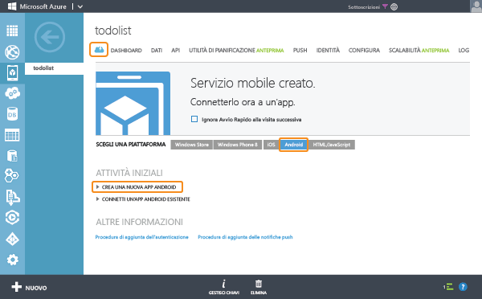

<properties
	pageTitle="Introduzione a Servizi mobili di Azure per le app per Android"
	description="Seguire questa esercitazione per iniziare a usare Servizi mobili di Azure per lo sviluppo per Android."
	services="mobile-services"
	documentationCenter="android"
	authors="RickSaling"
	manager="dwrede"
	editor=""/>

<tags
	ms.service="mobile-services"
	ms.workload="mobile"
	ms.tgt_pltfrm="mobile-android"
	ms.devlang="java"
	ms.topic="article" 
	ms.date="06/03/2015"
	ms.author="ricksal"/>

# Introduzione a Servizi mobili

[AZURE.INCLUDE [mobile-services-selector-get-started](../../includes/mobile-services-selector-get-started.md)]

Questa esercitazione illustra come aggiungere un servizio back-end basato sul cloud a un'app per Android mediante Servizi mobili di Azure. In questa esercitazione si creeranno sia un nuovo servizio mobile che una semplice app <em>To do list</em> che archivia i dati dell'app nel nuovo servizio mobile.

Di seguito è riportata una schermata dell'app completata:

<a href="http://channel9.msdn.com/Series/Windows-Azure-Mobile-Services/Android-Support-in-Windows-Azure-Mobile-Services" target="_blank" class="label">guarda l'esercitazione</a> <a style="background-image: url('/media/devcenter/mobile/videos/mobile-get-started-android-180x120.png') !important;" href="http://channel9.msdn.com/Series/Windows-Azure-Mobile-Services/Android-Support-in-Windows-Azure-Mobile-Services" target="_blank" class="dev-onpage-video">Riproduci video</a> 7:26

## Prerequisiti

Per completare questa esercitazione, è necessario disporre di [Android Developer Tools][Android Studio] che include l'ambiente di sviluppo integrato di Android Studio e la piattaforma Android più recente. È necessario Android 4.2 o versione successiva.

Il progetto di guida introduttiva scaricato contiene l'SDK di Servizi mobili di Azure per Android.

> [AZURE.IMPORTANT]Per completare l'esercitazione, è necessario un account Azure. Se non si dispone di un account, è possibile creare un account di valutazione gratuita in pochi minuti. Per informazioni dettagliate, vedere la pagina relativa alla [versione di valutazione gratuita di Azure](http://azure.microsoft.com/pricing/free-trial/?WT.mc_id=AE564AB28).

## Creare un nuovo servizio mobile

[AZURE.INCLUDE [mobile-services-create-new-service](../../includes/mobile-services-create-new-service.md)]

## Creazione di una nuova app per Android

Dopo aver creato il servizio mobile, è possibile seguire una facile guida introduttiva nel portale di gestione per creare una nuova app o modificare un'app esistente per connettersi al servizio mobile.

In questa sezione si creerà una nuova app per Android connessa al servizio mobile.

1.  Nel portale di gestione fare clic su **Mobile Services** e quindi sul servizio mobile appena creato.

2. Nella scheda Quickstart fare clic su **Android** in **Choose platform** ed espandere **Create a new Android app**.

   	

   	Di seguito sono visualizzati i tre semplici passaggi per creare un'app per Android connessa al servizio mobile.

  	

3. Se necessario, scaricare e installare [Android Developer Tools][Android SDK] nel computer locale o nella macchina virtuale.

4. Fare clic su **Create TodoItem table** per creare una tabella in cui archiviare i dati dell'app.

5. Scaricare ora l'app:
	- La versione più recente dell'app usa Mobile Services Android SDK 2.0, che è possibile scaricare <a href="https://github.com/RickSaling/mobile-services-samples/tree/futures">qui</a>. Fare clic su **Download del file ZIP** e decomprimere il file. Il progetto è disponibile in GettingStarted nella cartella Android.

	- Con una versione più recente si userà la versione precedente dell'SDK. A questo scopo, in **Scaricare ed eseguire l'applicazione** fare clic su **Download**. Verrà scaricato il progetto per l'applicazione _To do list_ di esempio connessa al servizio mobile. I file di progetto sono compressi. Individuare il relativo percorso ed espanderli nel computer.

## Esecuzione dell'app per Android

[AZURE.INCLUDE [mobile-services-run-your-app](../../includes/mobile-services-android-get-started.md)]

### Esaminare il codice (facoltativo)

Per visualizzare il codice sorgente dell'app completata, fare clic [qui](https://github.com/RickSaling/mobile-services-samples/tree/androidStudio/GettingStarted/AndroidStudio).

Per visualizzare la versione per Eclipse di questa esercitazione, vedere [Introduzione (Eclipse)](mobile-services-android-get-started-EC.md).

## Passaggi successivi
Dopo aver completato la guida introduttiva, è possibile eseguire altre importanti attività in Servizi mobili:

* [Introduzione ai dati]  Altre informazioni sull'archiviazione e l'esecuzione di query sui dati tramite servizi mobili.

* [Introduzione all'autenticazione]  Informazioni sull'autenticazione degli utenti dell'app con un provider di identità.

* [Introduzione alle notifiche push]  Informazioni sull'invio di una notifica push di base all'app.

<!-- Anchors. -->
[Getting started with Mobile Services]: #getting-started
[Create a new mobile service]: #create-new-service
[Define the mobile service instance]: #define-mobile-service-instance
[Next Steps]: #next-steps

<!-- Images. -->
[0]: ./media/mobile-services-android-get-started/mobile-quickstart-completed-android.png
[6]: ./media/mobile-services-android-get-started/mobile-portal-quickstart-android.png
[7]: ./media/mobile-services-android-get-started/mobile-quickstart-steps-android-AS.png
[8]: ./media/mobile-services-android-get-started/mobile-eclipse-quickstart.png
[10]: ./media/mobile-services-android-get-started/mobile-quickstart-startup-android.png
[11]: ./media/mobile-services-android-get-started/mobile-data-tab.png
[12]: ./media/mobile-services-android-get-started/mobile-data-browse.png
[14]: ./media/mobile-services-android-get-started/mobile-services-import-android-workspace.png
[15]: ./media/mobile-services-android-get-started/mobile-services-import-android-project.png

<!-- URLs. -->
[Get started (Eclipse)]: mobile-services-android-get-started-EC.md
[Introduzione ai dati]: mobile-services-android-get-started-data.md
[Introduzione all'autenticazione]: mobile-services-android-get-started-users.md
[Introduzione alle notifiche push]: mobile-services-javascript-backend-android-get-started-push.md
[Android SDK]: https://go.microsoft.com/fwLink/p/?LinkID=280125
[Android Studio]: https://developer.android.com/sdk/index.html
[Mobile Services Android SDK]: https://go.microsoft.com/fwLink/p/?LinkID=266533

[Management Portal]: https://manage.windowsazure.com/
 

<!---HONumber=July15_HO3-->