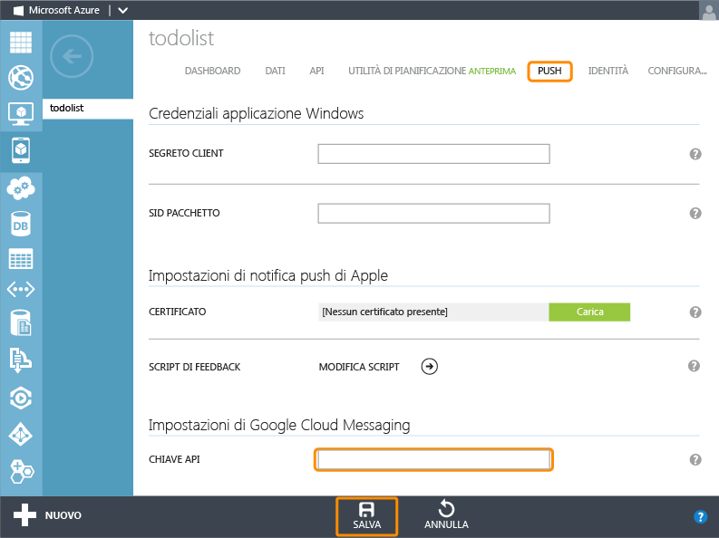

<properties 
	pageTitle="Introduzione al push (Android) | Mobile Dev Center" 
	description="Informazioni su come usare Servizi mobili di Azure per inviare notifiche push all'app .Net per Android." 
	services="mobile-services, notification-hubs" 
	documentationCenter="android" 
	authors="RickSaling" 
	manager="dwrede" 
	editor=""/>

<tags 
	ms.service="mobile-services" 
	ms.workload="mobile" 
	ms.tgt_pltfrm="mobile-android" 
	ms.devlang="java" 
	ms.topic="article" 
	ms.date="05/12/2015" 
	ms.author="ricksal"/>

# Aggiungere notifiche push all'app di Servizi mobili

[AZURE.INCLUDE [mobile-services-selector-get-started-push](../../includes/mobile-services-selector-get-started-push-EC.md)]

##Panoramica

Questo argomento illustra come usare Servizi mobili di Azure per inviare notifiche push a un'app per Android. L'esercitazione consente di aggiungere notifiche push al progetto di guida introduttiva tramite Google Cloud Messaging (GCM). Al termine dell'esercitazione, il servizio mobile invierà una notifica push ogni volta che viene inserito un record.

Questa esercitazione è basata sul progetto di guida introduttiva per Servizi mobili. Prima di iniziare l'esercitazione, è necessario completare [Introduzione a Servizi mobili] o [Aggiungere Servizi mobili a un’app esistente] per collegare il progetto al servizio mobile. Di conseguenza, per completare l'esercitazione è necessario anche Visual Studio 2013.

##Abilitare Google Cloud Messaging

[AZURE.INCLUDE [Abilitare GCM](../../includes/mobile-services-enable-Google-cloud-messaging.md)]

##Configurare Servizi mobili per l'invio di richieste push

1. Accedere al [portale di gestione di Azure], fare clic su **Servizi mobili** e quindi sull'app.

   	

2. Fare clic sulla scheda **Push** e immettere il valore **Chiave API** ottenuto da GCM nella procedura precedente, quindi fare clic su **Salva**.

   	

> [AZURE.IMPORTANT]Le credenziali GCM per le notifiche push avanzate configurate nella scheda Push del portale vengono condivise con Hub di notifica per configurare l'hub di notifica con l'app.

Il servizio mobile è ora configurato per funzionare con GCM e Hub di notifica.

##Scaricare il servizio nel computer locale

[AZURE.INCLUDE [mobile-services-download-service-locally](../../includes/mobile-services-download-service-locally.md)]

##Testare il servizio mobile

[AZURE.INCLUDE [mobile-services-dotnet-backend-test-local-service](../../includes/mobile-services-dotnet-backend-test-local-service.md)]

##Aggiornare il server per l'invio di notifiche push

1. In Esplora soluzioni di Visual Studio espandere la cartella **Controller** nel progetto del servizio mobile. Aprire TodoItemController.cs. Aggiungere le istruzioni `using` seguenti all'inizio del file:

		using System;
		using System.Collections.Generic;

2. Aggiornare la definizione del metodo `PostTodoItem` con il codice seguente:

        public async Task<IHttpActionResult> PostTodoItem(TodoItem item)
        {
            TodoItem current = await InsertAsync(item);

            Dictionary<string, string> data = new Dictionary<string, string>()
            {
                { "message", item.Text}
            };
            GooglePushMessage message = new GooglePushMessage(data, TimeSpan.FromHours(1));

            try
            {
                var result = await Services.Push.SendAsync(message);
                Services.Log.Info(result.State.ToString());
            }
            catch (System.Exception ex)
            {
                Services.Log.Error(ex.Message, null, "Push.SendAsync Error");
            }
            return CreatedAtRoute("Tables", new { id = current.Id }, current);
        }

    Questo codice invierà una notifica push (con il testo dell'elemento inserito) dopo l'inserimento di un elemento Todo. In caso di errore, il codice aggiungerà una voce di log errori visualizzabile nella scheda **Log** del servizio mobile nel portale di gestione.

##Pubblicare il servizio mobile in Azure

[AZURE.INCLUDE [mobile-services-dotnet-backend-publish-service](../../includes/mobile-services-dotnet-backend-publish-service.md)]

##Aggiungere notifiche push all'app

###Verificare la versione di Android SDK

[AZURE.INCLUDE [mobile-services-verify-android-sdk-version](../../includes/mobile-services-verify-android-sdk-version-EC.md)]

Il passaggio successivo comporta l'installazione di Google Play Services. Google Cloud Messaging prevede alcuni requisiti minimi a livello di API per lo sviluppo e il testing. È necessario che la proprietà **minSdkVersion** nel file manifesto sia conforme a tali requisiti.

Se il test verrà eseguito con un dispositivo meno recente, fare riferimento alla pagina relativa alla [configurazione di Google Play Services SDK] per determinare il livello minimo su cui è possibile impostare tale valore.

###Aggiungere Google Play Services al progetto

[AZURE.INCLUDE [Aggiungere Play Services](../../includes/mobile-services-add-Google-play-services-EC.md)]

###Aggiungere codice

[AZURE.INCLUDE [mobile-services-android-getting-started-with-push](../../includes/mobile-services-android-getting-started-with-push-EC.md)]

##Testare l'app sul servizio mobile pubblicato

È possibile eseguire il test dell'app collegando direttamente un telefono Android con un cavo USB oppure usando un dispositivo virtuale nell'emulatore.

###Uso dell'emulatore per il test

Assicurarsi di usare un emulatore Android Virtual Device (AVD) con il supporto per Google APIs.

1. In **Finestra** selezionare **Android Virtual Device Manager**, quindi selezionare il dispositivo e fare clic su **Modifica** (oppure su **Nuovo** se non sono presenti dispositivi).

	

2. Selezionare **Google APIs** (o **Google APIs x86**) in **Destinazione**, quindi fare clic su OK.

   	

	AVD sarà quindi configurato per l'utilizzo di Google APIs. Se sono installate diverse versioni di Android SDK, assicurarsi che il livello dell'API corrisponda a quello impostato in precedenza nelle impostazioni del progetto.

### Abilitare le notifiche push per i test locali

[AZURE.INCLUDE [mobile-services-dotnet-backend-configure-local-push](../../includes/mobile-services-dotnet-backend-configure-local-push.md)]

###Esecuzione del test

1. Dal menu **Run** di Eclipse, fare clic su **Run** per avviare l'app.

2. Digitare testo significativo nell'app, ad esempio _A new Mobile Services task_, quindi fare clic sul pulsante **Add**.

  	

3. Scorrere verso il basso dalla parte superiore della schermata per aprire il Notification Center del dispositivo e visualizzare la notifica.

L'esercitazione è stata completata.

## Passaggi successivi

<!---This tutorial demonstrated the basics of enabling an Android app to use Mobile Services and Notification Hubs to send push notifications. Next, consider completing the next tutorial, [Send push notifications to authenticated users], which shows how to use tags to send push notifications from a Mobile Service to only an authenticated user.

+ [Send push notifications to authenticated users]
	 Learn how to use tags to send push notifications from a Mobile Service to only an authenticated user.

+ [Send broadcast notifications to subscribers]
	 Learn how users can register and receive push notifications for categories they're interested in.

+ [Send template-based notifications to subscribers]
	 Learn how to use templates to send push notifications from a Mobile Service, without having to craft platform-specific payloads in your back-end.
-->
Per altre informazioni su Servizi mobili e su Hub di notifica, fare riferimento ai seguenti argomenti:

* [Introduzione ai dati]  Altre informazioni sull'archiviazione e l'esecuzione di query sui dati tramite servizi mobili.

* [Introduzione all'autenticazione]  Informazioni sull'autenticazione degli utenti dell'app con tipi di account diversi tramite Servizi mobili.

* [Informazioni su Hub di notifica]  Altre informazioni sull'uso di Hub di notifica per recapitare le notifiche alle app in tutte le principali piattaforme client.

* [Eseguire il debug delle applicazioni di Hub di notifica](http://go.microsoft.com/fwlink/p/?linkid=386630)  Informazioni aggiuntive sulla risoluzione dei problemi e sul debug di soluzioni di Hub di notifica.

* [Come usare la libreria client di Android per Servizi mobili]  Altre informazioni su come usare Servizi mobili con Android.
  
<!-- Anchors. -->

[Create a new mobile service]: #create-service
[Download the service locally]: #download-the-service-locally
[Test the mobile service]: #test-the-service
[Download the GetStartedWithData project]: #download-app
[Update the app to use the mobile service for data access]: #update-app
[Test the Android App against the service hosted locally]: #test-locally-hosted
[Publish the mobile service to Azure]: #publish-mobile-service
[Test the Android App against the service hosted in Azure]: #test-azure-hosted
[Test the app against the published mobile service]: #test-app
[Next Steps]: #next-steps

<!-- Images. -->
[0]: ./media/mobile-services-dotnet-backend-windows-store-dotnet-get-started-data/app-view.png
[1]: ./media/mobile-services-dotnet-backend-windows-store-dotnet-get-started-data/mobile-data-sample-download-dotnet-vs13.png
[2]: ./media/mobile-services-dotnet-backend-windows-store-dotnet-get-started-data/mobile-service-overview-page.png
[3]: ./media/mobile-services-dotnet-backend-windows-store-dotnet-get-started-data/download-service-project.png
[4]: ./media/mobile-services-dotnet-backend-windows-store-dotnet-get-started-data/add-service-project-to-solution.png
[5]: ./media/mobile-services-dotnet-backend-windows-store-dotnet-get-started-data/download-publishing-profile.png
[6]: ./media/mobile-services-dotnet-backend-windows-store-dotnet-get-started-data/add-existing-project-dialog.png
[7]: ./media/mobile-services-dotnet-backend-windows-store-dotnet-get-started-data/vs-manage-nuget-packages.png
[8]: ./media/mobile-services-dotnet-backend-windows-store-dotnet-get-started-data/manage-nuget-packages.png
[9]: ./media/mobile-services-dotnet-backend-windows-store-dotnet-get-started-data/copy-mobileserviceclient-snippet.png
[10]: ./media/mobile-services-dotnet-backend-windows-store-dotnet-get-started-data/vs-pasted-mobileserviceclient.png
[11]: ./media/mobile-services-dotnet-backend-windows-store-dotnet-get-started-data/vs-build-solution.png
[12]: ./media/mobile-services-dotnet-backend-windows-store-dotnet-get-started-data/vs-run-solution.png
[13]: ./media/mobile-services-dotnet-backend-windows-store-dotnet-get-started-data/new-local-todoitem.png
[14]: ./media/mobile-services-dotnet-backend-windows-store-dotnet-get-started-data/vs-show-local-table-data.png
[15]: ./media/mobile-services-dotnet-backend-windows-store-dotnet-get-started-data/local-item-checked.png
[16]: ./media/mobile-services-dotnet-backend-windows-store-dotnet-get-started-data/azure-items.png
[17]: ./media/mobile-services-dotnet-backend-windows-store-dotnet-get-started-data/manage-sql-azure-database.png
[18]: ./media/mobile-services-dotnet-backend-windows-store-dotnet-get-started-data/sql-azure-query.png

[20]: ./media/mobile-services-dotnet-backend-windows-store-dotnet-get-started-data/vs-build-service-project.png
[21]: ./media/mobile-services-dotnet-backend-windows-store-dotnet-get-started-data/vs-start-debug-service-project.png
[22]: ./media/mobile-services-dotnet-backend-windows-store-dotnet-get-started-data/service-welcome-page.png
[23]: ./media/mobile-services-dotnet-backend-windows-store-dotnet-get-started-data/iis-express-tray.png

[26]: ./media/mobile-services-dotnet-backend-windows-store-dotnet-get-started-data/copy-service-and-packages-folder.png

<!-- URLs. -->
[Introduzione a Servizi mobili]: mobile-services-dotnet-backend-android-get-started.md
[Aggiungere Servizi mobili a un’app esistente]: mobile-services-dotnet-backend-android-get-started-data.md
[Introduzione all'autenticazione]: mobile-services-dotnet-backend-android-get-started-users.md
[Azure Management Portal]: https://manage.windowsazure.com/
[Management Portal]: https://manage.windowsazure.com/
[Mobile Services SDK]: http://go.microsoft.com/fwlink/p/?LinkId=257545
[Developer Code Samples site]: http://go.microsoft.com/fwlink/p/?LinkId=328660

[Come usare la libreria client di Android per Servizi mobili]: mobile-services-android-how-to-use-client-library.md

[Send push notifications to authenticated users]: mobile-services-dotnet-backend-android-push-notifications-app-users.md

[Informazioni su Hub di notifica]: ../notification-hubs-overview.md
[Send broadcast notifications to subscribers]: ../notification-hubs-windows-store-dotnet-send-breaking-news.md
[Send template-based notifications to subscribers]: ../notification-hubs-windows-store-dotnet-send-localized-breaking-news.md
[portale di gestione di Azure]: https://manage.windowsazure.com/
 

<!---HONumber=July15_HO4-->