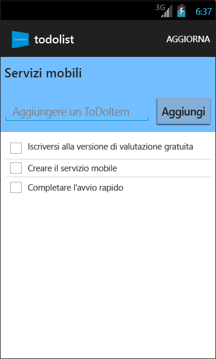

<properties
	pageTitle="Introduzione a Servizi mobili di Azure per le app per Android"
	description="Seguire questa esercitazione per iniziare a usare Servizi mobili di Azure per lo sviluppo per Android."
	services="mobile-services"
	documentationCenter="android"
	authors="RickSaling"
	manager="erikre"
	editor=""/>

<tags
	ms.service="mobile-services"
	ms.workload="mobile"
	ms.tgt_pltfrm="mobile-android"
	ms.devlang="java"
	ms.topic="get-started-article"
	ms.date="03/05/2016"
	ms.author="ricksal"/>

# Introduzione a Servizi mobili

[AZURE.INCLUDE [mobile-services-selector-get-started](../../includes/mobile-services-selector-get-started.md)]

&nbsp;

[AZURE.INCLUDE [mobile-service-note-mobile-apps](../../includes/mobile-services-note-mobile-apps.md)]
> Per l'equivalente di App per dispositivi mobili di questo argomento, vedere [Creare un'app per Android in App per dispositivi mobili di Azure](../app-service-mobile/app-service-mobile-android-get-started.md).

Questa esercitazione illustra come aggiungere un servizio back-end basato sul cloud a un'app per Android mediante Servizi mobili di Azure. In questa esercitazione si creeranno sia un nuovo servizio mobile che una semplice app _To do list_ che archivia i dati dell'app nel nuovo servizio mobile. Il servizio mobile che verrà creato usa i linguaggi .NET supportati tramite Visual Studio per la logica di business sul lato server e per la gestione del servizio mobile. Per creare un servizio mobile che consenta di scrivere la logica di business sul lato server in JavaScript, vedere la [versione per back-end JavaScript](mobile-services-android-get-started.md) di questo argomento.

Di seguito è riportata una schermata dell'app completata:

Per completare questa esercitazione, è necessario disporre di [Android Developer Tools][Android Studio] che include l'ambiente di sviluppo integrato di Android Studio e la piattaforma Android più recente. È necessario Android 4.2 o versione successiva.

Il progetto di guida introduttiva scaricato contiene Mobile Services SDK per Android.

> [AZURE.IMPORTANT] Per completare l'esercitazione, è necessario un account Azure. Se non si ha un account, è possibile iscriversi per accedere a una versione di valutazione di Azure e ottenere un massimo di 10 servizi mobili gratuiti che potranno essere usati anche dopo il termine del periodo di valutazione. Per informazioni dettagliate, vedere la pagina relativa alla [versione di valutazione gratuita di Azure](https://azure.microsoft.com/pricing/free-trial/?WT.mc_id=AE564AB28).

## Creare un nuovo servizio mobile

[AZURE.INCLUDE [mobile-services-dotnet-backend-create-new-service](../../includes/mobile-services-dotnet-backend-create-new-service.md)]

## Download del servizio mobile sul computer locale

Dopo aver creato il servizio mobile scaricare il progetto di servizio mobile personalizzato da eseguire sul computer locale o sulla macchina virtuale.

1. Fare clic sul servizio mobile appena creato, quindi nella scheda Quickstart fare clic su **Android** in **Choose platform** ed espandere **Create a new Android app**.

	![][1]

2. Se necessario, scaricare e installare [Visual Studio Professional 2013](https://go.microsoft.com/fwLink/p/?LinkID=391934) o una versione successiva.

3. Nel passaggio 2 fare clic su **Scarica** in **Scaricare e pubblicare il servizio nel cloud**.

	Verrà scaricato il progetto di Visual Studio che implementerà il servizio mobile. Salvare il file del progetto compresso nel computer locale e prendere nota del percorso.

## Testare il servizio mobile

[AZURE.INCLUDE [mobile-services-dotnet-backend-test-local-service](../../includes/mobile-services-dotnet-backend-test-local-service.md)]

## Pubblicare il servizio mobile

[AZURE.INCLUDE [mobile-services-dotnet-backend-publish-service](../../includes/mobile-services-dotnet-backend-publish-service.md)]

## Creazione di una nuova app per Android

In questa sezione si creerà una nuova app per Android connessa al servizio mobile.

1. Nel [portale di Azure classico] fare clic su **Servizi mobili** e quindi sul servizio mobile appena creato.

2. Nella scheda Quickstart fare clic su **Android** in **Choose platform** ed espandere **Create a new Android app**.

	![][2]

3. Se necessario, scaricare e installare [Android Developer Tools][Android SDK] nel computer locale o nella macchina virtuale.

4. In **Download and run your app** fare clic su **Download**.

  	Verrà scaricato il progetto per l'applicazione _To do list_ di esempio connessa al servizio mobile. Salvare il file del progetto compresso nel computer locale e prendere nota del percorso.

## Esecuzione dell'app per Android

[AZURE.INCLUDE [mobile-services-run-your-app](../../includes/mobile-services-android-get-started.md)]

## Passaggi successivi
Dopo aver completato la guida introduttiva, è possibile eseguire altre importanti attività in Servizi mobili:

* [Aggiungere notifiche push all'app]  Informazioni sull'invio di una notifica push di base all'app.

* [Aggiungere l'autenticazione all'app]  Informazioni su come limitare l'accesso ai dati di back-end per specifici utenti registrati dell'app.

* [Risoluzione dei problemi relativi a un back-end .NET di Servizi mobili]   Informazioni su come diagnosticare e correggere i problemi che possono verificarsi con un back-end .NET di Servizi mobili.

<!-- Anchors. -->
[Getting started with Mobile Services]: #getting-started
[Create a new mobile service]: #create-new-service
[Define the mobile service instance]: #define-mobile-service-instance
[Next Steps]: #next-steps

<!-- Images. -->
[0]: ./media/mobile-services-dotnet-backend-android-get-started/mobile-quickstart-completed-android.png
[1]: ./media/mobile-services-dotnet-backend-android-get-started/mobile-quickstart-steps-vs-AS.png
[2]: ./media/mobile-services-dotnet-backend-android-get-started/mobile-quickstart-steps-android-AS.png

[6]: ./media/mobile-services-dotnet-backend-android-get-started/mobile-portal-quickstart-android.png
[7]: ./media/mobile-services-dotnet-backend-android-get-started/mobile-quickstart-steps-android.png
[8]: ./media/mobile-services-dotnet-backend-android-get-started/mobile-eclipse-quickstart.png

[10]: ./media/mobile-services-dotnet-backend-android-get-started/mobile-quickstart-startup-android.png
[11]: ./media/mobile-services-dotnet-backend-android-get-started/mobile-data-tab.png
[12]: ./media/mobile-services-dotnet-backend-android-get-started/mobile-data-browse.png

[14]: ./media/mobile-services-dotnet-backend-android-get-started/mobile-services-import-android-workspace.png
[15]: ./media/mobile-services-dotnet-backend-android-get-started/mobile-services-import-android-project.png

<!-- URLs. -->
[Get started (Eclipse)]: mobile-services-dotnet-backend-android-get-started-ec.md
[Aggiungere notifiche push all'app]: mobile-services-dotnet-backend-android-get-started-push.md
[Aggiungere l'autenticazione all'app]: mobile-services-dotnet-backend-android-get-started-auth.md
[Android SDK]: https://go.microsoft.com/fwLink/p/?LinkID=280125
[Android Studio]: https://developer.android.com/sdk/index.html
[Mobile Services Android SDK]: https://go.microsoft.com/fwLink/p/?LinkID=266533
[Risoluzione dei problemi relativi a un back-end .NET di Servizi mobili]: mobile-services-dotnet-backend-how-to-troubleshoot.md

[portale di Azure classico]: https://manage.windowsazure.com/

<!-----HONumber=AcomDC_0309_2016-->