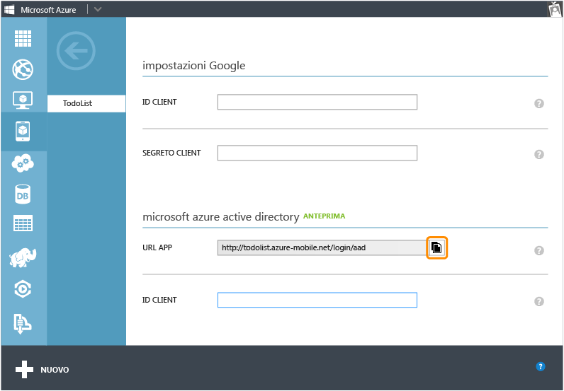
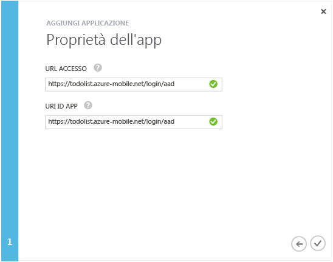

<properties 
	pageTitle="Effettuare la registrazione per l'autenticazione di Azure Active Directory | Microsoft Azure" 
	description="Informazioni su come effettuare la registrazione per l'autenticazione di Azure Active Directory nell'app di Servizi mobili." 
	authors="wesmc7777" 
	services="mobile-services" 
	documentationCenter="" 
	manager="dwrede" 
	editor=""/>

<tags 
	ms.service="mobile-services" 
	ms.workload="mobile" 
	ms.tgt_pltfrm="multiple" 
	ms.devlang="multiple" 
	ms.topic="article" 
	ms.date="09/24/2015" 
	ms.author="ricksal"/>

# Registrare le app per l'uso delle credenziali di accesso di un account Azure Active Directory

[AZURE.INCLUDE [mobile-services-selector-register-identity-provider](../../includes/mobile-services-selector-register-identity-provider.md)]

##Panoramica

Questo argomento illustra come registrare le app in modo da usare Azure Active Directory come provider di autenticazione per i servizi mobili.

##Registrazione dell'app

>[AZURE.NOTE]I passaggi descritti in questo argomento devono essere usati con l'esercitazione [Aggiungere l'autenticazione all'app di Servizi mobili](../mobile-services-dotnet-backend-windows-store-dotnet-get-started-users.md) se si vogliono usare [operazioni di accesso dirette dal servizio](http://msdn.microsoft.com/library/azure/dn283952.aspx) con l'app. Se invece l'app richiede [operazioni di accesso dirette dal client](http://msdn.microsoft.com/library/azure/jj710106.aspx) per Azure Active Directory e un servizio mobile back-end .NET, sarà necessario eseguire prima di tutto l'esercitazione relativa all'[autenticazione dell'app tramite il Single Sign-On di Active Directory Authentication Library](mobile-services-windows-store-dotnet-adal-sso-authentication.md).

1. Accedere al [portale di gestione di Azure], passare al servizio mobile, fare clic sulla scheda **Identità**, quindi scorrere verso il basso fino alla sezione del provider di identità **Azure Active Directory** e copiare l’**URL dell’app** illustrato qui.

    

2. Accedere ad **Active Directory** nel portale di gestione, fare clic sulla propria directory, quindi su **Domini** e prendere nota del dominio predefinito della directory.

3. Fare clic su **Applicazioni** > **Aggiungi** > **Aggiungi un'applicazione che l'organizzazione sta sviluppando.**.

4. Nella procedura guidata di aggiunta dell’applicazione immettere un nome per l'applicazione in **Nome** e fare clic sul tipo **Applicazione Web e/o API Web**.

    

5. In **URL di accesso** incollare il valore dell’URL dell’app copiato dal servizio mobile. Immettere lo stesso valore univoco nella casella **URI ID App**, quindi fare clic per continuare.
 
    

6. Dopo che l'applicazione è stata aggiunta, fare clic sulla scheda **Configura** e copiare l’ **ID Client** per l'app.

    >[AZURE.NOTE]Per un servizio mobile del back-end .NET, modificare anche il campo **URL di risposta** in **Single Sign-on** affinché costituisca l'URL del servizio mobile con l'aggiunta del percorso _signin-aad_. Ad esempio, `https://todolist.azure-mobile.net/signin-aad`

7. Tornare alla scheda **Identità** del servizio mobile e incollare il valore dell’**ID client** copiato per il provider di identità di Azure Active Directory.
 
    

8.  Nell'elenco **Tenant consentiti** è necessario aggiungere il dominio della directory in cui è stata registrata l'applicazione, ad esempio `contoso.onmicrosoft.com`, quindi fare clic su **Salva**.

È ora possibile utilizzare Azure Active Directory per l'autenticazione nell'app.

<!-- Anchors. -->

<!-- Images. -->

<!-- URLs. -->
[portale di gestione di Azure]: https://manage.windowsazure.com/

 

<!---HONumber=Oct15_HO3-->