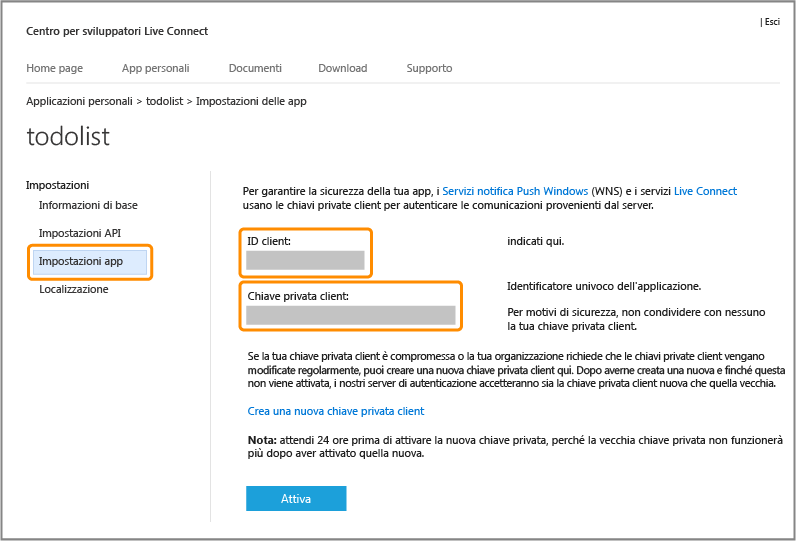

<properties 
	pageTitle="Registrarsi per l'autenticazione Microsoft | Microsoft Azure" 
	description="Informazioni su come registrarsi per l'autenticazione Microsoft nell'applicazione Servizi mobili di Azure." 
	authors="ggailey777" 
	services="mobile-services" 
	documentationCenter="Mobile" 
	manager="dwrede" 
	editor=""/>

<tags 
	ms.service="mobile-services" 
	ms.workload="mobile" 
	ms.tgt_pltfrm="NA" 
	ms.devlang="multiple" 
	ms.topic="article" 
	ms.date="08/08/2015" 
	ms.author="glenga"/>

# Registrare l'app per l'uso dell'account Microsoft per l'autenticazione

[AZURE.INCLUDE [mobile-services-selector-register-identity-provider](../../includes/mobile-services-selector-register-identity-provider.md)]

## Panoramica 

Questo argomento illustra come registrare l'app per dispositivi mobili in modo da usare l'account Microsoft come provider di identità con Servizi mobili di Azure. Gli stessi passaggi si applicano all'autenticazione diretta dal servizio e all'autenticazione diretta dal client mediante Live SDK.

##Registrare l'app di Windows Store in Windows Dev Center

Le app di Windows Store devono innanzitutto essere registrate in Windows Dev Center.

>[AZURE.NOTE]Per le app per Windows Phone 8, Windows Phone 8.1 Silverlight e non per Windows è possibile saltare questa sezione.

1. Se l'app non è ancora stata registrata, passare alla pagina [Invia un'app] in Windows Store Dev Center, accedere con il proprio account Microsoft e quindi fare clic su **Nome app**.

   	

2. Selezionare l'opzione che consente di **creare una nuova app riservando un nome univoco** e fare clic su **Continua**, quindi digitare il nome dell'app in **Nome app**, fare clic su **Riserva nome dell'app** e quindi su **Salva**.

   	

   	Verrà creata una nuova registrazione a Windows Store per l'app.

3. In Visual Studio aprire il progetto creato dopo aver completato l'esercitazione [Introduzione a Servizi mobili](mobile-services-dotnet-backend-windows-store-dotnet-get-started.md).

4. In Esplora soluzioni fare clic con il pulsante destro del mouse sul progetto di app di Windows Store, scegliere **Store** e quindi fare clic su **Associa applicazione a Store**.

  	

   	Verrà visualizzata la procedura guidata **Associa l'applicazione con Windows Store**.

5. Nella procedura guidata fare clic su **Accedi** e quindi accedere con il proprio account Microsoft, selezionare il nome dell'app riservato al passaggio 2, quindi fare clic su **Avanti** > **Associa**.

   	Le informazioni di registrazione a Windows Store necessarie verranno aggiunte al manifesto dell'applicazione.

6. (Facoltativo) Per un'app di Windows universale, ripetere i passaggi da 4 a 5 per il progetto Windows Phone Store.

6. Nella pagina di Windows Dev Center per la nuova app fare clic su **Servizi** > **Notifiche push**.

7. Nella pagina **Notifiche push** fare clic su **Sito di servizi Live** in **Servizi notifica Push Windows (WNS) e Servizi mobili di Microsoft Azure**.

Viene visualizzata la pagina dell'account Microsoft per l'app.

## Configurare la registrazione all'account Microsoft e connettersi a Servizi mobili

Il primo passaggio di questa sezione si applica solo ad app per Windows Phone 8, Windows Phone 8.1 Silverlight e app non di Windows Store. Per tali app è anche possibile ignorare l'ID di sicurezza (SID) del pacchetto, disponibile solo per le app di Windows Store.

1. Per un'app non di Windows Store, passare alla pagina <a href="http://go.microsoft.com/fwlink/p/?LinkId=262039" target="_blank">Applicazioni personali</a> nel centro per sviluppatori degli account Microsoft, accedere con l'account Microsoft (se richiesto), fare clic su **Crea applicazione**, quindi digitare un **Nome applicazione** e fare clic su **Accetto**.

   	Questo processo riserva il nome dell'app con l'account Microsoft e visualizza la pagina dell'account Microsoft per l'app.

2. Nella pagina dell'account Microsoft per l'app, fare clic su **Impostazioni API**, selezionare **App client desktop o per dispositivi mobili**, impostare l'URL del servizio mobile come **Dominio di destinazione**, specificare un valore di `https://<mobile_service>.azure-mobile.net/` in **URL di reindirizzamento** e quindi fare clic su **Salva**.

	 >[AZURE.NOTE]Per un servizio mobile back-end .NET pubblicato in Azure tramite Visual Studio, l'URL di reindirizzamento corrisponde all'URL del servizio mobile con l'aggiunta del percorso _signin-microsoft_, ovvero il servizio mobile come servizio .NET, ad esempio `https://todolist.azure-mobile.net/signin-microsoft`.

    

	Il **dominio radice** deve essere compilato automaticamente.

4. Fare clic su **Impostazioni app** e prendere nota dei valori di **ID client**, **segreto client** e **ID di sicurezza del pacchetto**.
	
   	
	
	
    > [AZURE.NOTE]Il segreto client è un'importante credenziale di sicurezza. Non condividere questo valore con altri né distribuirlo con l'app. Solo per le registrazioni delle app di Windows Store il campo relativo all'ID di sicurezza del pacchetto risulta compilato.

4. Nel [portale di gestione di Azure] fare clic sulla scheda **Identità** relativa al servizio mobile, immettere l'ID client, il segreto client e l'ID di sicurezza del pacchetto ottenuto dal provider di identità e fare clic su **Salva**.

 	
	
	>[AZURE.NOTE]Non è necessario specificare un valore per l'ID di sicurezza del pacchetto per un'app per Windows Phone 8, Windows Phone Store 8.1 Silverlight o non per Windows.
	
Il servizio mobile e l'app sono ora configurati per l'uso con l'account Microsoft.

<!-- Anchors. -->

<!-- Images. -->

<!-- URLs. -->

[Invia un'app]: http://go.microsoft.com/fwlink/p/?LinkID=266582
[My Applications]: http://go.microsoft.com/fwlink/p/?LinkId=262039

[portale di gestione di Azure]: https://manage.windowsazure.com/
 

<!---HONumber=August15_HO7-->