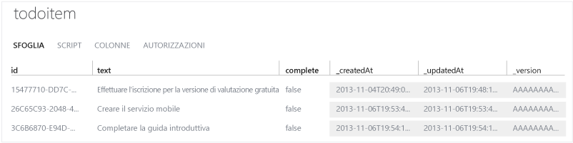

<properties
	pageTitle="Introduzione a Servizi mobili con PhoneGap | Mobile Dev Center"
	description="Seguire questa esercitazione per iniziare a usare Servizi mobili di Azure per lo sviluppo di PhoneGap per iOS, Android e Windows Phone."
	services="mobile-services"
	documentationCenter=""
	authors="ggailey777"
	manager="dwrede"
	editor=""/>

<tags
	ms.service="mobile-services"
	ms.workload="mobile"
	ms.tgt_pltfrm="mobile-phonegap"
	ms.devlang="multiple"
	ms.topic="article" 
	ms.date="04/24/2015"
	ms.author="ggailey777"/>

# Introduzione a Servizi mobili

[AZURE.INCLUDE [mobile-services-selector-get-started](../../includes/mobile-services-selector-get-started.md)]

In questa esercitazione viene illustrato come aggiungere un servizio back-end basato su cloud a un'app mediante Servizi mobili di Azure. In questa esercitazione si creeranno sia un nuovo servizio mobile che una semplice app _To do list_ che archivia i dati dell'app nel nuovo servizio mobile.

Di seguito è riportata una schermata dell'app completata:

![][3]

### Requisiti aggiuntivi

Il completamento di questa esercitazione richiede gli elementi seguenti:

+ Strumenti PhoneGap (per i progetti Windows Phone 8 è richiesta la versione 3.2 o successiva).

+ Account Microsoft Azure attivo.

+ PhoneGap supporta lo sviluppo per più piattaforme. Oltre agli strumenti PhoneGap, è necessario installare gli strumenti relativi a ogni piattaforma di destinazione:

	- Windows Phone: installare [Visual Studio 2012 Express per Windows Phone](https://go.microsoft.com/fwLink/p/?LinkID=268374)
	- iOS: installare [Xcode] (è richiesta la versione 4.4 o successiva)
	- Android: Installare [Android Developer Tools][Android SDK] . Mobile Services SDK per Android supporta le app per Android 2.2 o versione successiva. Per l'esecuzione dell'app di guida introduttiva è necessario Android 4.2 o versione successiva.

## Creare un nuovo servizio mobile

[AZURE.INCLUDE [mobile-services-create-new-service](../../includes/mobile-services-create-new-service.md)]

## Creare una nuova app PhoneGap

In questa sezione si creerà una nuova app PhoneGap connessa al servizio mobile.

1.  Nel portale di gestione fare clic su **Mobile Services** e quindi sul servizio mobile appena creato.

2. Nella scheda Quickstart fare clic su **PhoneGap** in **Choose platform** ed espandere **Create a new PhoneGap app**.

   	![][0]

   	Di seguito sono visualizzati i tre semplici passaggi per creare un'app PhoneGap connessa al servizio mobile.

  	![][1]

3. Se necessario, scaricare e installare PhoneGap e almeno uno strumento di sviluppo della piattaforma (Windows Phone, iOS o Android).

4. Fare clic su **Create TodoItem table** per creare una tabella in cui archiviare i dati dell'app.

5. In **Download and run your app** fare clic su **Download**.

	Verrà scaricato il progetto per l'applicazione _To do list_ di esempio connessa al servizio mobile, unitamente a Mobile Services SDK per JavaScript. Salvare il file del progetto compresso nel computer locale e prendere nota del percorso.

## Esecuzione della nuova app PhoneGap

La fase finale di questa esercitazione prevede la compilazione e l'esecuzione della nuova app.

1.	Individuare il percorso in cui sono stati salvati i file compressi del progetto ed espanderli nel computer in uso.

2.	Aprire ed eseguire il progetto in base alle istruzioni riportate di seguito per ogni piattaforma.

	+ **Windows Phone 8**

		1. Windows Phone 8: aprire il file con estensione sln nella cartella **platforms\\wp8** in Visual Studio 2012 Express per Windows Phone.

		2. Premere **F5** per ricompilare il progetto e avviare l'app.

	  	![][2]

	+ **iOS**

		1. Aprire il progetto nella cartella **platforms/ios** in Xcode.

		2. Fare clic su **Esegui** per compilare il progetto e avviare l'applicazione nell'emulatore iPhone, che è l'impostazione predefinita per questo progetto.

	  	![][3]

	+ **Android**

		1. In Eclipse fare clic su **File**, quindi su **Import**, espandere **Android**, fare clic su **Existing Android Code into Workspace** e quindi su **Next**.

		2. Fare clic su **Browse**, individuare il percorso dei file espansi del progetto, fare clic su **OK**, verificare che il progetto TodoActivity sia selezionato, quindi fare clic su **Finish**. 
I file del progetto verranno importati nell'area di lavoro corrente.

		3. Scegliere **Run** dal menu **Run** per avviare il progetto nell'emulatore di Android.

			![][4]

		>[AZURE.NOTE]Per poter eseguire il progetto nell'emulatore di Android, è necessario definire almeno un dispositivo Android Virtual Device (AVD). Utilizzare AVD Manager per creare e gestire questi dispositivi.

3. Dopo aver avviato l'app in uno degli emulatori mobili, digitare un testo nella casella di testo e quindi fare clic su **Add**.

	Verrà inviata una richiesta POST al nuovo servizio mobile ospitato in Azure. I dati della richiesta vengono inseriti nella tabella **TodoItem**. Gli elementi archiviati nella tabella vengono restituiti dal servizio mobile e i dati vengono visualizzati nell'elenco.

	> [AZURE.IMPORTANT]Le modifiche a questo progetto di piattaforma verranno sovrascritte se il progetto principale viene ricompilato con gli strumenti PhoneGap. Apportare invece le modifiche nella directory www radice del progetto, come illustrato di seguito.

4. Di nuovo nel portale di gestione fare clic sulla scheda **Data** e quindi sulla tabella **TodoItem**.

	

	In questo modo sarà possibile visualizzare i dati inseriti nella tabella dall'app.

	

## Esecuzione di aggiornamenti dell'app e ricompilazione di progetti per ogni piattaforma

1. Modificare i file di codice nella directory 'www', che in questo caso è 'todolist/www'.

2. Verificare che tutti gli strumenti della piattaforma di destinazione siano accessibili nel percorso di sistema.

2. Aprire un prompt dei comandi nella directory radice del progetto ed eseguire uno dei seguenti comandi, specifici della piattaforma:

	+ **Windows Phone**

		Eseguire il seguente comando al prompt dei comandi per gli sviluppatori Visual Studio:

    		phonegap local build wp8

	+ **iOS**

		Aprire il terminale ed eseguire il seguente comando:

    		phonegap local build ios

	+ **Android**

		Aprire un prompt dei comandi o una finestra del terminale ed eseguire il seguente comando.

		    phonegap local build android

4. Aprire ogni progetto nell'ambiente di sviluppo appropriato, come illustrato nella sezione precedente.

>[AZURE.NOTE]È possibile esaminare il codice che accede al servizio mobile per eseguire query e inserire dati, disponibile nel file js/index.js.

## Passaggi successivi
Dopo aver completato la guida introduttiva, è possibile eseguire altre importanti attività in Servizi mobili:

* [Aggiungere l'autenticazione all'app]  Informazioni sull'autenticazione degli utenti dell'app con un provider di identità.

* [Aggiungere notifiche push all'app](https://msdn.microsoft.com/magazine/dn879353.aspx)  Informazioni sulla registrazione e l'invio di notifiche push all'app.

<!-- Images. -->
[0]: ./media/mobile-services-javascript-backend-phonegap-get-started/portal-screenshot1.png
[1]: ./media/mobile-services-javascript-backend-phonegap-get-started/portal-screenshot2.png
[2]: ./media/mobile-services-javascript-backend-phonegap-get-started/mobile-portal-quickstart-wp8.png
[3]: ./media/mobile-services-javascript-backend-phonegap-get-started/mobile-portal-quickstart-ios.png
[4]: ./media/mobile-services-javascript-backend-phonegap-get-started/mobile-portal-quickstart-android.png

<!-- URLs. -->
[Add Mobile Services to an existing app]: mobile-services-html-get-started-data.md
[Aggiungere l'autenticazione all'app]: mobile-services-html-get-started-users.md
[Android SDK]: https://go.microsoft.com/fwLink/p/?LinkID=280125
[Management Portal]: https://manage.windowsazure.com/
[Xcode]: https://go.microsoft.com/fwLink/p/?LinkID=266532
[Visual Studio 2012 Express for Windows Phone]: https://go.microsoft.com/fwLink/p/?LinkID=268374
 

<!---HONumber=July15_HO3-->