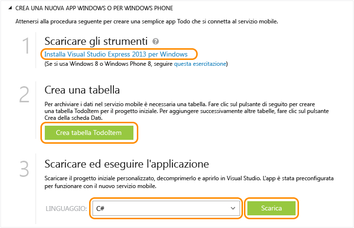

<properties
	pageTitle="Introduzione a servizi mobili per app Windows Store (C#) | Microsoft Azure"
	description="Seguire questa esercitazione per iniziare a usare Servizi mobili di Azure per lo sviluppo di Windows Store in C#."
	services="mobile-services"
	documentationCenter="windows"
	authors="ggailey777"
	manager="dwrede"
	editor=""/>

<tags
	ms.service="mobile-services"
	ms.workload="mobile"
	ms.tgt_pltfrm="mobile-windows"
	ms.devlang="dotnet"
	ms.topic="get-started-article" 
	ms.date="07/21/2016"
	ms.author="glenga"/>

# Introduzione a Servizi mobili

[AZURE.INCLUDE [mobile-services-selector-get-started](../../includes/mobile-services-selector-get-started.md)] &nbsp;

[AZURE.INCLUDE [mobile-service-note-mobile-apps](../../includes/mobile-services-note-mobile-apps.md)]
> Per l'equivalente di App per dispositivi mobili di questo argomento, vedere [Creare un'app di Windows](../app-service-mobile/app-service-mobile-windows-store-dotnet-get-started.md).

Questa esercitazione illustra come aggiungere un servizio back-end basato sul cloud a un'app di Windows universale mediante Servizi mobili di Azure. Le soluzioni per app universali di Windows includono progetti di app per Windows Store 8.1 e Windows Phone Store 8.1 e un progetto condiviso comune. Per altre informazioni, vedere [Creare app universali di Windows per Windows e Windows Phone](http://msdn.microsoft.com/library/windows/apps/xaml/dn609832.aspx).

In questa esercitazione si creeranno sia un nuovo servizio mobile che una semplice app *To do list* che archivia i dati dell'app nel nuovo servizio mobile. Per il servizio mobile creato verrà utilizzato JavaScript per la logica di business sul lato server. Per creare un servizio mobile che consenta di scrivere la logica di business sul lato server nei linguaggi .NET supportati tramite Visual Studio, vedere la versione per back-end .NET di questo argomento.

[AZURE.INCLUDE [mobile-services-windows-universal-get-started](../../includes/mobile-services-windows-universal-get-started.md)]

Per completare l'esercitazione, sono necessari gli elementi seguenti:

* Un account Azure attivo. Se non si ha un account, è possibile iscriversi per accedere a una versione di valutazione di Azure e ottenere un massimo di 10 servizi mobili gratuiti che potranno essere usati anche dopo il termine del periodo di valutazione. Per informazioni dettagliate, vedere la pagina relativa alla [versione di valutazione gratuita di Azure](https://azure.microsoft.com/pricing/free-trial/?WT.mc_id=A0E0E5C02&amp;returnurl=http%3A%2F%2Fazure.microsoft.com%2Fit-IT%2Fdocumentation%2Farticles%2Fmobile-services-javascript-backend-windows-store-javascript-get-started%2F).
* [Visual Studio 2013 Express per Windows]

## Creare un nuovo servizio mobile

[AZURE.INCLUDE [mobile-services-create-new-service](../../includes/mobile-services-create-new-service.md)]

## Creare una nuova app di Windows universale

Dopo aver creato il servizio mobile, è possibile seguire una facile guida introduttiva nel portale di Azure classico per creare una nuova app Windows universale o per modificare un progetto app esistente per Windows Store o Windows Phone per connettersi al servizio mobile.

In questa sezione si creerà una nuova app Windows universale connessa al servizio mobile.

1.  Nel [portale di Azure classico] fare clic su **Servizi mobili** e quindi sul servizio mobile appena creato.

2. Nella scheda Quickstart fare clic su **Windows** in **Choose platform** ed espandere **Create a new Windows Store app**.

   	Di seguito sono visualizzati i tre semplici passaggi per creare un'app di Windows Store connessa al servizio mobile.

  	

3. Se necessario, scaricare e installare [Visual Studio 2013 Express per Windows] nel computer locale o nella macchina virtuale.

4. Fare clic su **Create TodoItem table** per creare una tabella in cui archiviare i dati dell'app.

5. In **Download and run your app** selezionare un linguaggio per l'app, quindi fare clic su **Download**.

  	Verrà scaricato il progetto per l'applicazione *To do list* di esempio connessa al servizio mobile. Salvare il file del progetto compresso nel computer locale e prendere nota del percorso.

## Esecuzione dell'app per Windows

[AZURE.INCLUDE [mobile-services-javascript-backend-run-app](../../includes/mobile-services-javascript-backend-run-app.md)]

>[AZURE.NOTE]È possibile esaminare il codice che accede al servizio mobile per eseguire una query e inserire i dati, disponibile nel file MainPage.xaml.cs.

## Passaggi successivi
Dopo aver completato la guida introduttiva, è possibile eseguire altre importanti attività in Servizi mobili:

* [Introduzione alla sincronizzazione dei dati offline] Informazioni su come usare la sincronizzazione dei dati offline per rendere l'app più affidabile e veloce nelle risposte.

* [Aggiungere l'autenticazione all'app di Servizi mobili][Get started with authentication] Informazioni sull'autenticazione degli utenti dell'app con un provider di identità.

* [Aggiungere notifiche push all'app][Get started with push notifications] Informazioni sull'invio di una notifica push di base all'app.

* [Come utilizzare la libreria client .NET](mobile-services-dotnet-how-to-use-client-library.md) Informazioni su come eseguire una query nel servizio mobile, usare i dati e accedere alle API personalizzate.

[AZURE.INCLUDE [app-service-disqus-feedback-slug](../../includes/app-service-disqus-feedback-slug.md)]

<!-- Anchors. -->
[Getting started with Mobile Services]: #getting-started
[Create a new mobile service]: #create-new-service
[Define the mobile service instance]: #define-mobile-service-instance
[Next Steps]: #next-steps

<!-- Images. -->

<!-- URLs. -->
[Introduzione alla sincronizzazione dei dati offline]: mobile-services-windows-store-dotnet-get-started-offline-data.md
[Get started with authentication]: mobile-services-javascript-backend-windows-universal-dotnet-get-started-users.md
[Get started with push notifications]: mobile-services-javascript-backend-windows-universal-dotnet-get-started-push.md
[Visual Studio 2013 Express per Windows]: http://go.microsoft.com/fwlink/?LinkId=257546
[Mobile Services SDK]: http://go.microsoft.com/fwlink/?LinkId=257545
[portale di Azure classico]: https://manage.windowsazure.com/
 

<!---HONumber=AcomDC_0727_2016-->