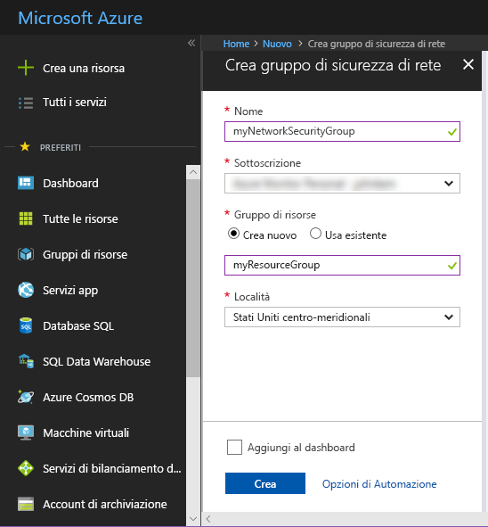
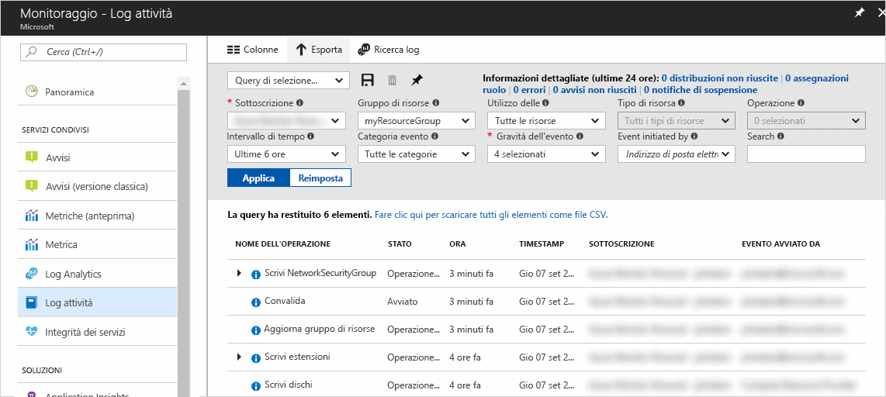
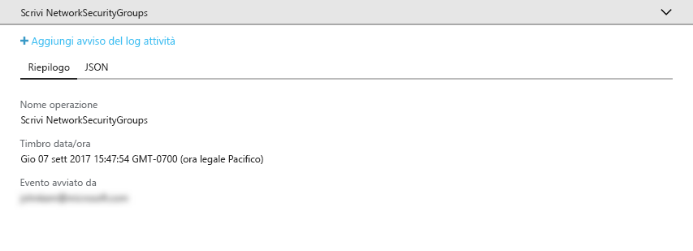
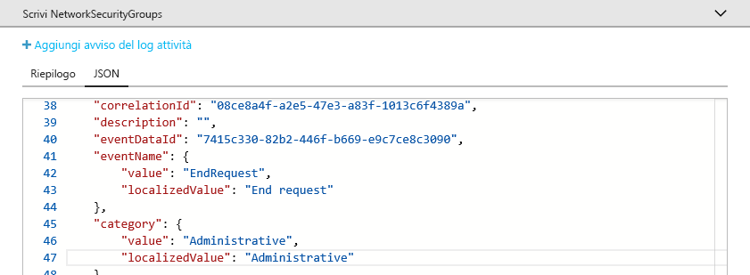
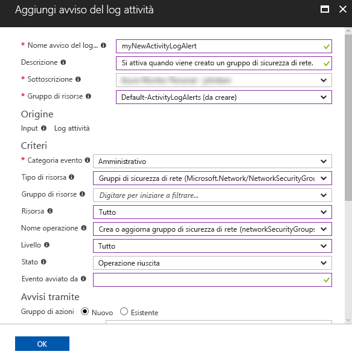
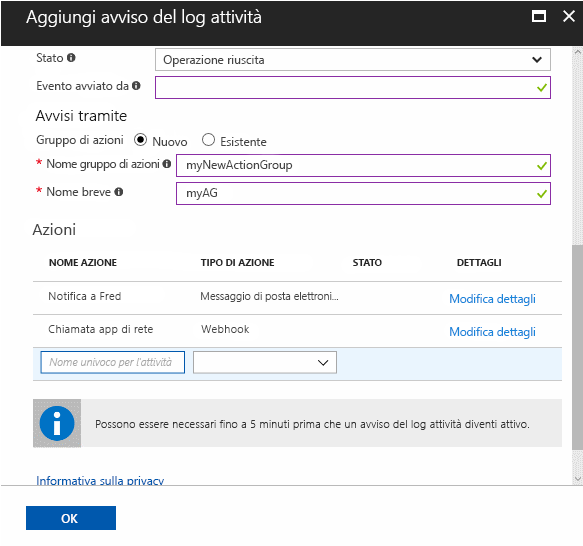

# Controllare e ricevere notifiche sulle azioni importanti nella sottoscrizione di Azure

Il **log attività di Azure** fornisce una cronologia degli eventi a livello di sottoscrizione in Azure. Offre informazioni su *chi* ha creato, aggiornato o eliminato *quali* risorse e *quando* sono state effettuate tali operazioni. È possibile creare un **avviso del log attività** per ricevere notifiche tramite posta elettronica, SMS o webhook quando si verifica un'attività che corrisponde alle condizioni di avviso. Questa guida introduttiva illustra la creazione di un gruppo di sicurezza di rete semplice, l'esplorazione del log attività per comprendere l'evento che si è verificato e la creazione di un avviso del log attività per ricevere una notifica della creazione di nuovi gruppi di sicurezza di rete.

Se non si ha una sottoscrizione di Azure, creare un account [gratuito](https://azure.microsoft.com/free/) prima di iniziare.

## Accedere al Portale di Azure.

Accedere al [Portale di Azure](https://portal.azure.com/).

## Creare un gruppo di sicurezza di rete

1. Fare clic sul pulsante **Nuovo** nell'angolo superiore sinistro del portale di Azure.

2. Selezionare **Rete**, selezionare **Gruppo di sicurezza di rete**.

3. Immettere "myNetworkSG" come **Nome** e creare un nuovo gruppo di risorse denominato **myResourceGroup**. Selezionare il pulsante **Create** .

    

## Esplorare il log attività nel portale

Ora è stato aggiunto un evento al log attività che descrive la creazione del gruppo di sicurezza di rete. Usare le istruzioni seguenti per identificare tale evento.

1. Fare clic sul pulsante **Monitoraggio** nell'elenco di navigazione a sinistra. Si apre la sezione del log attività. Questa sezione contiene una cronologia di tutte le azioni eseguite dagli utenti sulle risorse nella sottoscrizione, filtrabili in base a diverse proprietà, ad esempio **Gruppo di risorse**, **Timespan** e **Categoria**.

2. Nella sezione **Log attività** fare clic sull'elenco a discesa **Gruppo di risorse** e selezionare **myResourceGroup**. Modificare l'elenco a discesa **Timespan** in **Ultima ora**. Fare clic su **Apply**.

    

3. Fare clic sull'evento **Write NetworkSecurityGroups** nella tabella di eventi visualizzata.

## Selezionare un evento nel log attività

La sezione visualizzata contiene dettagli di base dell'operazione eseguita, inclusi il nome, il timestamp e l'utente o l'applicazione che l'ha eseguita.

Fare clic sulla scheda **JSON** per visualizzare i dettagli completi dell'evento. Sono inclusi i dettagli della modalità con cui l'utente o l'applicazione sono stati autorizzati a eseguire l'operazione, la categoria e il livello dell'evento e lo stato dell'operazione.

## Creare un avviso del log attività

1. Fare clic sulla scheda **Riepilogo** per tornare al riepilogo degli eventi.

2. Nella sezione di riepilogo visualizzata, fare clic su **Aggiungi avviso del log attività**.

    

3. Nella sezione che viene visualizzata assegnare un nome e una descrizione all'avviso del log attività.

4. In **Criteri** assicurarsi che **Categoria di eventi** sia impostata su **Amministrativa**, **Tipo di risorsa** sia impostato su **Gruppi di sicurezza di rete**, **Nome operazione** sia impostato su **Create or Update Network Security Group** (Crea o Aggiorna gruppo di sicurezza di rete), **Stato** sia impostato su **Operazione completata** e tutti gli altri campi dei criteri siano vuoti o impostati su **Tutti**. I criteri definiscono le regole usate per determinare se l'avviso deve essere attivato quando viene visualizzato un nuovo evento nel log attività.

    

5. In **Avvisi tramite** selezionare il gruppo di azioni **Nuovo** e fornire un **nome** e un **nome breve** al gruppo di azioni. Il gruppo di azioni definisce il set di azioni eseguite quando viene attivato l'avviso (quando i criteri corrispondono a un nuovo evento).

6. In **Azioni** aggiungere una o più azioni, fornendo un **Nome** per l'azione, il **Tipo di azione** (ad esempio, posta elettronica o SMS) e i **Dettagli**per quel tipo di azione specifico (ad esempio, un URL del webhook, un indirizzo e-mail o un numero SMS).

    

7. Fare clic su **Ok** per salvare l'avviso del log attività.

## Test dell'avviso del log attività

> [!NOTE]
> L'attivazione completa di un avviso del log attività richiede circa 10 minuti. I nuovi eventi che si verificano prima che l'avviso del log attività sia completamente attivato non generano notifiche.
>
>

Per eseguire il test dell'avviso, ripetere la sezione precedente per **Creare un gruppo di sicurezza di rete** ma fornire al gruppo di sicurezza di rete un nome diverso e usare nuovamente il gruppo di risorse esistente. Entro pochi minuti, si riceverà una notifica che è stato creato il gruppo di sicurezza di rete.

## Pulire le risorse

Quando non sono più necessari, eliminare il gruppo di risorse e il gruppo di sicurezza di rete. A tale scopo, digitare il nome del gruppo di risorse creato nella casella di ricerca nella parte superiore del portale e fare clic sul nome del gruppo di risorse. Nella sezione che viene visualizzata fare clic sul pulsante **Elimina gruppo di risorse**, digitare il nome del gruppo di risorse e fare clic su **Elimina**.

## Passaggi successivi

In questa Guida introduttiva è stata eseguita un'operazione per generare un evento di log attività e quindi è stato creato un avviso di log attività per ricevere una notifica quando questa operazione verrà eseguita nuovamente in futuro. È stato quindi eseguito il test dell'avviso eseguendo nuovamente l'operazione. Azure rende disponibili gli eventi del log attività degli ultimi 90 giorni. Se è necessario mantenere gli eventi per più di 90 giorni, provare ad archiviare i dati del log attività insieme agli altri dati di monitoraggio.

> [!div class="nextstepaction"]
> [Archiviare i dati di monitoraggio](./monitor-tutorial-archive-monitoring-data.md)

