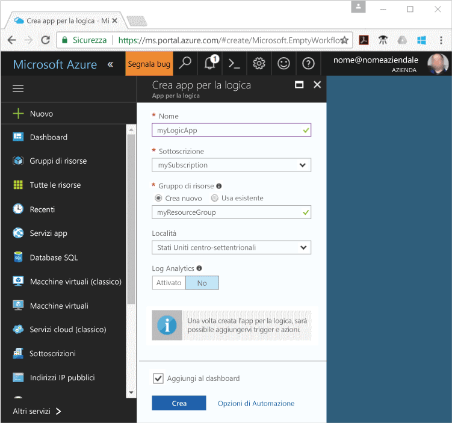
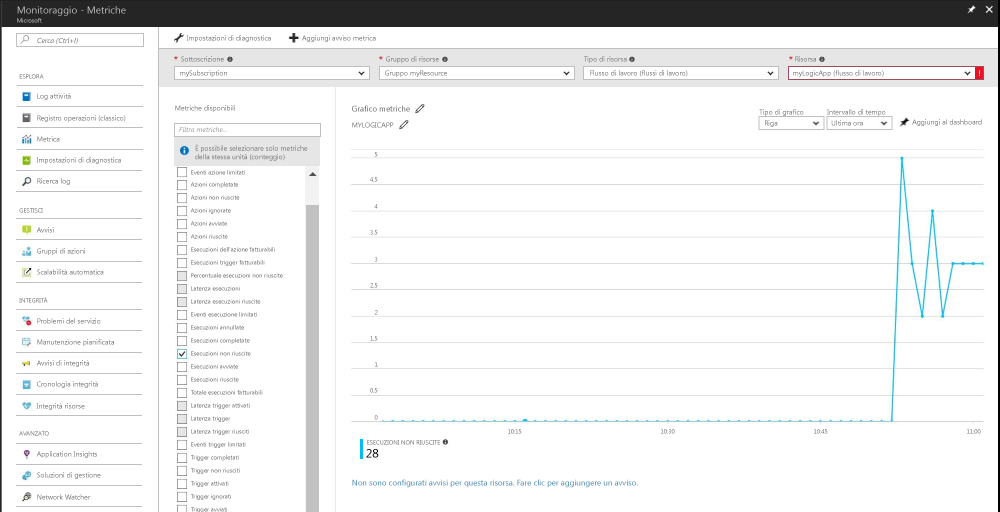
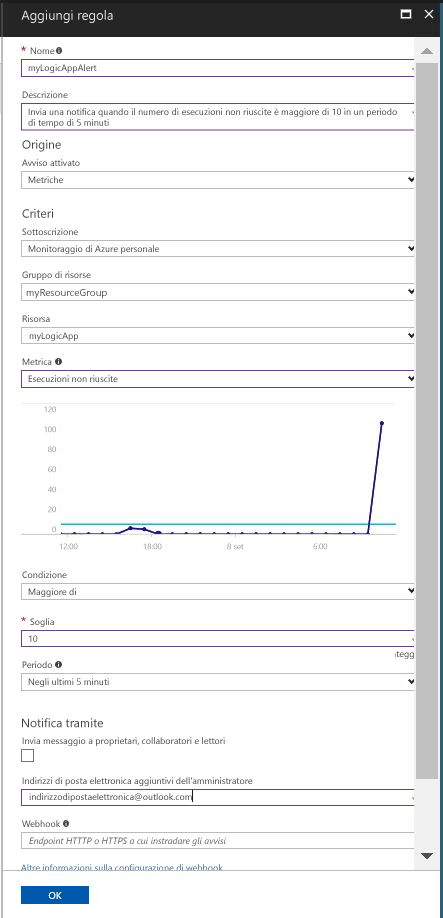

# Ricevere una notifica quando un valore della metrica soddisfa una condizione

Monitoraggio di Azure rende le metriche disponibili per molte risorse di Azure. Tali metriche trasmettono prestazioni e integrità delle risorse. In molti casi i valori della metrica possono puntare a un elemento errato per una risorsa. È possibile creare avvisi di metrica per monitorare i comportamenti anomali e ricevere una notifica quando questi si verificano. Questa guida rapida affronta la creazione di un'app per la logica, la creazione di un processo e la visualizzazione delle metriche per l'app per la logica. Passa quindi alla creazione di un avviso e alla ricezione di una notifica relativa a una metrica per la risorsa dell'app per la logica.

Per altre informazioni sulle metriche e gli avvisi per la metrica, vedere [Panoramica delle metriche di Monitoraggio di Azure](./monitoring-overview-metrics.md) e [Panoramica degli avvisi di Monitoraggio di Azure](./monitoring-overview-alerts.md). 

Se non si ha una sottoscrizione di Azure, creare un account [gratuito](https://azure.microsoft.com/free/) prima di iniziare.

## Accedere al portale di Azure

Accedere al [portale di Azure](https://portal.azure.com/).

## Creare un'app per la logica

1. Fare clic sul pulsante **Nuovo** nell'angolo superiore sinistro del portale di Azure.

2. Cercare e selezionare **App per la logica**. Creare un nuovo gruppo di risorse denominato **myResourceGroup**. Usare il percorso predefinito. Selezionare il pulsante **Create** .

3. Immettere le informazioni sull'app per la logica e selezionare l'opzione **Aggiungi al dashboard**. Al termine, fare clic su **Crea**.

      

4. L'app per la logica deve essere aggiunta al dashboard. Passare all'app per la logica facendo clic su di essa.

5. Nel pannello App per la logica, selezionare **Progettazione app per la logica**

       

6. Impostare i valori, come illustrato nel diagramma seguente.

    . 

7. Nella finestra di progettazione, selezionare il trigger **Ricorrenza**.

8. Impostare Intervallo su 20 e Frequenza su Secondo per assicurarsi che l'app per la logica venga attivata ogni 20 secondi.

9. Fare clic sul pulsante **Nuovo passaggio** e selezionare **Aggiungi un'azione**.

10. Scegliere l'opzione **HTTP** e selezionare **HTTP-HTTP**.

11. Impostare **Metodo** su POST e **Uri** su un indirizzo Web di propria scelta.

12. Fare clic su **Salva**.

## Visualizzare le metriche per l'app per la logica

1. Fare clic sull'opzione **Monitoraggio** nel riquadro di navigazione a sinistra.

2. Selezionare la scheda **Metriche**, inserire le informazioni in **Sottoscrizione**, **Gruppo di risorse**, **Tipo di risorsa** e **Risorsa** per l'app per la logica.

3. Nell'elenco delle metriche scegliere **Esecuzioni avviate**.

4. Modificare l'**intervallo di tempo** del grafico per visualizzare i dati dell'ora precedente.

5. Viene ora visualizzato un grafico che traccia il numero totale di esecuzioni avviate dall'app per la logica nell'ora precedente.

    

## Creare un avviso metrica per l'app per la logica

1.  Nella parte in alto a destra del pannello delle metriche fare clic sul pulsante **Aggiungi avviso per la metrica**.

2. Denominare l'avviso per la metrica "myLogicAppAlert" e inserire una breve descrizione dell'avviso.

3. Impostare **Condizione** per l'avviso della metrica su "Greater than" (Maggiore di), impostare **Soglia** su "10" e **Periodo** su "Over the last 5 minutes" (Negli ultimi 5 minuti).

4. Infine, in **Indirizzi di posta elettronica aggiuntivi dell'amministratore** immettere l'indirizzo di posta elettronica. Questo avviso garantisce la ricezione di un messaggio di posta elettronica nel caso in cui l'app per la logica abbia più di 10 esecuzioni non riuscite in un periodo di 5 minuti.

    

## Ricevere notifiche di avviso della metrica per l'app per la logica
1. In pochi minuti, si dovrebbe ricevere un messaggio di posta elettronica da "Avvisi di Microsoft Azure" per informare l'utente dell'attivazione dell'avviso.

2. Tornare all'app per la logica e modificare il trigger di ricorrenza impostando l'Intervallo su 1 e la Frequenza su Ora.

3. In pochi minuti, si dovrebbe ricevere un messaggio di posta elettronica da "Avvisi di Microsoft Azure" per informare l'utente che l'avviso è stato "risolto".

## Pulire le risorse

Altre guide rapide di questa raccolta si basano sulla presente guida rapida. Se si prevede di continuare a usare le guide rapide o le esercitazioni successive, non eliminare le risorse create in questa guida rapida. Se non si prevede di continuare, seguire questa procedura per eliminare tutte le risorse create da questa guida di avvio rapido nel portale di Azure.

1. Dal menu a sinistra nel portale di Azure fare clic su **Monitoraggio**.

2. Selezionare la scheda **Avvisi**, individuare l'avviso creato in questa guida rapida e fare clic su di esso.

3. Nel pannello dell'avviso per la metrica fare clic su **Elimina**.

4. Dal menu a sinistra del portale di Azure cercare **App per la logica** e quindi fare clic su **App per la logica**.

5. Nel pannello fare clic sull'app per la logica creata in questa guida rapida nella casella di testo e quindi fare clic su **Elimina**.

## Passaggi successivi

In questa guida rapida si è appreso come creare un avviso di metrica per le risorse. Per altre informazioni sugli avvisi per la metrica, fare clic sulla panoramica sugli avvisi.

> [!div class="nextstepaction"]
> [Avvisi sulle azioni relative alla sottoscrizione di Monitoraggio di Azure](./monitor-quick-audit-notify-action-in-subscription.md )
