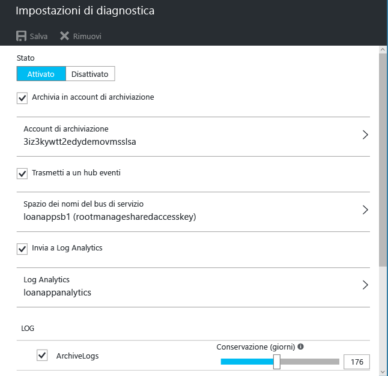

# Introduzione al monitoraggio di Azure
Monitoraggio di Azure è il servizio di piattaforma che mette a disposizione un'unica origine per il monitoraggio delle risorse di Azure. Con Monitoraggio di Azure è possibile visualizzare, fare query, indirizzare, archiviare ed effettuare operazioni sulle metriche e sui log provenienti dalle risorse di Azure. È possibile usare questi dati tramite il portale di Azure, i [cmdlet PowerShell di Monitoraggio di Azure](insights-powershell-samples.md), l'[interfaccia della riga di comando multipiattaforma](insights-cli-samples.md) o le [API REST di Monitoraggio di Azure](https://msdn.microsoft.com/library/dn931943.aspx). Questo articolo illustra alcuni componenti principali di Monitoraggio di Azure, usando il portale a scopo dimostrativo.

## Procedura dettagliata
1. Nel portale passare a **Tutti i servizi** e trovare l'opzione **Monitoraggio**. Fare clic sull'icona a forma di stella per aggiungere l'opzione all'elenco dei preferiti per renderla facilmente accessibile dalla barra di navigazione a sinistra.

    
2. Fare clic sull'opzione **Monitoraggio** per aprire la pagina **Monitoraggio**, che riunisce tutte le impostazioni e i dati di monitoraggio in un'unica vista consolidata. Per prima cosa si apre la sezione **Log di attività**.

    

    Monitoraggio di Azure presenta tre categorie di base dei dati di monitoraggio: **log di attività**, **metriche** e **log di diagnostica**.
3. Fare clic su **Log di attività** per assicurarsi di visualizzare la sezione Log di attività.

    

    Il [**log di attività**](monitoring-overview-activity-logs.md) descrive tutte le operazioni eseguite sulle risorse nella sottoscrizione. L'uso del log attività consente di acquisire informazioni dettagliate su qualsiasi operazione di creazione, aggiornamento o eliminazione eseguita per le risorse della sottoscrizione. Ad esempio, Log di attività indica quando un'app Web è stata arrestata e da chi. Gli eventi del log di attività vengono archiviati nella piattaforma e sono disponibili per le query per 90 giorni.

    È possibile creare e salvare le query per i filtri comuni, quindi aggiungere le query più importanti a un dashboard del portale, così da sapere sempre se si sono verificati eventi che soddisfano i criteri configurati.
4. Filtrare la visualizzazione su un determinato gruppo di risorse nell'ultima settimana, quindi fare clic sul pulsante **Salva** .

    
5. A questo punto, fare clic sul pulsante **Aggiungi** .

    

    La maggior parte delle visualizzazioni in questa procedura dettagliata può essere aggiunta a un dashboard. Ciò consente di creare un'unica origine di informazioni sui dati operativi nei propri servizi.
6. Tornare al dashboard. Come è possibile notare, adesso la query (e i risultati) viene visualizzata nel dashboard. Ciò è utile per visualizzare rapidamente le azioni di alto profilo che si sono verificate di recente nella sottoscrizione, ad esempio è stato assegnato un nuovo ruolo o è stata eliminata una macchina virtuale.

    
7. Tornare al riquadro **Monitoraggio** e fare clic sulla sezione **Metriche**. È prima necessario selezionare una risorsa filtrandola con le opzioni disponibili nella parte superiore della pagina.

    

    Tutte le risorse di Azure generano [**metriche**](monitoring-overview-metrics.md). Questa visualizzazione riunisce tutte le metriche in un unico pannello in modo da comprendere facilmente le prestazioni delle risorse. Inoltre, consultare la nostra nuovissima [esperienza di creazione di grafici per metriche](https://aka.ms/azuremonitor/new-metrics-charts) facendo clic sulla scheda **Metrica (anteprima)**.
8. Dopo aver selezionato una risorsa, tutte le metriche disponibili vengono visualizzate sul lato sinistro della pagina. È possibile creare un grafico di più metriche selezionando le metriche desiderate e modificando il tipo di grafico e l'intervallo di tempo. È inoltre possibile visualizzare tutti gli avvisi relativi alle metriche impostati su questa risorsa.

    

   > [!NOTE]
   > Alcune metriche sono disponibili solo abilitando [Application Insights](../application-insights/app-insights-overview.md) e/o Diagnostica di Azure per Windows o Linux sulla risorsa.
   >
   >
9. Una volta ottenuto il grafico desiderato, è possibile usare il pulsante **Aggiungi** per aggiungerlo al dashboard.
10. Tornare a **Monitoraggio** e fare clic su **Log di diagnostica**.

    

    I [**log di diagnostica**](monitoring-overview-of-diagnostic-logs.md) sono log generati *da* una risorsa che forniscono i dati sul funzionamento di tale risorsa. Ad esempio, i numeri di regole del gruppo di sicurezza di rete e i log del flusso di lavoro delle app per la logica sono due tipologie di log di diagnostica. Questi log possono essere archiviati in un account di archiviazione, trasmessi a un hub eventi e/o inviati a [Log Analytics](../log-analytics/log-analytics-overview.md). Log Analytics è il prodotto di intelligence operativa di Microsoft per eseguire operazioni avanzate di ricerca e avviso.

    Nel portale è possibile visualizzare e filtrare un elenco di tutte le risorse nella sottoscrizione per scoprire se dispongono di log di diagnostica abilitati.
11. Fare clic su una risorsa nella pagina Log di diagnostica. Se i log di diagnostica vengono archiviati in un account di archiviazione, l'utente visualizzerà un elenco di log orari scaricabile.

    

    È anche possibile fare clic su **Impostazioni di diagnostica** per configurare o modificare le impostazioni dell'archiviazione in un account di archiviazione, lo streaming all'hub eventi o l'invio a un'area di lavoro di Log Analytics.

    

    Se i log di diagnostica sono stati impostati su Log Analytics, allora è possibile cercarli nella sezione **Ricerca Log** del portale.
12. Passare alla sezione **Avvisi** della pagina Monitoraggio.

    

    Qui è possibile gestire tutti gli [**avvisi**](monitoring-overview-alerts.md) delle risorse di Azure, compresi gli avvisi sulle metriche, sugli eventi di log attività, sui test Web di Application Insights (posizioni) e sulla diagnostica proattiva di Application Insights. Gli avvisi possono attivare l'invio di un messaggio di posta elettronica o un HTTP POST a un URL webhook.
13. Fare clic su **Aggiungi avviso sulla metrica** per creare un avviso.

    

    A questo punto è possibile aggiungere un avviso al dashboard per visualizzarne facilmente lo stato in qualsiasi momento.

    Ora Monitoraggio di Azure dispone anche degli [**avvisi metrica quasi in tempo reale**](https://aka.ms/azuremonitor/near-real-time-alerts)(anteprima) che possono essere valutati a una frequenza minima di un minuto.
    
14. La sezione Monitoraggio include anche i collegamenti alle applicazioni di [Application Insights](../application-insights/app-insights-overview.md) e alle soluzioni di gestione di [Log Analytics](../log-analytics/log-analytics-overview.md). Questi altri prodotti Microsoft si integrano pienamente con il monitoraggio di Azure.
15. Se Application Insights o Log Analytics non vengono usati, ci sono possibilità che il monitoraggio di Azure funzioni in collaborazione con le soluzioni di monitoraggio, registrazione e avviso attualmente in uso. Consultare la [pagina dedicata ai partner](monitoring-partners.md) per l'elenco completo dei partner e per ricevere le istruzioni di integrazione.

Seguendo questi passaggi e aggiungendo tutti i riquadri pertinenti a un dashboard, è possibile creare delle visualizzazioni complete dell'applicazione e dell'infrastruttura come quella mostrata di seguito:

## Passaggi successivi
* Consultare [Panoramica del monitoraggio di Azure](monitoring-overview.md)
