# Introduzione al monitoraggio di Azure
Il monitoraggio di Azure è un nuovo servizio di piattaforma che fornisce un'unica origine per il monitoraggio delle risorse di Azure. Con il monitoraggio di Azure è possibile visualizzare, fare query, indirizzare, archiviare ed effettuare operazioni sulle metriche e sui log provenienti dalle risorse di Azure. È possibile usare questi dati tramite il pannello del portale del monitoraggio di Azure, i cmdlet di Insights PowerShell, l'interfaccia della riga di comando multi-piattaforma o le API REST di Azure Insights. In questo articolo viene fornita una descrizione dettagliata dei componenti principali del monitoraggio di Azure.

1. Nel portale accedere a **Altri servizi** e trovare l'opzione **Monitoraggio**. Fare clic sull'icona a forma di stella per aggiungere l'opzione all'elenco dei preferiti per renderla facilmente accessibile dalla barra di navigazione a sinistra.
   
    
2. Fare clic sull'opzione **Monitoraggio** per aprire il pannello **Monitoraggio**. che riunisce tutte le impostazioni e i dati di monitoraggio in un'unica vista consolidata. Per prima cosa si apre la sezione **Log di attività**.
   
    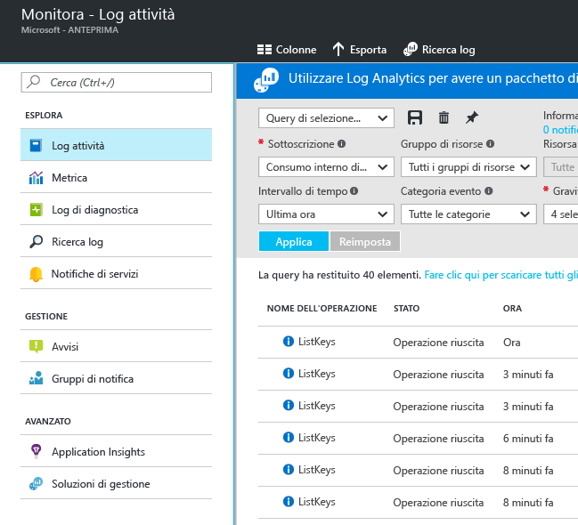
   
   > [!WARNING]
   > Le opzioni **Notifiche del servizio** e **Gruppi di notifica** sono visualizzate in modalità Anteprima privata solo per gli utenti che hanno partecipato all'Anteprima privata.
   > 
   > 
   
    Il monitoraggio di Azure presenta tre categorie di base dei dati di monitoraggio: Log di attività, Metriche e Log di diagnostica.
3. Fare clic su **Log di attività** per assicurarsi di visualizzare la sezione Log di attività.
   
    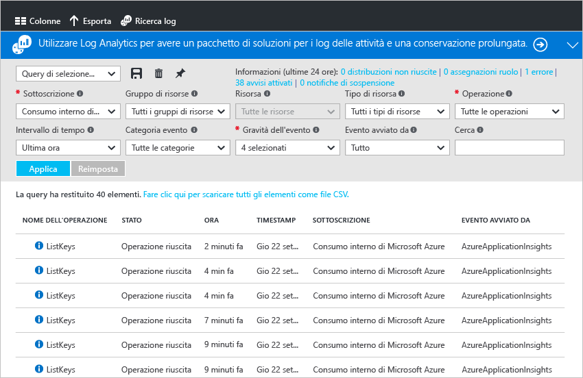
   
    **Log di attività** descrive tutte le operazioni eseguite sulle risorse nella sottoscrizione. Usando questa sezione è possibile determinare "cosa, chi e quando" per qualsiasi operazione di scrittura sulle risorse nella sottoscrizione. Ad esempio, Log di attività indica quando un'app Web è stata arrestata e da chi. Gli eventi di Log di attività vengono archiviati nella piattaforma per 90 giorni.
   
    È possibile creare e salvare le query per i filtri comuni, quindi aggiungere le query più importanti a un dashboard del portale, così da sapere sempre se si sono verificati eventi che soddisfano i criteri configurati.
4. Filtrare la visualizzazione su un determinato gruppo di risorse nell'ultima settimana, quindi fare clic sul pulsante **Salva** .
   
    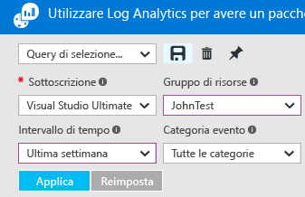
5. A questo punto, fare clic sul pulsante **Aggiungi** .
   
    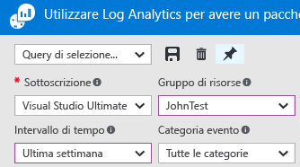
   
    La maggior parte delle visualizzazioni in questa procedura dettagliata può essere aggiunta a un dashboard. Ciò consente di creare un'unica origine di informazioni sui dati operativi nei propri servizi. 
6. Tornare al dashboard. Come è possibile notare, adesso la query (e i risultati) viene visualizzata nel dashboard.
   
    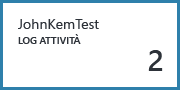
7. Tornare al riquadro **Monitoraggio** e fare clic sulla sezione **Metriche**. Per prima cosa è necessario selezionare una risorsa applicando un filtro e selezionandola mediante le opzioni disponibili nella parte superiore della sezione.
   
    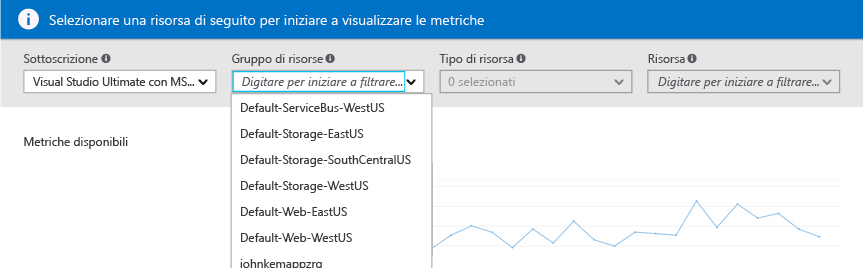
   
    Tutte le risorse di Azure generano delle metriche. Questa visualizzazione riunisce tutte le metriche in un unico riquadro accessibile.
8. Dopo aver selezionato una risorsa, tutte le metriche disponibili vengono visualizzate sul lato sinistro del pannello. È possibile creare un grafico di più metriche selezionando le metriche desiderate e modificando il tipo di grafico e l'intervallo di tempo. È inoltre possibile visualizzare tutti gli avvisi relativi alle metriche impostati su questa risorsa.
   
    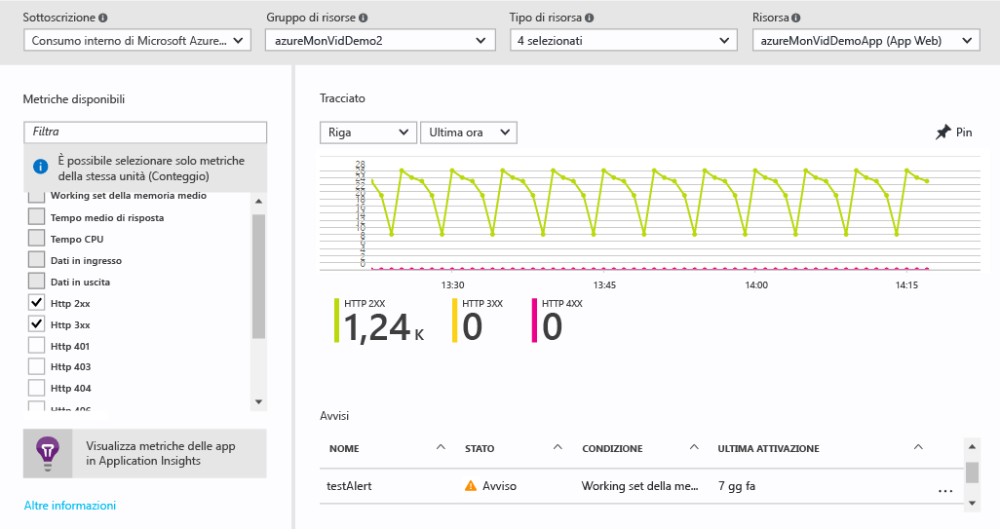
   
   > [!NOTE]
   > Alcune metriche sono disponibili soltanto dopo aver abilitato [Application Insights](../application-insights/app-insights-overview.md) sulla risorsa.
   > 
   > 
9. Una volta ottenuto il grafico desiderato, è possibile usare il pulsante **Aggiungi** per aggiungerlo al dashboard.
10. Tornare al pannello **Monitoraggio** e fare clic su **Log di diagnostica**.
    
    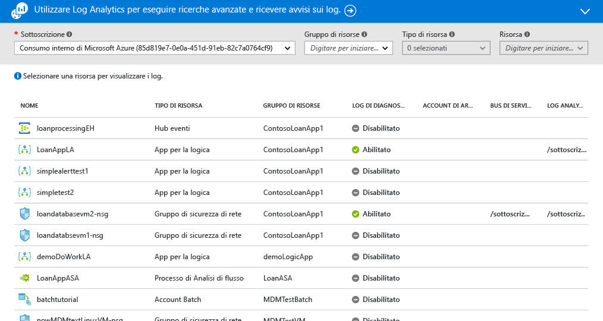
    
    I log di diagnostica sono log generati da una risorsa che forniscono i dati sul funzionamento di tale risorsa. Ad esempio, i numeri di regole del gruppo di sicurezza di rete e i log del flusso di lavoro delle app per la logica sono due tipologie di log di diagnostica. Questi log possono essere archiviati in un account di archiviazione, trasmessi a un hub eventi e/o inviati a [Log Analytics](../log-analytics/log-analytics-overview.md)(il prodotto di intelligence operativa di Microsoft) per eseguire oeprazioni avanzate di ricerca e avviso.
    
    Nel portale è possibile visualizzare e filtrare un elenco di tutte le risorse nella sottoscrizione per scoprire se dispongono di log di diagnostica abilitati.
11. Fare clic su una risorsa nel pannello Log di diagnostica. Se i log di diagnostica vengono archiviati in un account di archiviazione, l'utente visualizzerà un elenco di log orari scaricabile. È inoltre possibile fare clic su "Attiva/disattiva diagnostica" per configurare l'archiviazione in un account di archiviazione, la trasmissione del flusso all'hub eventi o l'invio a un'area di lavoro di Log Analytics.
    
    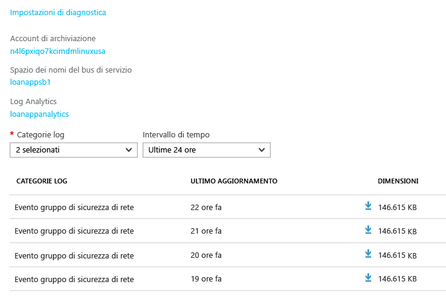
    
    Se i log di diagnostica sono stati impostati su Log Analytics, allora è possibile cercarli nella sezione **Ricerca Log** del portale.
12. Andare alla sezione **Avvisi** del pannello Monitoraggio.
    
    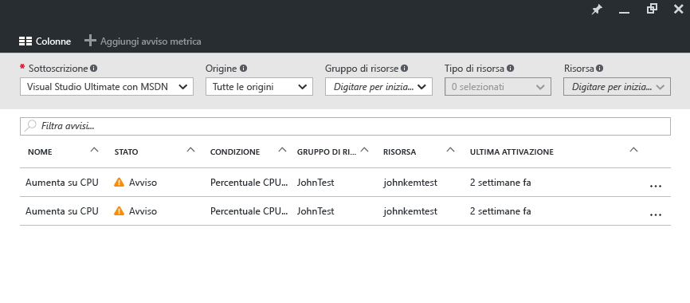
    
    Qui è possibile gestire tutti gli avvisi delle risorse di Azure, compresi gli avvisi sulle metriche, sugli eventi di log di attività (anteprima), sui test Web di Application Insights (posizioni) e sulla diagnostica proattiva di Application Insights. Gli avvisi possono attivare l'invio di un messaggio di posta elettronica o un POST su un webhook.
13. Fare clic su **Aggiungi avviso sulla metrica** per creare un avviso.
    
    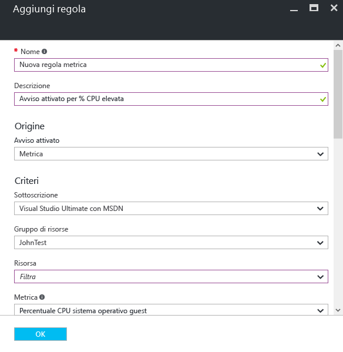
    
    A questo punto è possibile aggiungere un avviso al dashboard per visualizzarne facilmente lo stato in qualsiasi momento.
14. La sezione Monitoraggio include anche i collegamenti alle applicazioni di [Application Insights](../application-insights/app-insights-overview.md) e alle soluzioni di gestione di [Log Analytics](../log-analytics/log-analytics-overview.md). Questi altri prodotti Microsoft si integrano pienamente con il monitoraggio di Azure.
15. Se Application Insights o Log Analytics non vengono usati, ci sono possibilità che il monitoraggio di Azure funzioni in collaborazione con le soluzioni di monitoraggio, registrazione e avviso attualmente in uso. Consultare la [pagina dedicata ai partner](monitoring-partners.md) per l'elenco completo dei partner e per ricevere le istruzioni di integrazione.

Seguendo questi passaggi e aggiungendo tutti i riquadri pertinenti a un dashboard, è possibile creare delle visualizzazioni complete dell'applicazione e dell'infrastruttura come quella mostrata di seguito:

## Passaggi successivi
* Consultare [Panoramica del monitoraggio di Azure](monitoring-overview.md)

<!--HONumber=Oct16_HO2-->

