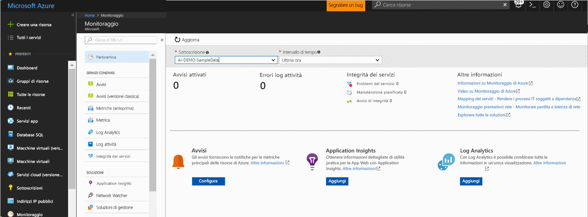
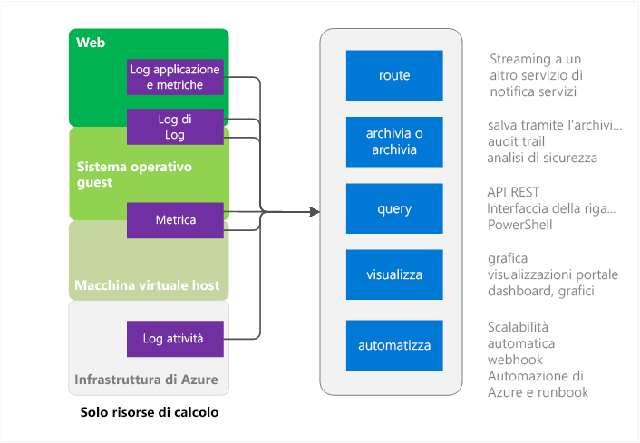

# Panoramica di Monitoraggio di Azure
Questo articolo fornisce una panoramica del servizio Monitoraggio di Azure in Microsoft Azure. Illustra il funzionamento di Monitoraggio di Azure e fornisce collegamenti a informazioni aggiuntive su come usare Monitoraggio di Azure.  Per un'introduzione video, vedere i collegamenti della sezione Passaggi successivi alla fine dell'articolo. 

## Monitoraggio di Azure e altri prodotti per il monitoraggio di Microsoft
Attualmente Monitoraggio di Azure offre log e metriche dell'infrastruttura di livello base per la maggior parte dei servizi in Microsoft Azure ma in futuro tutti i servizi di Azure inseriranno i dati in Monitoraggio di Azure.

Microsoft offre altri prodotti e servizi con funzionalità di monitoraggio aggiuntive per sviluppatori, DevOps o ITOps, che hanno anche installazioni locali. Per una panoramica e per informazioni sull'integrazione di questi diversi prodotti e servizi, vedere [Monitoraggio in Microsoft Azure](monitoring-overview.md).

## Pagina di panoramica del portale

Monitoraggio di Azure ha una pagina di destinazione che consente agli utenti di: 
- Comprendere le funzionalità di monitoraggio offerte da Azure.
- Individuare, configurare e caricare la piattaforma e le funzionalità premium di monitoraggio di Azure.

Mentre il servizio Monitoraggio di Azure viene rilasciato, la pagina di panoramica di destinazione è in anteprima. 

La pagina è un punto di partenza per la navigazione, incluso il caricamento. Mostra i problemi dettagliati rilevanti dei vari servizi e consente all'utente di accedervi con il relativo contesto.
 

Quando si apre la pagina, è possibile scegliere tra le sottoscrizioni per cui si dispone di accesso in lettura. Per una sottoscrizione selezionata, è possibile vedere:

- **Avvisi attivati e origini degli avvisi**: questa tabella mostra il riepilogo conteggi, le origini degli avvisi e quante volte sono stati generati gli avvisi per la durata di tempo selezionata. Si applica sia agli avvisi metrica che agli avvisi del log attività. *<Modifica: l'anteprima degli avvisi con l'esperienza unificata deve essere visualizzata anche per tutti gli avvisi: eventi, metriche e log>*
- **Errori log attività**: se una delle risorse di Azure registra eventi con gravità a livello di errore, è possibile visualizzare un conteggio di alto livello e andare alla pagina log attività per esaminare ogni evento.
- **Integrità dei servizi di Azure**: è possibile visualizzare un conteggio di problemi di integrità del servizio, eventi pianificati di manutenzione e avvisi sull'integrità. Integrità dei servizi di Azure offre informazioni personalizzate quando nell'infrastruttura di Azure si verificano problemi che influiscono sui servizi.  Per altre informazioni, vedere [Integrità dei servizi di Azure](../service-health/service-health-overview.md).  
- **Application Insights**: vedere gli indicatori KPI per ogni risorsa AppInsights nella sottoscrizione corrente. Gli indicatori KPI sono ottimizzati affinché l'applicazione sul lato server monitori le applicazioni web ASP.NET e i tipi di applicazione Java, Node e generali. Gli indicatori KPI includono metriche per la frequenza di richieste, la durata di risposta, la percentuale di errori e di disponibilità. 

Se non sono state caricate Log Analytics o Application Insights o se non è stato configurato alcun avviso di Azure nella sottoscrizione corrente, la pagina indica collegamenti per iniziare il processo di caricamento.

## Origini di Monitoraggio di Azure: subset di calcolo

I servizi di calcolo includono: 
- Servizi cloud 
- Macchine virtuali 
- Set di scalabilità di macchine virtuali 
- Service Fabric

### Applicazione: log di diagnostica, log applicazioni e metriche
Nel modello di calcolo le applicazioni possono essere eseguite nel sistema operativo guest. Le applicazioni creano il proprio set di log e metriche. Monitoraggio di Azure si basa sull'estensione Diagnostica di Azure (Windows o Linux) per raccogliere la maggior parte delle metriche e dei log a livello di applicazione. I tipi includono:

* Contatori delle prestazioni
* Log applicazioni
* Registri eventi di Windows
* Origine dell'evento .NET
* log di IIS
* ETW basato su manifesto
* Dump di arresto anomalo del sistema
* Log degli errori dei clienti

Senza l'estensione Diagnostica, sono disponibili solo alcune metriche, ad esempio Utilizzo CPU. 

### Metriche delle VM host e guest
Le risorse di calcolo elencate sopra hanno una VM host dedicata e un sistema operativo guest con cui interagiscono. La VM host e il sistema operativo guest sono gli equivalenti della VM radice e della VM guest nel modello di hypervisor Hyper-V. È possibile raccogliere le metriche in entrambi. È anche possibile raccogliere i log di diagnostica nel sistema operativo guest.   

### Log attività
Nei log attività, in precedenza chiamati log operativi o di controllo, è possibile cercare informazioni relative alla risorsa così come visualizzate dall'infrastruttura di Azure. I log contengono informazioni quali gli orari di creazione ed eliminazione delle risorse.  Per altre informazioni, vedere [Panoramica del log attività di Azure](monitoring-overview-activity-logs.md). 

## Origini di Monitoraggio di Azure: altro

### Risorsa: log di diagnostica e metriche
Le metriche e i log di diagnostica che è possibile raccogliere variano in base al tipo di risorsa. Ad esempio, App Web fornisce statistiche sull'I/O del disco e sulla percentuale CPU. Tali metriche non esistono invece per una coda del bus di servizio, che invece fornisce metriche come le dimensioni della coda e la velocità effettiva dei messaggi. In [Metriche supportate](monitoring-supported-metrics.md) è disponibile un elenco delle metriche che è possibile raccogliere per ogni risorsa. 

### Metriche delle VM host e guest
Non esiste necessariamente una corrispondenza 1:1 tra la risorsa e una determinata VM host o guest e di conseguenza le metriche della VM non sono disponibili.

### Log attività
Il log attività è identico a quello delle risorse di calcolo.  

## Uso dei dati di monitoraggio
Dopo avere raccolto i dati, è possibile eseguire le operazioni seguenti in Monitoraggio di Azure.

### Route
È possibile trasmettere i dati di monitoraggio ad altre posizioni. 

Tra gli esempi sono inclusi:

- Invio ad Application Insights per usare strumenti di visualizzazione e analisi più avanzati.
- Invio a Hub eventi per il routing a strumenti di terze parti. 

### Archiviare
Alcuni dati di monitoraggio sono già archiviati e disponibili in Monitoraggio di Azure per un periodo di tempo specificato. 
- Le metriche vengono archiviate per 30 giorni. 
- Le voci di log attività vengono archiviate per 90 giorni. 
- I log di diagnostica non vengono archiviati. 

Per archiviare i dati per periodi più lunghi di quelli elencati sopra, è possibile usare una risorsa di archiviazione di Azure. I dati di monitoraggio vengono mantenuti nell'account di archiviazione in base ai criteri di conservazione impostati. Viene addebitato un costo per lo spazio occupato dai dati in Archiviazione di Azure. 

Ecco alcuni modi in cui usare questi dati:

- Fare in modo che i dati scritti vengano letti ed elaborati da altri strumenti all'interno o all'esterno di Azure.
- Scaricare i dati in locale per l'uso in un archivio locale o modificare i criteri di conservazione nel cloud per conservare i dati per lunghi periodi di tempo.  
- Lasciare i dati in Archiviazione di Azure a tempo indeterminato a scopo di archiviazione. 

### Query
Per accedere ai dati nel sistema o in Archiviazione di Azure, è possibile usare l'API REST di Monitoraggio di Azure, l'interfaccia della riga di comando multipiattaforma, i cmdlet di PowerShell o .NET SDK.

Tra gli esempi sono inclusi:

* Recuperare i dati per un'applicazione di monitoraggio personalizzata che si è scritta.
* Creare query personalizzate e inviare i dati a un'applicazione di terze parti.

### Visualizzazione
La visualizzazione in grafici dei dati di monitoraggio permette di identificare le tendenze più rapidamente della ricerca sui dati.  

Ecco alcuni metodi di visualizzazione:

* Usare il portale di Azure
* Instradare i dati ad Application Insights in Azure
* Instradare i dati a Microsoft Power BI
* Instradare i dati a uno strumento di visualizzazione di terze parti usando lo streaming live o facendo in modo che lo strumento esegua la lettura da un archivio in Archiviazione di Azure

### Automatizzare
> [!NOTE]
> Come parte dell'evoluzione continua degli avvisi in Microsoft Azure, è ora disponibile un'esperienza unificata per gli avvisi in anteprima. Altre informazioni sugli [avvisi di Azure (anteprima)](monitoring-overview-unified-alerts.md)

Negli avvisi di Azure standard è possibile usare i dati di monitoraggio per attivare avvisi o anche interi processi. Tra gli esempi sono inclusi:

* Usare i dati per la scalabilità automatica delle istanze di calcolo in base al carico dell'applicazione.
* Inviare messaggi di posta elettronica quando una metrica supera una soglia predeterminata.
* Chiamare un URL Web (webhook) per eseguire un'azione in un sistema all'esterno di Azure.
* Avviare un runbook in Automazione di Azure per eseguire varie attività.

## Metodi di accesso a Monitoraggio di Azure
In generale, è possibile modificare il rilevamento, il routing e il recupero dei dati usando uno dei metodi seguenti. Non tutti i metodi sono disponibili per tutte le azioni o tutti i tipi di dati.

* [Portale di Azure](https://portal.azure.com)
* [PowerShell](insights-powershell-samples.md)  
* [Interfaccia della riga di comando multipiattaforma](insights-cli-samples.md)
* [API REST](https://docs.microsoft.com/rest/api/monitor/)
* [.NET SDK](http://www.nuget.org/packages/Microsoft.Azure.Management.Monitor)

## Passaggi successivi
Altre informazioni su:
- Una procedura dettagliata video solo di Monitoraggio di Azure è disponibile alla pagina  
[Introduzione a Monitoraggio di Azure](https://channel9.msdn.com/Blogs/Azure-Monitoring/Get-Started-with-Azure-Monitor). 
- Un video che illustra uno scenario in cui è possibile usare Monitoraggio di Azure è disponibile alle pagine [Explore Microsoft Azure monitoring and diagnostics](https://channel9.msdn.com/events/Ignite/2016/BRK2234) (Esplorare le funzionalità Diagnostica e Monitoraggio di Microsoft Azure) e [Azure Monitor in a video from Ignite 2016](https://myignite.microsoft.com/videos/4977) (Monitoraggio di Azure in un video di Ignite 2016).
- Riesaminare l'interfaccia di Monitoraggio di Azure in [Introduzione a Monitoraggio di Azure](monitoring-get-started.md)
- Configurare le [estensioni di Diagnostica di Azure](../azure-diagnostics.md), per diagnosticare problemi nell'applicazione di servizio cloud, macchina virtuale, set di scalabilità di macchine virtuali o Service Fabric.
- [Application Insights](https://azure.microsoft.com/documentation/services/application-insights/) , utili per la diagnosi di problemi nell'app Web del servizio app.
- [Risoluzione dei problemi di Archiviazione di Azure](../storage/common/storage-e2e-troubleshooting.md) , utile per l'uso di BLOB, tabelle o code di archiviazione.
- [Log Analytics](https://azure.microsoft.com/documentation/services/log-analytics/) e [Operations Management Suite](https://www.microsoft.com/oms/)
