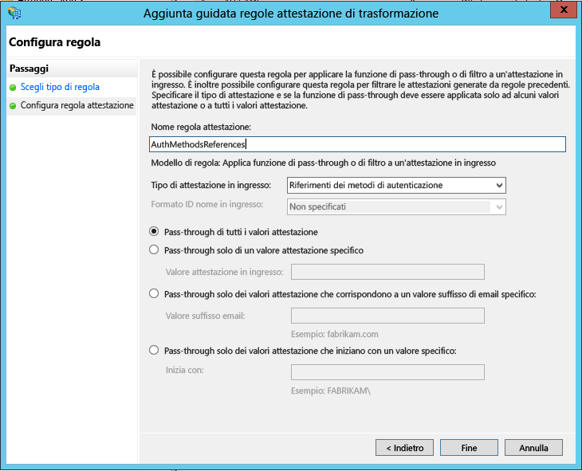

# Configurare il server Azure Multi-Factor Authentication per lavorare con AD FS in Windows Server 2012 R2
Se l'organizzazione usa Active Directory Federation Services (ADFS), per proteggere le risorse del cloud o locali è possibile configurare il server Azure Multi-Factor Authentication per l'uso con ADFS. Questa configurazione attiva la verifica in due passaggi per gli endpoint di alto valore.

Questo articolo illustra l'uso del server Azure Multi-Factor Authentication con AD FS in Windows Server 2012 R2. Per altre informazioni, vedere [Proteggere le risorse del cloud e locali mediante il server Azure Multi-Factor Authentication con AD FS 2.0](multi-factor-authentication-get-started-adfs-adfs2.md).

## Proteggere AD FS per Windows Server 2012 R2 con il server Azure Multi-Factor Authentication
Quando si installa il server Multi-Factor Authentication sono disponibili le opzioni seguenti:

* Installare il server Azure Multi-Factor Authentication in locale nello stesso server di AD FS
* Installare l'adapter di Azure Multi-Factor Authentication in locale nel server AD FS e quindi installare il server Multi-Factor Authentication in un altro computer

Prima di iniziare, tenere presente le seguenti informazioni:

* Non è necessario installare il server Azure Multi-Factor Authentication nel server AD FS. È tuttavia necessario installare l'adapter Multi-Factor Authentication per AD FS in un computer Windows Server 2012 R2 che esegue AD FS. È possibile installare il server in un computer diverso, se si tratta di una versione supportata, e installare separatamente l'adapter AD FS nel server federativo AD FS. Vedere le procedure seguenti per informazioni su come installare l'adapter separatamente.
* Quando è stata progettata la scheda ADFS del server MFA, è stato previsto per ADFS il passaggio del nome della relying party alla scheda. Perciò il nome della relying party potrebbe essere usato come nome di un'applicazione. Tuttavia, questo non si è verificato. Se l'organizzazione usa metodi di autenticazione tramite app per dispositivi mobili o SMS, le stringhe definite in Impostazioni società contengono un segnaposto <$*nome_applicazione*$>. Questo segnaposto non viene sostituito automaticamente quando si usa l'adapter AD FS. È consigliabile rimuovere il segnaposto dalle stringhe appropriate per la protezione di AD FS.
* L'account usato per accedere deve avere diritti utente per la creazione di gruppi di sicurezza nel servizio Active Directory.
* L'installazione guidata della scheda ADFS di Multi-Factor Authentication crea un gruppo di sicurezza denominato PhoneFactor Admins nell'istanza di Active Directory e aggiunge l'account del servizio ADFS del servizio federativo a questo gruppo. È consigliabile verificare nel controller di dominio che il gruppo PhoneFactor Admins sia stato effettivamente creato e che l'account del servizio AD FS sia un membro di questo gruppo. Se necessario, aggiungere l'account del servizio AD FS manualmente al gruppo PhoneFactor Admins nel controller di dominio.
* Per informazioni sull'installazione dell'SDK del servizio Web con il portale utenti, vedere [Distribuzione del portale utenti per il server Azure Multi-Factor Authentication](multi-factor-authentication-get-started-portal.md)

### Installare il server Azure Multi-Factor Authentication in locale nel server AD FS
1. Scaricare e installare il server Azure Multi-Factor Authentication nel server ADFS. Per informazioni sull'installazione, vedere [Introduzione al server Azure Multi-Factor Authentication](multi-factor-authentication-get-started-server.md).
2. Nella console di gestione del server Azure Multi-Factor Authentication fare clic sull'icona **ADFS** e selezionare le opzioni **Consenti registrazione utente** e **Consenti agli utenti di selezionare il metodo**.
3. Selezionare eventuali opzioni aggiuntive per l'organizzazione.
4. Fare clic su **Installa scheda ADFS**.
   

5. L'eventuale visualizzazione della finestra di Active Directory significa due cose. Il computer è unito a un dominio e la configurazione di Active Directory per proteggere la comunicazione tra la scheda ADFS e il servizio Multi-Factor Authentication è incompleta. Fare clic su **Avanti** per completare la configurazione oppure selezionare la casella di controllo **Ignora la configurazione automatica di Active Directory e configura le impostazioni manualmente** e fare clic su **Avanti**.
6. L'eventuale visualizzazione delle finestre Gruppo locale significa due cose. Il computer non è unito a un dominio e la configurazione del gruppo locale per proteggere la comunicazione tra la scheda ADFS e il servizio Multi-Factor Authentication è incompleta. Fare clic su **Avanti** per completare la configurazione oppure selezionare la casella di controllo **Ignora la configurazione automatica di Gruppo locale e configura le impostazioni manualmente** e fare clic su **Avanti**.
7. Nell'installazione guidata fare clic su **Avanti**. Il server Azure Multi-Factor Authentication creerà il gruppo PhoneFactor Admins e aggiungerà l'account del servizio AD FS al gruppo PhoneFactor Admins.
   

8. Nella pagina **Avvia programma di installazione** fare clic su **Avanti**.
9. Nel programma di installazione dell'adapter AD FS di Multi-Factor Authentication fare clic su **Avanti**.
10. Al termine dell'installazione, fare clic su **Chiudi** .
11. Dopo aver installato l'adapter è necessario registrarlo con AD FS. Aprire Windows PowerShell ed eseguire il comando seguente: 
    `C:\Program Files\Multi-Factor Authentication Server\Register-MultiFactorAuthenticationAdfsAdapter.ps1`
    

12. Modificare i criteri di autenticazione globali in ADFS per usare la scheda appena registrata. Nella console di gestione di AD FS, passare al nodo **Criteri di autenticazione** . Nella sezione **Multi-factor Authentication** fare clic sul collegamento **Modifica** accanto alla sezione **Impostazioni globali**. Nella finestra di dialogo **Modifica criteri di autenticazione globali** selezionare **Multi-Factor Authentication** come metodo di autenticazione aggiuntivo e fare clic su **OK**. L'adapter viene registrata come WindowsAzureMultiFactorAuthentication. È necessario riavviare il servizio ADFS per rendere effettiva la registrazione.

A questo punto, il server Multi-Factor Authentication è configurato per essere un provider di autenticazione aggiuntivo per l'uso con AD FS.

## Installare un'istanza autonoma dell'adapter AD FS usando l'SDK del servizio Web
1. Installare l'SDK del servizio Web nel server che esegue il server Multi-Factor Authentication.
2. Copiare i file seguenti dalla directory \Programmi\Multi-Factor Authentication Server al server in cui si prevede di installare l'adapter AD FS:
   * MultiFactorAuthenticationAdfsAdapterSetup64.msi
   * Register-MultiFactorAuthenticationAdfsAdapter.ps1
   * Unregister-MultiFactorAuthenticationAdfsAdapter.ps1
   * MultiFactorAuthenticationAdfsAdapter.config
3. Eseguire il file di installazione MultiFactorAuthenticationAdfsAdapterSetup64.msi.
4. Nel programma di installazione della scheda ADFS di Multi-Factor Authentication fare clic su **Avanti** per eseguire l'installazione.
5. Al termine dell'installazione, fare clic su **Chiudi** .

## Modificare il file MultiFactorAuthenticationAdfsAdapter.config
Per modificare il file MultiFactorAuthenticationAdfsAdapter.config, seguire questa procedura:

1. Impostare il nodo **UseWebServiceSdk** su **true**.  
2. Impostare il valore di **WebServiceSdkUrl** sull'URL dell'SDK del servizio Web Multi-Factor Authentication. Ad esempio:  *https://contoso.com/&lt;nomecertificato&gt;/MultiFactorAuthWebServicesSdk/PfWsSdk.asmx*, dove nomecertificato è il nome del certificato.  
3. Modificare lo script Register-MultiFactorAuthenticationAdfsAdapter.ps1 aggiungendo*-ConfigurationFilePath &lt;percorso&gt;* alla fine del comando `Register-AdfsAuthenticationProvider`, dove *&lt;percorso&gt;* è il percorso completo del file MultiFactorAuthenticationAdfsAdapter.config.

### Configurare l'SDK del servizio Web con un nome utente e una password
Per configurare l'SDK del servizio Web è possibile procedere in due modi: usando un nome utente e una password oppure un certificato client. Per la prima opzione, seguire questa procedura. Per la seconda opzione, vedere più avanti.  

1. Impostare il valore di **WebServiceSdkUsername** su un account membro del gruppo di sicurezza PhoneFactor Admins. Usare il formato &lt;dominio&gt;&#92;&lt;nome utente&gt;.  
2. Impostare il valore di **WebServiceSdkPassword** sulla password dell'account appropriato.

### Configurare l'SDK del servizio Web con un certificato client
Se si preferisce non usare un nome utente e una password, seguire questa procedura per configurare l'SDK del servizio Web con un certificato client.

1. Ottenere un certificato client da un'autorità di certificazione per il server che esegue l'SDK del servizio Web. Informazioni su come [ottenere certificati client](https://technet.microsoft.com/library/cc770328.aspx).  
2. Importare il certificato client nell'archivio certificati personali del computer locale nel server che esegue l'SDK del servizio Web. Verificare che il certificato pubblico dell'autorità di certificazione si trovi nell'archivio dei certificati radice attendibili.  
3. Esportare le chiavi pubbliche e private del certificato client in un file PFX.  
4. Esportare la chiave pubblica con codifica Base64 in un file CER.  
5. In Server Manager, verificare che sia installata la funzionalità Autenticazione mapping certificati client IIS in Server Web (IIS)\Server Web\Sicurezza. Se non è installata, selezionare **Aggiungi ruoli e funzionalità** per aggiungerla.  
6. In Gestione IIS fare doppio clic sull' **editor di configurazione** nel sito Web che contiene la directory virtuale dell'SDK del servizio Web. È importante selezionare il sito Web, non la directory virtuale.  
7. Passare alla sezione **system.webServer/security/authentication/iisClientCertificateMappingAuthentication** .  
8. Impostare enabled su **true**.  
9. Impostare oneToOneCertificateMappingsEnabled su **true**.  
10. Fare clic sul pulsante **...** accanto a oneToOneMappings e sul collegamento **Aggiungi**.  
11. Aprire il file CER con codifica Base64 esportato in precedenza. Rimuovere *-----BEGIN CERTIFICATE-----*, *-----END CERTIFICATE-----* e tutte le interruzioni di riga. Copiare la stringa risultante.  
12. Impostare certificate sulla stringa copiata nel passaggio precedente.  
13. Impostare enabled su **true**.  
14. Impostare userName su un account membro del gruppo di sicurezza PhoneFactor Admins. Usare il formato &lt;dominio&gt;&#92;&lt;nome utente&gt;.  
15. Impostare la password su quella dell'account appropriato e quindi chiudere l'editor di configurazione.  
16. Fare clic sul collegamento **Apply** (Applica).  
17. Nella directory virtuale dell'SDK del servizio Web fare doppio clic su **Autenticazione**.  
18. Verificare che Rappresentazione ASP.NET e Autenticazione di base siano entrambe **abilitate** e che tutti gli altri elementi siano **disabilitati**.  
19. Nella directory virtuale dell'SDK del servizio Web fare doppio clic su **Impostazioni SSL**.  
20. Impostare Certificati client su **Accetta** e fare clic su **Applica**.  
21. Copiare il file PFX esportato in precedenza nel server che esegue la scheda AD FS.  
22. Importare il file PFX nell'archivio certificati personali del computer locale.  
23. Fare clic con il pulsante destro del mouse e selezionare **Gestisci chiavi private**, quindi concedere l'accesso in lettura all'account usato per accedere al servizio AD FS.  
24. Aprire il certificato client e copiare l'identificazione personale dalla scheda **Dettagli** .  
25. Nel file MultiFactorAuthenticationAdfsAdapter.config impostare **WebServiceSdkCertificateThumbprint** sulla stringa copiata nel passaggio precedente.  

Infine, per registrare la scheda, eseguire lo script \Program Files\Multi-Factor Authentication Server\Register-MultiFactorAuthenticationAdfsAdapter.ps1 in PowerShell. L'adapter viene registrata come WindowsAzureMultiFactorAuthentication. È necessario riavviare il servizio ADFS per rendere effettiva la registrazione.

## Proteggere le risorse Azure AD con ADFS
Per proteggere le risorse cloud, configurare una regola attestazioni in modo che Active Directory Federation Services generi l'attestazione multipleauthn quando un utente esegue correttamente la verifica in due passaggi. Questa attestazione viene passata ad Azure AD. Seguire questa procedura per eseguire i passaggi:

1. Aprire il componente di gestione di ADFS.
2. A sinistra selezionare **Attendibilità componente**.
3. Fare clic con il pulsante destro del mouse su **Piattaforma delle identità di Microsoft Office 365** e selezionare **Modifica regole attestazione...**

   

4. In Regole di trasformazione rilascio fare clic su **Aggiungi regola**.

   

5. Nell'Aggiunta guidata regole attestazione di trasformazione selezionare **Applicare la funzione di pass-through o di filtro a un'attestazione in ingresso** dall'elenco a discesa e fare clic su **Avanti**.

   

6. Assegnare un nome alla regola. 
7. Selezionare **Riferimenti dei metodi di autenticazione** come Tipo di attestazione in ingresso.
8. Selezionare **Pass-through di tutti i valori attestazione**.
    
9. Fare clic su **Fine**. Chiudere la console di gestione di ADFS.

## Argomenti correlati
Per la risoluzione dei problemi, vedere [Domande frequenti su Azure Multi-Factor Authentication](multi-factor-authentication-faq.md)

