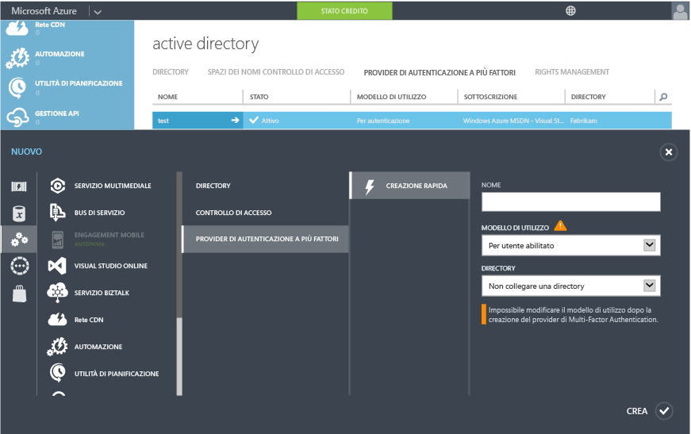
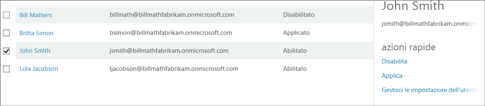

<properties 
	pageTitle="Introduzione ad Azure Multi-Factor Authentication nel cloud"
	description="Questa è la pagina su Multi-Factor Authentication di Azure in cui viene descritto come iniziare a utilizzare questa tipologia di autenticazione di Azure nel cloud."
	services="multi-factor-authentication"
	documentationCenter=""
	authors="billmath"
	manager="stevenpo"
	editor="curtand"/>

<tags 
	ms.service="multi-factor-authentication"
	ms.workload="identity"
	ms.tgt_pltfrm="na"
	ms.devlang="na"
	ms.topic="get-started-article"
	ms.date="08/24/2015"
	ms.author="billmath"/>

# Introduzione ad Azure Multi-Factor Authentication nel cloud

Dopo aver determinato che viene usata la modalità Multi-Factor Authentication nel cloud, è possibile procedere. Si noti che se si utilizza la modalità Multi-Factor Authentication per Office 365 o per amministratori di Azure, è possibile procedere al passaggio 3. Questo documento riguarda anche quanto segue

1. **Iscriversi per ottenere una sottoscrizione ad Azure**
	- Se non si dispone già di una sottoscrizione ad Azure, è necessario iscriversi. Se si è appena iniziato a esplorare la modalità Multi-Factor Authentication di Azure, è possibile utilizzare una sottoscrizione di valutazione
2. **Creare un Provider Multi-Factor Authentication o assegnare una licenza Azure AD Premium o Enterprise Mobility Suite agli utenti**
	- Occorre creare un Provider Multi-Factor Authentication e assegnare alla directory o assegnare licenze agli utenti di Azure AD Premium o EMS. La modalità Azure Multi-Factor Authentication è inclusa in Azure Active Directory Premium e di conseguenza è compresa inoltre in Enterprise Mobility Suite. Se si dispone di Azure AD Premium o EMS, non è necessario creare un Provider Multi-Factor Authentication, piuttosto che attivare la Multi-Factor Authentication per un utente di Azure AD Premium o EMS, una licenza Azure AD Premium o EMS deve essere assegnata al medesimo utente e un amministratore può assegnare la modalità Multi-Factor Authentication all'utente tramite il portale di gestione. Per informazioni su come assegnare le licenze all'utente, vedere la sezione seguente.
3. **Attivare la modalità Multi-Factor Authentication per gli utenti** 
	- Attivare Azure MFA per gli utenti tramite il portale di Office 365 o di Azure. Vedere la sezione seguente per informazioni su come eseguire questa operazione.
4. **Inviare messaggi di posta elettronica agli utenti finali per informarli sulla modalità MFA**
	- Dopo aver attivato la modalità Multi-Factor Authentication sull'account di un utente, si consiglia di inviare un messaggio di posta elettronica di notifica all'utente interessato. All'utente verrà richiesto di completare la procedura la volta successiva che eseguirà l'accesso, in modo da essere informato su ciò che si verificherà sull'account. Vedere la sezione seguente per un modello di messaggio di posta elettronica di esempio.

## Creazione di un Provider Multi-Factor Authentication di Azure
La modalità Multi-Factor Authentication è disponibile per impostazione predefinita per gli amministratori globali che dispongono di un tenant Azure Active Directory. Tuttavia, se si desidera estendere la modalità Multi-Factor Authentication a tutti gli utenti e/o si desidera consentire agli amministratori globali di sfruttare i vantaggi offerti da funzionalità quali il portale di gestione, i messaggi di saluto personalizzati e i report, sarà necessario acquistare e configurare un Provider Multi-Factor Authentication.

### Per creare un Provider Multi-Factor Authentication
--------------------------------------------------------------------------------

1. Accedere al Portale di Azure come amministratore.
2. A sinistra selezionare Active Directory.
3. Nella parte superiore della pagina Active Directory, selezionare i provider Multi-Factor Authentication. Nella parte inferiore, fare clic su **Nuovo**.
4. In Servizi app, selezionare Provider di autenticazione attivi, quindi scegliere Creazione rapida.
5. Compilare i campi seguenti, quindi selezionare Crea.
	1. Nome: il nome del Provider di autenticazione attivo.
	2. Modello di utilizzo: il modello di utilizzo del Provider Multi-Factor Authentication.
		- Per ogni autenticazione: modello di acquisto in cui è previsto l'addebito in base al numero di autenticazioni. In genere, viene utilizzato per scenari in cui viene impiegata la modalità Multi-Factor Authentication di Azure in un'applicazione.
		- Per ogni utente abilitato: modello di acquisto in cui è previsto l'addebito in base al numero di utenti abilitati. In genere, viene utilizzati in ambiti come quello di Office 365.
	2. Directory: tenant di Azure Active Directory a cui è associato il Provider Multi-Factor Authentication. Tenere presente quanto segue:
		- Non è necessaria una directory di Azure AD per creare un Provider Multi-Factor Authentication. Può essere lasciata vuota se si prevede di utilizzare solo i Server Azure Multi-Factor Authentication o l'SDK.
		- Tuttavia, se si desidera estendere la modalità Multi-Factor Authentication a tutti gli utenti e/o si desidera consentire agli amministratori globali di sfruttare i vantaggi offerti da funzionalità quali il portale di gestione, i messaggi di saluto personalizzati e i report, sarà necessario associare il Provider Multi-Factor Authentication a una directory di Azure AD.
		- Le funzionalità DirSync o AAD Sync sono necessarie solo se si esegue la sincronizzazione dell'ambiente Active Directory locale con una directory di Azure AD. Se si utilizza solo una directory di Azure AD che non è sincronizzata con un'istanza locale di Active Directory, non è necessario disporre delle funzionalità DirSync o AAD Sync.
		

5. Facendo clic su Crea, verrà creato il Provider Multi-Factor Authentication e verrà visualizzato il messaggio in cui verrà indicato la corretta creazione del Provider. Fare clic su Ok.

## Assegnazion di una licenza Azure AD Premium o Enterprise Mobility agli utenti

Se si dispone di Azure AD Premium o di Enterprise Mobility Suite, non è necessario creare un Provider Multi-Factor Authentication. È sufficiente assegnare una licenza a un utente per attivare la modalità MFA per gli utenti.

### Per assegnare una licenza Azure AD Premium o Enterprise Mobility Suite
--------------------------------------------------------------------------------
<ol>

<li>Accesso al portale di Azure come amministratore.</li>
<li>A sinistra selezionare **Active Directory**.</li>
<li>Nella pagina Active Directory fare doppio clic sulla directory con gli utenti da abilitare.</li>
<li>Nella parte superiore della pagina della directory selezionare **Licenses**.</li>
<li>Nella pagina Licenze selezionare Active Directory Premium o Enterprise Mobility Suite, quindi fare clic su **Assegna**.</li>

<li>Nella finestra di dialogo selezionare gli utenti a cui assegnare le licenze, quindi fare clic sull'icona con il segno di spunta per salvare le modifiche.</li>

## Attivare la modalità Multi-Factor Authentication per gli utenti

Gli account utente in modalità Multi-Factor Authentication di Azure presentano i seguenti tre stati distinti:

Stato | Descrizione |Interessate le app non basate su browser| Note 
:-------------: | :-------------: |:-------------: |:-------------: |
Disabled | Lo stato predefinito per un nuovo utente non registrato alla modalità Multi-Factor Authentication.|No|L'utente attualmente non utilizza la modalità Multi-Factor Authentication.
Enabled |L'utente è stato registrato alla modalità Multi-Factor Authentication.|No. Continueranno a funzionare fino al completamento della registrazione.|L'utente è abilitato ma non ha completato la procedura di registrazione. All'utente verrà chiesto di completare la procedura all'accesso successivo.
Enforced|L'utente è stato registrato e ha completato la procedura di registrazione per l'utilizzo della modalità Multi-Factor Authentication.|Sì. Non funzioneranno finché non verranno create e utilizzate password per le app. | È possibile che l'utente abbia o non abbia completato la registrazione. Se la procedura di registrazione è stata completata, l'utente utilizzerà la modalità Multi-Factor Authentication. In caso contrario, all'utente verrà chiesto di completare la procedura all'accesso successivo.
Ora che si dispone di un provider di autenticazione o che agli utenti sono state assegnate le necessarie licenze, il passaggio successivo consiste nell'attivare la modalità MFA per gli utenti presenti nella directory. Utilizzare la procedura seguente per attivare la modalità MFA per gli utenti.

### Per attivare la modalità Multi-Factor Authentication
--------------------------------------------------------------------------------
1.  Accedere al portale di gestione di Azure come amministratore.
2.  A sinistra fare clic su Active Directory.
3.  In Directory fare clic sulla directory relativa all'utente che si desidera attivare.
4.  Nella parte superiore fare clic su Utenti.
5.  Nella parte inferiore della pagina fare clic sull'opzione per gestire la modalità Multi-Factor Authentication.
6.  Trovare l'utente che si desidera abilitare alla modalità Multi-Factor Authentication Potrebbe essere necessario modificare la visualizzazione nella parte superiore. Verificare che lo stato dell'utente sia disabilitato e inserire un segno di spunta nella casella accanto al nome.
7.  In questo modo verranno visualizzate due opzioni a destra: Abilita e Gestisci le impostazioni dell'utente. Fare clic su Abilita. Viene visualizzata una finestra popup in cui vengono indicati i passaggi successivi da effettuare con gli utenti. Fare clic sull'opzione per abilitare la modalità Multi-Factor Authentication.
8.  Dopo avere attivato gli utenti, si consiglia di inviare agli utenti un messaggio di posta elettronica per informarli su come utilizzare le applicazioni non basate su browser e per non rimanere bloccati.

Per modificare lo stato dell'utente utilizzando Windows PowerShell, è possibile utilizzare le operazioni seguenti. È possibile modificare `$st.State` in modo che corrisponda a uno degli stati indicati in precedenza.

		$st = New-Object -TypeName Microsoft.Online.Administration.StrongAuthenticationRequirement
		$st.RelyingParty = "*"
		$st.State = “Enabled”
		$sta = @($st)
		Set-MsolUser -UserPrincipalName bsimon@contoso.com -StrongAuthenticationRequirements $sta

## Inviare un messaggio di posta elettronica agli utenti finali

Dopo avere attivato gli utenti, si consiglia di inviare agli utenti un messaggio di posta elettronica per invitarli a fornire le propri informazioni di contatto. Di seguito è riportato un modello di messaggio di posta elettronica che può essere utilizzato e che include un collegamento a un video per gli utenti.

		Subject: ACTION REQUIRED: Your password for Outlook and other apps needs updated

		Body:

		For added security, we have enabled multi-factor authentication for your account. 

		Action Required: You will need to complete the enrollment steps below to make your account secure with multi-factor authentication.  

		What to expect once MFA is enabled:

		Multi-factor authentication requires a password that you know and a phone that you have in order to sign into browser applications and to access Office 365, Azure portals.

		For Office 365 non-browser applications such as outlook, lync, a mail client on your mobile device etc, a special password called an app password is required instead of your account password to sign in. App passwords are different than your account password, and are generated during the multi-factor authentication set up process. 

		Please follow these enrollment steps to avoid interruption of your Office 365 service:

			1.  Sign in to the Office 365 Portal at http://portal.microsoftonline.com.
			2.  Follow the instructions to set up your preferred multi-factor authentication method when signing into Office 365 using a web browser. 
			3.  Create one app password for each device.
			4.  Enter the same app password in all applicable apps on that device e.g. Outlook, Mail client, Lync, Word, Powerpoint, Excel, CRM etc. 
			5.  Update your Office client applications or other mobile applications to use an app password.

		You can visit http://aka.ms/mfasetup to create app passwords or change your MFA Setting.  Please bookmark this.

		NOTE: Before entering an app password, you will need to clear the sign-in information (delete sign-in info), restart the application,   and sign-in with the username and app password. Follow the steps documented : http://technet.microsoft.com/library/dn270518.aspx#apppassword.

		Watch a video showing these steps at http://g.microsoftonline.com/1AX00en/175.

		Best Regards,
		Your Administrator

## Passaggi successivi
Ora che è stata impostata la modalità Multi-Factor Authentication nel cloud, è possibile passare alla fase successiva andando alla sezione [Configurazione di Azure Multi-Factor Authentication](multi-factor-authentication-whats-next.md). Da qui sarà possibile apprendere come creare report, segnalare avvisi di illecito, personalizzare i messaggi vocali e tutte le funzionalità offerte da Azure multi-Factor Authentication.

<!---HONumber=August15_HO9-->