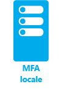
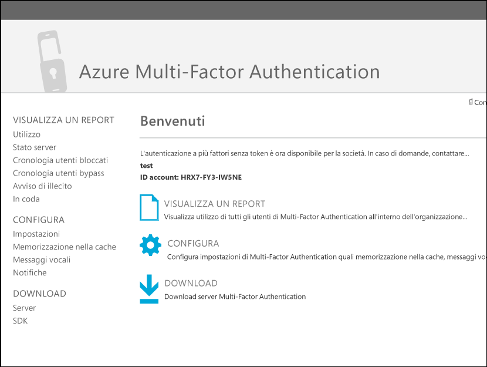
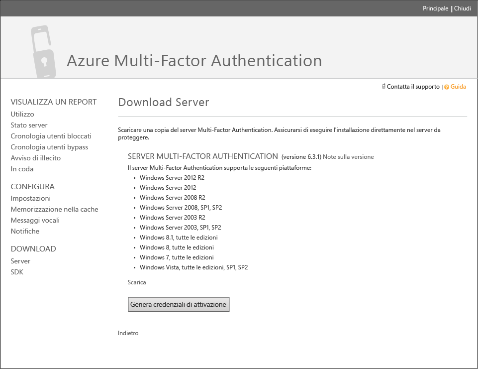
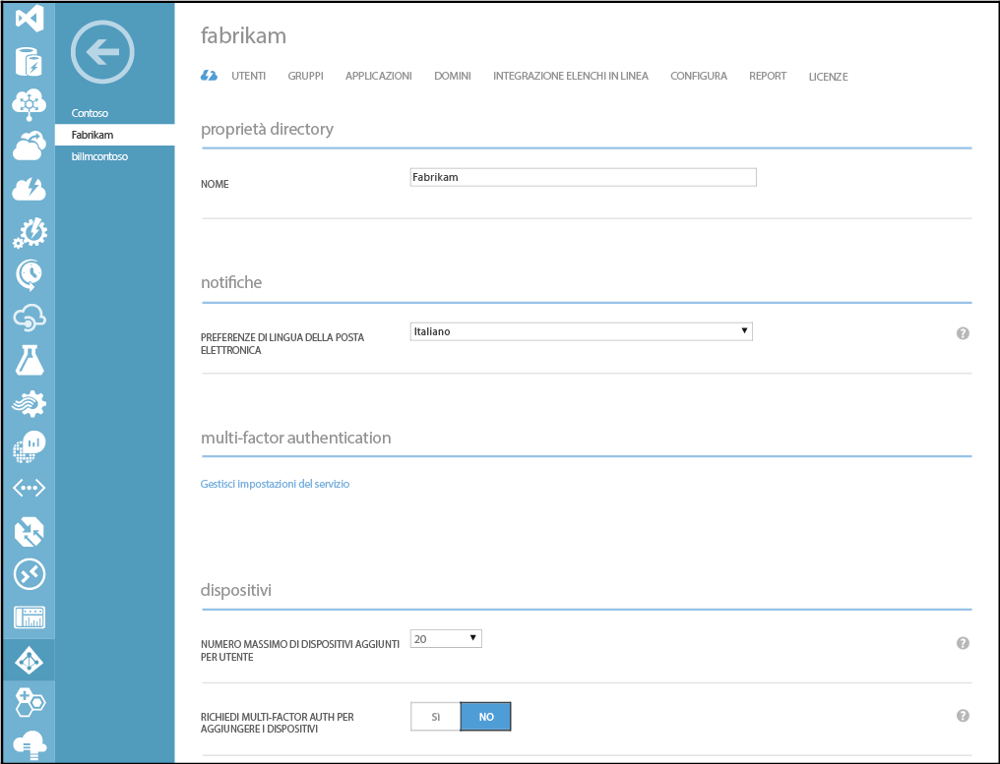
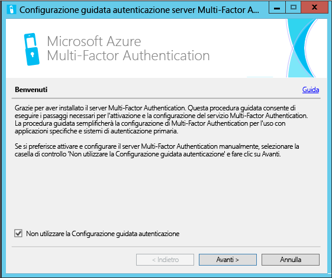
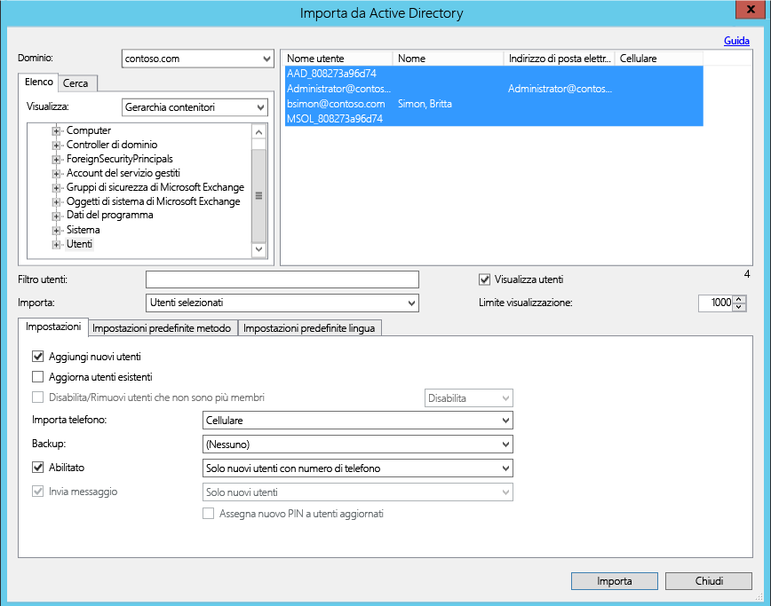
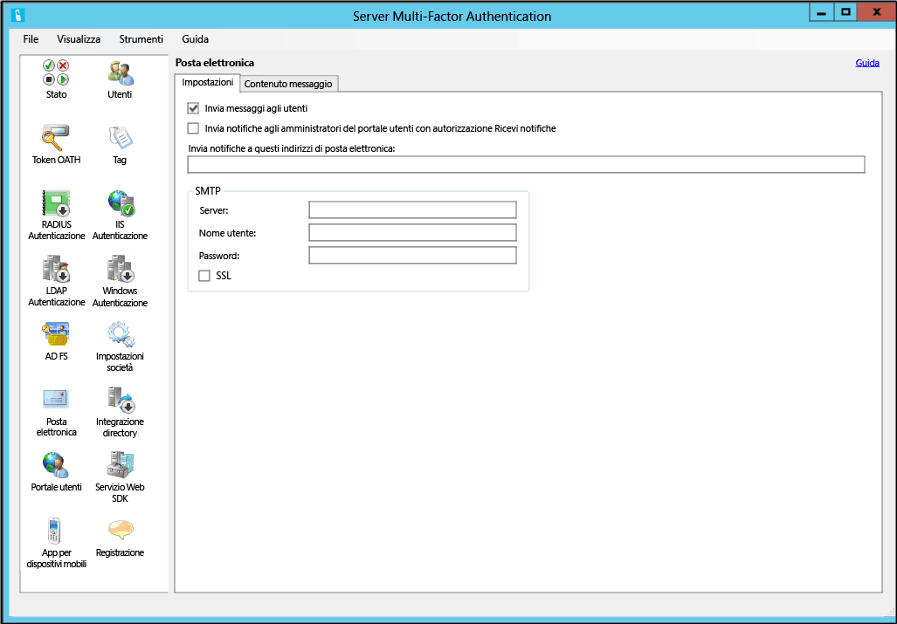
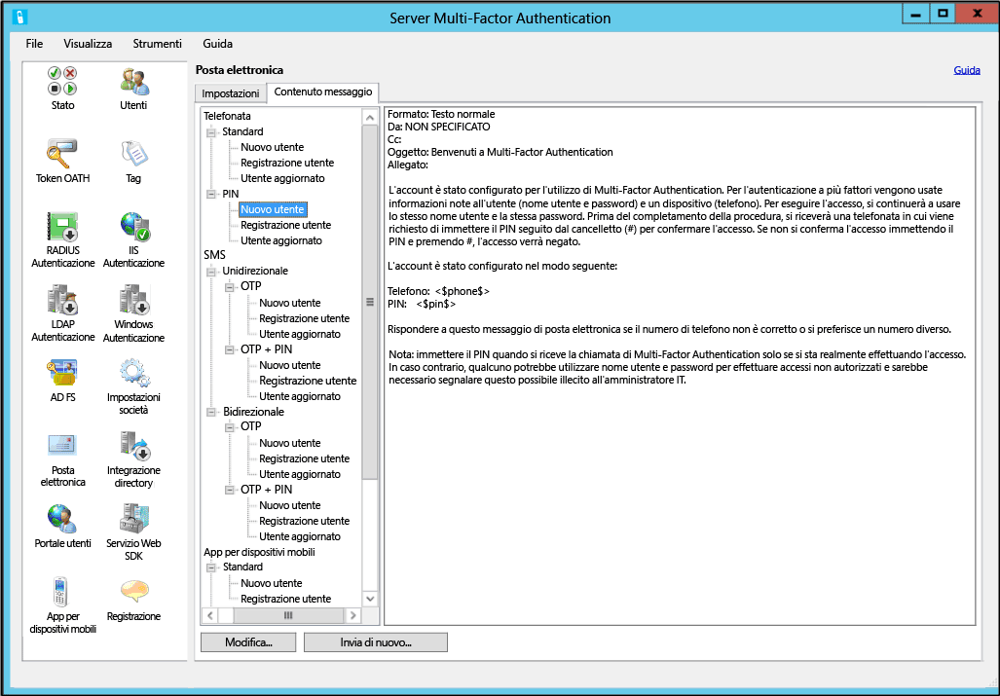

<properties 
	pageTitle="Introduzione al server Azure Multi-Factor Authentication" 
	description="Questa è la pagina di Azure Multi-Factor Authentication in cui viene descritto come iniziare a utilizzare Azure MFA." 
	services="multi-factor-authentication"
	keywords="server di autenticazione, pagina di attivazione dell'app azure multi factor authentication, download server di autenticazione" 
	documentationCenter="" 
	authors="billmath" 
	manager="stevenpo" 
	editor="curtand"/>

<tags 
	ms.service="multi-factor-authentication" 
	ms.workload="identity" 
	ms.tgt_pltfrm="na" 
	ms.devlang="na" 
	ms.topic="get-started-article" 
	ms.date="02/16/2016" 
	ms.author="billmath"/>

# Introduzione al server Azure Multi-Factor Authentication

Dopo aver stabilito se è necessario usare l'autenticazione a più fattori in locale, è possibile procedere. Questa pagina include una nuova installazione del server che include l'impostazione di Active Directory locale. Se il server PhoneFactor è già installato e si vuole eseguire l'aggiornamento, vedere [Aggiornamento dell'agente PhoneFactor al server Azure Multi-Factor Authentication](multi-factor-authentication-get-started-server-upgrade.md). Per informazioni sull'installazione solo del servizio Web, vedere [Introduzione al servizio Web di app per dispositivi mobili del server MFA](multi-factor-authentication-get-started-server-webservice.md).

## Scaricare il server Azure Multi-Factor Authentication

Esistono due modi diversi per scaricare il server Azure Multi-Factor Authentication. Entrambi vengono eseguiti con il portale di Azure. Il primo prevede la gestione diretta del provider di Multi-Factor Authentication, il secondo l'uso delle impostazioni del servizio. La seconda opzione richiede un provider Multi-Factor Authentication o una licenza di Azure MFA, Azure AD Premium o Enterprise Mobility Suite.

### Per scaricare il server Azure Multi-Factor Authentication dal portale Azure
--------------------------------------------------------------------------------

1. Accedre al portale di Azure come amministratore.
2. A sinistra selezionare Active Directory.
3. Nella parte superiore della pagina Active Directory, selezionare **Provider Multi-Factor Authentication**
4. Nella parte inferiore fare clic su **Gestisci**
5. Verrà aperta una nuova pagina. Fare clic su **Download.** 
6. Sopra all'opzione relativa alla **generazione delle credenziali di attivazione**, fare clic su **Download**. 
7. Salvare il download.

### Per scaricare il server Azure Multi-Factor Authentication con le impostazioni del servizio

1. Accedere al portale di Azure come amministratore.
2. A sinistra selezionare Active Directory.
3. Fare doppio clic sull'istanza di Azure AD.
4. Nella parte superiore fare clic su **Configura** 
5. In Multi-Factor Authentication selezionare **Gestisci impostazioni del servizio**
6. Nella parte inferiore della schermata della pagina Impostazioni servizio, fare clic su **Vai al portale**. 
7. Verrà aperta una nuova pagina. Fare clic su **Download**.
8. Sopra all'opzione relativa alla **generazione delle credenziali di attivazione**, fare clic su **Download**.
9. Salvare il download.

## Installare e configurare il server Azure Multi-Factor Authentication
Dopo averlo scaricato, è possibile installare e configurare il server. Assicurarsi che il server su cui viene installato soddisfi i requisiti seguenti:

Requisiti del server Azure Multi-Factor Authentication|Descrizione|
:------------- | :------------- | 
Hardware|<li>200 MB di spazio su disco rigido</li><li>processore in grado di supportare istruzioni x32 o x64</li><li>1 GB o più di RAM</li>
Software|<li>Windows Server 2003 o versione successiva, se l'host è un sistema operativo server</li><li>Windows Vista o versione successiva, se l'host è un sistema operativo client</li><li>Microsoft .NET 2.0 Framework</li><li>IIS 6.0 o versione successiva per l'installazione del portale utenti o dell'SDK servizio Web</li>

### Requisiti del firewall del server Azure Multi-Factor Authentication
--------------------------------------------------------------------------------
Ogni server Multi-Factor Authentication Server deve essere in grado di comunicare sulla porta 443 in uscita in modo seguente:

- https://pfd.phonefactor.net
- https://pfd2.phonefactor.net
- https://css.phonefactor.net

Se i firewall in uscita sono limitati sulla porta 443, sarà necessario aprire i seguenti intervalli di indirizzi IP:

Subnet IP|Netmask|Intervallo IP
:------------- | :------------- | :------------- |
134\.170.116.0/25|255\.255.255.128|134\.170.116.1 – 134.170.116.126
134\.170.165.0/25|255\.255.255.128|134\.170.165.1 – 134.170.165.126
70\.37.154.128/25|255\.255.255.128|70\.37.154.129 – 70.37.154.254

Se non si utilizza la funzionalità di conferma dell'evento Azure Multi-Factor Authentication e se gli utenti non eseguono l'autenticazione con le app per dispositivi mobili Multi-Factor Authentication da dispositivi nella rete aziendale, gli intervalli di indirizzi IP possono essere ridotti a quanto segue:

Subnet IP|Netmask|Intervallo IP
:------------- | :------------- | :------------- |
134\.170.116.72/29|255\.255.255.248|134\.170.116.72 – 134.170.116.79
134\.170.165.72/29|255\.255.255.248|134\.170.165.72 – 134.170.165.79
70\.37.154.200/29|255\.255.255.248|70\.37.154.201 – 70.37.154.206

### Per installare e configurare il server Azure Multi-Factor Authentication
--------------------------------------------------------------------------------

1. Fare doppio clic sul file eseguibile. Viene avviata l'installazione.
2. Nella schermata di selezione della cartella di installazione, assicurarsi che la cartella sia corretta e fare clic su Avanti.
3. Al termine dell'installazione, fare clic su Fine. Verrà avviata la configurazione guidata.
4. Nella schermata iniziale della configurazione guidata, inserire un segno di spunta sull'opzione per **non utilizzare la configurazione guidata di autenticazione** e fare clic su **Avanti**. Verrà chiusa la procedura guidata e avviato il server.

5. Tornare nella pagina da cui è stato scaricato il server, scegliere il pulsante relativo alla **generazione delle credenziali di attivazione**. Copiare queste informazioni nel server Azure MFA nelle apposite caselle e fare clic su **Attiva**.

I passaggi sopra riportati mostrano un'installazione rapida con la configurazione guidata. È possibile eseguire nuovamente la procedura guidata di autenticazione selezionandolo dal menu Strumenti sul server.

##Importare gli utenti da Active Directory

Ora che il server è stato installato e configurato, è possibile importare rapidamente gli utenti nel server Azure MFA.

### Per importare gli utenti da Active Directory
--------------------------------------------------------------------------------

1. Nel server Azure MFA, a sinistra, selezionare **Utenti**.
2. Nella parte inferiore, selezionare **Importa da Active Directory**.
3. A questo punto è possibile eseguire la ricerca di singoli utenti o effettuare una ricerca delle unità organizzative con utenti all'interno di Active Directory. In questo caso, specifichiamo l'Unità organizzativa utenti.
4. Selezionare tutti gli utenti a destra e fare clic per avviare l'**importazione**. Verrà visualizzata una finestra popup che informa che tutte le operazioni sono state eseguite correttamente. Chiudere la finestra di importazione.

## Inviare agli utenti un messaggio e-mail
Dopo aver importato gli utenti nel server Azure Multi-Factor Authentication, è consigliabile inviare agli utenti una e-mail che li informa che sono stati iscritti all’autenticazione a più fattori.

Con il Server Azure Multi-Factor Authentication ci sono vari modi disponibili per configurare gli utenti all'utilizzo dell’autenticazione a più fattori. Ad esempio, se si conoscono i numeri di telefono degli utenti o è stato possibile importare i numeri di telefono nel Server Azure Multi-Factor Authentication dalla directory aziendale, il messaggio di posta elettronica indica agli utenti che sono stati configurati per utilizzare Azure Multi-Factor Authentication, fornendo inoltre alcune istruzioni sull'utilizzo di Azure Multi-Factor Authentication e informando l'utente sul numero di telefono sul quale riceveranno le autenticazioni.

Il contenuto del messaggio di posta elettronica varia a seconda del metodo di autenticazione che è stato impostato per l'utente (ad esempio telefonata, SMS, app mobile). Ad esempio, se l'utente deve utilizzare un PIN quando si esegue l'autenticazione, il messaggio di posta elettronica indicherà quale PIN iniziale è stato impostato. Agli utenti viene generalmente richiesto di modificare il PIN nel corso della prima autenticazione.

Se i numeri di telefono degli utenti non sono stati configurati o importati nel Server Azure Multi-Factor Authentication oppure gli utenti sono stati preconfigurati per utilizzare l'app mobile per l'autenticazione, è possibile inviare un messaggio di posta elettronica che consente di sapere che sono stati configurati per utilizzare Azure Multi-Factor Authentication e nel quale si invita a completare la registrazione del loro account tramite il portale utenti Azure Multi-Factor Authentication. Sarà incluso un collegamento ipertestuale sul quale l'utente fa clic per accedere al portale per gli utenti. Quando l'utente fa clic sul collegamento ipertestuale, il web browser verrà aperto e lo condurrà al portale per gli utenti Azure multi-Factor Authentication della propria azienda.

### Configurazione di posta elettronica e modelli di messaggio di posta elettronica

Facendo clic sull'icona del messaggio di posta elettronica a sinistra è possibile configurare le impostazioni per l'invio di questi messaggi di posta elettronica. Qui è possibile immettere le informazioni SMTP del server di posta elettronica e dove è possibile inviare un messaggio di ampia copertura aggiungendo un controllo Invia messaggi alla casella di controllo degli utenti.

Nella scheda contenuto messaggio di posta elettronica, sarà possibile vedere tutti i vari modelli di messaggio di posta elettronica disponibili per la selezione. A seconda della modalità di configurazione degli utenti per l’utilizzo dell'autenticazione a più fattori, è possibile scegliere il modello che meglio si adatta alle esigenze.

## Come gestire i dati utente tramite il server Multi-Factor Authentication

Quando si usa il server Multi-Factor Authentication (MFA) locale, i dati di un utente vengono archiviati nel server locale. Nel cloud non vengono archiviati dati utente persistenti. Quando l'utente esegue un'autenticazione a due fattori, il server MFA invia dati al servizio cloud Azure MFA per eseguire l'autenticazione. Quando queste richieste di autenticazione vengono inviate al servizio cloud, i campi seguenti vengono inviati nella richiesta e dei log, in modo che siano disponibili nei report di autenticazione/utilizzo del cliente. Alcuni campi sono facoltativi e possono essere abilitati o disabilitati nel server Multi-Factor Authentication. La comunicazione dal server MFA al servizio cloud MFA usa SSL/TLS sulla porta 443 in uscita. Questi campi sono:

- ID univoco: nome utente o ID interno del MFA
- Nome e cognome: facoltativo
- Indirizzo di posta elettronica: facoltativo
- Numero di telefono: quando si esegue una chiamata vocale o l'autenticazione tramite SMS
- Token del dispositivo: quando si esegue l'autenticazione con l'app per dispositivi mobili
- Modalità di autenticazione 
- Risultato dell'autenticazione 
- Nome del server MFA 
- IP del server MFA 
- IP client: se disponibile

Oltre a questi campi, il risultato dell'autenticazione (esito positivo/rifiuto) e il motivo di eventuali rifiuti vengono archiviati insieme ai dati di autenticazione e sono disponibili nei report di autenticazione/utilizzo.

## Configurazioni avanzate del Server Azure Multi-Factor Authentication.
Per ulteriori informazioni sull'installazione avanzata e informazioni di configurazione, utilizzare la tabella seguente.

Metodo|Descrizione
:------------- | :------------- | 
[Portale per gli utenti](multi-factor-authentication-get-started-portal.md)| Informazioni sull'installazione e configurazione del portale per gli utenti, incluse la distribuzione e il self-service dell’utente.
[Active Directory Federation Services](multi-factor-authentication-get-started-adfs.md)|Informazioni sull'impostazione di Azure Multi-Factor Authentication con ADFS.
[Autenticazione RADIUS](multi-factor-authentication-get-started-server-radius.md)| Informazioni sull'installazione e la configurazione del Server di autenticazione a più fattori di Azure con RADIUS.
[Autenticazione IIS](multi-factor-authentication-get-started-server-iis.md)|Informazioni sull'installazione e la configurazione del Server di autenticazione a più fattori di Azure con IIS.
[Autenticazione di Windows](multi-factor-authentication-get-started-server-windows.md)| Informazioni sull'installazione e la configurazione del Server di autenticazione a più fattori di Azure con l'autenticazione di Windows.
[Autenticazione LDAP](multi-factor-authentication-get-started-server-ldap.md)|Informazioni sull'installazione e la configurazione del Server di autenticazione a più fattori di Azure con l'autenticazione LDAP.
[Gateway Desktop remoto e server Azure Multi-Factor Authentication utilizzando RADIUS](multi-factor-authentication-get-started-server-rdg.md)| Informazioni sull'installazione e configurazione del Server di autenticazione a più fattori di Azure con Gateway Desktop remoto utilizzando RADIUS.
[Sincronizzazione con Windows Server Active Directory](multi-factor-authentication-get-started-server-dirint.md)|Informazioni sull'installazione e la configurazione della sincronizzazione tra Active Directory e il Server di autenticazione a più fattori di Azure.
[Distribuzione del servizio Web App Mobile di Azure Multi-Factor Authentication Server](multi-factor-authentication-get-started-server-webservice.md)|Informazioni sull'installazione e configurazione del servizio web del server Azure di autenticazione a più fattori.

<!---HONumber=AcomDC_0218_2016-->