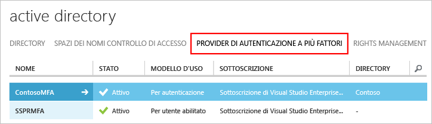

# Introduzione al server Azure Multi-Factor Authentication

Dopo aver stabilito di usare un server Multi-Factor Authentication locale, è possibile procedere. Questa pagina include una nuova installazione del server che include l'impostazione di Active Directory locale. Se il server PhoneFactor è già installato e si vuole eseguire l'aggiornamento, vedere [Aggiornamento dell'agente PhoneFactor al server Azure Multi-Factor Authentication](multi-factor-authentication-get-started-server-upgrade.md). Per informazioni sull'installazione solo del servizio Web, vedere [Introduzione al servizio Web di app per dispositivi mobili del server MFA](multi-factor-authentication-get-started-server-webservice.md).

## Scaricare il server Azure Multi-Factor Authentication
Esistono due modi diversi per scaricare il server Azure Multi-Factor Authentication. Entrambi vengono eseguiti con il portale di Azure. Il primo prevede la gestione diretta del provider di Multi-Factor Authentication, il secondo l'uso delle impostazioni del servizio. La seconda opzione richiede un provider Multi-Factor Authentication o una licenza Azure MFA, Azure AD Premium o Enterprise Mobility Suite.

> [!Important]
> Queste due opzioni sembrano simili, ma è importante sapere quale usare. Se gli utenti hanno licenze che includono MFA, non creare un provider Multi-Factor Authentication per ottenere il download del server. Usare invece l'opzione 2 per scaricare il server dalla pagina delle impostazioni del servizio. 

### Opzione 1: Scaricare il server Azure Multi-Factor Authentication dal portale di Azure classico

Usare questa opzione di download se si ha già un provider Multi-Factor Authentication perché viene eseguito il pagamento per MFA per utente abilitato o per autenticazione. 

1. Accedere al [portale di Azure classico](https://manage.windowsazure.com) come amministratore.
2. A sinistra, selezionare **Active Directory**.
3. Nella pagina Active Directory fare clic su **Provider di Autenticazione a più fattori**
    .
4. Nella parte inferiore fare clic su **Gestisci**. Viene aperta una nuova pagina.
5. Fare clic su **Download**.
6. Sopra **Genera credenziali di attivazione** fare clic sul collegamento **Download**.
   
7. Salvare il download.

### Opzione 2: Scaricare il server Azure Multi-Factor Authentication dalle impostazioni del servizio

Usare questa opzione di download se si hanno licenze Enterprise Mobility Suite, Azure AD Premium o Enterprise Cloud Suite. 

1. Accedere al [portale di Azure classico](https://manage.windowsazure.com) come amministratore.
2. A sinistra, selezionare **Active Directory**.
3. Fare doppio clic sull'istanza di Azure AD.
4. Nella parte superiore fare clic su **Configura**
5. Scorrere verso il basso fino alla sezione **Multi-Factor Authentication**, selezionare **Gestisci impostazioni del servizio**.
6. Nella parte inferiore della schermata della pagina Impostazioni servizio, fare clic su **Vai al portale**. Viene aperta una nuova pagina.
   
7. Fare clic su **Download**
8. Sopra **Genera credenziali di attivazione** fare clic sul collegamento **Download**.
    
9. Salvare il download.

## Installare e configurare il server Azure Multi-Factor Authentication
Dopo averlo scaricato, è possibile installare e configurare il server.  Assicurarsi che il server su cui viene installato soddisfi i requisiti seguenti:

| Requisiti del server Azure Multi-Factor Authentication | Descrizione |
|:--- |:--- |
| Hardware |<li>200 MB di spazio su disco rigido</li><li>processore idoneo per x32 o x64</li><li>1 GB o più di RAM</li> |
| Software |<li>Windows Server 2008 o versione successiva se l'host è un sistema operativo server</li><li>Windows 7 o versione successiva se l'host è un sistema operativo client</li><li>Microsoft .NET 4.0 Framework</li><li>IIS 7.0 o versione successiva se si installa il portale utenti o l'SDK servizi Web</li> |

### Requisiti del firewall del server Azure Multi-Factor Authentication
- - -
Ogni server Multi-Factor Authentication deve essere in grado di comunicare sulla porta 443 in uscita negli indirizzi seguenti:

* https://pfd.phonefactor.net
* https://pfd2.phonefactor.net
* https://css.phonefactor.net

Se i firewall in uscita sono limitati sulla porta 443, sarà necessario aprire gli intervalli di indirizzi IP seguenti:

| Subnet IP | Netmask | Intervallo IP |
|:--- |:--- |:--- |
| 134.170.116.0/25 |255.255.255.128 |134.170.116.1 – 134.170.116.126 |
| 134.170.165.0/25 |255.255.255.128 |134.170.165.1 – 134.170.165.126 |
| 70.37.154.128/25 |255.255.255.128 |70.37.154.129 – 70.37.154.254 |

Se non si usa la funzionalità di conferma dell'evento e gli utenti non usano app per dispositivi mobili per verificare da dispositivi nella rete aziendale, gli indirizzi IP possono essere ridotti per gli intervalli seguenti:

| Subnet IP | Netmask | Intervallo IP |
|:--- |:--- |:--- |
| 134.170.116.72/29 |255.255.255.248 |134.170.116.72 – 134.170.116.79 |
| 134.170.165.72/29 |255.255.255.248 |134.170.165.72 – 134.170.165.79 |
| 70.37.154.200/29 |255.255.255.248 |70.37.154.201 – 70.37.154.206 |

### Per installare e configurare il server Azure Multi-Factor Authentication

1. Fare doppio clic sul file eseguibile. Viene avviata l'installazione.
2. Nella schermata di selezione della cartella di installazione, assicurarsi che la cartella sia corretta e fare clic su **Avanti**.
3. Al termine dell'installazione, fare clic su **Fine**.  Viene avviata la configurazione guidata.
4. Nella schermata iniziale della configurazione guidata selezionare **Non utilizzare la Configurazione guidata autenticazione** e fare clic su **Avanti**.  Viene chiusa la procedura guidata e si avvia il server.
    
5. Tornare nella pagina da cui è stato scaricato il server, scegliere il pulsante relativo alla **generazione delle credenziali di attivazione** . Copiare queste informazioni nel server Azure MFA nelle apposite caselle e fare clic su **Attiva**.

I passaggi sopra riportati mostrano un'installazione rapida con la configurazione guidata.  È possibile eseguire nuovamente la procedura guidata di autenticazione selezionandola dal menu Strumenti sul server.

## Importare gli utenti da Active Directory
Ora che il server è stato installato e configurato, è possibile importare rapidamente gli utenti nel server Azure MFA.

1. Nel server Azure MFA, a sinistra, selezionare **Utenti**.
2. Nella parte inferiore, selezionare **Importa da Active Directory**.
3. A questo punto è possibile eseguire la ricerca di singoli utenti o effettuare una ricerca delle unità organizzative con utenti all'interno di Active Directory.  In questo caso, viene specificata l'unità organizzativa utenti.
4. Selezionare tutti gli utenti a destra e fare clic su **Importa**.  Verrà visualizzata una finestra popup che informa che tutte le operazioni sono state eseguite correttamente.  Chiudere la finestra di importazione.

## Inviare agli utenti un messaggio di posta elettronica
Dopo aver importato gli utenti nel server di MFA, si consiglia di inviare un messaggio di posta elettronica per informarli che sono stati registrati per la verifica in due passaggi.

Il messaggio di posta elettronica inviato deve essere determinato dalla configurazione degli utenti per la verifica in due passaggi. Ad esempio, se è possibile importare i numeri di telefono degli utenti dalla directory aziendale, il messaggio di posta elettronica deve includere i numeri di telefono predefiniti in modo che gli utenti sappiano cosa aspettarsi. Analogamente, se i numeri di telefono degli utenti non sono stati importati o gli utenti sono configurati per l'uso dell'app per dispositivi mobili, inviare un messaggio di posta elettronica per invitarli a completare la registrazione dell'account tramite un collegamento ipertestuale al portale utenti di Azure Multi-Factor Authentication.

Il contenuto del messaggio di posta elettronica varia a seconda del metodo di verifica impostato per l'utente (telefonata, SMS o app per dispositivi mobili).  Se, ad esempio, l'utente deve usare un PIN quando esegue l'autenticazione, il messaggio di posta elettronica indicherà quale PIN iniziale è stato impostato.  Agli utenti viene richiesto di modificare il PIN nel corso della prima verifica.

### Configurare l'indirizzo di posta elettronica e i modelli di messaggio di posta elettronica
Fare clic sull'icona del messaggio di posta elettronica a sinistra per configurare le impostazioni per l'invio dei messaggi di posta elettronica. In quest'area è possibile immettere le informazioni SMTP del server di posta elettronica e inviare un messaggio selezionando la casella di controllo **Invia messaggi agli utenti**.

Nella scheda Contenuto messaggio è possibile visualizzare i modelli di messaggio di posta elettronica disponibili per la selezione. A seconda della modalità di configurazione scelta per l'esecuzione della verifica in due passaggi, è possibile scegliere il modello che meglio si adatta alle proprie esigenze.

## Come gestire i dati utente tramite il server Multi-Factor Authentication
Quando si usa il server Multi-Factor Authentication (MFA) locale, i dati di un utente vengono archiviati nel server locale. Nel cloud non vengono archiviati dati utente persistenti. Quando l'utente esegue una verifica in due passaggi, Azure MFA Server invia i dati al servizio cloud Azure MFA per eseguire la verifica. Quando queste richieste di autenticazione vengono inviate al servizio cloud, i campi seguenti vengono inviati nella richiesta e dei log, in modo che siano disponibili nei report di autenticazione/utilizzo del cliente. Alcuni campi sono facoltativi e possono essere abilitati o disabilitati nel server Multi-Factor Authentication. La comunicazione dal server MFA al servizio cloud MFA usa SSL/TLS sulla porta 443 in uscita. Questi campi sono:

* ID univoco: nome utente o ID interno del MFA
* Nome e cognome (facoltativo)
* Indirizzo di posta elettronica (facoltativo)
* Numero di telefono: quando si esegue una chiamata vocale o l'autenticazione tramite SMS
* Token del dispositivo: quando si esegue l'autenticazione con l'app per dispositivi mobili
* Modalità di autenticazione
* Risultato dell'autenticazione
* Nome del server MFA
* IP del server MFA
* IP client: se disponibile

Oltre a questi campi, il risultato della verifica (esito positivo/rifiuto) e il motivo di eventuali rifiuti vengono archiviati insieme ai dati di autenticazione e sono disponibili nei report di autenticazione/utilizzo.

## Passaggi successivi
Per altre informazioni sull'installazione avanzata e la configurazione, usare i collegamenti della tabella seguente.

| Metodo | Descrizione |
|:--- |:--- |
| [Portale per gli utenti](multi-factor-authentication-get-started-portal.md) |Informazioni sull'installazione e configurazione del portale per gli utenti, incluse la distribuzione e il self-service dell’utente. |
| [Active Directory Federation Services](multi-factor-authentication-get-started-adfs.md) |Informazioni sull'impostazione di Azure Multi-Factor Authentication con ADFS. |
| [Autenticazione RADIUS](multi-factor-authentication-get-started-server-radius.md) |Informazioni sull'installazione e la configurazione del Server di autenticazione a più fattori di Azure con RADIUS. L'uso di RADIUS consente di integrare vari sistemi di terze parti con il server di Azure MFA. |
| [Autenticazione IIS](multi-factor-authentication-get-started-server-iis.md) |Informazioni sull'installazione e la configurazione del Server di autenticazione a più fattori di Azure con IIS. L'uso di IIS consente di integrare vari sistemi di terze parti conAzure MFA Server. |
| [Autenticazione di Windows](multi-factor-authentication-get-started-server-windows.md) |Informazioni sull'installazione e la configurazione del Server di autenticazione a più fattori di Azure con l'autenticazione di Windows. |
| [Autenticazione LDAP](multi-factor-authentication-get-started-server-ldap.md) |Informazioni sull'installazione e la configurazione del Server di autenticazione a più fattori di Azure con l'autenticazione LDAP. L'uso di LDAP consente di integrare vari sistemi di terze parti conAzure MFA Server. |
| [Gateway Desktop remoto e server Azure Multi-Factor Authentication utilizzando RADIUS](multi-factor-authentication-get-started-server-rdg.md) |Informazioni sull'installazione e configurazione del Server di autenticazione a più fattori di Azure con Gateway Desktop remoto utilizzando RADIUS. |
| [Sincronizzazione con Windows Server Active Directory](multi-factor-authentication-get-started-server-dirint.md) |Informazioni sull'installazione e la configurazione della sincronizzazione tra Active Directory e il Server di autenticazione a più fattori di Azure. |
| [Distribuzione del servizio Web App Mobile di Azure Multi-Factor Authentication Server](multi-factor-authentication-get-started-server-webservice.md) |Informazioni sull'installazione e configurazione del servizio web del server Azure di autenticazione a più fattori. |
| [Scenari avanzati con Azure Multi-Factor Authentication e soluzioni VPN di terze parti](multi-factor-authentication-advanced-vpn-configurations.md) | Guide dettagliate per la configurazione per i dispositivi VPN Juniper, Citrix e Cisco. |

<!--HONumber=Jan17_HO1-->

