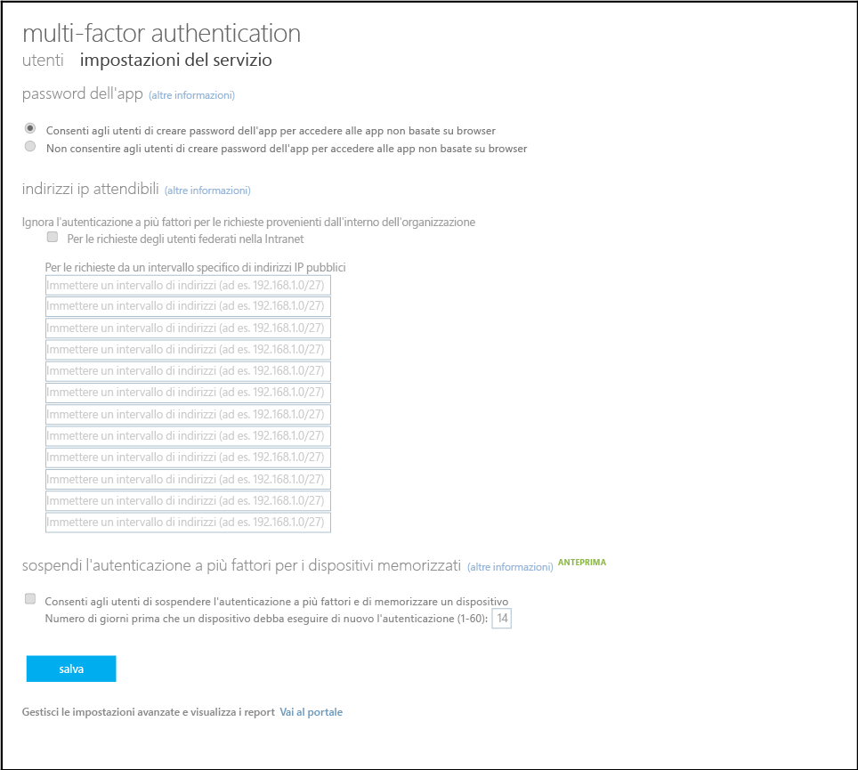

<properties 
	pageTitle="Integrazione delle identità locali con Azure Active Directory." 
	description="Articolo relativo ad Azure AD Connect che ne descrive le funzionalità e spiega perché è consigliabile usarlo." 
	services="multi-factor-authentication" 
	documentationCenter="" 
	authors="billmath" 
	manager="stevenpo" 
	editor="curtand"/>

<tags 
	ms.service="multi-factor-authentication" 
	ms.workload="identity" 
	ms.tgt_pltfrm="na" 
	ms.devlang="na" 
	ms.topic="article" 
	ms.date="07/21/2015" 
	ms.author="billmath"/>

# Compilazione di Multi-Factor Authentication in app personalizzate (SDK)

Il Software Development Kit (SDK) di Azure Multi-Factor Authentication consente di compilare la verifica di telefonata e SMS direttamente nei processi di accesso o di transazione delle applicazioni nel tenant di Azure AD.

L'SDK di Multi-Factor Authentication è disponibile per c#, Visual Basic (.NET), Java, Perl, PHP e Ruby. L'SDK fornisce un wrapper sottile per l'autenticazione a più fattori. Include tutto ciò che occorre per scrivere il codice, inclusi i file di codice sorgente commentati, i file di esempio e un file ReadMe dettagliato. Ogni SDK include anche un certificato e una chiave privata per crittografare le transazioni che è univoco per il Provider Multi-Factor Authentication. Fino a quando si dispone di un provider, è possibile scaricare l'SDK in tutti i formati e le lingue necessari.

La struttura delle API nell'SDK di Multi-Factor Authentication è piuttosto semplice. Si esegue una sola funzione di chiamata a un'API con i parametri di opzione a più fattori, ad esempio la modalità di verifica e dati utente, come il numero di telefono da chiamare o il numero PIN da convalidare. Le API convertono la chiamata di funzione in richieste di servizi web per il servizio Azure Multi-Factor Authentication. Tutte le chiamate devono includere un riferimento al certificato privato incluso in ogni SDK.

Poiché le API non hanno accesso agli utenti registrati in Azure Active Directory, è necessario fornire le informazioni sull'utente, quali numeri di telefono e codici PIN in un file o database. Inoltre, le API non forniscono funzionalità di gestione di registrazione o dell'utente, pertanto è necessario creare questi processi nell'applicazione.

## Scaricare il server Azure Multi-Factor Authentication 

Esistono due modi diversi per scaricare l'SDK di Azure Multi-Factor Authentication. Entrambi vengono eseguiti con il portale di Azure. Il primo prevede la gestione diretta del provider di Multi-Factor Authentication, il secondo l'uso delle impostazioni del servizio. La seconda opzione richiede un provider di Multi-Factor Authentication o una licenza Azure AD Premium.

### Per scaricare l'SDK di Azure Multi-Factor Authentication dal portale di Azure

1. Accedere al portale di Azure come amministratore.
2. A sinistra selezionare Active Directory.
3. Nella parte superiore della pagina Active Directory selezionare **Provider Multi-Factor Authentication**
4. Nella parte inferiore fare clic su **Gestisci**
5. Verrà aperta una nuova pagina. A sinistra, nella parte inferiore, fare clic su SDK.

! [Scarica] (. / media/multi-factor-authentication-sdk/download.png)

6. Selezionare la lingua desiderata e fare clic su uno dei collegamenti di download associato.
7. Salvare il download.

### Per scaricare l'SDK di Azure Multi-Factor Authentication con le impostazioni del servizio

1. Accedere al portale di Azure come amministratore.
2. A sinistra selezionare Active Directory.
3. Fare doppio clic sull'istanza di Azure AD.
4. Nella parte superiore fare clic su **Configura**
5. In Multi-Factor Authentication selezionare **Gestisci impostazioni del servizio** 
6. Nella parte inferiore della schermata della pagina Impostazioni servizio, fare clic su **Vai al portale**.
7. Verrà aperta una nuova pagina. A sinistra, nella parte inferiore, fare clic su SDK.
8. Selezionare la lingua desiderata e fare clic su uno dei collegamenti di download associato.
9. Salvare il download.

## Contenuto dell'SDK di Azure Multi-Factor Authentication
Nell'SDK sono disponibili i seguenti elementi:

- **README**. Viene illustrato come usare le API di Multi-Factor Authentication in un'applicazione nuova o esistente.
- **File di origine** per Multi-Factor Authentication
- **Certificato client** usato per comunicare con il servizio Multi-Factor Authentication
- **Chiave privata** per il certificato
- **Risultati delle chiamate.** Un elenco di codici risultato chiamata. Per aprire questo file, usare un'applicazione con formattazione del testo, come ad esempio WordPad. Usare i codici risultato chiamata per verificare e risolvere l'implementazione di autenticazione Multi-Factor Authentication nell'applicazione. Non sono codici di stato di autenticazione.
- **Esempi.** Codice di esempio per un'implementazione di base funzionante di Multi-Factor Authentication.

>[AZURE.WARNING]Il certificato client è un certificato privato univoco generato per un utente specifico. Non condividere o perdere questo file. È la chiave per garantire la sicurezza delle comunicazioni con il servizio di autenticazione Multi-Factor Authentication.

## Nell'esempio di codice: Verifica telefonica tramite modalità Standard

Questo esempio di codice illustra come usare le API nell'SDK di Azure Multi-Factor Authentication per aggiungere all'applicazione una verifica tramite chiamata vocale in modalità standard. La modalità standard è una telefonata a cui l'utente risponde premendo il tasto #.

Questo esempio usa L'SDK di Multi-Factor Authentication C# .NET 2.0 in un'applicazione ASP.NET con logica sul lato server C#, ma il processo è molto simile per implementazioni semplici in altri linguaggi. Poiché l'SDK include file di origine, file non eseguibili, è possibile compilare i file e farvi riferimento o includerli direttamente nell'applicazione.

>[AZURE.NOTE]Quando si implementa Multi-Factor Authentication, usare i fattori aggiuntivi come verifica secondaria o terziaria per integrare il metodo di autenticazione principale. Questi metodi non sono progettati per essere usati come metodi di autenticazione principale.

### Panoramica dell'esempio di codice
Questo codice di esempio per un'applicazione demo Web molto semplice usa una chiamata con risposta mediante il tasto # per completare l'autenticazione dell'utente. Questo fattore telefonata è noto in Multi-Factor Authentication come modalità standard.

Il codice sul lato client non include elementi specifici di autenticazione Multi-Factor Authentication. Poiché i fattori di autenticazione aggiuntivi sono indipendenti dall'autenticazione principale, è possibile aggiungerli senza modificare l'interfaccia di accesso esistente. Le API negli SDK di Multi-Factor consentono di personalizzare l'esperienza dell'utente, ma potrebbe non essere necessario apportare alcuna modifica.

Il codice lato server aggiunge l'autenticazione in modalità standard nel passaggio 2. Crea un oggetto PfAuthParams con i parametri necessari per la verifica della modalità standard: nome utente, numero, modalità e il percorso verso il certificato del client (CertFilePath), che è necessario in ogni chiamata. Per una dimostrazione di tutti i parametri in PfAuthParams, vedere il file di esempio nel SDK.

Successivamente, il codice passa l'oggetto PfAuthParams alla funzione pf\_authenticate(). Il valore restituito indica l'esito positivo o negativo dell'autenticazione. I parametri out, callStatus ed errorID, contengono informazioni aggiuntive sul risultato della chiamata. I codici di risultato della chiamata sono documentati nel file dei risultati della chiamata nel SDK.

Questa implementazione minima può essere scritta in solo poche righe. Nel codice di produzione, tuttavia, è necessario includere la gestione degli errori più sofisticati, il codice di database aggiuntivo e un'esperienza utente avanzata.

### Codice client web

Di seguito è riportato il codice di client web per una pagina demo.

	
	<%@ Page Language="C#" AutoEventWireup="true" CodeFile="Default.aspx.cs" Inherits="_Default" %>
	
	<!DOCTYPE html>
	
	<html xmlns="http://www.w3.org/1999/xhtml">
	<head runat="server">
	<title>Multi-Factor Authentication Demo</title>
	</head>
	<body>
	<h1>Azure Multi-Factor Authentication Demo</h1>
	<form id="form1" runat="server">
	
	

	Username:&nbsp; 
	Password:&nbsp; 
	

	
	<div">
	<asp:TextBox id="username" runat="server" width="100px"/> 
	<asp:Textbox id="password" runat="server" width="100px" TextMode="password" /> 
	

	
	<asp:Button id="btnSubmit" runat="server" Text="Log in" onClick="btnSubmit_Click"/>
	
	
<asp:Label ID="lblResult" runat="server"></asp:Label>

	
	</form>
	</body>
	</html>

### Codice lato server

Nel seguente codice lato server, la Multi-Factor Authentication è configurata ed eseguita nel passaggio 2. La modalità standard (MODE\_STANDARD) è una telefonata a cui l'utente risponde premendo il tasto #.

	using System;
	using System.Collections.Generic;
	using System.Linq;
	using System.Web;
	using System.Web.UI;
	using System.Web.UI.WebControls;
	
	public partial class _Default : System.Web.UI.Page
	{
	    protected void Page_Load(object sender, EventArgs e)
	    {
	    }
	
	    protected void btnSubmit_Click(object sender, EventArgs e)
	    {
	        // Step 1: Validate the username and password
	        if (username.Text != "Contoso" || password.Text != "password")
	        {
	            lblResult.ForeColor = System.Drawing.Color.Red;
	            lblResult.Text = "Username or password incorrect.";
	        }
	        else
	        {
	            // Step 2: Perform multi-factor authentication
	
	            // Add call details from the user database.
	            PfAuthParams pfAuthParams = new PfAuthParams();
	            pfAuthParams.Username = username.Text;
	            pfAuthParams.Phone = "9134884271";
	            pfAuthParams.Mode = pf_auth.MODE_STANDARD;
	            
	            // Specify a client certificate 
	            // NOTE: This file contains the private key for the client
	            // certificate. It must be stored with appropriate file 
	            // permissions.
	            pfAuthParams.CertFilePath = "c:\\cert_key.p12";
	
	            // Perform phone-based authentication
	            int callStatus;
	            int errorId;
	
	            if(pf_auth.pf_authenticate(pfAuthParams, out callStatus, out errorId))
	            {
	                lblResult.ForeColor = System.Drawing.Color.Green;
	                lblResult.Text = "Multi-Factor Authentication succeeded.";
	            }
	            else
	            {
	                lblResult.ForeColor = System.Drawing.Color.Red;
	                lblResult.Text = " Multi-Factor Authentication failed.";
	            }
	        }
	
	    }
	}

<!---HONumber=August15_HO6-->