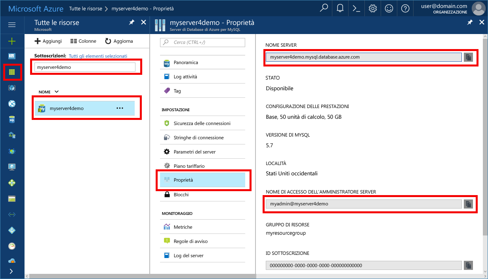

# <a name="azure-database-for-mysql-use-connectorc-to-connect-and-query-data"></a>Database di Azure per MySQL: usare Connector/C++ per connettersi ed eseguire query sui dati
Questa guida introduttiva illustra come connettersi a un database di Azure per MySQL usando un'applicazione C++. Spiega come usare le istruzioni SQL per eseguire query, inserire, aggiornare ed eliminare dati nel database. Le procedure descritte in questo articolo presuppongono che si abbia familiarità con lo sviluppo con C++, ma non con Database di Azure per MySQL.

## <a name="prerequisites"></a>Prerequisiti
Questa guida introduttiva usa le risorse create in una delle guide seguenti come punto di partenza:
- [Creare un database di Azure per il server MySQL tramite il portale di Azure](./quickstart-create-mysql-server-database-using-azure-portal.md)
- [Creare un database di Azure per il server MySQL tramite l'interfaccia della riga di comando di Azure](./quickstart-create-mysql-server-database-using-azure-cli.md)

È anche necessario:
- Installare [.NET Framework](https://www.microsoft.com/net/download)
- Installare [Visual Studio](https://www.visualstudio.com/downloads/)
- Installare [MySQL Connector/C++](https://dev.mysql.com/downloads/connector/cpp/) 
- Installare [Boost](http://www.boost.org/)

## <a name="install-visual-studio-and-net"></a>Installare Visual Studio e .NET
La procedura descritta in questa sezione presuppone che si abbia familiarità con lo sviluppo con .NET.

### <a name="windows"></a>**Windows**
1. Installare Visual Studio 2017 Community, che è un IDE gratuito, con funzionalità complete ed estendibile per creare applicazioni moderne per Android, iOS, Windows, oltre ad applicazioni Web e database e servizi cloud. È possibile installare la versione completa di .NET Framework o solamente .NET Core. I frammenti di codice nella guida introduttiva sono compatibili con entrambe le versioni. Se Visual Studio è già installato nel computer, ignorare i due passaggi successivi.
   - Scaricare il [programma di installazione di Visual Studio 2017](https://www.visualstudio.com/thank-you-downloading-visual-studio/?sku=Community&rel=15). 
   - Eseguire il programma di installazione e seguire le richieste di installazione per completare l'operazione.

### <a name="configure-visual-studio"></a>**Configurare Visual Studio**
1. Da Visual Studio, Proprietà progetto > Proprietà di configurazione > C/C++ > Linker > Generale > Directory librerie aggiuntive, aggiungere la directory lib\opt (ad esempio: C:\Programmi (x86)\MySQL\MySQL Connector C++ 1.1.9\lib\opt) del connettore C++.
2. Da Visual Studio, Proprietà progetto > Proprietà di configurazione > C/C++ > Generale > Directory di inclusione aggiuntive
   - Aggiungere la directory include/ del connettore C++ (ad esempio: C:\Programmi (x86)\MySQL\MySQL Connector C++ 1.1.9\include\)
   - Aggiungere la directory radice della libreria Boost (ad esempio: C:\boost_1_64_0\)
3. Da Visual Studio, Proprietà progetto > Proprietà di configurazione > C/C++ > Linker > Input > Dipendenze aggiuntive, aggiungere mysqlcppconn.lib nel campo di testo
4. Copiare mysqlcppconn.dll dalla cartella della libreria del connettore C++ del passaggio 3 alla stessa directory del file eseguibile dell'applicazione oppure aggiungerlo alla variabile di ambiente in modo che l'applicazione possa trovarlo.

## <a name="get-connection-information"></a>Ottenere informazioni di connessione
Ottenere le informazioni di connessione necessarie per connettersi al database di Azure per MySQL. Sono necessari il nome del server completo e le credenziali di accesso.

1. Accedere al [Portale di Azure](https://portal.azure.com/).
2. Nel menu a sinistra nel portale di Azure fare clic su **Tutte le risorse** e cercare il server creato, ad esempio **myserver4demo**.
3. Fare clic sul nome del server.
4. Selezionare la pagina **Proprietà** del server. Annotare il **Nome server** e il **nome di accesso dell'amministratore del server**.
 
5. Se si dimenticano le informazioni di accesso per il server, passare alla pagina **Panoramica** per visualizzare il nome di accesso dell'amministratore del server e, se necessario, reimpostare la password.

## <a name="connect-create-table-and-insert-data"></a>Connettersi, creare tabelle e inserire dati
Usare il codice seguente per connettersi e caricare i dati usando le istruzioni SQL **CREATE TABLE** e **INSERT INTO**. Il codice usa la classe sql::Driver con il metodo connect() per stabilire una connessione a MySQL. Il codice usa quindi il metodo createStatement() e il metodo execute() per eseguire i comandi di database. 

Sostituire i parametri Host, DBName, User e Password con i valori specificati al momento della creazione del server e del database. 

```c++
#include <stdlib.h>
#include <iostream>
#include "stdafx.h"

#include "mysql_connection.h"
#include <cppconn/driver.h>
#include <cppconn/exception.h>
#include <cppconn/prepared_statement.h>
using namespace std;

int main()
{
    sql::Driver *driver;
    sql::Connection *con;
    sql::Statement *stmt;
    sql::PreparedStatement *pstmt;

    try
    {
        driver = get_driver_instance();
        //for demonstration only. never save password in the code!
        con = driver>connect("tcp://myserver4demo.mysql.database.azure.com:3306/quickstartdb", "myadmin@myserver4demo", "server_admin_password");
    }
    catch (sql::SQLException e)
    {
        cout << "Could not connect to database. Error message: " << e.what() << endl;
        system("pause");
        exit(1);
    }

    stmt = con>createStatement();
    stmt>execute("DROP TABLE IF EXISTS inventory");
    cout << "Finished dropping table (if existed)" << endl;
    stmt>execute("CREATE TABLE inventory (id serial PRIMARY KEY, name VARCHAR(50), quantity INTEGER);");
    cout << "Finished creating table" << endl;
    delete stmt;

    pstmt = con>prepareStatement("INSERT INTO inventory(name, quantity) VALUES(?,?)");
    pstmt>setString(1, "banana");
    pstmt>setInt(2, 150);
    pstmt>execute();
    cout << "One row inserted." << endl;

    pstmt>setString(1, "orange");
    pstmt>setInt(2, 154);
    pstmt>execute();
    cout << "One row inserted." << endl;

    pstmt>setString(1, "apple");
    pstmt>setInt(2, 100);
    pstmt>execute();
    cout << "One row inserted." << endl;
    
    delete pstmt;   
    delete con;
    system("pause");
    return 0;

```

## <a name="read-data"></a>Leggere i dati

Usare il codice seguente per connettersi e leggere i dati usando un'istruzione SQL **SELECT**. Il codice usa la classe sql::Driver con il metodo connect() per stabilire una connessione a MySQL. Il codice usa quindi il metodo prepareStatement() e il metodo executeQuery() per eseguire i comandi di selezione. Il codice usa infine next() per passare ai record nei risultati. Il codice usa quindi getInt() e getString() per analizzare i valori nel record.

Sostituire i parametri Host, DBName, User e Password con i valori specificati al momento della creazione del server e del database. 

```csharp
#include <stdlib.h>
#include <iostream>
#include "stdafx.h"

#include "mysql_connection.h"
#include <cppconn/driver.h>
#include <cppconn/exception.h>
#include <cppconn/resultset.h>
#include <cppconn/prepared_statement.h>
using namespace std;

int main()
{
    sql::Driver *driver;
    sql::Connection *con;
    sql::PreparedStatement *pstmt;
    sql::ResultSet *result;

    try
    {
        driver = get_driver_instance();
        //for demonstration only. never save password in the code!
        con = driver>connect("tcp://myserver4demo.mysql.database.azure.com:3306/quickstartdb", "myadmin@myserver4demo", "server_admin_password");
    }
    catch (sql::SQLException e)
    {
        cout << "Could not connect to database. Error message: " << e.what() << endl;
        system("pause");
        exit(1);
    }   

//  select  
    pstmt = con>prepareStatement("SELECT * FROM inventory;");
    result = pstmt>executeQuery();  
    
    while (result>next())
        printf("Reading from table=(%d, %s, %d)\n", result>getInt(1), result>getString(2).c_str(), result>getInt(3));   
    
    delete result;
    delete pstmt;   
    delete con;
    system("pause");
    return 0;
}
```

## <a name="update-data"></a>Aggiornare i dati
Usare il codice seguente per connettersi e leggere i dati usando un'istruzione SQL **UPDATE**. Il codice usa la classe sql::Driver con il metodo connect() per stabilire una connessione a MySQL. Il codice usa quindi il metodo prepareStatement() e il metodo executeQuery() per eseguire i comandi di aggiornamento. 

Sostituire i parametri Host, DBName, User e Password con i valori specificati al momento della creazione del server e del database. 

```csharp
#include <stdlib.h>
#include <iostream>
#include "stdafx.h"

#include "mysql_connection.h"
#include <cppconn/driver.h>
#include <cppconn/exception.h>
#include <cppconn/prepared_statement.h>
using namespace std;

int main()
{
    sql::Driver *driver;
    sql::Connection *con;
    sql::PreparedStatement *pstmt;

    try
    {
        driver = get_driver_instance();
        //for demonstration only. never save password in the code!
        con = driver>connect("tcp://myserver4demo.mysql.database.azure.com:3306/quickstartdb", "myadmin@myserver4demo", "server_admin_password");
    }
    catch (sql::SQLException e)
    {
        cout << "Could not connect to database. Error message: " << e.what() << endl;
        system("pause");
        exit(1);
    }   

    //update
    pstmt = con>prepareStatement("UPDATE inventory SET quantity = ? WHERE name = ?");
    pstmt>setInt(1, 200);
    pstmt>setString(2, "banana");
    pstmt>executeQuery();
    printf("Row updated\n");
    
    delete con;
    delete pstmt;
    system("pause");
    return 0;
}
```


## <a name="delete-data"></a>Eliminare i dati
Usare il codice seguente per connettersi e leggere i dati usando un'istruzione SQL **DELETE**. Il codice usa la classe sql::Driver con il metodo connect() per stabilire una connessione a MySQL. Il codice usa quindi il metodo prepareStatement() e il metodo executeQuery() per eseguire i comandi di eliminazione.

Sostituire i parametri Host, DBName, User e Password con i valori specificati al momento della creazione del server e del database. 

```csharp
#include <stdlib.h>
#include <iostream>
#include "stdafx.h"

#include "mysql_connection.h"
#include <cppconn/driver.h>
#include <cppconn/exception.h>
#include <cppconn/resultset.h>
#include <cppconn/prepared_statement.h>
using namespace std;

int main()
{
    sql::Driver *driver;
    sql::Connection *con;
    sql::PreparedStatement *pstmt;
    sql::ResultSet *result;

    try
    {
        driver = get_driver_instance();
        //for demonstration only. never save password in the code!
        con = driver>connect("tcp://myserver4demo.mysql.database.azure.com:3306/quickstartdb", "myadmin@myserver4demo", "server_admin_password");
    }
    catch (sql::SQLException e)
    {
        cout << "Could not connect to database. Error message: " << e.what() << endl;
        system("pause");
        exit(1);
    }
        
    //delete
    pstmt = con>prepareStatement("DELETE FROM inventory WHERE name = ?");
    pstmt>setString(1, "orange");
    result = pstmt>executeQuery();
    printf("Row deleted\n");    
    
    delete pstmt;
    delete con;
    delete result;
    system("pause");
    return 0;
}
```

## <a name="next-steps"></a>Passaggi successivi
> [!div class="nextstepaction"]
> [Eseguire la migrazione del database MySQL a Database di Azure per MySQL usando dump e ripristino](concepts-migrate-dump-restore.md)

