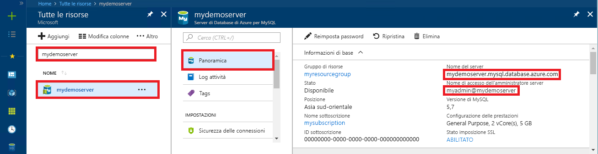

# <a name="azure-database-for-mysql-use-net-c-to-connect-and-query-data"></a>Database di Azure per MySQL: usare .NET (C#) per connettersi ed eseguire query sui dati
Questa guida introduttiva illustra come connettersi a un database di Azure per MySQL usando un'applicazione C#. Spiega come usare le istruzioni SQL per eseguire query, inserire, aggiornare ed eliminare dati nel database. Questo argomento presuppone che si abbia familiarità con lo sviluppo con C#, ma non con Database di Azure per MySQL.

## <a name="prerequisites"></a>prerequisiti
Questa guida introduttiva usa le risorse create in una delle guide seguenti come punto di partenza:
- [Create an Azure Database for MySQL server using Azure portal](./quickstart-create-mysql-server-database-using-azure-portal.md) (Creare un database di Azure per il server MySQL usando il portale di Azure)
- [Creare un database di Azure per il server MySQL tramite l'interfaccia della riga di comando di Azure](./quickstart-create-mysql-server-database-using-azure-cli.md)

È anche necessario:
- Installare [.NET](https://www.microsoft.com/net/download). Seguire la procedura descritta nell'articolo collegato per installare .NET per la specifica piattaforma in uso (Windows, Ubuntu Linux o macOS). 
- [Installare Visual Studio](https://www.visualstudio.com/downloads/).

## <a name="create-a-c-project"></a>Creare un progetto C#
Al prompt dei comandi eseguire:

```
mkdir AzureMySqlExample
cd AzureMySqlExample
dotnet new console
dotnet add package MySqlConnector
```

## <a name="get-connection-information"></a>Ottenere informazioni di connessione
Ottenere le informazioni di connessione necessarie per connettersi al database di Azure per MySQL. Sono necessari il nome del server completo e le credenziali di accesso.

1. Accedere al [Portale di Azure](https://portal.azure.com/).
2. Nel menu a sinistra nel portale di Azure fare clic su **Tutte le risorse** e quindi cercare il server creato, ad esempio **mydemoserver**.
3. Fare clic sul nome del server.
4. Nel pannello **Panoramica** del server prendere nota dei valori riportati in **Nome server** e **Nome di accesso dell'amministratore server**. Se si dimentica la password, in questo pannello è anche possibile reimpostarla.
 

## <a name="connect-create-table-and-insert-data"></a>Connettersi, creare tabelle e inserire dati
Usare il codice seguente per connettersi e caricare i dati usando le istruzioni SQL `CREATE TABLE` e `INSERT INTO`. Il codice usa la classe `MySqlConnection` con il metodo [OpenAsync()](https://docs.microsoft.com/en-us/dotnet/api/system.data.common.dbconnection.openasync#System_Data_Common_DbConnection_OpenAsync) per stabilire una connessione a MySQL. Il codice usa quindi il metodo [CreateCommand()](https://docs.microsoft.com/en-us/dotnet/api/system.data.common.dbconnection.createcommand), imposta la proprietà CommandText e chiama il metodo [ExecuteNonQueryAsync()](https://docs.microsoft.com/en-us/dotnet/api/system.data.common.dbcommand.executenonqueryasync) per eseguire i comandi di database. 

Sostituire i parametri `Server`, `Database`, `UserID` e `Password` con i valori specificati al momento della creazione del server e del database. 

```csharp
using System;
using System.Threading.Tasks;
using MySql.Data.MySqlClient;

namespace AzureMySqlExample
{
    class MySqlCreate
    {
        static async Task Main(string[] args)
        {
            var builder = new MySqlConnectionStringBuilder
            {
                Server = "YOUR-SERVER.mysql.database.azure.com",
                Database = "YOUR-DATABASE",
                UserID = "USER@YOUR-SERVER",
                Password = "PASSWORD",
                SslMode = MySqlSslMode.Required,
            };

            using (var conn = new MySqlConnection(builder.ConnectionString))
            {
                Console.WriteLine("Opening connection");
                await conn.OpenAsync();

                using (var command = conn.CreateCommand())
                {
                    command.CommandText = "DROP TABLE IF EXISTS inventory;";
                    await command.ExecuteNonQueryAsync();
                    Console.WriteLine("Finished dropping table (if existed)");

                    command.CommandText = "CREATE TABLE inventory (id serial PRIMARY KEY, name VARCHAR(50), quantity INTEGER);";
                    await command.ExecuteNonQueryAsync();
                    Console.WriteLine("Finished creating table");

                    command.CommandText = @"INSERT INTO inventory (name, quantity) VALUES (@name1, @quantity1),
                        (@name2, @quantity2), (@name3, @quantity3);";
                    command.Parameters.AddWithValue("@name1", "banana");
                    command.Parameters.AddWithValue("@quantity1", 150);
                    command.Parameters.AddWithValue("@name2", "orange");
                    command.Parameters.AddWithValue("@quantity2", 154);
                    command.Parameters.AddWithValue("@name3", "apple");
                    command.Parameters.AddWithValue("@quantity3", 100);

                    int rowCount = await command.ExecuteNonQueryAsync();
                    Console.WriteLine(String.Format("Number of rows inserted={0}", rowCount));
                }

                // connection will be closed by the 'using' block
                Console.WriteLine("Closing connection");
            }

            Console.WriteLine("Press RETURN to exit");
            Console.ReadLine();
        }
    }
}
```

## <a name="read-data"></a>Leggere i dati

Usare il codice seguente per connettersi e leggere i dati usando un'istruzione SQL `SELECT`. Il codice usa la classe `MySqlConnection` con il metodo [OpenAsync()](https://docs.microsoft.com/en-us/dotnet/api/system.data.common.dbconnection.openasync#System_Data_Common_DbConnection_OpenAsync) per stabilire una connessione a MySQL. Usa quindi i metodi [CreateCommand()](https://docs.microsoft.com/en-us/dotnet/api/system.data.common.dbconnection.createcommand) ed [ExecuteReaderAsync()](https://docs.microsoft.com/en-us/dotnet/api/system.data.common.dbcommand.executereaderasync) per eseguire i comandi di database e successivamente [ReadAsync()](https://docs.microsoft.com/en-us/dotnet/api/system.data.common.dbdatareader.readasync#System_Data_Common_DbDataReader_ReadAsync) per passare ai record nei risultati. Il codice usa quindi GetInt32 e GetString per analizzare i valori nel record.

Sostituire i parametri `Server`, `Database`, `UserID` e `Password` con i valori specificati al momento della creazione del server e del database. 

```csharp
using System;
using System.Threading.Tasks;
using MySql.Data.MySqlClient;

namespace AzureMySqlExample
{
    class MySqlRead
    {
        static async Task Main(string[] args)
        {
            var builder = new MySqlConnectionStringBuilder
            {
                Server = "YOUR-SERVER.mysql.database.azure.com",
                Database = "YOUR-DATABASE",
                UserID = "USER@YOUR-SERVER",
                Password = "PASSWORD",
                SslMode = MySqlSslMode.Required,
            };

            using (var conn = new MySqlConnection(builder.ConnectionString))
            {
                Console.WriteLine("Opening connection");
                await conn.OpenAsync();

                using (var command = conn.CreateCommand())
                {
                    command.CommandText = "SELECT * FROM inventory;";

                    using (var reader = await command.ExecuteReaderAsync())
                    {
                        while (await reader.ReadAsync())
                        {
                            Console.WriteLine(string.Format(
                                "Reading from table=({0}, {1}, {2})",
                                reader.GetInt32(0),
                                reader.GetString(1),
                                reader.GetInt32(2)));
                        }
                    }
                }

                Console.WriteLine("Closing connection");
            }

            Console.WriteLine("Press RETURN to exit");
            Console.ReadLine();
        }
    }
}
```

## <a name="update-data"></a>Aggiornare i dati
Usare il codice seguente per connettersi e leggere i dati usando un'istruzione SQL `UPDATE`. Il codice usa la classe `MySqlConnection` con il metodo [OpenAsync()](https://docs.microsoft.com/en-us/dotnet/api/system.data.common.dbconnection.openasync#System_Data_Common_DbConnection_OpenAsync) per stabilire una connessione a MySQL. Il codice usa quindi il metodo [CreateCommand()](https://docs.microsoft.com/en-us/dotnet/api/system.data.common.dbconnection.createcommand), imposta la proprietà CommandText e chiama il metodo [ExecuteNonQueryAsync()](https://docs.microsoft.com/en-us/dotnet/api/system.data.common.dbcommand.executenonqueryasync) per eseguire i comandi di database. 

Sostituire i parametri `Server`, `Database`, `UserID` e `Password` con i valori specificati al momento della creazione del server e del database. 

```csharp
using System;
using System.Threading.Tasks;
using MySql.Data.MySqlClient;

namespace AzureMySqlExample
{
    class MySqlUpdate
    {
        static async Task Main(string[] args)
        {
            var builder = new MySqlConnectionStringBuilder
            {
                Server = "YOUR-SERVER.mysql.database.azure.com",
                Database = "YOUR-DATABASE",
                UserID = "USER@YOUR-SERVER",
                Password = "PASSWORD",
                SslMode = MySqlSslMode.Required,
            };

            using (var conn = new MySqlConnection(builder.ConnectionString))
            {
                Console.WriteLine("Opening connection");
                await conn.OpenAsync();

                using (var command = conn.CreateCommand())
                {
                    command.CommandText = "UPDATE inventory SET quantity = @quantity WHERE name = @name;";
                    command.Parameters.AddWithValue("@quantity", 200);
                    command.Parameters.AddWithValue("@name", "banana");

                    int rowCount = await command.ExecuteNonQueryAsync();
                    Console.WriteLine(String.Format("Number of rows updated={0}", rowCount));
                }

                Console.WriteLine("Closing connection");
            }

            Console.WriteLine("Press RETURN to exit");
            Console.ReadLine();
        }
    }
}
```

## <a name="delete-data"></a>Eliminare i dati
Usare il codice seguente per connettersi ed eliminare i dati usando un'istruzione SQL `DELETE`. 

Il codice usa la classe `MySqlConnection` con il metodo [OpenAsync()](https://docs.microsoft.com/en-us/dotnet/api/system.data.common.dbconnection.openasync#System_Data_Common_DbConnection_OpenAsync) per stabilire una connessione a MySQL. Il codice usa quindi il metodo [CreateCommand()](https://docs.microsoft.com/en-us/dotnet/api/system.data.common.dbconnection.createcommand), imposta la proprietà CommandText e chiama il metodo [ExecuteNonQueryAsync()](https://docs.microsoft.com/en-us/dotnet/api/system.data.common.dbcommand.executenonqueryasync) per eseguire i comandi di database. 

Sostituire i parametri `Server`, `Database`, `UserID` e `Password` con i valori specificati al momento della creazione del server e del database. 

```csharp
using System;
using System.Threading.Tasks;
using MySql.Data.MySqlClient;

namespace AzureMySqlExample
{
    class MySqlDelete
    {
        static async Task Main(string[] args)
        {
            var builder = new MySqlConnectionStringBuilder
            {
                Server = "YOUR-SERVER.mysql.database.azure.com",
                Database = "YOUR-DATABASE",
                UserID = "USER@YOUR-SERVER",
                Password = "PASSWORD",
                SslMode = MySqlSslMode.Required,
            };

            using (var conn = new MySqlConnection(builder.ConnectionString))
            {
                Console.WriteLine("Opening connection");
                await conn.OpenAsync();

                using (var command = conn.CreateCommand())
                {
                    command.CommandText = "DELETE FROM inventory WHERE name = @name;";
                    command.Parameters.AddWithValue("@name", "orange");

                    int rowCount = await command.ExecuteNonQueryAsync();
                    Console.WriteLine(String.Format("Number of rows deleted={0}", rowCount));
                }

                Console.WriteLine("Closing connection");
            }

            Console.WriteLine("Press RETURN to exit");
            Console.ReadLine();
        }
    }
}
```

## <a name="next-steps"></a>Passaggi successivi
> [!div class="nextstepaction"]
> [Eseguire la migrazione del database MySQL a Database di Azure per MySQL usando dump e ripristino](concepts-migrate-dump-restore.md)
