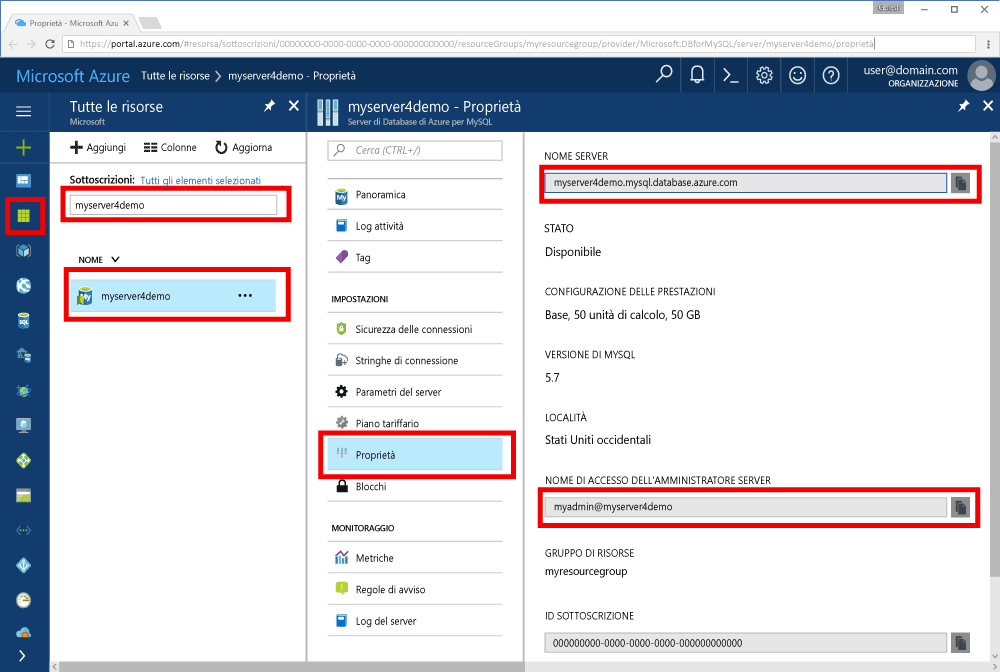

# <a name="azure-database-for-mysql-use-go-language-to-connect-and-query-data"></a>Database di Azure per MySQL: usare il linguaggio Go per connettersi ai dati ed eseguire query
Questa guida introduttiva illustra come connettersi a un database di Azure per MySQL usando codice scritto nel linguaggio [Go](https://golang.org/) dalle piattaforme Windows, Ubuntu Linux e Apple macOS. Spiega come usare le istruzioni SQL per eseguire query, inserire, aggiornare ed eliminare dati nel database. Questo articolo presuppone che si abbia familiarità con lo sviluppo con Go, ma non con Database di Azure per MySQL.

## <a name="prerequisites"></a>Prerequisiti
Questa guida introduttiva usa le risorse create in una delle guide seguenti come punto di partenza:
- [Creare un database di Azure per il server MySQL tramite il portale di Azure](./quickstart-create-mysql-server-database-using-azure-portal.md)
- [Create an Azure Database for MySQL server using Azure CLI](./quickstart-create-mysql-server-database-using-azure-cli.md) (Creare un database di Azure per il server MySQL usando l'interfaccia della riga di comando di Azure)

## <a name="install-go-and-mysql-connector"></a>Installare Go e il connettore MySQL
Installare [Go](https://golang.org/doc/install) e il [driver go-sql per MySQL](https://github.com/go-sql-driver/mysql#installation) nel computer. A seconda della piattaforma, seguire questa procedura:

### <a name="windows"></a>Windows
1. [Scaricare](https://golang.org/dl/) e installare Go per Microsoft Windows seguendo le [istruzioni di installazione](https://golang.org/doc/install).
2. Avviare il prompt dei comandi dal menu Start.
3. Creare una cartella per il progetto, ad esempio `mkdir  %USERPROFILE%\go\src\mysqlgo`.
4. Passare alla cartella del progetto, ad esempio `cd %USERPROFILE%\go\src\mysqlgo`.
5. Impostare la variabile di ambiente per GOPATH in modo che punti alla directory del codice sorgente. `set GOPATH=%USERPROFILE%\go`.
6. Installare il [driver go-sql per MySQL](https://github.com/go-sql-driver/mysql#installation) eseguendo il comando `go get github.com/go-sql-driver/mysql`.

   ```cmd
   mkdir  %USERPROFILE%\go\src\mysqlgo
   cd %USERPROFILE%\go\src\mysqlgo
   set GOPATH=%USERPROFILE%\go
   go get github.com/go-sql-driver/mysql
   ```

### <a name="linux-ubuntu"></a>Linux (Ubuntu)
1. Avviare la shell Bash. 
2. Installare Go eseguendo `sudo apt-get install golang-go`.
3. Creare una cartella per il progetto nella home directory, ad esempio `mkdir -p ~/go/src/mysqlgo/`.
4. Passare alla cartella, ad esempio `cd ~/go/src/mysqlgo/`.
5. Impostare la variabile di ambiente GOPATH in modo che punti a una directory di origine valida, ad esempio la cartella go della home directory corrente. Nella shell Bash eseguire `export GOPATH=~/go` per aggiungere la directory go come GOPATH per la sessione shell corrente.
6. Installare il [driver go-sql per MySQL](https://github.com/go-sql-driver/mysql#installation) eseguendo il comando `go get github.com/go-sql-driver/mysql`.

   ```bash
   sudo apt-get install golang-go
   mkdir -p ~/go/src/mysqlgo/
   cd ~/go/src/mysqlgo/
   export GOPATH=~/go/
   go get github.com/go-sql-driver/mysql
   ```

### <a name="apple-macos"></a>Apple macOS
1. Scaricare e installare Go seguendo le [istruzioni di installazione](https://golang.org/doc/install) per la piattaforma in uso. 
2. Avviare la shell Bash. 
3. Creare una cartella per il progetto nella home directory, ad esempio `mkdir -p ~/go/src/mysqlgo/`.
4. Passare alla cartella, ad esempio `cd ~/go/src/mysqlgo/`.
5. Impostare la variabile di ambiente GOPATH in modo che punti a una directory di origine valida, ad esempio la cartella go della home directory corrente. Nella shell Bash eseguire `export GOPATH=~/go` per aggiungere la directory go come GOPATH per la sessione shell corrente.
6. Installare il [driver go-sql per MySQL](https://github.com/go-sql-driver/mysql#installation) eseguendo il comando `go get github.com/go-sql-driver/mysql`.

   ```bash
   mkdir -p ~/go/src/mysqlgo/
   cd ~/go/src/mysqlgo/
   export GOPATH=~/go/
   go get github.com/go-sql-driver/mysql
   ```


## <a name="get-connection-information"></a>Ottenere informazioni di connessione
Ottenere le informazioni di connessione necessarie per connettersi al database di Azure per MySQL. Sono necessari il nome del server completo e le credenziali di accesso.

1. Accedere al [Portale di Azure](https://portal.azure.com/).
2. Nel menu a sinistra nel portale di Azure fare clic su **Tutte le risorse** e cercare il server creato, ad esempio **myserver4demo**.
3. Fare clic sul nome server **myserver4demo**.
4. Selezionare la pagina **Proprietà** del server. Annotare il **Nome server** e il **nome di accesso dell'amministratore del server**.
 
5. Se si dimenticano le informazioni di accesso per il server, passare alla pagina **Panoramica** per visualizzare il nome di accesso dell'amministratore del server e, se necessario, reimpostare la password.
   

## <a name="build-and-run-go-code"></a>Compilare ed eseguire il codice Go 
1. Incollare nei file di testo il codice Go riportato nelle sezioni seguenti, quindi salvare i file nella cartella del progetto con l'estensione go, ad esempio il percorso di Windows `%USERPROFILE%\go\src\mysqlgo\createtable.go` o il percorso di Linux `~/go/src/mysqlgo/createtable.go`.
2. Avviare il prompt dei comandi o la shell Bash. Passare alla cartella del progetto, ad esempio `cd %USERPROFILE%\go\src\mysqlgo\` in Windows. In Linux `cd ~/go/src/mysqlgo/`.
3. Eseguire il codice digitando il comando `go run createtable.go` per compilare l'applicazione ed eseguirla.
4. In alternativa, per compilare il codice in un'applicazione nativa, digitare `go build createtable.go` e quindi avviare `createtable.exe` per eseguire l'applicazione.

## <a name="connect-create-table-and-insert-data"></a>Connettersi, creare tabelle e inserire dati
Usare il codice seguente per connettersi al server, creare una tabella e caricare i dati usando un'istruzione SQL **INSERT**. 

Il codice importa tre pacchetti: il [pacchetto SQL](https://golang.org/pkg/database/sql/), il [driver go sql per MySql](https://github.com/go-sql-driver/mysql#installation) come driver per comunicare con il database di Azure per MySQL e il [pacchetto fmt](https://golang.org/pkg/fmt/) per l'input e l'output stampati nella riga di comando.

Il codice chiama il metodo [sql.Open()](http://go-database-sql.org/accessing.html) per la connessione al database di Azure per MySQL e controlla la connessione usando il metodo [db.Ping()](https://golang.org/pkg/database/sql/#DB.Ping). Viene usato un [handle di database](https://golang.org/pkg/database/sql/#DB), contenente il pool di connessioni per il server di database. Il codice chiama il metodo [Exec()](https://golang.org/pkg/database/sql/#DB.Exec) più volte per eseguire diversi comandi DDL. Il codice usa anche [Prepare()](http://go-database-sql.org/prepared.html) ed Exec() per eseguire le istruzioni preparate con parametri diversi per inserire tre righe. Ogni volta viene usato un metodo checkError() personalizzato per controllare se si è verificato un errore e un metodo panic per uscire.

Sostituire le costanti `host`, `database`, `user` e `password` con i propri valori. 

```Go
package main

import (
    "database/sql"
    "fmt"

    _ "github.com/go-sql-driver/mysql"
)

const (
    host     = "myserver4demo.mysql.database.azure.com"
    database = "quickstartdb"
    user     = "myadmin@myserver4demo"
    password = "yourpassword"
)

func checkError(err error) {
    if err != nil {
        panic(err)
    }
}

func main() {

    // Initialize connection string.
    var connectionString = fmt.Sprintf("%s:%s@tcp(%s:3306)/%s?allowNativePasswords=true", user, password, host, database)

    // Initialize connection object.
    db, err := sql.Open("mysql", connectionString)
    checkError(err)
    defer db.Close()

    err = db.Ping()
    checkError(err)
    fmt.Println("Successfully created connection to database.")

    // Drop previous table of same name if one exists.
    _, err = db.Exec("DROP TABLE IF EXISTS inventory;")
    checkError(err)
    fmt.Println("Finished dropping table (if existed).")

    // Create table.
    _, err = db.Exec("CREATE TABLE inventory (id serial PRIMARY KEY, name VARCHAR(50), quantity INTEGER);")
    checkError(err)
    fmt.Println("Finished creating table.")

    // Insert some data into table.
    sqlStatement, err := db.Prepare("INSERT INTO inventory (name, quantity) VALUES (?, ?);")
    res, err := sqlStatement.Exec("banana", 150)
    checkError(err)
    rowCount, err := res.RowsAffected()
    fmt.Printf("Inserted %d row(s) of data.\n", rowCount)

    res, err = sqlStatement.Exec("orange", 154)
    checkError(err)
    rowCount, err = res.RowsAffected()
    fmt.Printf("Inserted %d row(s) of data.\n", rowCount)

    res, err = sqlStatement.Exec("apple", 100)
    checkError(err)
    rowCount, err = res.RowsAffected()
    fmt.Printf("Inserted %d row(s) of data.\n", rowCount)
    fmt.Println("Done.")
}

```

## <a name="read-data"></a>Leggere i dati
Usare il codice seguente per connettersi e leggere i dati usando un'istruzione SQL **SELECT**. 

Il codice importa tre pacchetti: il [pacchetto SQL](https://golang.org/pkg/database/sql/), il [driver go sql per MySql](https://github.com/go-sql-driver/mysql#installation) come driver per comunicare con il database di Azure per MySQL e il [pacchetto fmt](https://golang.org/pkg/fmt/) per l'input e l'output stampati nella riga di comando.

Il codice chiama il metodo [sql.Open()](http://go-database-sql.org/accessing.html) per la connessione al database di Azure per MySQL e controlla la connessione usando il metodo [db.Ping()](https://golang.org/pkg/database/sql/#DB.Ping). Viene usato un [handle di database](https://golang.org/pkg/database/sql/#DB), contenente il pool di connessioni per il server di database. Il codice chiama il metodo [Query()](https://golang.org/pkg/database/sql/#DB.Query) per eseguire il comando SELECT. Esegue quindi il metodo [Next()](https://golang.org/pkg/database/sql/#Rows.Next) per scorrere il set di risultati e [Scan()](https://golang.org/pkg/database/sql/#Rows.Scan) per analizzare i valori delle colonne, salvando il valore nelle variabili. Ogni volta viene usato un metodo checkError() personalizzato per controllare se si è verificato un errore e un metodo panic per uscire.

Sostituire le costanti `host`, `database`, `user` e `password` con i propri valori. 

```Go
package main

import (
    "database/sql"
    "fmt"

    _ "github.com/go-sql-driver/mysql"
)

const (
    host     = "myserver4demo.mysql.database.azure.com"
    database = "quickstartdb"
    user     = "myadmin@myserver4demo"
    password = "yourpassword"
)

func checkError(err error) {
    if err != nil {
        panic(err)
    }
}

func main() {

    // Initialize connection string.
    var connectionString = fmt.Sprintf("%s:%s@tcp(%s:3306)/%s?allowNativePasswords=true", user, password, host, database)

    // Initialize connection object.
    db, err := sql.Open("mysql", connectionString)
    checkError(err)
    defer db.Close()

    err = db.Ping()
    checkError(err)
    fmt.Println("Successfully created connection to database.")

    // Variables for printing column data when scanned.
    var (
        id       int
        name     string
        quantity int
    )

    // Read some data from the table.
    rows, err := db.Query("SELECT id, name, quantity from inventory;")
    checkError(err)
    defer rows.Close()
    fmt.Println("Reading data:")
    for rows.Next() {
        err := rows.Scan(&id, &name, &quantity)
        checkError(err)
        fmt.Printf("Data row = (%d, %s, %d)\n", id, name, quantity)
    }
    err = rows.Err()
    checkError(err)
    fmt.Println("Done.")
}
```

## <a name="update-data"></a>Aggiornare i dati
Usare il codice seguente per connettersi e aggiornare i dati usando un'istruzione SQL **UPDATE**. 

Il codice importa tre pacchetti: il [pacchetto SQL](https://golang.org/pkg/database/sql/), il [driver go sql per MySql](https://github.com/go-sql-driver/mysql#installation) come driver per comunicare con il database di Azure per MySQL e il [pacchetto fmt](https://golang.org/pkg/fmt/) per l'input e l'output stampati nella riga di comando.

Il codice chiama il metodo [sql.Open()](http://go-database-sql.org/accessing.html) per la connessione al database di Azure per MySQL e controlla la connessione usando il metodo [db.Ping()](https://golang.org/pkg/database/sql/#DB.Ping). Viene usato un [handle di database](https://golang.org/pkg/database/sql/#DB), contenente il pool di connessioni per il server di database. Il codice chiama il metodo [Exec()](https://golang.org/pkg/database/sql/#DB.Exec) per eseguire il comando UPDATE. Ogni volta viene usato un metodo checkError() personalizzato per controllare se si è verificato un errore e un metodo panic per uscire.

Sostituire le costanti `host`, `database`, `user` e `password` con i propri valori. 

```Go
package main

import (
    "database/sql"
    "fmt"

    _ "github.com/go-sql-driver/mysql"
)

const (
    host     = "myserver4demo.mysql.database.azure.com"
    database = "quickstartdb"
    user     = "myadmin@myserver4demo"
    password = "yourpassword"
)

func checkError(err error) {
    if err != nil {
        panic(err)
    }
}

func main() {

    // Initialize connection string.
    var connectionString = fmt.Sprintf("%s:%s@tcp(%s:3306)/%s?allowNativePasswords=true", user, password, host, database)

    // Initialize connection object.
    db, err := sql.Open("mysql", connectionString)
    checkError(err)
    defer db.Close()

    err = db.Ping()
    checkError(err)
    fmt.Println("Successfully created connection to database.")

    // Modify some data in table.
    rows, err := db.Exec("UPDATE inventory SET quantity = ? WHERE name = ?", 200, "banana")
    checkError(err)
    rowCount, err := rows.RowsAffected()
    fmt.Printf("Deleted %d row(s) of data.\n", rowCount)
    fmt.Println("Done.")
}
```

## <a name="delete-data"></a>Eliminare i dati
Usare il codice seguente per connettersi e rimuovere i dati usando un'istruzione SQL **DELETE**. 

Il codice importa tre pacchetti: il [pacchetto SQL](https://golang.org/pkg/database/sql/), il [driver go sql per MySql](https://github.com/go-sql-driver/mysql#installation) come driver per comunicare con il database di Azure per MySQL e il [pacchetto fmt](https://golang.org/pkg/fmt/) per l'input e l'output stampati nella riga di comando.

Il codice chiama il metodo [sql.Open()](http://go-database-sql.org/accessing.html) per la connessione al database di Azure per MySQL e controlla la connessione usando il metodo [db.Ping()](https://golang.org/pkg/database/sql/#DB.Ping). Viene usato un [handle di database](https://golang.org/pkg/database/sql/#DB), contenente il pool di connessioni per il server di database. Il codice chiama il metodo [Exec()](https://golang.org/pkg/database/sql/#DB.Exec) per eseguire il comando DELETE. Ogni volta viene usato un metodo checkError() personalizzato per controllare se si è verificato un errore e un metodo panic per uscire.

Sostituire le costanti `host`, `database`, `user` e `password` con i propri valori. 

```Go
package main

import (
    "database/sql"
    "fmt"
    _ "github.com/go-sql-driver/mysql"
)

const (
    host     = "myserver4demo.mysql.database.azure.com"
    database = "quickstartdb"
    user     = "myadmin@myserver4demo"
    password = "yourpassword"
)

func checkError(err error) {
    if err != nil {
        panic(err)
    }
}

func main() {

    // Initialize connection string.
    var connectionString = fmt.Sprintf("%s:%s@tcp(%s:3306)/%s?allowNativePasswords=true", user, password, host, database)

    // Initialize connection object.
    db, err := sql.Open("mysql", connectionString)
    checkError(err)
    defer db.Close()

    err = db.Ping()
    checkError(err)
    fmt.Println("Successfully created connection to database.")

    // Modify some data in table.
    rows, err := db.Exec("DELETE FROM inventory WHERE name = ?", "orange")
    checkError(err)
    rowCount, err := rows.RowsAffected()
    fmt.Printf("Deleted %d row(s) of data.\n", rowCount)
    fmt.Println("Done.")
}
```

## <a name="next-steps"></a>Passaggi successivi
> [!div class="nextstepaction"]
> [Eseguire la migrazione del database usando le funzionalità di esportazione e importazione](./concepts-migrate-import-export.md)

