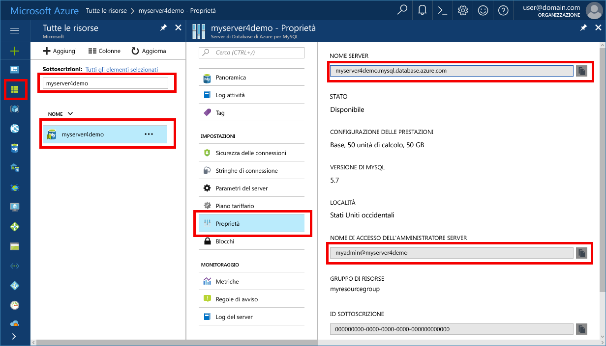

# <a name="azure-database-for-mysql-use-nodejs-to-connect-and-query-data"></a>Database di Azure per MySQL: usare Node.js per connettersi ai dati ed eseguire query
Questa guida introduttiva illustra come connettersi a un database di Azure per MySQL usando [Node.js](https://nodejs.org/) dalle piattaforme Windows, Ubuntu Linux e Mac. Spiega come usare le istruzioni SQL per eseguire query, inserire, aggiornare ed eliminare dati nel database. Questo argomento presuppone che si abbia familiarità con lo sviluppo con Node.js, ma non con Database di Azure per MySQL.

## <a name="prerequisites"></a>prerequisiti
Questa guida introduttiva usa le risorse create in una delle guide seguenti come punto di partenza:
- [Create an Azure Database for MySQL server using Azure portal](./quickstart-create-mysql-server-database-using-azure-portal.md) (Creare un database di Azure per il server MySQL usando il portale di Azure)
- [Creare un database di Azure per il server MySQL tramite l'interfaccia della riga di comando di Azure](./quickstart-create-mysql-server-database-using-azure-cli.md)

È anche necessario:
- Installare il runtime di [Node.js](https://nodejs.org).
- Installare il pacchetto [mysql2](https://www.npmjs.com/package/mysql2) per connettersi a MySQL dall'applicazione Node.js. 

## <a name="install-nodejs-and-the-mysql-connector"></a>Installare Node.js e il connettore MySQL
A seconda della piattaforma, seguire le istruzioni nella sezione appropriata per installare Node.js. Usare npm per installare il pacchetto mysql2 e le relative dipendenze nella cartella del progetto.

### <a name="windows"></a>**Windows**
1. Visitare la [pagina di download di Node.js](https://nodejs.org/en/download/) e quindi selezionare l'opzione di installazione di Windows desiderata.
2. Creare una cartella di progetto locale, ad esempio `nodejsmysql`. 
3. Avviare il prompt dei comandi e quindi passare alla cartella del progetto, ad esempio `cd c:\nodejsmysql\`
4. Eseguire lo strumento NPM per installare la libreria mysql2 nella cartella del progetto.

   ```cmd
   cd c:\nodejsmysql\
   "C:\Program Files\nodejs\npm" install mysql2
   "C:\Program Files\nodejs\npm" list
   ```

5. Verificare l'installazione controllando il testo di output `npm list` per `mysql2@1.3.5`.

### <a name="linux-ubuntu"></a>**Linux (Ubuntu)**
1. Eseguire questi comandi per installare **Node.js** e la gestione pacchetti **npm** per Node.js.

   ```bash
   sudo apt-get install -y nodejs npm
   ```

2. Eseguire questi comandi per creare una cartella di progetto `mysqlnodejs` e installare il pacchetto mysql2 nella cartella.

   ```bash
   mkdir nodejsmysql
   cd nodejsmysql
   npm install --save mysql2
   npm list
   ```
3. Verificare l'installazione controllando il testo di output npm list per `mysql2@1.3.5`.

### <a name="mac-os"></a>**Mac OS**
1. Immettere i comandi seguenti per installare **brew**, una gestione pacchetti facile da usare per Mac OS X e **Node.js**.

   ```bash
   ruby -e "$(curl -fsSL https://raw.githubusercontent.com/Homebrew/install/master/install)"
   brew install node
   ```
2. Eseguire questi comandi per creare una cartella di progetto `mysqlnodejs` e installare il pacchetto mysql2 nella cartella.

   ```bash
   mkdir nodejsmysql
   cd nodejsmysql
   npm install --save mysql2
   npm list
   ```

3. Verificare l'installazione controllando il testo di output `npm list` per `mysql2@1.3.6`. Il numero di versione può variare nel momento in cui vengono rilasciate nuove patch.

## <a name="get-connection-information"></a>Ottenere informazioni di connessione
Ottenere le informazioni di connessione necessarie per connettersi al database di Azure per MySQL. Sono necessari il nome del server completo e le credenziali di accesso.

1. Accedere al [Portale di Azure](https://portal.azure.com/).
2. Nel riquadro a sinistra fare clic su **Tutte le risorse** e cercare il server creato, ad esempio **myserver4demo**.
3. Fare clic sul nome server **myserver4demo**.
4. Selezionare la pagina **Proprietà** del server e prendere nota dei valori riportati in **Nome server** e **Nome di accesso dell'amministratore server**.
 
5. Se si dimenticano le informazioni di accesso per il server, passare alla pagina **Panoramica** per visualizzare il nome di accesso dell'amministratore del server e, se necessario, reimpostare la password.

## <a name="running-the-javascript-code-in-nodejs"></a>Esecuzione del codice JavaScript in Node.js
1. Incollare il codice JavaScript nei file di testo e quindi salvarli in una cartella di progetto con estensione js, ad esempio C:\nodejsmysql\createtable.js o /home/username/nodejsmysql/createtable.js.
2. Avviare il prompt dei comandi o la shell Bash e quindi passare alla cartella del progetto `cd nodejsmysql`.
3. Per eseguire l'applicazione, digitare il comando node seguito dal nome del file, ad esempio `node createtable.js`.
4. In Windows, se l'applicazione Node non è presente nella variabile di ambiente PATH potrebbe essere necessario usare il percorso completo per avviare l'applicazione Node, ad esempio `"C:\Program Files\nodejs\node.exe" createtable.js`

## <a name="connect-create-table-and-insert-data"></a>Connettersi, creare tabelle e inserire dati
Usare il codice seguente per connettersi e caricare i dati usando le istruzioni SQL **CREATE TABLE** e **INSERT INTO**.

Il metodo [mysql.createConnection()](https://github.com/mysqljs/mysql#establishing-connections) viene usato per l'interfaccia con il server MySQL. La funzione [connect()](https://github.com/mysqljs/mysql#establishing-connections) viene usata per stabilire la connessione al server. La funzione [query()](https://github.com/mysqljs/mysql#performing-queries) viene usata per eseguire la query SQL sul database MySQL. 

Sostituire i parametri `host`, `user`, `password` e `database` con i valori specificati al momento della creazione del server e del database.

```javascript
const mysql = require('mysql2');

var config =
{
    host: 'myserver4demo.mysql.database.azure.com',
    user: 'myadmin@myserver4demo',
    password: 'your_password',
    database: 'quickstartdb',
    port: 3306,
    ssl: true
};

const conn = new mysql.createConnection(config);

conn.connect(
    function (err) { 
    if (err) { 
        console.log("!!! Cannot connect !!! Error:");
        throw err;
    }
    else
    {
       console.log("Connection established.");
           queryDatabase();
    }   
});

function queryDatabase(){
       conn.query('DROP TABLE IF EXISTS inventory;', function (err, results, fields) { 
            if (err) throw err; 
            console.log('Dropped inventory table if existed.');
        })
       conn.query('CREATE TABLE inventory (id serial PRIMARY KEY, name VARCHAR(50), quantity INTEGER);', 
            function (err, results, fields) {
                if (err) throw err;
            console.log('Created inventory table.');
        })
       conn.query('INSERT INTO inventory (name, quantity) VALUES (?, ?);', ['banana', 150], 
            function (err, results, fields) {
                if (err) throw err;
            else console.log('Inserted ' + results.affectedRows + ' row(s).');
        })
       conn.query('INSERT INTO inventory (name, quantity) VALUES (?, ?);', ['orange', 154], 
            function (err, results, fields) {
                if (err) throw err;
            console.log('Inserted ' + results.affectedRows + ' row(s).');
        })
       conn.query('INSERT INTO inventory (name, quantity) VALUES (?, ?);', ['apple', 100], 
        function (err, results, fields) {
                if (err) throw err;
            console.log('Inserted ' + results.affectedRows + ' row(s).');
        })
       conn.end(function (err) { 
        if (err) throw err;
        else  console.log('Done.') 
        });
};
```

## <a name="read-data"></a>Leggere i dati
Usare il codice seguente per connettersi e leggere i dati usando un'istruzione SQL **SELECT**. 

Il metodo [mysql.createConnection()](https://github.com/mysqljs/mysql#establishing-connections) viene usato per l'interfaccia con il server MySQL. Il metodo [connect()](https://github.com/mysqljs/mysql#establishing-connections) viene usato per stabilire la connessione al server. Il metodo [query()](https://github.com/mysqljs/mysql#performing-queries) viene usato per eseguire la query SQL sul database MySQL. La matrice dei risultati viene usata per contenere i risultati della query.

Sostituire i parametri `host`, `user`, `password` e `database` con i valori specificati al momento della creazione del server e del database.

```javascript
const mysql = require('mysql2');

var config =
{
    host: 'myserver4demo.mysql.database.azure.com',
    user: 'myadmin@myserver4demo',
    password: 'your_password',
    database: 'quickstartdb',
    port: 3306,
    ssl: true
};

const conn = new mysql.createConnection(config);

conn.connect(
    function (err) { 
        if (err) { 
            console.log("!!! Cannot connect !!! Error:");
            throw err;
        }
        else {
            console.log("Connection established.");
            readData();
        }   
    });

function readData(){
        conn.query('SELECT * FROM inventory', 
            function (err, results, fields) {
                if (err) throw err;
                else console.log('Selected ' + results.length + ' row(s).');
                for (i = 0; i < results.length; i++) {
                    console.log('Row: ' + JSON.stringify(results[i]));
                }
                console.log('Done.');
            })
       conn.end(
           function (err) { 
                if (err) throw err;
                else  console.log('Closing connection.') 
        });
};
```

## <a name="update-data"></a>Aggiornare i dati
Usare il codice seguente per connettersi e leggere i dati usando un'istruzione SQL **UPDATE**. 

Il metodo [mysql.createConnection()](https://github.com/mysqljs/mysql#establishing-connections) viene usato per l'interfaccia con il server MySQL. Il metodo [connect()](https://github.com/mysqljs/mysql#establishing-connections) viene usato per stabilire la connessione al server. Il metodo [query()](https://github.com/mysqljs/mysql#performing-queries) viene usato per eseguire la query SQL sul database MySQL. 

Sostituire i parametri `host`, `user`, `password` e `database` con i valori specificati al momento della creazione del server e del database.

```javascript
const mysql = require('mysql2');

var config =
{
    host: 'myserver4demo.mysql.database.azure.com',
    user: 'myadmin@myserver4demo',
    password: 'your_password',
    database: 'quickstartdb',
    port: 3306,
    ssl: true
};

const conn = new mysql.createConnection(config);

conn.connect(
    function (err) { 
        if (err) { 
            console.log("!!! Cannot connect !!! Error:");
            throw err;
        }
        else {
            console.log("Connection established.");
            updateData();
        }   
    });

function updateData(){
       conn.query('UPDATE inventory SET quantity = ? WHERE name = ?', [200, 'banana'], 
            function (err, results, fields) {
                if (err) throw err;
                else console.log('Updated ' + results.affectedRows + ' row(s).');
        })
       conn.end(
           function (err) { 
                if (err) throw err;
                else  console.log('Done.') 
        });
};
```

## <a name="delete-data"></a>Eliminare i dati
Usare il codice seguente per connettersi e leggere i dati usando un'istruzione SQL **DELETE**. 

Il metodo [mysql.createConnection()](https://github.com/mysqljs/mysql#establishing-connections) viene usato per l'interfaccia con il server MySQL. Il metodo [connect()](https://github.com/mysqljs/mysql#establishing-connections) viene usato per stabilire la connessione al server. Il metodo [query()](https://github.com/mysqljs/mysql#performing-queries) viene usato per eseguire la query SQL sul database MySQL. 

Sostituire i parametri `host`, `user`, `password` e `database` con i valori specificati al momento della creazione del server e del database.

```javascript
const mysql = require('mysql2');

var config =
{
    host: 'myserver4demo.mysql.database.azure.com',
    user: 'myadmin@myserver4demo',
    password: 'your_password',
    database: 'quickstartdb',
    port: 3306,
    ssl: true
};

const conn = new mysql.createConnection(config);

conn.connect(
    function (err) { 
        if (err) { 
            console.log("!!! Cannot connect !!! Error:");
            throw err;
        }
        else {
            console.log("Connection established.");
            deleteData();
        }   
    });

function deleteData(){
       conn.query('DELETE FROM inventory WHERE name = ?', ['orange'], 
            function (err, results, fields) {
                if (err) throw err;
                else console.log('Deleted ' + results.affectedRows + ' row(s).');
        })
       conn.end(
           function (err) { 
                if (err) throw err;
                else  console.log('Done.') 
        });
};
```

## <a name="next-steps"></a>Passaggi successivi
> [!div class="nextstepaction"]
> [Eseguire la migrazione del database usando le funzionalità di esportazione e importazione](./concepts-migrate-import-export.md)
