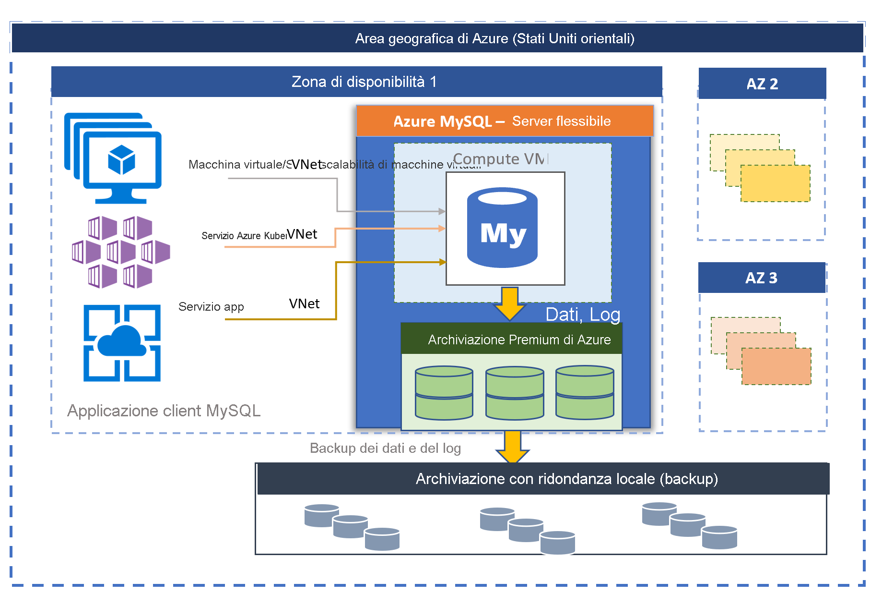

# Database di Azure per MySQL - Server flessibile (anteprima)

Database di Azure per MySQL basato su MySQL Community Edition è disponibile in due modalità di distribuzione:
- Server unico 
- Server flessibile (anteprima)

In questo articolo verrà fornita una panoramica e un'introduzione ai concetti di base del modello di distribuzione flessibile del server. Per informazioni su come decidere qual è l'opzione di distribuzione appropriata per il carico di lavoro, vedere [come scegliere l'opzione di server MySQL corretta in Azure](./../select-right-deployment-type.md).

## Panoramica

Il server flessibile di Database di Azure per MySQL è un servizio di database completamente gestito progettato per offrire un controllo più granulare e una maggiore flessibilità rispetto alle funzioni di gestione e alle impostazioni di configurazione del database. In generale, il servizio offre maggiore flessibilità e personalizzazioni della configurazione del server in base ai requisiti dell'utente. L'architettura del server flessibile consente agli utenti di scegliere la disponibilità elevata all'interno di una singola zona di disponibilità e tra più zone di disponibilità. I server flessibili forniscono anche controlli di ottimizzazione dei costi migliori con l'opzione per arrestare/avviare il server e gli SKU con possibilità di burst, ideale per i carichi di lavoro che non necessitano di capacità di calcolo completa in modo continuo. Il servizio supporta attualmente la versione community di MySQL 5.7. Il servizio è attualmente disponibile in anteprima, in un'ampia gamma di [aree di Azure](https://azure.microsoft.com/global-infrastructure/services/).

I server flessibili sono ideali per 
- Sviluppi di applicazioni che richiedono un controllo e personalizzazioni migliori.
- Disponibilità elevata di ridondanza della zona
- Finestre di manutenzione gestite

 

## Disponibilità elevata in e tra zone di disponibilità

Il modello di distribuzione di server flessibili è progettato per supportare la disponibilità elevata all'interno di una singola zona di disponibilità e tra più zone di disponibilità. L'architettura separa il calcolo e l'archiviazione. Il motore di database viene eseguito in una macchina virtuale, mentre i file di dati risiedono in archiviazione di Azure. L'archiviazione mantiene in locale tre copie sincrone con ridondanza dei file di database garantendo la durabilità continua dei dati. 

All'interno di una singola zona di disponibilità, se il server diventa inattivo a causa di eventi pianificati o non, il servizio ne mantiene la disponibilità elevata usando la procedura automatizzata seguente:

1. Viene effettuato il provisioning di una nuova VM di calcolo.
2. Viene eseguito il mapping della risorsa di archiviazione con i file di dati alla nuova macchina virtuale
3. Il motore di database MySQL viene portato online sulla nuova macchina virtuale.
4. Le applicazioni client possono riconnettersi quando il server è pronto ad accettare le connessioni.
   
:::image type="content" source="media/overview/2-flexible-server-architecture.png" alt-text="Diagramma concettuale della disponibilità elevata a zona singola"::: 

Se è configurata la disponibilità elevata con ridondanza della zona, il servizio effettua il provisioning e gestisce un server hot standby nella zona di disponibilità all'interno della stessa area di Azure. Le modifiche dei dati nel server di origine vengono replicate in modo sincrono nel server di standby per garantire una perdita di dati pari a zero. Con la disponibilità elevata con ridondanza della zona, dopo l'attivazione dell'evento di failover pianificato o non pianificato, il server di standby viene portato online immediatamente ed è disponibile per l'elaborazione delle transazioni in ingresso. Il tempo di failover tipico è compreso tra 60 e 120 secondi. Il servizio può quindi supportare la disponibilità elevata e fornire una maggiore resilienza con la tolleranza degli errori nella singola zona di disponibilità in una specifica area di Azure. 

Per informazioni dettagliate, vedere i [concetti sulla disponibilità elevata](concepts-high-availability.md).

:::image type="content" source="media/overview/3-flexible-server-overview-zone-redundant-ha.png" alt-text="Diagramma concettuale della disponibilità elevata con ridondanza della zona"::: 

## Applicazione automatica delle patch con la finestra di manutenzione gestita

Il servizio esegue l'applicazione automatica di patch dell'hardware, del sistema operativo e del motore di database sottostanti. L'applicazione di patch include aggiornamenti di sicurezza e software. Per il motore MySQL, sono inclusi anche gli aggiornamenti della versione secondaria come parte della versione di manutenzione pianificata. Gli utenti possono configurare la pianificazione dell'applicazione di patch in modo che sia gestita dal sistema o definire la pianificazione personalizzata. Durante la pianificazione della manutenzione, viene applicata la patch e potrebbe essere necessario riavviare il server come parte di questo processo per completare l'aggiornamento. Con la pianificazione personalizzata gli utenti possono prevedere il ciclo di applicazione delle patch e scegliere una finestra di manutenzione con un impatto minimo sull'attività. Il servizio segue in genere la pianificazione di rilascio mensile come parte del processo continuo di integrazione e rilascio.

Per altre informazioni, vedere [Manutenzione pianificata](concepts-maintenance.md). 

## Backup automatici

Il servizio server flessibile crea automaticamente i backup del server e li archivia nella risorsa di archiviazione con ridondanza locale o geografica configurata dall'utente. I backup possono essere usati per ripristinare il server in modo temporizzato entro il periodo di conservazione. Il periodo di conservazione dei backup predefinito è di sette giorni. La conservazione può essere configurata facoltativamente fino a 35 giorni. Tutti i backup vengono crittografati con crittografia AES a 256 bit. 

Per altre informazioni, vedere i [concetti sul backup](concepts-backup-restore.md).

## Isolamento della rete

Per la connessione al server flessibile di Database di Azure per MySQL, sono disponibili due opzioni di rete. Le opzioni sono **Accesso privato (integrazione rete virtuale)** e **Accesso pubblico (indirizzi IP consentiti)** . 

* **Accesso privato (integrazione rete virtuale)** : è possibile distribuire il server flessibile nella [rete virtuale di Azure](../../virtual-network/virtual-networks-overview.md). Le reti virtuali di Azure forniscono comunicazioni private e sicure. Le risorse di una rete virtuale possono comunicare tramite indirizzi IP privati.

   Scegliere l'opzione di integrazione rete virtuale per ottenere le funzionalità seguenti:
   * Connettersi al server flessibile da risorse di Azure nella stessa rete virtuale usando indirizzi IP privati
   * Usare VPN o ExpressRoute per connettersi al server flessibile da risorse non di Azure
   * Nessun endpoint pubblico

* **Accesso pubblico (indirizzi IP consentiti)** : è possibile distribuire il server flessibile con un endpoint pubblico. L'endpoint pubblico è un indirizzo DNS risolvibile pubblicamente. L'espressione "indirizzi IP consentiti" si riferisce a un intervallo di indirizzi IP a cui si sceglie di concedere l'autorizzazione per l'accesso al server. Queste autorizzazioni si definiscono **regole del firewall**.

Per altre informazioni, vedere i [concetti sulla rete](concepts-networking.md).

## Regolare prestazioni e scalabilità in pochi secondi

Il servizio server flessibile è disponibile in tre livelli di SKU: Con possibilità di burst, Per utilizzo generico e Con ottimizzazione per la memoria. Il livello Con possibilità di burst è particolarmente adatto per lo sviluppo a basso costo e per carichi di lavoro di concorrenza bassi che non necessitano di capacità di calcolo completa in modo continuo. Per utilizzo generico e Con ottimizzazione per la memoria sono più adatti per i carichi di lavoro di produzione che richiedono concorrenza elevata, scalabilità e prevedibilità delle prestazioni. È possibile compilare la prima app in un database di piccole dimensioni con un costo mensile minimo, quindi regolare in tutta semplicità la scalabilità in base alle esigenze della soluzione. Il dimensionamento dello spazio di archiviazione è online e supporta l'aumento automatico. La scalabilità dinamica consente al database di rispondere in modo trasparente ai requisiti delle risorse soggetti a rapidi cambiamenti. Verranno addebitati i costi solo per le risorse usate. 

Per altre informazioni, vedere i [concetti su calcolo e archiviazione](concepts-compute-storage.md).

## Aumentare il carico di lavoro di lettura con un totale di 10 repliche in lettura

MySQL è uno dei motori di database più diffusi per l'esecuzione di applicazioni Web e per dispositivi mobili su scala Internet. Molti clienti lo usano per servizi di formazione online, servizi di streaming video, soluzioni di pagamento digitale, piattaforme di e-commerce, servizi per videogiochi, portali di notizie, siti Web di enti pubblici e assistenza sanitaria. Per rispondere alle esigenze dei clienti, questi servizi devono poter essere ampliati con l'aumento del traffico nelle applicazioni Web o per dispositivi mobili.

Sul lato applicazioni, l'applicazione viene in genere sviluppata in Java o php e ne viene eseguita la migrazione per l'esecuzione in  [set di scalabilità di macchine virtuali di Azure](/azure/virtual-machine-scale-sets/overview.md) o in [Servizi app di Azure](/azure/app-service/overview.md) oppure viene inserita in contenitori per l'esecuzione nel [servizio Azure Kubernetes](/azure/aks/intro-kubernetes.md). Con il set di scalabilità di macchine virtuali, il servizio app o il servizio Azure Kubernetes come infrastruttura sottostante, la scalabilità dell'applicazione risulta semplificata tramite il provisioning istantaneo di nuove VM e la replica dei componenti senza stato per soddisfare le richieste, ma spesso il database finisce col diventare un collo di bottiglia come componente con stato centralizzato.

La funzionalità di replica in lettura consente di replicare i dati di un server flessibile di Database di Azure per MySQL in un server di sola lettura. È possibile creare **fino a 10 repliche** da un server di origine. Le repliche vengono aggiornate in modo asincrono tramite la [tecnologia di replica basata sulla posizione del file di log binario (binlog)](https://dev.mysql.com/doc/refman/5.7/en/replication-features.html) nativo del motore MySQL. È possibile usare una soluzione proxy del servizio di bilanciamento del carico, come [ProxySQL](https://techcommunity.microsoft.com/t5/azure-database-for-mysql/load-balance-read-replicas-using-proxysql-in-azure-database-for/ba-p/880042), per aumentare il carico di lavoro dell'applicazione e includere le repliche in lettura senza costi di refactoring. 

Per altre informazioni, vedere [Concetti sulla replica in lettura](concepts-read-replicas.md). 

## Arrestare/avviare il server per ottimizzare i costi

Il servizio server flessibile consente di arrestare e avviare il server su richiesta per ottimizzare i costi. La fatturazione del livello di calcolo viene interrotta immediatamente quando il server viene arrestato. Ciò consente un notevole risparmio sui costi durante lo sviluppo, il test e i carichi di lavoro di produzione prevedibili con limiti temporali. Se non viene riavviato prima, il server rimane nello stato interrotto per sette giorni. 

Per altre informazioni, vedere [Concetti relativi al server](concept-servers.md). 

## Sicurezza e privacy di livello aziendale

Il servizio server flessibile usa il modulo crittografico convalidato FIPS 140-2 per la crittografia dei dati archiviati inattivi. I dati, inclusi i backup e i file temporanei creati durante l'esecuzione di query, sono crittografati. Il servizio usa la crittografia AES a 256 bit inclusa nella crittografia di archiviazione di Azure e le chiavi possono essere gestite dal sistema (predefinito). 

Il servizio crittografa i dati in transito con il protocollo Transport Layer Security applicato per impostazione predefinita. I server flessibili supportano solo connessioni crittografate con Transport Layer Security (TLS 1.2), mentre tutte le connessioni in ingresso con TLS 1.0 e TLS 1.1 verranno negate. 

Per altre informazioni, vedere [come usare connessioni crittografate a server flessibili](https://docs.mongodb.com/manual/tutorial/configure-ssl).

I server flessibili consentono l'accesso privato completo ai server tramite l'integrazione della [rete virtuale di Azure](../../virtual-network/virtual-networks-overview.md). I server nella rete virtuale di Azure possono essere raggiunti e connessi solo tramite indirizzi IP privati. Con l'integrazione di VNet, l'accesso pubblico viene negato e non è possibile raggiungere i server usando gli endpoint pubblici. 

Per altre informazioni, vedere i [concetti sulla rete](concepts-networking.md).

## Monitoraggio e avviso

Il servizio server flessibile è dotato di funzionalità predefinite di monitoraggio delle prestazioni e di avviso. Tutte le metriche di Azure hanno una frequenza di un minuto e offrono una cronologia di 30 giorni. È possibile configurare avvisi in base alle metriche. Il servizio espone le metriche del server host per monitorare l'utilizzo delle risorse e consente la configurazione di log di query lente. Grazie a questi strumenti è possibile ottimizzare rapidamente i carichi di lavoro e configurare il server per ottenere prestazioni ottimali. 

Per altre informazioni, vedere i [concetti sul monitoraggio](concepts-monitoring.md).

## Migrazione

Il servizio esegue la versione community di MySQL. Questo consente la compatibilità completa delle applicazioni e richiede un costo di refactoring minimo per eseguire la migrazione di un'applicazione esistente sviluppata sul motore MySQL a un servizio server singolo. Per eseguire la migrazione al server singolo, è possibile usare una delle opzioni seguenti:

- **Dump e ripristino** : per le migrazioni offline, in cui gli utenti possono permettersi un certo tempo di inattività, l'esecuzione del dump e del ripristino usando strumenti della community come mysqldump/mydumpere può fornire una soluzione più rapida per la migrazione. Per i dettagli, vedere Eseguire la migrazione con dump e ripristino. 
- **Servizio Migrazione del database di Azure** : per migrazioni semplici e facilitate al server singolo con tempi di inattività minimi, è possibile sfruttare [Servizio Migrazione del database di Azure](../../dms/tutorial-mysql-azure-mysql-online.md). 

## Aree di Azure

Uno dei vantaggi offerti dall'esecuzione del carico di lavoro in Azure è la copertura globale. Il server flessibile per il database di Azure per MySQL è attualmente disponibile nelle aree di Azure seguenti:

- Europa occidentale
- Europa settentrionale
- Regno Unito meridionale
- Stati Uniti orientali 2
- Stati Uniti occidentali 2
- Stati Uniti centrali
- Stati Uniti orientali
- Canada centrale
- Asia sud-orientale
- Corea centrale
- Giappone orientale
- Australia orientale

Presto verranno aggiunti nuovi server.

## Contatti
Per eventuali domande o suggerimenti sul server flessibile del database di Azure per MySQL, inviare un messaggio di posta elettronica al team di Database di Azure per MySQL ([@Ask Azure DB per MySQL](mailto:AskAzureDBforMySQL@service.microsoft.com)). Questo indirizzo di posta elettronica non è un alias del supporto tecnico.

Inoltre, prendere in considerazione i seguenti punti di contatto in base alle specifiche esigenze:

- Per contattare il supporto di Azure, [creare un ticket dal portale di Azure](https://portal.azure.com/?#blade/Microsoft_Azure_Support/HelpAndSupportBlade).
- Per risolvere un problema relativo all'account, inviare una [richiesta di supporto](https://ms.portal.azure.com/#blade/Microsoft_Azure_Support/HelpAndSupportBlade/newsupportrequest) nel portale di Azure.
- Per fornire commenti e suggerimenti o richiedere nuove funzionalità, creare una richiesta tramite [UserVoice](https://feedback.azure.com/forums/597982-azure-database-for-mysql).

## Passaggi successivi
A questo punto, dopo aver letto un'introduzione alla modalità di distribuzione server singolo di Database di Azure per MySQL, si è pronti per:

- Creare il primo server. 
  - [Creare un server flessibile di Database di Azure per MySQL tramite il portale di Azure](quickstart-create-server-portal.md)
  - [Creare un server flessibile di Database di Azure per MySQL tramite l'interfaccia della riga di comando di Azure](quickstart-create-server-cli.md)
  - [Gestire un server flessibile di Database di Azure per MySQL tramite l'interfaccia della riga di comando di Azure](how-to-manage-server-portal.md)

- Creare la prima app usando il linguaggio preferito:
  - [Python](connect-python.md)
  - [Php](connect-php.md)
