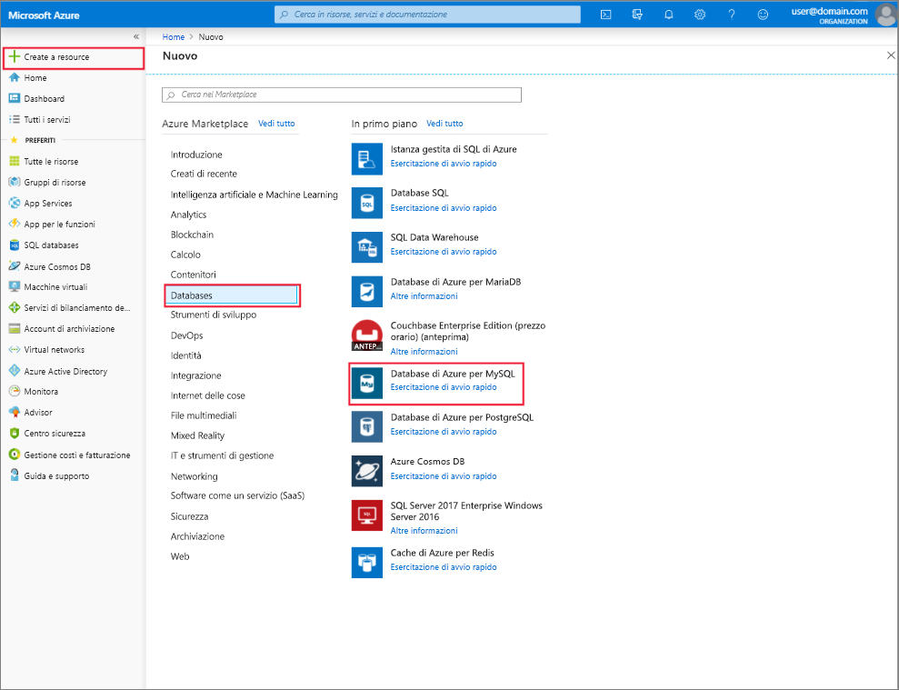

# Creare e gestire Database di Azure per il server MySQL con il portale di Azure
Questo argomento descrive come creare rapidamente una nuova istanza di Database di Azure per il server MySQL. Include anche informazioni sulla gestione del server tramite il portale di Azure. La gestione del server include la visualizzazione di database e dettagli del server, la reimpostazione della password e l'eliminazione del server.

## Accedere al Portale di Azure
Accedere al [Portale di Azure](https://portal.azure.com).

## Creare un'istanza di Database di Azure per il server MySQL
Seguire questi passaggi per creare un'istanza di Database di Azure per il server MySQL denominata "mysqlserver4demo".

1. Fare clic sul pulsante **Crea una risorsa** nell'angolo superiore sinistro del portale di Azure.

2. Nella pagina Nuovo selezionare **Database** e nella pagina Database selezionare **Database di Azure per MySQL**.

    > Verrà creata un'istanza di Database di Azure per il server MySQL con un set definito di risorse di [calcolo e di archiviazione](./concepts-compute-unit-and-storage.md). Il database viene creato in un gruppo di risorse di Azure e in un'istanza di Database di Azure per il server MySQL.

   

3. Compilare il modulo Database di Azure per MySQL con le informazioni seguenti:

    | **Campo modulo** | **Descrizione campo** |
    |----------------|-----------------------|
    | *Server name* (Nome server) | azure-mysql. Il nome server è univoco a livello globale |
    | *Sottoscrizione* | MySQLaaS (selezionare nel menu a discesa) |
    | *Gruppo di risorse* | myresource. Creare un nuovo gruppo di risorse o usarne uno esistente |
    | *Accesso amministratore server* | myadmin (configurare il nome dell'account amministratore) |
    | *Password* | Definire la password dell'account amministratore |
    | *Conferma password* | Confermare la password dell'account amministratore |
    | *Località* | Europa settentrionale. La scelta è tra Europa settentrionale e Stati Uniti occidentali. |
    | *Versione* | 5.6. Scegliere la versione di Database di Azure per il server MySQL |

4. Fare clic su **Piano tariffario** per specificare il livello di servizio e il livello delle prestazioni per il nuovo server. Il numero delle unità di calcolo può essere configurato tra 50 e 100 nel piano Basic e tra 100 e 200 nel piano Standard. È possibile aggiungere spazio di archiviazione in base alla quantità inclusa. Per questa guida si sceglieranno 50 unità di calcolo e 50 GB. Fare clic su **OK** per salvare la selezione.

   

5. Fare clic su **Crea** per eseguire il provisioning del server. Il provisioning richiede alcuni minuti.

    > Selezionare l'opzione **Aggiungi al dashboard** per tenere facilmente traccia delle distribuzioni.
    > [!NOTE]
    > Anche se sono supportati fino a 1.000 GB di spazio di archiviazione nel piano Basic e fino a 10.000 GB nel piano Standard, per l'anteprima pubblica lo spazio di archiviazione massimo è ancora limitato temporaneamente a 1.000 GB.</Include>

## Aggiornare un'istanza di Database di Azure per il server MySQL
Dopo il provisioning di un nuovo server, l'utente ha due opzioni per la modifica di un server esistente: reimpostare la password amministratore oppure aumentare/ridurre le prestazioni del server modificando le unità di calcolo.

### Modificare la password amministratore
1. Nel pannello **Panoramica** del server fare clic su **Reimposta password** per popolare una finestra di input e conferma della password.

2. Immettere la nuova password e confermarla nella finestra come illustrato di seguito:

   

3. Fare clic su **OK** per salvare la nuova password.

### Aumentare/ridurre le prestazioni modificando le unità di calcolo

1. Nel pannello del server fare clic su **Piano tariffario** in **Impostazioni** per aprire il pannello Piano tariffario relativo all'istanza di Database di Azure per il server MySQL.

2. Seguire il passaggio 4 in **Creare un'istanza di Database di Azure per il server MySQL** per modificare le unità di calcolo nello stesso piano tariffario.

## Eliminare un'istanza di Database di Azure per il server MySQL

1. Nel pannello **Panoramica** del server fare clic sul pulsante **Elimina** per aprire il pannello di conferma dell'eliminazione.

2. Digitare il nome server corretto nella casella di input del pannello per una doppia conferma.

3. Fare di nuovo clic su **Elimina** per confermare l'eliminazione e attendere che nella barra di notifica venga visualizzato un messaggio popup che indica che l'eliminazione è stata eseguita.

## Elencare i database di Database di Azure per MySQL
Nel pannello **Panoramica** del server scorrere verso il basso fino al riquadro dei database nella parte inferiore. La tabella elenca tutti i database. Fare clic sul pulsante **Elimina** per aprire il pannello di conferma dell'eliminazione.

   

## Visualizzare i dettagli di un'istanza di Database di Azure per il server MySQL
Nel pannello del server fare clic su **Proprietà** in **Impostazioni** per aprire il pannello **Proprietà** e quindi visualizzare tutte informazioni dettagliate sul server.

## Passaggi successivi

[Guida introduttiva: Creare Database di Azure per il server MySQL con il portale di Azure](./quickstart-create-mysql-server-database-using-azure-portal.md)