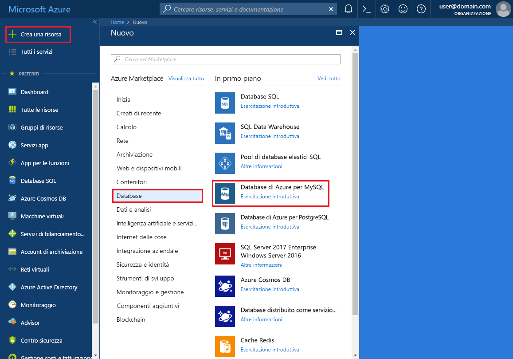

# <a name="create-an-azure-database-for-mysql-server-using-azure-portal"></a>Creare un database di Azure per il server MySQL tramite il portale di Azure

Questo articolo contiene informazioni dettagliate su come usare il portale di Azure per creare un database di Azure di esempio per il server MySQL in circa cinque minuti. 

Se non si ha una sottoscrizione di Azure, creare un account [gratuito](https://azure.microsoft.com/free/) prima di iniziare.

## <a name="log-in-to-azure"></a>Accedere ad Azure
Aprire il Web browser e passare al [portale di Microsoft Azure](https://portal.azure.com/). Immettere le credenziali per accedere al portale. La visualizzazione predefinita è il dashboard del servizio.

## <a name="create-azure-database-for-mysql-server"></a>Creare un database di Azure per il server MySQL

1. Passare a **Database** > **MySQL**. Se non è possibile trovare il database di Azure per il server MySQL nella categoria **Database**, fare clic su **Visualizza tutto** per visualizzare tutti i servizi di database disponibili. È anche possibile digitare **MySQL** nella casella di ricerca per trovare rapidamente il servizio.


2. Fare clic sull'icona **MySQL** e quindi fare clic su **Crea**.
In questo esempio immettere le informazioni seguenti nella pagina del database di Azure per MySQL:

| **Campo modulo** | **Descrizione campo** |
|----------------|-----------------------|
| *Server name* (Nome server) | mysqlserver4demo (il nome del server è univoco a livello globale) |
| *Sottoscrizione* | MySQLaaS (selezionare nell'elenco a discesa) |
| *Gruppo di risorse* | myresource (creare un gruppo di risorse o usarne uno esistente) |
| *Nome di accesso amministratore server* | myadmin (configurare il nome dell'account amministratore) |
| *Password* | Impostare la password dell'account amministratore |
| *Conferma password* | Confermare la password dell'account amministratore |
| *Posizione* | Europa settentrionale (scegliere tra **Europa settentrionale** e **Stati Uniti occidentali**) |
| *Versione* | 5.6 (scegliere la versione del server MySQL) |
| *Configura prestazioni* | Basic (scegliere **Livello di prestazioni**, **Unità di calcolo**, **Archiviazione** e quindi fare clic su **OK**) |


Dopo pochi minuti, verrà effettuato il provisioning del database di Azure per il server MySQL e il database sarà in esecuzione. È possibile fare clic sul pulsante **Notifiche** (icona di campanello) sulla barra degli strumenti per monitorare il processo di distribuzione.

> [!TIP]
> È consigliabile ubicare i servizi di Azure nella stessa area e selezionare la località più vicina. È anche possibile selezionare l'opzione **Aggiungi al dashboard** per tenere facilmente traccia delle distribuzioni.

## <a name="configure-the-firewall"></a>Configurare il firewall
Prima di connettersi per la prima volta al database di Azure per MySQL dal client, è necessario configurare il firewall e aggiungere l'indirizzo IP (o l'intervallo di indirizzi IP) della rete pubblica del client all'elenco elementi consentiti.

1. Fare clic sul server appena creato e quindi su **Impostazioni**.
  

2. Nella sezione **GENERALE** fare clic su **Impostazioni del firewall**. È possibile fare clic su **Aggiungi indirizzo IP corrente** per aggiungere l'indirizzo IP del computer locale oppure configurare un intervallo di indirizzi IP. Ricordarsi di fare clic su **Salva** dopo aver creato le regole.
  

## <a name="get-connection-information"></a>Ottenere informazioni di connessione
Ottenere il nome di dominio completo del server MySQL Azure nel portale di Azure. Usare il nome di dominio completo per connettersi al server tramite lo strumento da riga di comando **mysql.exe**.

1.    Nel [portale di Azure](https://portal.azure.com/) scegliere **Tutte le risorse** dal menu a sinistra e quindi fare clic sul database di Azure per il server MySQL.

2.    Fare clic su **Proprietà**. Annotare **NOME SERVER** e **NOME DI ACCESSO AMMINISTRATORE SERVER**.
In questo esempio il nome del server è *mysql4doc.database.windows.net* e l'account di accesso dell'amministratore del server è *mysqladmin@mysql4doc*.

## <a name="connect-to-the-server-using-mysqlexe-command-line-tool"></a>Connettersi al server tramite lo strumento da riga di comando mysql.exe
È possibile creare più database in un server MySQL. Il numero di database che è possibile creare è illimitato, ma più database condividono le stesse risorse del server.  Per connettersi al server tramite lo strumento da riga di comando **mysql.exe**, aprire **Azure Cloud Shell** nel portale e immettere il comando seguente:

1. Connettersi al server tramite lo strumento da riga di comando **mysql**:
```dos
 mysql -h mysqlserver4demo.database.windows.net -u myadmin@mysqlserver4demo -p
```

2. Visualizzare lo stato del server:
```dos
 mysql> status
```
  

> [!TIP]
> Per altri comandi, vedere [MySQL 5.6 Reference Manual - Chapter 4.5.1](https://dev.mysql.com/doc/refman/5.6/en/mysql.html) (Manuale di riferimento di MySQL 5.6 - Capitolo 4.5.1).

## <a name="connect-to-the-server-using-the-mysql-workbench-gui-tool"></a>Connettersi al server tramite lo strumento dell'interfaccia utente grafica MySQL Workbench
1.    Avviare l'applicazione MySQL Workbench nel computer client. È possibile scaricare e installare MySQL Workbench da [qui](https://dev.mysql.com/downloads/workbench/).

2.    Nella finestra di dialogo **Setup New Connection** (Configura nuova connessione) immettere le informazioni seguenti nella scheda **Parameters** (Parametri):

| **Parameters** (Parametri) | **Descrizione** |
|----------------|-----------------|
|    *Connection Name* (Nome connessione) | Specificare un nome per la connessione. Può essere qualsiasi nome. |
| *Connection Method* (Metodo di connessione) | Scegliere Standard (TCP/IP) |
| *Hostname* (Nome host) | mycliserver.database.windows.net (NOME SERVER annotato in precedenza) |
| *Porta* | 3306 |
| *Nome utente* | myadmin@mycliserver (NOME DI ACCESSO AMMINISTRATORE SERVER annotato in precedenza) |
| *Password* | È possibile archiviare la password dell'account amministratore nell'insieme di credenziali |


3.    Fare clic su **Test Connection** (Test connessione) per verificare che tutti i parametri siano configurati correttamente.

4.    È ora possibile fare clic sulla connessione appena creata per connettersi al server.

> SSL viene applicato per impostazione predefinita nel server e richiede una configurazione aggiuntiva per la corretta connessione. Vedere [Configure SSL connectivity in your application to securely connect to Azure Database for MySQL](./howto-configure-ssl.md) (Configurare la connettività SSL nell'applicazione per connettersi in modo sicuro al database di Azure per MySQL).  Se si vuole disabilitare SSL per questa guida di avvio rapido, è possibile passare a "Sicurezza connessione" nel portale per disabilitare l'applicazione di SSL.

## <a name="clean-up-resources"></a>Pulire le risorse

Se queste risorse non sono necessarie per un'altra guida di avvio rapido/esercitazione, è possibile eliminarle eseguendo questi passaggi:

1. Scegliere **Gruppi di risorse** dal menu a sinistra del portale di Azure e quindi fare clic su **myresource**. 
2. Nella pagina del gruppo di risorse fare clic su **Elimina**, digitare **myresource** nella casella di testo e quindi fare clic su **Elimina**.

## <a name="next-steps"></a>Passaggi successivi

> [!div class="nextstepaction"]
> [Progettare il primo database di Azure per il database MySQL](./tutorial-design-database-using-portal.md)


