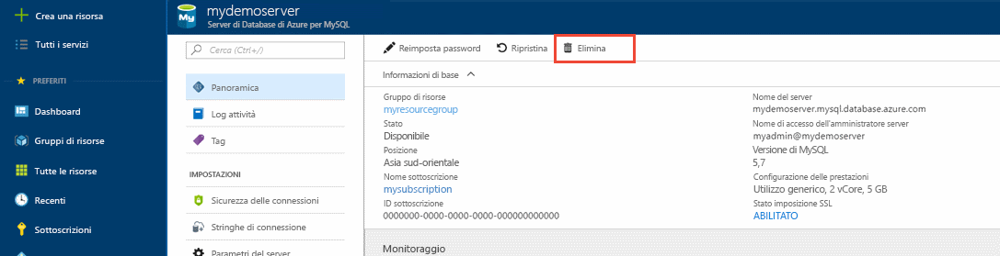

# <a name="create-an-azure-database-for-mysql-server-using-azure-portal"></a>Creare un database di Azure per il server MySQL tramite il portale di Azure
Questo articolo contiene informazioni dettagliate su come usare il portale di Azure per creare un database di Azure per il server MySQL in circa cinque minuti. 

Se non si ha una sottoscrizione di Azure, creare un account [gratuito](https://azure.microsoft.com/free/) prima di iniziare.

## <a name="log-in-to-azure"></a>Accedere ad Azure
Aprire il Web browser e passare al [portale di Microsoft Azure](https://portal.azure.com/). Immettere le credenziali per accedere al portale. La visualizzazione predefinita è il dashboard del servizio.

## <a name="create-azure-database-for-mysql-server"></a>Creare un database di Azure per il server MySQL
1. Fare clic sul pulsante **Nuovo** nell'angolo superiore sinistro del portale di Azure.

2. Selezionare **Database** nella pagina **Nuovo** e quindi **Database di Azure per MySQL** nella pagina **Database**. È anche possibile digitare **MySQL** nella casella di ricerca della pagina Nuovo per trovare il servizio.


3. Compilare il modulo per i dettagli del nuovo server con le informazioni seguenti, come illustrato nell'immagine precedente:

| **Impostazione** | **Valore consigliato** | **Descrizione campo** |
|---|---|---|
| *Server name* (Nome server) | myserver4demo  | Il nome del server deve essere univoco a livello globale. |
| *Sottoscrizione* | mysubscription | Selezionare la sottoscrizione dall'elenco a discesa. |
| *Gruppo di risorse* | myresourcegroup | Creare un gruppo di risorse o usarne uno esistente. |
| *Nome di accesso amministratore server* | myadmin | Specificare un nome account come amministratore nel motore di MySQL. |
| *Password* |  | Impostare una password complessa per l'account amministratore. |
| *Conferma password* |  | Confermare la password dell'account amministratore. |
| *Posizione* |  | Selezionare un'area disponibile. |
| *Versione* | 5.7 | Scegliere la versione più recente. |
| *Piano tariffario* | Basic, con 50 unità di calcolo e archiviazione da 50 (GB)  | Scegliere **Piano tariffario**, **Unità di calcolo**, **Archiviazione (GB)** e quindi fare clic su **OK**. |
| *Aggiungi al dashboard* | Controllo | È consigliabile selezionare questa casella per trovare facilmente il server in un secondo momento. |

   Fare clic su **Piano tariffario** per specificare il piano tariffario e il livello delle prestazioni per il nuovo database. Per questa guida introduttiva, selezionare il livello Basic, con 50 unità di calcolo e 50 GB di spazio di archiviazione inclusi. Fare clic su **OK** per salvare il piano tariffario.
   
   

   Fare quindi clic su **Crea**. Dopo pochi minuti, un nuovo database di Azure per il server MySQL sarà in esecuzione nel cloud. Fare clic sul pulsante **Notifiche** (icona campanello) sulla barra degli strumenti per monitorare il processo di distribuzione.

## <a name="configure-the-firewall"></a>Configurare il firewall
Prima di connettersi per la prima volta al database di Azure per MySQL, configurare il firewall e aggiungere l'indirizzo IP della rete pubblica del client (o un intervallo) all'elenco elementi consentiti.

1. Al termine della distribuzione, fare clic su **Tutte le risorse** nel menu a sinistra e digitare il nome **myserver4demo** per cercare il server appena creato. Fare clic sul nome del server elencato nei risultati della ricerca. Verrà visualizzata la pagina Panoramica per il server, con le opzioni per un'ulteriore configurazione.

2. Nel pannello del server, selezionare **Sicurezza connessione**.

3. Fare clic su **Aggiungi indirizzo IP corrente** per aggiungere l'indirizzo IP del computer locale oppure configurare un intervallo di indirizzi IP. Ricordarsi di fare clic su **Salva** dopo aver creato le regole.
  

## <a name="get-connection-information"></a>Ottenere informazioni di connessione
Ottenere il nome di dominio completo del server MySQL Azure nel portale di Azure. Usare il nome di dominio completo per connettersi al server tramite lo strumento da riga di comando **mysql.exe**.

1.  Nel [portale di Azure](https://portal.azure.com/) scegliere **Tutte le risorse** dal menu a sinistra e quindi fare clic sul database di Azure per il server MySQL.

2.  Fare clic su **Proprietà**. Annotare **NOME SERVER** e **NOME DI ACCESSO AMMINISTRATORE SERVER**.
In questo esempio il nome del server è *myserver4demo.mysql.database.azure.com* e l'account di accesso dell'amministratore del server è *myadmin@myserver4demo*.

## <a name="connect-to-the-server-using-mysqlexe-command-line-tool"></a>Connettersi al server tramite lo strumento da riga di comando mysql.exe
Usare lo [strumento da riga di comando mysql](https://dev.mysql.com/doc/refman/5.7/en/mysql.html) per stabilire una connessione al database di Azure per il server MySQL. È possibile eseguire lo strumento da riga di comando mysql nel browser usando Azure Cloud Shell o avviarlo dal computer tramite gli strumenti di mysql installati localmente. Per avviare Azure Cloud Shell, fare clic sul pulsante `Try It` in un blocco di codice in questo articolo oppure visitare il [portale di Azure](https://portal.azure.com) e fare clic sull'icona `>_` nella barra degli strumenti in alto a destra. 

1. Digitare il comando per la connessione:
```azurecli-interactive
mysql -h myserver4demo.mysql.database.azure.com -u myadmin@myserver4demo -p
```

2. Visualizzare lo stato del server per verificare che la connessione sia funzionale. Digitare `status` al prompt mysql> dopo che è stata eseguita la connessione.
```sql
status
```

   

   > [!TIP]
   > Per altri comandi, vedere il capitolo 4.5.1 di [MySQL 5.7 Reference Manual](https://dev.mysql.com/doc/refman/5.7/en/mysql.html) (Manuale di riferimento di MySQL 5.7).

3. Creare un database vuoto digitando il comando `CREATE DATABASE` al prompt mysql>.

   ```sql
   CREATE DATABASE quickstartdb;
   ```

   In un database di Azure per il server MySQL è possibile avere uno o più database. È possibile scegliere di creare un singolo database per ogni server per usare tutte le risorse o creare più database per condividere le risorse. Il numero di database che è possibile creare è illimitato, ma più database condividono le stesse risorse del server.  

4. Elencare i database digitando il comando `SHOW DATABASES` al prompt mysql>.

   ```sql
   SHOW DATABASES;
   ```

## <a name="connect-to-the-server-using-the-mysql-workbench-gui-tool"></a>Connettersi al server tramite lo strumento dell'interfaccia utente grafica MySQL Workbench
1.  Avviare l'applicazione MySQL Workbench nel computer client. È possibile scaricare e installare MySQL Workbench da [qui](https://dev.mysql.com/downloads/workbench/).

2.  Nella finestra di dialogo **Setup New Connection** (Configura nuova connessione) immettere le informazioni seguenti nella scheda **Parameters** (Parametri):

   

| **Impostazione** | **Valore consigliato** | **Descrizione campo** |
|---|---|---|
|   *Connection Name* (Nome connessione) | Demo Connection| Specificare un'etichetta per la connessione. |
| *Connection Method* (Metodo di connessione) | Standard (TCP/IP) | Standard (TCP/IP) è sufficiente. |
| *Hostname* (Nome host) | myserver4demo.mysql.database.azure.com | Usare il nome completo del server per il server. |
| *Porta* | 3306 | Usare la porta predefinita 3306. |
| *Nome utente* | myadmin@myserver4demo  | Usare il nome di accesso amministratore server annotato in precedenza con un carattere @ e il nome del server. |
| *Password* | Immettere la password. | Fare clic sul pulsante Store in Vault... (Archivia nell'insieme di credenziali) per salvare la password. |

Fare clic su **Test Connection** (Test connessione) per verificare che tutti i parametri siano configurati correttamente. Fare clic su OK per salvare la connessione. 

> [!NOTE]
> SSL viene applicato per impostazione predefinita nel server e richiede una configurazione aggiuntiva per la corretta connessione. Vedere [Configure SSL connectivity in your application to securely connect to Azure Database for MySQL](./howto-configure-ssl.md) (Configurare la connettività SSL nell'applicazione per connettersi in modo sicuro al database di Azure per MySQL).  Se si vuole disabilitare SSL per questa guida introduttiva, visitare il portale di Azure e fare clic sulla pagina Sicurezza connessione per disabilitare l'interruttore Imponi connessione SSL.

## <a name="clean-up-resources"></a>Pulire le risorse
Pulire tutte le risorse create nella guida di avvio rapido eliminando il [gruppo di risorse di Azure](../azure-resource-manager/resource-group-overview.md).

> [!TIP]
> Altre guide di avvio rapido di questa raccolta si basano sulla presente guida di avvio rapido. Se si prevede di continuare a usare le guide di avvio rapido successive, non pulire le risorse create in questa guida di avvio rapido. Se non si prevede di continuare, seguire questa procedura per eliminare tutte le risorse create da questa guida di avvio rapido nel portale di Azure.

1.  Scegliere **Gruppi di risorse** dal menu a sinistra nel portale di Azure e quindi fare clic su **myresourcegroup**.
2.  Nella pagina del gruppo di risorse fare clic su **Elimina**, digitare **myresourcegroup** nella casella di testo e quindi fare clic su Elimina.

Se si vuole eliminare il server appena creato:
1.  Nel menu a sinistra nel portale di Azure fare clic su Server PostgreSQL e quindi cercare il server appena creato
2.  Nella pagina Panoramica fare clic sul pulsante Elimina nel riquadro superiore .
3.  Verificare il nome del server che si vuole eliminare e visualizzare i database interessati sotto al server. Digitare **myserver4demo** nella casella di testo e quindi fare clic su Elimina.


## <a name="next-steps"></a>Passaggi successivi

> [!div class="nextstepaction"]
> [Progettare il primo database di Azure per il database MySQL](./tutorial-design-database-using-portal.md)


