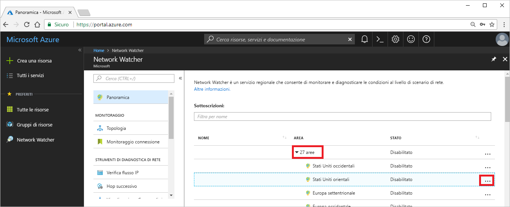
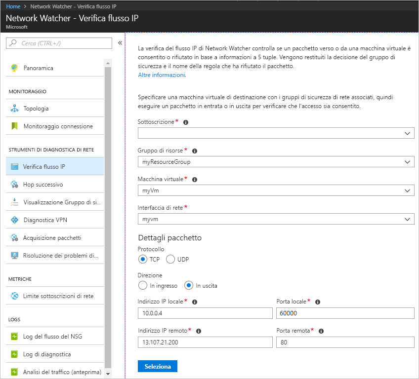
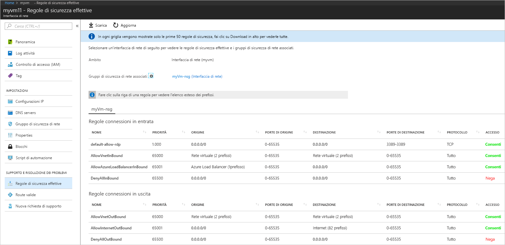
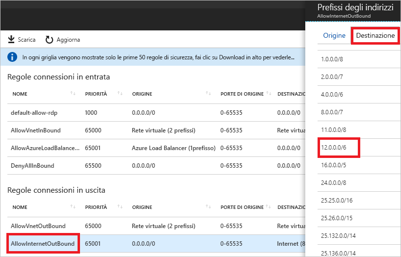

# Guida introduttiva: Diagnosticare un problema di filtro del traffico di rete di una macchina virtuale con il Portale di Azure

In questa guida introduttiva si distribuisce una macchina virtuale e quindi si controllano le comunicazioni verso un indirizzo IP e un URL e da un indirizzo IP. Vengono determinate le cause degli errori di comunicazione e si apprende come è possibile risolverli.

Se non si ha una sottoscrizione di Azure, creare un [account gratuito](https://azure.microsoft.com/free/?WT.mc_id=A261C142F) prima di iniziare.

## Accedere ad Azure

Accedere al portale di Azure all'indirizzo https://portal.azure.com.

## Creare una macchina virtuale

1. Selezionare **+ Crea una risorsa** visualizzato nell'angolo in alto a sinistra del portale di Azure.
2. Selezionare **Calcolo** e quindi **Windows Server 2016 Datacenter** o **Ubuntu Server 17.10 VM**.
3. Immettere o selezionare le informazioni seguenti, accettare le impostazioni predefinite rimanenti e quindi scegliere **OK**:

    |Impostazione|Valore|
    |---|---|
    |NOME|myVm|
    |Nome utente| Immettere un nome utente a scelta.|
    |Password| Immettere una password a scelta. La password deve contenere almeno 12 caratteri e soddisfare i [requisiti di complessità definiti](../virtual-machines/windows/faq.md?toc=%2fazure%2fnetwork-watcher%2ftoc.json#what-are-the-password-requirements-when-creating-a-vm).|
    |Sottoscrizione| Selezionare la propria sottoscrizione.|
    |Gruppo di risorse| Selezionare **Crea nuovo** e immettere **myResourceGroup**.|
    |Località| Selezionare **Stati Uniti orientali**.|

4. Selezionare una dimensione per la VM e quindi selezionare **Seleziona**.
5. In **Impostazioni**  accettare tutte le impostazioni predefinite e scegliere **OK**.
6. In **Crea** in **Riepilogo** selezionare **Crea** per avviare la distribuzione della VM. La distribuzione della VM richiede alcuni minuti. Attendere che la VM completi la distribuzione prima di continuare con i passaggi rimanenti.

## Testare la comunicazione di rete

Per testare la comunicazione di rete con Network Watcher è necessario innanzitutto abilitare un Network Watcher almeno in un'area di Azure, quindi usare la funzionalità di verifica del flusso IP di Network Watcher.

### Abilitare Network Watcher

Se si dispone già di un Network Watcher abilitato in almeno un'area, passare al paragrafo [Usare la verifica del flusso IP](#use-ip-flow-verify).

1. Nel portale selezionare **Tutti i servizi**. Nella **casella del filtro** immettere *Network Watcher*. Selezionare **Network Watcher** quando viene visualizzato tra i risultati.
2. Abilitare un Network Watcher nell'area Stati Uniti orientali, poiché questa è l'area in cui è stata distribuita la VM nel passaggio precedente. Selezionare **Area** per espandere e quindi selezionare **...** a destra di **Stati Uniti orientali**, come mostrato nell'immagine seguente:

    

3. Selezionare **Abilita Network Watcher**.

### Usare la verifica del flusso IP

Quando si crea una macchina virtuale, per impostazione predefinita Azure consente e nega il traffico di rete da e verso la macchina virtuale. È possibile eseguire l'override in un secondo momento delle impostazioni predefinite di Azure, consentendo o negando altri tipi di traffico.

1. Nel portale selezionare **Tutti i servizi**. Nella casella **Tutti i servizi** *Filtro* immettere *Network Watcher*. Selezionare **Network Watcher** quando viene visualizzato tra i risultati.
2. Selezionare **Verifica flusso IP** in **Strumenti di diagnostica di rete**.
3. Selezionare la sottoscrizione, immettere o selezionare i valori seguenti e quindi selezionare **Controllo**, come illustrato nell'immagine seguente:

    |Impostazione            |Valore                                                                                              |
    |---------          |---------                                                                                          |
    | Gruppo di risorse    | Selezionare myResourceGroup                                                                            |
    | Macchina virtuale   | Selezionare myVm                                                                                       |
    | interfaccia di rete | MyVM: il nome dell'interfaccia di rete creata dal portale quando è stata creata la VM è diverso. |
    | Protocollo          | TCP                                                                                               |
    | Direzione         | In uscita                                                                                          |
    | Indirizzo IP locale  | 10.0.0.4                                                                                          |
    | Porta locale      | 60000                                                                                                |
    | Indirizzo IP remoto | 13.107.21.200: uno degli indirizzi per www.bing.com.                                             |
    | Porta remota       | 80                                                                                                |

    

    Dopo pochi secondi, il risultato restituito informa l'utente che l'accesso è consentito dalla regola di sicurezza denominata **AllowInternetOutbound**. Quando è stato eseguito il controllo, Network Watcher ha creato automaticamente un Network Watcher nell'area degli Stati Uniti orientali, se si disponeva di un Network Watcher esistente in un'area diversa dall'area degli Stati Uniti orientali prima dell'esecuzione del controllo.
4. Completare di nuovo passaggio 3 ma modificare l'**indirizzo IP remoto** su **172.31.0.100**. Il risultato restituito informa l'utente che l'accesso è negato dalla regola di sicurezza denominata **DefaultOutboundDenyAll**.
5. Completare di nuovo il passaggio 3 ma modificare la **Direzione** su **In ingresso**, la **Porta locale** su **80** e la **Porta remota** su **60000**. Il risultato restituito informa l'utente che l'accesso è negato dalla regola di sicurezza denominata **DefaultInboundDenyAll**.

Conoscendo le regole di sicurezza che consentono o negano il traffico da o verso una macchina virtuale, è possibile determinare come risolvere i problemi.

## Visualizzare i dettagli di una regola di sicurezza

1. Per determinare perché le regole nei passaggi 3-5 di [Usare la verifica del flusso IP](#use-ip-flow-verify) consentono o negano la comunicazione, esaminare le regole di sicurezza valide per l'interfaccia di rete nella VM. Nella casella di ricerca nella parte superiore del portale immettere *myvm*. Quando nei risultati della ricerca viene visualizzata l'interfaccia di rete **myvm** (o qualunque sia il nome dell'interfaccia di rete), selezionarla.
2. Selezionare **Regole di sicurezza valide** in **SUPPORTO E RISOLUZIONE DEI PROBLEMI**, come illustrato nell'immagine seguente:

    

    Nel passaggio 3 di [Usare la verifica del flusso IP](#use-ip-flow-verify), si è appreso che la comunicazione è stata consentita dalla regola **AllowInternetOutbound**. È possibile vedere nell'immagine precedente che la **DESTINAZIONE** per la regola è **Internet**. Tuttavia non è chiaro come 13.107.21.200, l'indirizzo testato nel passaggio 3 in [Usare la verifica del flusso IP](#use-ip-flow-verify), sia correlato a **Internet**.
3. Selezionare la regola **AllowInternetOutBound** e quindi **Destinazione**, come illustrato nell'immagine seguente:

    

    Uno dei prefissi nell'elenco è **12.0.0.0/6**, che comprende l'intervallo di indirizzi IP 12.0.0.1-15.255.255.254. Poiché 13.107.21.200 è compreso in tale intervallo di indirizzi, la regola **AllowInternetOutBound** consente il traffico in uscita. Inoltre, nell'output precedente non sono presenti le regole con priorità più alta (numero inferiore) mostrate nella figura nel passaggio 2 che sostituiscono questa regola. Chiudere la casella **Prefissi degli indirizzi**. Per impedire le comunicazioni in uscita verso 13.107.21.200, è possibile aggiungere una regola di sicurezza con una priorità più alta, che neghi l'accesso in uscita dalla porta 80 verso l'indirizzo IP.
4. Quando è stato eseguito il controllo in uscita verso 172.131.0.100 nel passaggio 4 di [Usare la verifica del flusso IP](#use-ip-flow-verify), si è appreso che la regola **DefaultOutboundDenyAll** ha negato la comunicazione. Tale regola equivale alla regola **DenyAllOutBound** illustrata nell'immagine nel passaggio 2 che specifica **0.0.0.0/0** come **DESTINAZIONE**. La regola nega la comunicazione in uscita verso 172.131.0.100, perché l'indirizzo non rientra nel valore della **DESTINAZIONE** di nessuna delle altre **Regole in uscita** mostrate nell'immagine. Per consentire la comunicazione in uscita, è possibile aggiungere una regola di sicurezza con una priorità più alta, che consente il traffico in uscita sulla porta 80 verso 172.131.0.100.
5. Quando è stato eseguito il controllo in entrata da 172.131.0.100 nel passaggio 5 di [Usare la verifica del flusso IP](#use-ip-flow-verify), si è appreso che la regola **DefaultInboundDenyAll** ha negato la comunicazione. Tale regola equivale alla regola **DenyAllInBound** illustrato nell'immagine nel passaggio 2. La regola **DenyAllInBound** viene applicata perché non è presente nessun'altra regola di priorità superiore che consente alla porta 80 l'ingresso alla VM da 172.31.0.100. Per consentire la comunicazione in ingresso, è possibile aggiungere una regola di sicurezza con una priorità più alta, che consente il traffico in ingresso sulla porta 80 da 172.31.0.100.

I controlli eseguiti in questa guida introduttiva hanno consentito di testare la configurazione di Azure. Se i controlli hanno restituito i risultati previsti ma sussistono ancora problemi di rete, verificare che non sia presente un firewall tra la macchina virtuale e l'endpoint con cui si sta comunicando e che il sistema operativo nella macchina virtuale non disponga di un firewall che stia consentendo o negando la comunicazione.

## Pulire le risorse

Quando non sono più necessari, eliminare il gruppo di risorse e tutte le risorse in esso contenute:

1. Immettere *myResourceGroup* nella casella di **ricerca** nella parte superiore del portale. Selezionare **myResourceGroup** quando viene visualizzato nei risultati della ricerca.
2. Selezionare **Elimina gruppo di risorse**.
3. Immettere *myResourceGroup* in **DIGITARE IL NOME DEL GRUPPO DI RISORSE** e selezionare **Elimina**.

## Passaggi successivi

In questa guida introduttiva si è appreso come creare una macchina virtuale e diagnosticare problemi dei filtri del traffico di rete in ingresso e in uscita. Si è appreso che le regole del gruppo di sicurezza di rete consentono o negano il traffico da e verso una macchina virtuale. Altre informazioni sulle [regole di sicurezza](../virtual-network/security-overview.md?toc=%2fazure%2fnetwork-watcher%2ftoc.json) e su come [creare le regole di sicurezza](../virtual-network/manage-network-security-group.md?toc=%2fazure%2fnetwork-watcher%2ftoc.json#create-a-security-rule).

Anche se i filtri del traffico di rete non presentano problemi, la comunicazione verso una macchina virtuale può non riuscire a causa della configurazione del routing. Per informazioni su come diagnosticare problemi di routing della rete delle macchine virtuali, vedere [Diagnosticare i problemi di routing delle macchine virtuali](diagnose-vm-network-routing-problem.md) o, per diagnosticare con uno strumento i problemi inerenti il routing in uscita, la latenza e i filtri del traffico, vedere [Risolvere i problemi relativi alle connessioni](network-watcher-connectivity-portal.md).