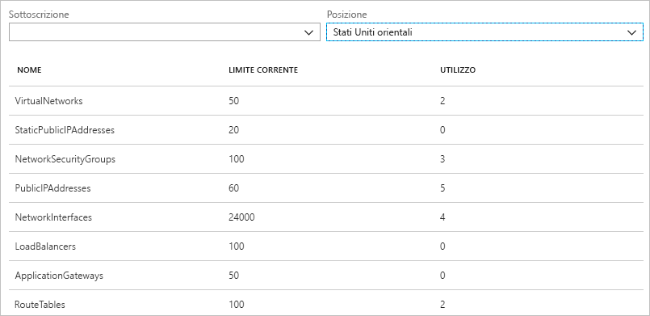
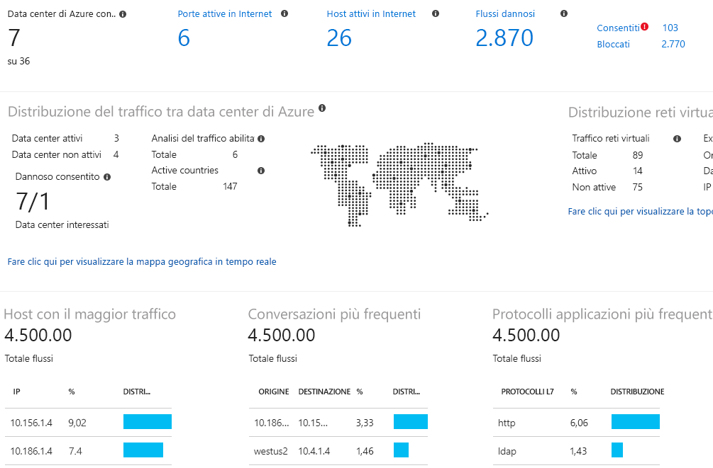

# Informazioni su Azure Network Watcher

Azure Network Watcher fornisce gli strumenti per il monitoraggio, la diagnostica, la visualizzazione delle metriche e l'abilitazione o la disabilitazione dei log per le risorse in una rete virtuale di Azure.

## Monitoraggio

### Monitorare la comunicazione tra una macchina virtuale e un endpoint

Gli endpoint possono essere un'altra macchina virtuale (VM), un nome di dominio completo (FQDN), un URI (Uniform Resource Identifier) o un indirizzo IPv4. La funzionalità di *monitoraggio connessione* monitora la comunicazione a intervalli regolari e informa l'utente in merito a modifiche relative a raggiungibilità, latenza e topologia di rete tra la macchina virtuale e l'endpoint. Può ad esempio esserci una macchina virtuale del server Web che comunica con una macchina virtuale del server di database. Un utente nell'organizzazione potrebbe, a insaputa di altri, applicare una route personalizzata o una regola di sicurezza di rete alla subnet o alla macchina virtuale del server Web o del server di database.

Se un endpoint smette di essere raggiungibile, la funzionalità di risoluzione dei problemi di connessione informa l'utente del motivo. Le cause possibili sono un problema di risoluzione del nome DNS, la CPU, la memoria o un firewall nel sistema operativo di una macchina virtuale oppure il tipo di hop di una route personalizzata o una regola di sicurezza per la macchina virtuale o la subnet della connessione in uscita. Leggere altre informazioni sulle [regole di sicurezza](../virtual-network/security-overview.md?toc=%2fazure%2fnetwork-watcher%2ftoc.json#security-rules) e sui [tipi di hop delle route](../virtual-network/virtual-networks-udr-overview.md?toc=%2fazure%2fnetwork-watcher%2ftoc.json) in Azure.

La funzionalità di monitoraggio connessione indica anche la latenza minima, media e massima osservata nel corso del tempo. Dopo aver appreso la latenza per una connessione, è possibile riuscire a ridurla spostando le risorse di Azure in aree di Azure diverse. Leggere altre informazioni su come determinare le [latenze relative tra aree di Azure e provider di servizi Internet](#determine-relative-latencies-between-azure-regions-and-internet-service-providers) e su come monitorare la comunicazione tra una macchina virtuale e un endpoint con la funzionalità di [monitoraggio connessione](connection-monitor.md). Se si preferisce testare una connessione in un determinato momento invece che monitorarla nel tempo come con la funzionalità di monitoraggio connessione, usare la funzionalità di [risoluzione dei problemi di connessione](#connection-troubleshoot).

Monitoraggio prestazioni rete è una soluzione di monitoraggio reti ibrida basata sul cloud che consente di monitorare le prestazioni della rete tra vari punti dell'infrastruttura di rete. Consente anche di monitorare la connettività di rete al servizio e agli endpoint dell'applicazione e di monitorare le prestazioni di Microsoft Azure ExpressRoute. Monitoraggio prestazioni rete rileva i problemi di rete, ad esempio buchi neri del traffico, errori di routing e altri problemi che i metodi di monitoraggio di rete tradizionali non riescono a rilevare. La soluzione genera avvisi e invia notifiche quando viene superata una soglia per un collegamento di rete. Garantisce anche una tempestiva individuazione dei problemi legati alle prestazioni di rete e localizza l'origine del problema in un dispositivo o segmento di rete specifico. Altre informazioni su [Monitoraggio prestazioni rete](../azure-monitor/insights/network-performance-monitor.md?toc=%2fazure%2fnetwork-watcher%2ftoc.json).

### Visualizzare le risorse in una rete virtuale e le relative relazioni

Man mano che vengono aggiunte risorse a una rete virtuale, può diventare difficile capire quali risorse sono presenti in una rete virtuale e quali sono le relazioni tra le risorse. La funzionalità di *topologia* consente di generare un diagramma visivo delle risorse in una rete virtuale, con le relazioni tra le risorse. La figura seguente illustra un diagramma di topologia di esempio per una rete virtuale con tre subnet, due macchine virtuali, interfacce di rete, indirizzi IP pubblici, gruppi di sicurezza di rete, tabelle di route e relazioni tra le risorse:

È possibile scaricare una versione modificabile dell'immagine in formato SVG. Leggere altre informazioni sulla [visualizzazione della topologia](view-network-topology.md).

## Diagnostica

### Diagnosticare i problemi di filtro del traffico di rete da o verso una macchina virtuale

Quando si distribuisce una macchina virtuale, Azure applica diverse regole di sicurezza predefinite per la macchina virtuale che consentono o bloccano il traffico da o verso la macchina virtuale. È possibile eseguire l'override delle regole predefinite di Azure o creare regole aggiuntive. A un certo punto, una macchina virtuale potrebbe non essere più in grado di comunicare con altre risorse, a causa di una regola di sicurezza. La funzionalità di *verifica flusso IP* consente di specificare un indirizzo IPv4 di origine e di destinazione, una porta, un protocollo (TCP o UDP) e la direzione del traffico (in ingresso o in uscita). La verifica flusso IP testa quindi la comunicazione e informa l'utente se la connessione ha esito positivo o negativo. In caso di esito negativo, la funzionalità di verifica flusso IP indica quale regola di sicurezza ha consentito o bloccato la comunicazione, per permettere di risolvere il problema. Per scoprire di più sulla funzionalità di verifica flusso IP, completare l'esercitazione [Diagnose a virtual machine network traffic filter problem](diagnose-vm-network-traffic-filtering-problem.md) (Diagnosticare un problema di filtro del traffico di rete di una macchina virtuale).

### Diagnosticare i problemi di routing di rete da una macchina virtuale

Quando si crea una rete virtuale, Azure crea diverse route predefinite in uscita per il traffico di rete. Il traffico in uscita da tutte le risorse, ad esempio le macchine virtuali, distribuite in una rete virtuale, viene instradato in base alle route predefinite di Azure. È possibile eseguire l'override delle route predefinite di Azure o creare route aggiuntive. È possibile che una macchina virtuale non riesca più a comunicare con altre risorse a causa di una route specifica. La funzionalità di *hop successivo* consente di specificare un indirizzo IPv4 di origine e di destinazione. L'hop successivo testa quindi la comunicazione e indica all'utente il tipo di hop successivo usato per instradare il traffico. È quindi possibile rimuovere, modificare o aggiungere una route, per risolvere un problema di routing. Leggere altre informazioni sulla funzionalità di [hop successivo](diagnose-vm-network-routing-problem.md).

### Diagnosticare i problemi delle connessioni in uscita da una macchina virtuale

La funzionalità di *risoluzione dei problemi di connessione* consente di testare una connessione tra una macchina virtuale e un'altra macchina virtuale, un FQDN, un URI o un indirizzo IPv4. Il test restituisce informazioni simili a quelle restituite quando si usa la funzionalità di [monitoraggio connessione](#connection-monitor), ma viene verificata la connessione in un determinato momento, invece di monitorarla nel tempo, come avviene con il monitoraggio connessione. Leggere altre informazioni sulla risoluzione dei problemi di connessione tramite la funzionalità di [risoluzione dei problemi di connessione](network-watcher-connectivity-overview.md).

### Acquisire i pacchetti da e verso una macchina virtuale

Opzioni di filtro avanzate e controlli ottimizzati, ad esempio la possibilità di impostare limitazioni di tempo e dimensioni, offrono versatilità. L'acquisizione può essere archiviata in Archiviazione di Azure, nel disco della macchina virtuale oppure in entrambe le posizioni. È quindi possibile analizzare il file di acquisizione usando diversi strumenti di analisi dell'acquisizione di rete standard. Leggere altre informazioni sull'[acquisizione pacchetti](network-watcher-packet-capture-overview.md).

### Diagnosticare i problemi relativi a un gateway di rete virtuale e alle connessioni di Azure

I gateway di rete virtuale forniscono la connettività tra le risorse locali e le reti virtuali di Azure. Il monitoraggio di questi gateway e delle rispettive connessioni è essenziale per assicurare che le comunicazioni non siano interrotte. La funzionalità di *diagnostica VPN* consente di diagnosticare i problemi relativi a gateway e connessioni. La diagnostica VPN consente di diagnosticare l'integrità del gateway, o della connessione gateway, e informa l'utente se sono disponibili un gateway e connessioni gateway. Se il gateway o la connessione non è disponibile, la diagnostica VPN indica il motivo, per consentire di risolvere il problema. Per scoprire di più sulla diagnostica VPN, è possibile completare l'esercitazione [Diagnosticare un problema di comunicazione tra le reti](diagnose-communication-problem-between-networks.md).

### Determinare le latenze relative tra aree di Azure e provider di servizi Internet

È possibile eseguire una query in Network Watcher per ottenere informazioni sulla latenza tra aree di Azure e tra provider di servizi Internet. Quando si conoscono le latenze tra aree di Azure e tra provider di servizi Internet, è possibile distribuire le risorse di Azure in modo da ottimizzare il tempo di risposta di rete. Leggere altre informazioni sulle [latenze relative](view-relative-latencies.md).

### Visualizzare le regole di sicurezza per un'interfaccia di rete

Le regole di sicurezza effettive per un'interfaccia di rete sono una combinazione tra tutte le regole di sicurezza applicate all'interfaccia di rete e la subnet in cui si trova l'interfaccia di rete.  La funzionalità di *visualizzazione gruppo di sicurezza* mostra tutte le regole di sicurezza applicate all'interfaccia di rete, la subnet in cui si trova l'interfaccia di rete e l'aggregazione di entrambi gli elementi. Comprendendo quali regole vengono applicate a un'interfaccia di rete, è possibile aggiungere, rimuovere o modificare le regole per modificare il traffico consentito o bloccato. Leggere altre informazioni sulla [visualizzazione gruppo di sicurezza](network-watcher-security-group-view-overview.md).

## Metriche

Sono previsti [limiti](../azure-subscription-service-limits.md?toc=%2fazure%2fnetwork-watcher%2ftoc.json#azure-resource-manager-virtual-networking-limits) per il numero di risorse di rete che è possibile creare in un'area e in una sottoscrizione di Azure. Se si raggiungono tali limiti, non è possibile creare altre risorse all'interno dell'area o della sottoscrizione. La funzionalità *limite sottoscrizioni di rete* fornisce un riepilogo della quantità di risorse di rete di ogni tipo distribuite in una sottoscrizione e in un'area e l'indicazione del limite per tale risorsa. La figura seguente mostra l'output parziale delle risorse di rete distribuite nell'area Stati Uniti orientali per una sottoscrizione di esempio:

Le informazioni sono utili per pianificare le distribuzioni di risorse future.

## Log

### Analizzare il traffico da o verso un gruppo di sicurezza di rete

I gruppi di sicurezza di rete (NSG) consentono o bloccano il traffico in ingresso o in uscita per un'interfaccia di rete in una macchina virtuale. La funzionalità di *log del flusso del NSG* consente di registrare l'indirizzo IP di origine e destinazione, la porta, il protocollo e un'indicazione del fatto che il traffico sia stato consentito o bloccato da un gruppo di sicurezza di rete. È possibile analizzare i log usando diversi strumenti, ad esempio Power BI e la funzionalità di *analisi del traffico*. L'analisi del traffico fornisce visualizzazioni dettagliate dei dati scritti nei log di flusso del gruppo di sicurezza di rete. La figura seguente illustra alcune delle informazioni e delle visualizzazioni che l'analisi del traffico presenta dai dati di log di flusso del gruppo di sicurezza di rete:

Ottenere altre informazioni sui log di flusso NSG completando l'esercitazione [Registrare il traffico di rete da e verso una macchina virtuale](network-watcher-nsg-flow-logging-portal.md) e scoprire le procedure per implementare l'[analisi del traffico](traffic-analytics.md).

### Visualizzare i log di diagnostica per le risorse di rete

È possibile abilitare la registrazione diagnostica per le risorse di rete di Azure, ad esempio gruppi di sicurezza di rete, indirizzi IP pubblici, servizi di bilanciamento del carico, gateway di rete virtuale e gateway applicazione. La funzionalità di *log di diagnostica* offre una singola interfaccia per abilitare e disabilitare i log di diagnostica per qualsiasi risorsa di rete esistente che genera un log di diagnostica. È possibile visualizzare i log di diagnostica usando strumenti come Microsoft Power BI e i log di Monitoraggio di Azure. Per altre informazioni sull'analisi dei log di diagnostica di rete di Azure, vedere [Soluzioni di monitoraggio di rete di Azure nei log di Monitoraggio di Azure](../azure-monitor/insights/azure-networking-analytics.md?toc=%2fazure%2fnetwork-watcher%2ftoc.json).

## Abilitazione automatica di Network Watcher
Quando si crea o si aggiorna una rete virtuale nella sottoscrizione, Network Watcher viene abilitato automaticamente nell'area della rete virtuale. Non è previsto alcun impatto sulle risorse o alcun addebito associato per l'abilitazione automatica di Network Watcher. Per altre informazioni, vedere [Creare un'istanza di Network Watcher](network-watcher-create.md).

## Passaggi successivi

In questo articolo è stata presentata una panoramica di Azure Network Watcher. Per iniziare a usare Network Watcher, diagnosticare un problema di comunicazione comune da e verso una macchina virtuale usando la verifica flusso IP. Per informazioni su come procedere, vedere la guida introduttiva [Diagnose a virtual machine network traffic filter problem](diagnose-vm-network-traffic-filtering-problem.md) (Diagnosticare un problema di filtro del traffico di rete di una macchina virtuale).
