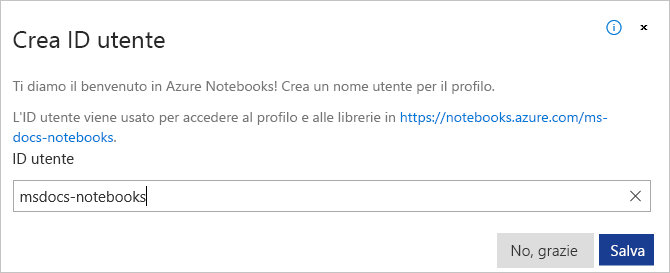

# Profilo e ID utente per i Azure Notebooks

Nello spazio potente e collaborativo di Azure Notebooks, il profilo utente presenta l'immagine pubblica agli altri:

L'ID utente è parte della URL usata per condividere i progetti e i notebook. L'elenco seguente descrive i diversi modelli di URL:

- `https://notebooks.azure.com/<user_id>`: pagina del profilo.
- `https://notebooks.azure.com/<user_id>/projects`: i progetti. Vengono visualizzati tutti i progetti; gli altri utenti vedono solo i progetti pubblici.
- `https://notebooks.azure.com/<user_id>/projects/<project_id>`: file di progetto.
- `https://notebooks.azure.com/<user_id>/projects/<project_id>/clones`: cloni di un progetto specifico.
- `https://notebooks.azure.com/<user_id>/projects/<project_id>/html/<notebook>.ipynb`: anteprima HTML di un file o di un notebook specifico.

## ID utente

Quando si accede ad Azure Notebooks per la prima volta, all'account viene assegnato automaticamente un ID utente temporaneo, per esempio "anon-idr3ca". A condizione che si disponga di un ID utente che inizia con "anon-", Azure Notebooks richiede di modificarlo ogni volta che si effettua l'accesso:

Accanto al nome utente temporaneo compare anche il comando **Configura ID utente**:

È anche possibile modificare l'ID utente in qualsiasi momento nella pagina del profilo.

Un ID utente deve essere composto da un numero di lettere, un numero e un segno meno compreso tra quattro e sedici. Non sono consentiti altri caratteri e l'ID utente non può iniziare o terminare con un trattino né è possibile utilizzare più trattini in fila. Poiché gli ID utente sono univoci in tutti gli account di Azure Notebooks, è possibile che venga visualizzato il messaggio "l'ID utente è già in uso". Il messaggio viene visualizzato anche se si tenta di usare un marchio Microsoft come ID utente. In questi casi, scegliere un ID utente diverso.

> [!Important]
> La modifica del proprio ID rende non valido qualsiasi URL eventualmente condiviso con l'ID precedente. È possibile modificare l'ID usando l'ID precedente per riconvalidare i collegamenti. Tuttavia, nel frattempo un altro utente può richiedere un ID inutilizzato.

## Profilo

Il profilo è composto da informazioni visualizzabili pubblicamente nella URL, `https://notebooks.azure.com/<user_id>`. La pagina del profilo mostra anche i progetti usati di recente e tutti i progetti contrassegnati con una stella.

Per modificare il profilo, usare il comando **Modifica le informazioni del profilo** nella pagina del profilo. Le sezioni del profilo sono le seguenti:

| Sezione | Sommario |
| --- | --- |
| Foto profilo | Un'immagine che viene visualizzata nella pagina del profilo. |
| Informazioni account | Il nome visualizzato, l'ID utente e l'account di posta elettronica pubblico. In questo caso l'account di posta elettronica fornisce agli altri utenti un mezzo di contatto e può essere diverso dall'[account](azure-notebooks-user-account.md) usato per accedere ad Azure Notebooks stesso. |
| Informazioni del profilo | Percorso, azienda, posizione, sito Web e una breve descrizione personale. |
| Profili social | Di GItHub, Twitter e Facebook, se li si vuole condividere. |
| Impostazioni sulla privacy | Fornisce due comandi:<ul><li>**Esporta il profilo**: crea e scarica un file *.zip* che contiene tutte le informazioni che Azure Notebooks salva nel profilo, tra cui la foto, le informazioni del profilo e i log di protezione.</li><li>**Elimina account**personale: Elimina definitivamente tutte le informazioni personali archiviate in Azure Notebooks.</li></ul> |
| Abilitare le funzionalità del sito | Consente di controllare gli aspetti del comportamento di Azure Notebooks:<ul><li>**Front-end unificato per Notebooks**: abilita l'avvio più veloce del notebook e una persistenza migliore.</li><li>**Esegui in JupyterLab per**impostazione predefinita: per impostazione predefinita, Azure Notebooks fornisce una semplice interfaccia utente adatta alla maggior parte degli utenti. JupyterLab fornisce un'interfaccia più completa ma più complessa per utenti esperti.</li><li>**Sito Web VNext**: consente il layout Web moderno mostrato in questa documentazione.</li></ul> |

## Passaggi successivi  

> [!div class="nextstepaction"]
> [Esercitazione: Creare ed eseguire un notebook di Jupyter per la regressione lineare](tutorial-create-run-jupyter-notebook.md)
