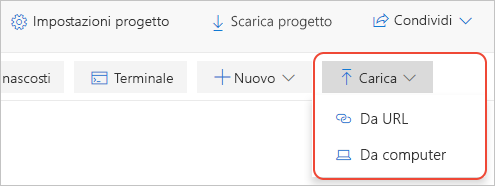

# Avvio rapido: Eseguire la migrazione di un notebook di Jupyter locale

I notebook di Jupyter creati da utente in locale sono accessibili solo dall'utente, che potrà condividerli in vari modi, ma ai destinatari resterà una copia locale del notebook, in cui sarà difficile incorporare eventuali modifiche necessarie. È anche possibile archiviare i notebook in un repository online condiviso come GitHub, ma in questo caso è necessario che ogni collaboratore abbia un'installazione Jupyter locale con la stessa configurazione di cui dispone l'utente.

Eseguendo la migrazione in Azure Notebooks dei notebook locali o basati su repository, questi vengono archiviati nel cloud da cui è possibile condividerli immediatamente con i collaboratori. Questi ultimi possono visualizzare ed eseguire il notebook mediante un semplice browser e, se [accedono](quickstart-sign-in-azure-notebooks.md) ad Azure Notebooks, possono anche apportare modifiche.

Questo argomento di avvio rapido illustra il processo di migrazione di un notebook dal computer locale o da un altro URL di file accessibile. Per migrare un notebook da un repository di GitHub, vedere [Avvio rapido: Clonare un notebook](quickstart-clone-jupyter-notebook.md).

## Creare un progetto in Azure Notebooks

1. Passare ad [Azure Notebooks](https://notebooks.azure.com) ed eseguire l'accesso. Per informazioni dettagliate, vedere [Avvio rapido: Accedere ad Azure Notebooks](quickstart-sign-in-azure-notebooks.md).

1. Dalla pagina del profilo pubblico selezionare **My Projects** (Progetti personali) nella parte superiore:

    

1. Nella pagina **My Projects** (Progetti personali) selezionare **+ New Project** (+ Nuovo progetto) (tasto di scelta rapida: n); se la finestra del browser è di dimensioni ridotte, il pulsante potrebbe essere visualizzato solo come **+**:

    

1. Nella finestra popup **Create New Project** (Crea nuovo progetto) visualizzata immettere i valori appropriati per il notebook di cui si sta eseguendo la migrazione nei campi **Project name**  (Nome progetto) e **Project ID** (ID progetto), deselezionare le opzioni **Public project** (Progetto pubblico) e **Create a README.md** (Crea un README.md) e quindi selezionare **Create** (Crea).

## Caricare il notebook locale

1. Nella pagina del progetto selezionare **Upload** (Carica), che potrebbe essere visualizzato sotto forma di freccia se la finestra del browser è di dimensioni ridotte, e quindi selezionare 1. Nella finestra popup visualizzata selezionare **From computer** (Da computer) se il notebook si trova nel file system locale o **From URL** (Da URL) se il notebook è disponibile online:

    

   Anche in questo caso, se il notebook si trova in un repository di GitHub, seguire la procedura descritta in [Avvio rapido: Clonare un notebook](quickstart-clone-jupyter-notebook.md).

   - Se si usa l'opzione **From Computer** (Da computer), trascinare i file *.ipynb* nella finestra popup o selezionare **Choose Files** (Scegli file) e quindi passare ai file di dati da importare e selezionarli. Selezionare quindi **Carica**. A file caricati viene assegnato lo stesso nome dei file locali. Non è necessario caricare il contenuto della cartella *.ipynb_checkpoints*.

     

   - Se si usa l'opzione **From URL** (Da URL), immettere l'indirizzo dell'origine nel campo **File URL** (URL del file) e il nome file da assegnare al notebook nel progetto nel campo **File Name** (Nome file). Selezionare quindi **Carica**. Se si hanno più file con URL separati, usare il comando **+ Add file** (Aggiungi file) per verificare il primo URL immesso. Nella finestra popup verranno quindi visualizzati nuovi campi per un altro file.

     

1. Aprire ed eseguire il notebook appena caricato per verificarne il contenuto e il funzionamento. Al termine, selezionare **File** > **Halt and close** (File > Interrompi e chiudi) per chiudere il notebook.

1. Per condividere un collegamento al notebook caricato, fare clic con il pulsante destro del mouse sul file nel progetto e selezionare **Copy Link** (Copia collegamento) (tasto di scelta rapida: y) e quindi incollare il collegamento nel messaggio appropriato. In alternativa, è possibile condividere l'intero progetto usando il controllo **Share** (Condividi) nella pagina del progetto.

1. Per modificare file diversi dai notebook, fare clic con il pulsante destro del mouse sul file nel progetto e scegliere **Edit file** (Modifica file) (tasto di scelta rapida: i). L'operazione predefinita **Run** (Esegui) (tasto di scelta rapida: r) mostra solo il contenuto del file e non consente la modifica.

## Passaggi successivi

> [!div class="nextstepaction"]
> [Esercitazione: Creare ed eseguire un notebook di Jupyter per la regressione lineare](tutorial-create-run-jupyter-notebook.md)
