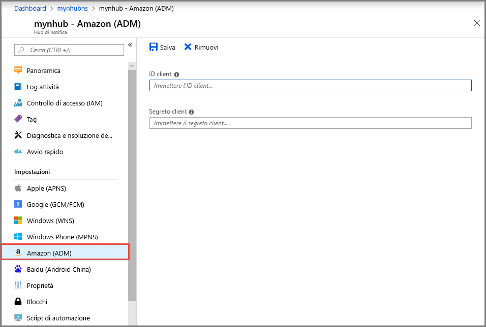

# Configurare le impostazioni di Android Device Messaging (ADM) per un hub di notifica nel portale di Azure
Questo articolo illustra come configurare le impostazioni di Android Device Messaging (ADM) per un hub di notifica di Azure usando il portale di Azure. 

## Prerequisiti
Se non è stato già creato un hub di notifica, crearne uno ora. Per altre informazioni, vedere [Creare un hub di notifica di Azure nel portale di Azure](create-notification-hub-portal.md). 

## Configurare Android Device Messaging

La procedura seguente illustra i passaggi per configurare le impostazioni di Amazon Device Messaging (ADM) per un hub di notifica: 

1. Nel portale di Azure, nelle **Hub di notifica** pagina, selezionare **Amazon (ADM)** nel menu a sinistra.
2. Immettere i valori per **ID client** e **Segreto client**.
3. Selezionare **Salva**.
    
   

## Passaggi successivi
Per un'esercitazione con istruzioni dettagliate per il push di notifiche a dispositivi Android con hub di notifica di Azure e Android Device Messaging (ADM), vedere [Introduzione ad hub di notifica per le applicazioni Kindle](notification-hubs-kindle-amazon-adm-push-notification.md).

