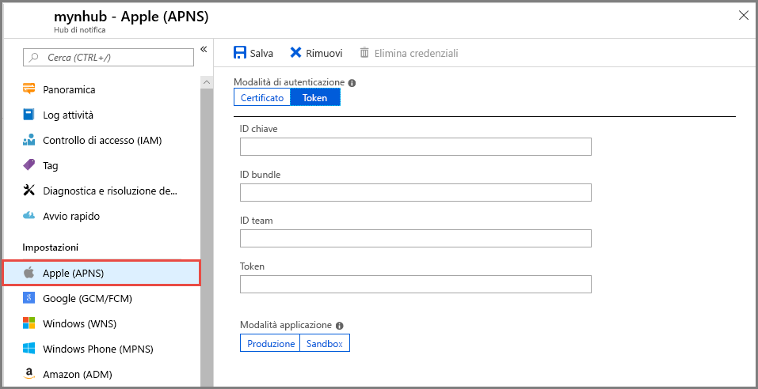

# Configurare le impostazioni di Apple Push Notification Service (APNS) per un hub di notifica nel portale di Azure
Questo articolo illustra come configurare le impostazioni di Apple Push Notification Service (APNS) per un hub di notifica di Azure usando il portale di Azure. 

## Prerequisiti
Se non è stato già creato un hub di notifica, crearne uno ora. Per altre informazioni, vedere [Creare un hub di notifica di Azure nel portale di Azure](create-notification-hub-portal.md). 

## Configurare il servizio Apple Push Notification

La procedura seguente illustra i passaggi per configurare le impostazioni di Apple Push Notification Service (APNS) per un hub di notifica:

1. Nel portale di Azure, nelle **Hub di notifica** pagina, selezionare **Apple (APNS)** nel menu a sinistra.

1. Per **Modalità di autenticazione** selezionare **Certificato** oppure **Token**.

   a. Se si seleziona **Certificato**:
   * Selezionare l'icona del file e quindi il file con estensione *p12* da caricare.
   * Immettere una password.
   * Selezionare la modalità **Sandbox**. In alternativa, se si vogliono inviare notifiche push agli utenti che hanno acquistato l'app dallo Store, selezionare la modalità **Produzione**.

     

   b. Se si seleziona **Token**:

   * Immettere i valori per **ID chiave**, **ID bundle**, **ID team** e **Token**.
   * Selezionare la modalità **Sandbox**. In alternativa, se si vogliono inviare notifiche push agli utenti che hanno acquistato l'app dallo Store, selezionare la modalità **Produzione**.

     

## Passaggi successivi
Per un'esercitazione con istruzioni dettagliate per eseguire il push di notifiche a dispositivi iOS, vedere l'articolo seguente: [Effettuare il push di notifiche ai dispositivi iOS con Hub di notifica e APNS](notification-hubs-ios-apple-push-notification-apns-get-started.md)
