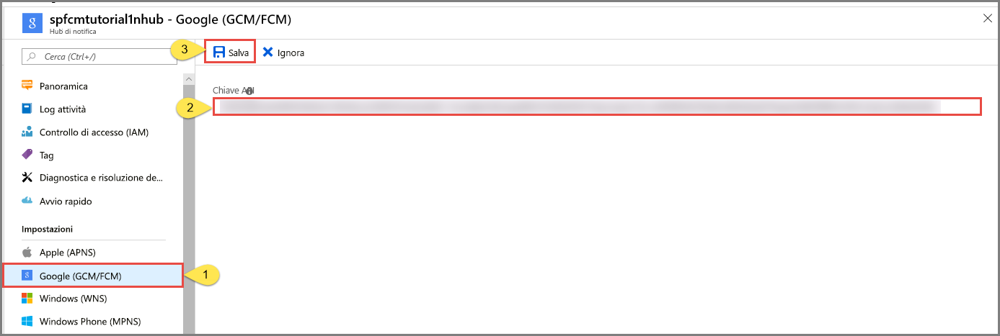

# Configurare le impostazioni di Google Firebase Cloud Messaging (FCM) per un hub di notifica nel portale di Azure
Questo articolo illustra come configurare le impostazioni di Google Firebase Cloud Messaging (FCM) per un hub di notifica di Azure usando il portale di Azure.  

## Prerequisiti
Se non è stato già creato un hub di notifica, crearne uno ora. Per altre informazioni, vedere [Creare un hub di notifica di Azure nel portale di Azure](create-notification-hub-portal.md). 

## Configurare Google Firebase Cloud Messaging (FCM)

La procedura seguente illustra i passaggi per configurare le impostazioni di Google Firebase Cloud Messaging (FCM) per un hub di notifica: 

1. Nel portale di Azure, nelle **Hub di notifica** pagina, selezionare **Google (GCM/FCM)** nel menu a sinistra. 
2. Incollare il valore di **Chiave API** per il progetto FCM salvato in precedenza. 
3. Selezionare **Salva**. 

   

## Passaggi successivi
Per un'esercitazione con istruzioni dettagliate per il push di notifiche a dispositivi Android con hub di notifica di Azure e Google Firebase Cloud Messaging, vedere [inviare notifiche Push a dispositivi Android con hub di notifica e Google FCM ](notification-hubs-android-push-notification-google-fcm-get-started.md).

