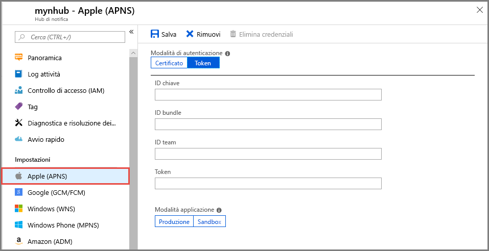

# <a name="quickstart-set-up-push-notifications-in-a-notification-hub"></a>Avvio rapido: Configurare notifiche push in un hub di notifica

Hub di notifica di Azure offre un motore di push facile da usare e di cui è possibile aumentare il numero di istanze. Usare Hub di notifica per inviare notifiche a qualsiasi piattaforma (iOS, Android, Windows, Baidu) e da qualsiasi back-end (cloud o locale). Per altre informazioni, vedere [Informazioni su Hub di notifica di Azure](notification-hubs-push-notification-overview.md).

In questo argomento di avvio rapido si useranno le impostazioni Platform Notification System (PNS) in Hub di notifica per configurare le notifiche push su più piattaforme. Questo argomento di avvio rapido illustra i passaggi da eseguire nel portale di Azure.  [Google Firebase Cloud Messaging](?tabs=azure-cli#google-firebase-cloud-messaging-fcm) include le istruzioni per l'uso dell'interfaccia della riga di comando di Azure.

Se non è stato già creato un hub di notifica, crearne uno ora. Per altre informazioni, vedere [Creare un hub di notifica di Azure nel portale di Azure](create-notification-hub-portal.md) o [Creare un hub di notifica di Azure con l'interfaccia della riga di comando di Azure](create-notification-hub-azure-cli.md)

## <a name="apple-push-notification-service"></a>Apple Push Notification Service

Per configurare Apple Push Notification Service (APNS):

1. Nella pagina **Hub di notifica** del portale di Azure, selezionare **Apple (APNS)** nel menu a sinistra.

1. Per **Modalità di autenticazione** selezionare **Certificato** oppure **Token**.

   a. Se si seleziona **Certificato**:
   * Selezionare l'icona del file e quindi il file con estensione *p12* da caricare.
   * Immettere una password.
   * Selezionare la modalità **Sandbox**. In alternativa, se si vogliono inviare notifiche push agli utenti che hanno acquistato l'app dallo Store, selezionare la modalità **Produzione**.

     

   b. Se si seleziona **Token**:

   * Immettere i valori per **ID chiave**, **ID bundle**, **ID team** e **Token**.
   * Selezionare la modalità **Sandbox**. In alternativa, se si vogliono inviare notifiche push agli utenti che hanno acquistato l'app dallo Store, selezionare la modalità **Produzione**.

     

Per altre informazioni, vedere [Inviare notifiche push alle app iOS con Hub di notifica di Azure](ios-sdk-get-started.md).

## <a name="google-firebase-cloud-messaging-fcm"></a>Google Firebase Cloud Messaging (FCM)

# <a name="portal"></a>[Portale](#tab/azure-portal)

Per configurare le notifiche push per Google FCM:

1. Nella pagina **Hub di notifica** del portale di Azure, selezionare **Google (GCM/FCM)** nel menu a sinistra.
2. Incollare il valore di **Chiave API** per il progetto Google FCM salvato in precedenza.
3. Selezionare **Salva**.

   

Dopo aver completato questi passaggi, un avviso indica che l'hub di notifica è stata aggiornato correttamente. Il pulsante **Save** (Salva) è disabilitato.

# <a name="azure-cli"></a>[Interfaccia della riga di comando di Azure](#tab/azure-cli)

### <a name="prerequisites"></a>Prerequisiti

Per eseguire le procedure descritte è necessario:

* L'[interfaccia della riga di comando di Azure](/cli/azure/install-azure-cli) versione 2.0.67 o successiva.

* Estensione dell'interfaccia della riga di comando di Azure [per gli Hub di notifica](/cli/azure/ext/notification-hub/notification-hub).
* La **Chiave API** per un progetto Google Firebase Cloud Messaging (FCM).

### <a name="set-up-push-notifications-for-google-fcm"></a>Configurare le notifiche push per Google FCM

1. Usare il comando [az notification-hub credential gcm update](/cli/azure/ext/notification-hub/notification-hub/credential/gcm#ext-notification-hub-az-notification-hub-credential-gcm-update) per aggiungere la chiave dell'API Google all'hub di notifica.

   ```azurecli
   az notification-hub credential gcm update --resource-group spnhubrg --namespace-name spnhubns    --notification-hub-name spfcmtutorial1nhub --google-api-key myKey
   ```

2. L'app Android necessita di una stringa di connessione per connettersi all'hub di notifica.  Usare il comando [az notification-hub authorization-rule list](/cli/azure/ext/notification-hub/notification-hub/authorization-rule#ext-notification-hub-az-notification-hub-authorization-rule-list) per elencare i criteri di accesso disponibili.  Usare il comando [az notification-hub authorization-rule list-keys](/cli/azure/ext/notification-hub/notification-hub/authorization-rule#ext-notification-hub-az-notification-hub-authorization-rule-list-keys) per ottenere le stringhe di connessione dei criteri di accesso.  Specificare il **primaryConnectionString** o **secondaryConnectionString** nel parametro `--query` per ottenere direttamente la stringa di connessione primaria.

   ```azurecli
   #list access policies for a notification hub
   az notification-hub authorization-rule list --resource-group spnhubrg --namespace-name spnhubns --notification-hub-name spfcmtutorial1nhub --output table

   #list keys and connection strings for a notification hub access policy
   az notification-hub authorization-rule list-keys --resource-group spnhubrg --namespace-name spnhubns --notification-hub-name spfcmtutorial1nhub --name myAccessPolicyName --output json

   #get the primaryConnectionString for an access policy
   az notification-hub authorization-rule list-keys --resource-group spnhubrg --namespace-name spnhubns --notification-hub-name spfcmtutorial1nhub --name myAccessPolicyName --query primaryConnectionString
   ```

3. Usare il comando [az notification-hub test-send](/cli/azure/ext/notification-hub/notification-hub#ext-notification-hub-az-notification-hub-test-send) per testare l'invio di messaggi all'app Android.

   ```azurecli
   #test with message body
   az notification-hub test-send --resource-group spnhubrg --namespace-name spnhubns --notification-hub-name spfcmtutorial1nhub --notification-format gcm --message "my message body"

   #test with JSON string
   az notification-hub test-send --resource-group spnhubrg --namespace-name spnhubns --notification-hub-name spfcmtutorial1nhub --notification-format gcm --payload "{\"data\":{\"message\":\"my JSON string\"}}"
   ```

Ottenere i riferimenti all'interfaccia della riga di comando di Azure per altre piattaforme con il comando [az notification-hub credential](/cli/azure/ext/notification-hub/notification-hub/credential).

---

Per altre informazioni sul push delle notifiche a un'applicazione Android, vedere [Inviare notifiche push ai dispositivi Android con Firebase](notification-hubs-android-push-notification-google-fcm-get-started.md).

## <a name="windows-push-notification-service"></a>Servizi notifica Push Windows

Per configurare Servizi notifica Push Windows (WNS):

1. Nella pagina **Hub di notifica** del portale di Azure, selezionare **Windows (WNS)** nel menu a sinistra.
2. Immettere i valori per **SID pacchetto** e **Chiave di sicurezza**.
3. Selezionare **Salva**.

   

Per informazioni, vedere [Inviare notifiche alle app della piattaforma UWP con Hub di notifica di Azure](notification-hubs-windows-store-dotnet-get-started-wns-push-notification.md).

## <a name="microsoft-push-notification-service-for-windows-phone"></a>Servizio notifica push Microsoft per Windows Phone

Per configurare Servizio notifica push Microsoft (MPNS) per Windows Phone:

1. Nella pagina **Hub di notifica** del portale di Azure, selezionare **Windows Phone (MPNS)** nel menu a sinistra.
1. Abilitare le notifiche push non autenticate o autenticate:

   a. Per abilitare le notifiche push non autenticate, selezionare **Abilita notifiche push non autenticate** > **Salva**.

      

   b. Per abilitare le notifiche push autenticate:
      * Selezionare **Carica certificato** sulla barra degli strumenti.
      * Selezionare l'icona del file e quindi il file del certificato.
      * Immettere la password per il certificato.
      * Selezionare **OK**.
      * Nella pagina **Windows Phone(MPNS)** selezionare **Salva**.

Per altre informazioni, vedere [Effettuare il push di notifiche alle app Windows Phone con Hub di notifica](notification-hubs-windows-mobile-push-notifications-mpns.md).

## <a name="baidu-android-china"></a>Baidu (Android China)

Per configurare le notifiche push per Baidu:

1. Nella pagina **Hub di notifica** del portale di Azure, selezionare **Baidu (Android China)** nel menu a sinistra.
2. Immettere il valore di **Chiave API** ottenuto dalla console di Baidu nel progetto push cloud Baidu.
3. Immettere il valore **Chiave privata** ottenuto dalla console di Baidu nel progetto push cloud Baidu.
4. Selezionare **Salva**.

    

Dopo aver completato questi passaggi, un avviso indica che l'hub di notifica è stata aggiornato correttamente. Il pulsante **Save** (Salva) è disabilitato.

Per altre informazioni, vedere [Introduzione ad Hub di notifica tramite Baidu](notification-hubs-baidu-china-android-notifications-get-started.md).

## <a name="next-steps"></a>Passaggi successivi

In questo argomento di avvio rapido è stato illustrato come configurare le impostazioni Platform Notification System per un hub di notifica nel portale di Azure.

Per altre informazioni su come effettuare il push di notifiche a diverse piattaforme, vedere queste esercitazioni:

* [Inviare notifiche push alle app iOS con Hub di notifica di Azure](ios-sdk-get-started.md)
* [Inviare notifiche a dispositivi Android con Hub di notifica e Google FCM](notification-hubs-android-push-notification-google-fcm-get-started.md)
* [Inviare notifiche a un'app della piattaforma UWP in un dispositivo Windows](notification-hubs-windows-store-dotnet-get-started-wns-push-notification.md)
* [Inviare notifiche a un'app di Windows Phone 8 con MPNS](notification-hubs-windows-mobile-push-notifications-mpns.md)
* [Inviare notifiche con Hub di notifica e push cloud Baidu](notification-hubs-baidu-china-android-notifications-get-started.md)
