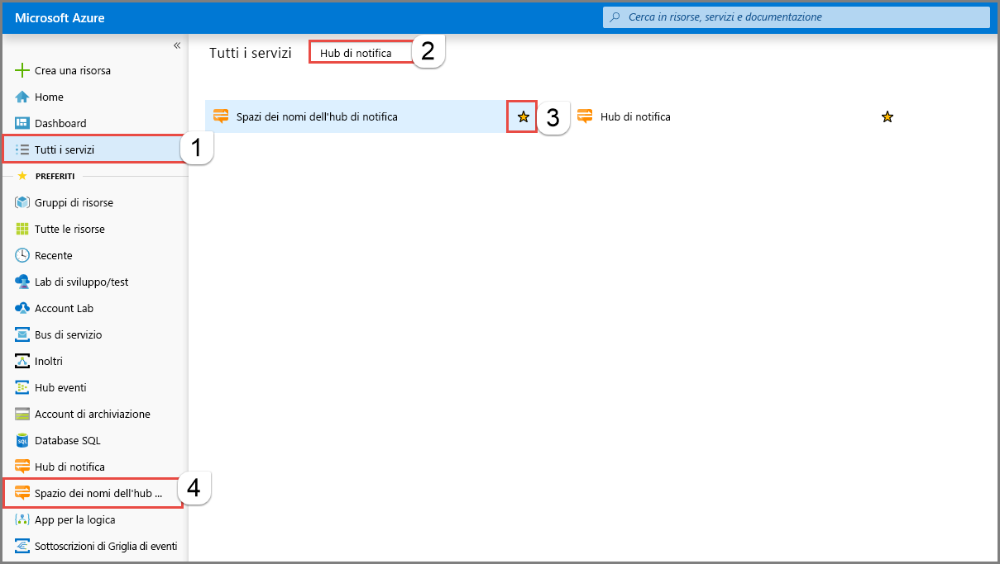
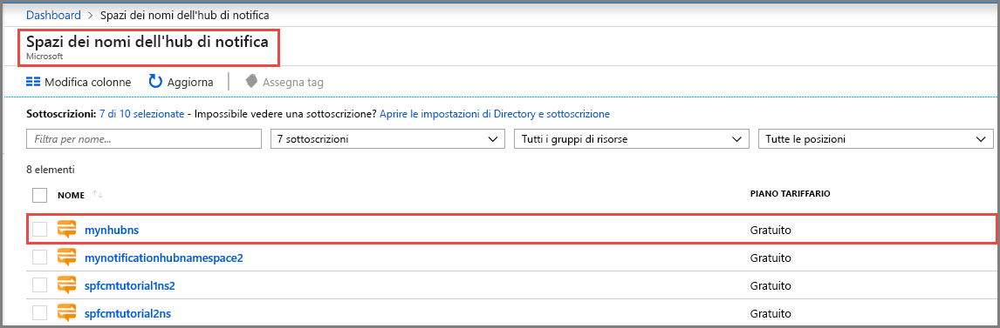
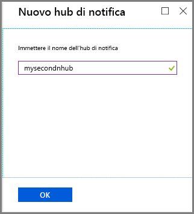
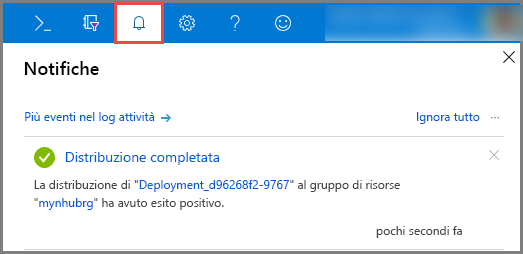
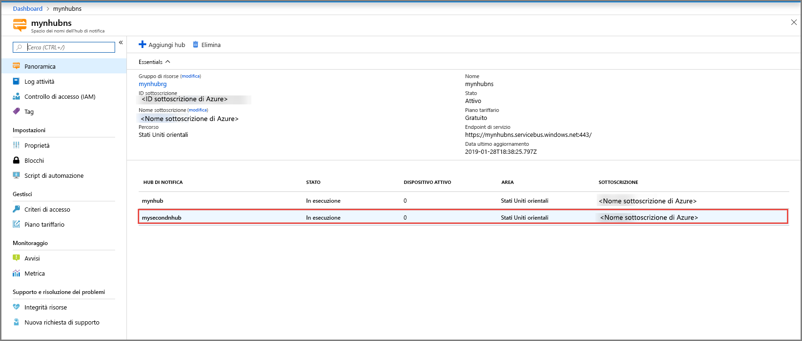
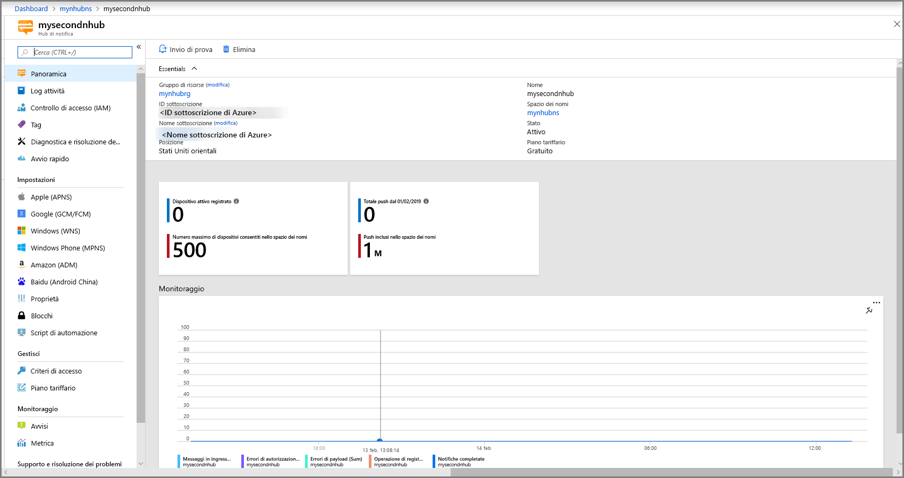

# Creare un hub di notifica di Azure nel portale di Azure 
Hub di notifica di Azure offre un motore di push di facile uso e con scalabilità orizzontale che consente di inviare notifiche a qualsiasi piattaforma (iOS, Android, Windows, Kindle, Baidu e così via) da qualsiasi back-end (cloud o locale). Per altre informazioni sul servizio, vedere [Informazioni su Hub di notifica](notification-hubs-push-notification-overview.md).

In questa guida introduttiva viene creato un hub di notifica nel portale di Azure. La prima sezione illustra i passaggi per creare uno spazio dei nomi Hub di notifica e un hub in tale spazio dei nomi. La seconda sezione descrive i passaggi per creare un hub di notifica in uno spazio dei nomi Hub di notifica esistente. 

## Creare uno spazio dei nomi e un hub di notifica
In questa sezione viene creato uno spazio dei nomi e un hub nello spazio dei nomi. 

[!INCLUDE [notification-hubs-portal-create-new-hub](../../includes/notification-hubs-portal-create-new-hub.md)]

## Creare un hub di notifica in uno spazio dei nomi esistente
In questa sezione viene creato un hub di notifica in uno spazio dei nomi esistente. 

1. Accedere al [portale di Azure](https://portal.azure.com).
2. Selezionare **Tutti i servizi** nel menu a sinistra, cercare **Hub di notifica**, selezionare la **stella** (`*`) accanto a **Spazi dei nomi dell'hub di notifica** per aggiungerlo alla sezione **PREFERITI** nel menu a sinistra. Selezionare **Spazi dei nomi dell'hub di notifica**. 

      
3. Nella pagina **Spazi dei nomi dell'hub di notifica** selezionare lo spazio dei nomi nell'elenco. 

      
1. Nella pagina **Spazi dei nomi dell'hub di notifica** selezionare **Aggiungi hub** nella barra degli strumenti. 

      
4. Nella pagina **Nuovo hub di notifica** immettere un nome per l'hub di notifica e selezionare **OK**.

      
4. Selezionare **Notifiche** (icona a forma di campanello) nella parte superiore per visualizzare lo stato della distribuzione del nuovo hub. Selezionare **X** nell'angolo destro per chiudere la finestra di notifica. 

      
5. Aggiornare la pagina Web **Spazi dei nomi dell'hub di notifica** per visualizzare il nuovo hub nell'elenco. 

      
6. Selezionare l'**hub di notifica** per visualizzare la home page dell'hub di notifica. 

      

## Passaggi successivi
In questa guida introduttiva è stato creato un hub di notifica. Per informazioni su come configurare l'hub con le impostazioni PNS (Platform Notification System), vedere [Configurare un hub di notifica con le impostazioni PNS](configure-notification-hub-portal-pns-settings.md). 