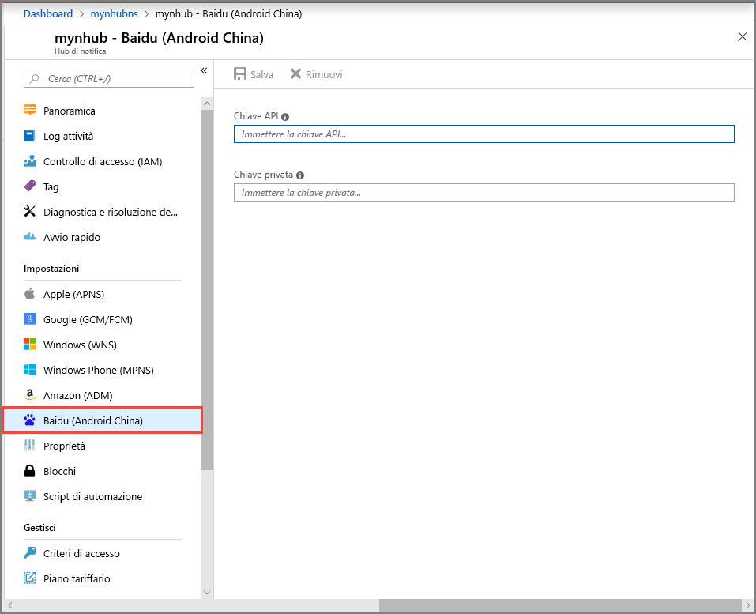

# <a name="get-started-with-notification-hubs-using-baidu"></a>Introduzione ad Hub di notifica tramite Baidu
[!INCLUDE [notification-hubs-selector-get-started](../../includes/notification-hubs-selector-get-started.md)]

Baidu cloud push è un servizio cloud cinese che consente di inviare notifiche push ai dispositivi mobili. 

Dato che Google Play e FCM (Firebase Cloud Messaging) non sono disponibili in Cina, è necessario usare app store e servizi push diversi. Uno di questi è Baidu, attualmente usato da Hub di notifica.

## <a name="prerequisites"></a>prerequisiti
Questa esercitazione richiede:

* Android SDK (si presuppone che venga usato Android Studio), scaricabile dal <a href="http://go.microsoft.com/fwlink/?LinkId=389797">sito Android</a>
* [Baidu Push Android SDK]

> [!NOTE]
> Per completare l'esercitazione, è necessario disporre di un account Azure attivo. Se non si dispone di un account Azure, è possibile creare un account di valutazione gratuito in pochi minuti. Per informazioni dettagliate, vedere la pagina relativa alla [versione di valutazione gratuita di Azure](https://azure.microsoft.com/pricing/free-trial/?WT.mc_id=A0E0E5C02&amp;returnurl=http%3A%2F%2Fazure.microsoft.com%2Fen-us%2Fdocumentation%2Farticles%2Fnotification-hubs-baidu-get-started%2F).
> 
> 

## <a name="create-a-baidu-account"></a>Creare un account Baidu
Per usare Baidu, è necessario un account Baidu. Se è già disponibile un account, accedere al [portale di Baidu] e procedere al passaggio successivo. In caso contrario, vedere le istruzioni seguenti sulla creazione di un account Baidu.  

1. Andare al [portale di Baidu] e fare clic sul collegamento **登录** (**Accedi**). Fare clic su **立即注册** (**Esegui registrazione**) per avviare il processo di registrazione dell'account.
   
    

2. Immettere i dettagli necessari, ossia numero di telefono/indirizzo di posta elettronica, password e codice di verifica, e fare clic su 注册 (**Iscrizione**).
   
    

3. Si riceverà un messaggio di posta elettronica all'indirizzo specificato, con un collegamento per l'attivazione dell'account Baidu.
   
    

4. Accedere all'account di posta elettronica, aprire il messaggio per l'attivazione di Baidu e fare clic sul collegamento per attivare l'account.
   
    

Dopo l'attivazione di un account Baidu, accedere al [portale di Baidu].

## <a name="create-a-baidu-cloud-push-project"></a>Creare un progetto di Baidu cloud push
Quando si crea un progetto di Baidu cloud push, si ricevono l'ID dell'app, la chiave API e la chiave privata.

1. Dopo avere effettuato l'accesso al [portale di Baidu], fare clic su **更多>>** (**altro**).
   
    

2. Scorrere verso il basso la sezione **站长与开发者服务** (**Servizi per webmaster e sviluppatori**) e fare clic su **百度云推送** (**Push cloud Baidu**).
   
    

3. Nella pagina successiva fare clic su **登录** (**Accedi**) nell'angolo superiore destro.
   
    

4. Nella pagina visualizzata fare quindi clic su **创建应用** (**Crea applicazione**).

    

5. Nella pagina successiva fare clic su 创建新应用 (**Crea nuova applicazione**).
   
    

6. Immettere un nome di applicazione e fare clic su 创建 (**Crea**).
   
    

7. Al termine della creazione di un progetto push cloud Baidu viene visualizzata una pagina con l'**AppID**, la **chiave API** e la **chiave privata**. Prendere nota della chiave API e della chiave privata, che verranno usate più avanti.
   
    

8. Configurare il progetto per le notifiche push facendo clic su 创建通知 (**Crea notifica**) nel riquadro sinistro.
   
    


## <a name="configure-a-new-notification-hub"></a>Configurare un nuovo hub di notifica
[!INCLUDE [notification-hubs-portal-create-new-hub](../../includes/notification-hubs-portal-create-new-hub.md)]


&emsp;&emsp;6. Nell'hub di notifica selezionare **Servizi di notifica** e quindi **Baidu (Android China)**.

&emsp;&emsp;

&emsp;&emsp;7. Scorrere verso il basso fino alla sezione Impostazioni di notifica Baidu. Immettere la chiave API e la chiave privata ottenute dalla console di Baidu nel progetto push cloud Baidu. Fare quindi clic su Salva.

&emsp;&emsp;

L'hub di notifica è ora configurato per l'uso di Baidu. Sono anche disponibili le **stringhe di connessione** per registrare l'app sia per l'invio che per la ricezione di notifiche push.

Prendere nota dei valori di `DefaultListenSharedAccessSignature` e `DefaultFullSharedAccessSignature` nella finestra Accedi a informazioni di connessione.

## <a name="connect-your-app-to-the-notification-hub"></a>Connettere l'app all'hub di notifica
1. In Android Studio creare un nuovo progetto Android scegliendo File > New (Nuovo) > New Project (Nuovo progetto).

    

2.  Immettere un nome di applicazione e assicurarsi che la versione minima richiesta dell'SDK sia impostata su API 16: Android 4.1. **Verificare anche che il nome del pacchetto (应用包名) sia lo stesso riportato nel portale del servizio push cloud Baidu**.

    
    

3.  Fare clic su Next (Avanti) e continuare la procedura guidata fino alla visualizzazione della finestra per la creazione di un'attività. Verificare che sia selezionata l'opzione Empy Activity (Attività vuota) e infine scegliere Finish (Fine) per creare una nuova applicazione Android.

    

4.  Assicurarsi che l'opzione Project Build Target (Destinazione build progetto) sia impostata correttamente.

5.  Aggiungere quindi le librerie di Hub di notifica di Azure. Nel file `Build.Gradle` relativo all'app aggiungere le righe seguenti alla sezione dependencies.

    ```javascript
    compile 'com.microsoft.azure:notification-hubs-android-sdk:0.4@aar'
    compile 'com.microsoft.azure:azure-notifications-handler:1.0.1@aar'
    ```

    Aggiungere il repository seguente dopo la sezione dependencies.

    ```javascript
    repositories {
        maven {
            url "http://dl.bintray.com/microsoftazuremobile/SDK"
        }
    }
    ```

    Per evitare il conflitto a livello di elenco, è necessario aggiungere il codice seguente in **Manifest.xml**:

    ```xml
    <manifest package="YOUR.PACKAGE.NAME"
    xmlns:tools="http://schemas.android.com/tools"
    xmlns:android="http://schemas.android.com/apk/res/android">
    ```

    e nel tag `<application/>`:

    ```xml
    <application
        tools:replace="android:allowBackup,icon,theme,label">
    ```

6.  Scaricare e decomprimere [Baidu Push Android SDK]. Copiare il file `pushservice-x.y.z jar` nella cartella libs. Copiare quindi i file `.so` nelle cartelle `src/main/jniLibs` dell'applicazione Android, creando una nuova cartella.

    

7. Fare clic con il pulsante destro del mouse sul file pushervice-x.y.z.jar nella cartella libs e quindi scegliere Add as Library (Aggiungi come libreria) per includere questa libreria nel progetto.

    

8. Aprire il file **AndroidManifest.xml** del progetto Android e aggiungere le autorizzazioni necessarie per Baidu SDK. **Sostituire `YOURPACKAGENAME` con il nome del pacchetto**.

    ```xml
    <uses-permission android:name="android.permission.INTERNET" />
    <uses-permission android:name="android.permission.READ_PHONE_STATE" />
    <uses-permission android:name="android.permission.ACCESS_NETWORK_STATE" />
    <uses-permission android:name="android.permission.RECEIVE_BOOT_COMPLETED" />
    <uses-permission android:name="android.permission.WRITE_SETTINGS" />
    <uses-permission android:name="android.permission.VIBRATE" />
    <uses-permission android:name="android.permission.WRITE_EXTERNAL_STORAGE" />
    <uses-permission android:name="android.permission.DISABLE_KEYGUARD" />
    <uses-permission android:name="android.permission.ACCESS_COARSE_LOCATION" />
    <uses-permission android:name="android.permission.ACCESS_WIFI_STATE" />
    <uses-permission android:name="android.permission.ACCESS_DOWNLOAD_MANAGER" />
    <uses-permission android:name="android.permission.DOWNLOAD_WITHOUT_NOTIFICATION" />
    <uses-permission android:name="android.permission.EXPAND_STATUS_BAR" />
    !! <uses-permission android:name="baidu.push.permission.WRITE_PUSHINFOPROVIDER.YOURPACKAGENAME" />
    !!<permission android:name="baidu.push.permission.WRITE_PUSHINFOPROVIDER.YOURPACKAGENAME"android:protectionLevel="normal" />

    ```

9. Aggiungere la configurazione seguente nell'elemento application dopo l'elemento di attività `.MainActivity`, sostituendo *yourprojectname* (ad esempio, `com.example.BaiduTest`):

    ```xml
    <activity
        android:name="com.baidu.android.pushservice.richmedia.MediaViewActivity"
        android:configChanges="orientation|keyboardHidden"
        android:label="MediaViewActivity" />
    <activity
        android:name="com.baidu.android.pushservice.richmedia.MediaListActivity"
        android:configChanges="orientation|keyboardHidden"
        android:label="MediaListActivity"
        android:launchMode="singleTask" />
 
    <!-- Push application definition message -->
    <receiver android:name=".MyPushMessageReceiver">
        <intent-filter>

            <!-- receive push message-->
            <action android:name="com.baidu.android.pushservice.action.MESSAGE" />
            <!-- receive bind,unbind,fetch,delete.. message-->
            <action android:name="com.baidu.android.pushservice.action.RECEIVE" />
            <action android:name="com.baidu.android.pushservice.action.notification.CLICK" />
        </intent-filter>
    </receiver>

    <receiver
        android:name="com.baidu.android.pushservice.PushServiceReceiver"
        android:process=":bdservice_v1">
        <intent-filter>
            <action android:name="android.intent.action.BOOT_COMPLETED" />
            <action android:name="android.net.conn.CONNECTIVITY_CHANGE" />
            <action android:name="com.baidu.android.pushservice.action.notification.SHOW" />
            <action android:name="com.baidu.android.pushservice.action.media.CLICK" />
            <action android:name="android.intent.action.MEDIA_MOUNTED" />
            <action android:name="android.intent.action.USER_PRESENT" />
            <action android:name="android.intent.action.ACTION_POWER_CONNECTED" />
            <action android:name="android.intent.action.ACTION_POWER_DISCONNECTED" />
        </intent-filter>
    </receiver>

    <receiver
        android:name="com.baidu.android.pushservice.RegistrationReceiver"
        android:process=":bdservice_v1">
        <intent-filter>
            <action android:name="com.baidu.android.pushservice.action.METHOD" />
            <action android:name="com.baidu.android.pushservice.action.BIND_SYNC" />
        </intent-filter>
        <intent-filter>
            <action android:name="android.intent.action.PACKAGE_REMOVED" />

            <data android:scheme="package" />
        </intent-filter>
    </receiver>

    <service
        android:name="com.baidu.android.pushservice.PushService"
        android:exported="true"
        android:process=":bdservice_v1">
        <intent-filter>
            <action android:name="com.baidu.android.pushservice.action.PUSH_SERVICE" />
        </intent-filter>
    </service>

    <service
        android:name="com.baidu.android.pushservice.CommandService"
        android:exported="true" />

    <!-- Adapt the ContentProvider declaration required for the Android N system, and the write permissions include the application package name-->
    <provider
        android:name="com.baidu.android.pushservice.PushInfoProvider"
        android:authorities="com.baidu.push.example.bdpush"
        android:exported="true"
        android:protectionLevel="signature"
        android:writePermission="baidu.push.permission.WRITE_PUSHINFOPROVIDER. yourprojectname  " />

    <!-- API Key of the Baidu application -->
    <meta-data
        android:name="api_key"
        !!   android:value="api_key" />
    </application>
    ```

10. Aggiungere una nuova classe denominata `ConfigurationSettings.java` al progetto.

    ```java
    public class ConfigurationSettings {
        public static String API_KEY = "...";
        public static String NotificationHubName = "...";
        public static String NotificationHubConnectionString = "...";
    }
    ```
    
    Impostare il valore della stringa `API_KEY` con il valore API_KEY del progetto cloud Baidu.
    
    Impostare il valore della stringa `NotificationHubName` con il nome dell'hub di notifica nel [portale di Azure] e quindi `NotificationHubConnectionString` con il valore di `DefaultListenSharedAccessSignature` riportato nel [portale di Azure].

11. Aprire MainActivity.java e aggiungere quanto segue al metodo onCreate:

    ```java
    PushManager.startWork(this, PushConstants.LOGIN_TYPE_API_KEY,  API_KEY );
    ```

12. Aggiungere una nuova classe denominata `MyPushMessageReceiver.java` e aggiungervi il codice seguente. Questa è la classe che gestisce le notifiche push ricevute dal server push di Baidu.

    ```java
    package your.package.name;

    import android.content.Context;
    import android.content.Intent;
    import android.os.AsyncTask;
    import android.text.TextUtils;
    import android.util.Log;

    import com.baidu.android.pushservice.PushMessageReceiver;
    import com.microsoft.windowsazure.messaging.NotificationHub;
    import org.json.JSONException;
    import org.json.JSONObject;

    import java.util.List;

    public class MyPushMessageReceiver extends PushMessageReceiver {

        public static final String TAG = MyPushMessageReceiver.class
                .getSimpleName();
        public static NotificationHub hub = null;
        public static String mChannelId, mUserId;

        @Override
        public void onBind(Context context, int errorCode, String appid,
                        String userId, String channelId, String requestId) {
            String responseString = "onBind errorCode=" + errorCode + " appid="
                    + appid + " userId=" + userId + " channelId=" + channelId
                    + " requestId=" + requestId;
            Log.d(TAG, responseString);

            if (errorCode == 0) {
                // Binding successful
                Log.d(TAG, " Binding successful");
            }
            try {
                if (hub == null) {
                    hub = new NotificationHub(
                            ConfigurationSettings.NotificationHubName,
                            ConfigurationSettings.NotificationHubConnectionString,
                            context);
                    Log.i(TAG, "Notification hub initialized");
                }
            } catch (Exception e) {
                Log.e(TAG, e.getMessage());
            }
            mChannelId = channelId;
            mUserId = userId;

            registerWithNotificationHubs();
        }
        private void registerWithNotificationHubs() {

            new AsyncTask<Void, Void, Void>() {
                @Override
                protected Void doInBackground(Void... params) {
                    try {
                        hub.registerBaidu(mUserId, mChannelId);
                        Log.i(TAG, "Registered with Notification Hub - '"
                                + ConfigurationSettings.NotificationHubName + "'"
                                + " with UserId - '"
                                + mUserId + "' and Channel Id - '"
                                + mChannelId + "'");
                    } catch (Exception e) {
                        Log.e(TAG, e.getMessage());
                    }
                    return null;
                }
            }.execute(null, null, null);
        }

        @Override
        public void onMessage(Context context, String message,
                            String customContentString) {
            String messageString = " onMessage=\"" + message
                    + "\" customContentString=" + customContentString;
            Log.d(TAG, messageString);
            if (!TextUtils.isEmpty(customContentString)) {
                JSONObject customJson = null;
                try {
                    customJson = new JSONObject(customContentString);
                    String myvalue = null;
                    if (!customJson.isNull("mykey")) {
                        myvalue = customJson.getString("mykey");
                    }
                } catch (JSONException e) {
                    e.printStackTrace();
                }
            }

        }

        @Override
        public void onNotificationArrived(Context context, String title, String description, String customContentString) {
            String notifyString = " Notice Arrives onNotificationArrived  title=\"" + title
                    + "\" description=\"" + description + "\" customContent="
                    + customContentString;
            Log.d(TAG, notifyString);
            if (!TextUtils.isEmpty(customContentString)) {
                JSONObject customJson = null;
                try {
                    customJson = new JSONObject(customContentString);
                    String myvalue = null;
                    if (!customJson.isNull("mykey")) {
                        myvalue = customJson.getString("mykey");
                    }
                } catch (JSONException e) {
                    // TODO Auto-generated catch block
                    e.printStackTrace();
                }
            }
        }

        @Override
        public void onNotificationClicked(Context context, String title, String description, String customContentString) {
            String notifyString = " onNotificationClicked title=\"" + title + "\" description=\""
                    + description + "\" customContent=" + customContentString;
            Log.d(TAG, notifyString);
            Intent intent = new Intent(context.getApplicationContext(),MainActivity.class);
            intent.putExtra("title",title);
            intent.putExtra("description",description);
            intent.putExtra("isFromNotify",true);
            intent.addFlags(Intent.FLAG_ACTIVITY_NEW_TASK);
            context.getApplicationContext().startActivity(intent);

        }

        @Override
        public void onSetTags(Context context, int errorCode,
                            List<String> successTags, List<String> failTags, String requestId) {
            String responseString = "onSetTags errorCode=" + errorCode
                    + " successTags=" + successTags + " failTags=" + failTags
                    + " requestId=" + requestId;
            Log.d(TAG, responseString);

        }

        @Override
        public void onDelTags(Context context, int errorCode,
                            List<String> successTags, List<String> failTags, String requestId) {
            String responseString = "onDelTags errorCode=" + errorCode
                    + " successTags=" + successTags + " failTags=" + failTags
                    + " requestId=" + requestId;
            Log.d(TAG, responseString);

        }

        @Override
        public void onListTags(Context context, int errorCode, List<String> tags,
                            String requestId) {
            String responseString = "onListTags errorCode=" + errorCode + " tags="
                    + tags;
            Log.d(TAG, responseString);

        }

        @Override
        public void onUnbind(Context context, int errorCode, String requestId) {
            String responseString = "onUnbind errorCode=" + errorCode
                    + " requestId = " + requestId;
            Log.d(TAG, responseString);

            if (errorCode == 0) {
                // Unbinding is successful
                Log.d(TAG, " Unbinding is successful ");
            }
        }
    }
    ```

## <a name="send-notifications-to-your-app"></a>Invio di notifiche all'app

È possibile testare rapidamente la ricezione delle notifiche dal [portale di Azure] usando il pulsante **Invia** nella schermata di configurazione dell'hub di notifica, come illustrato nelle schermate seguenti:


Le notifiche push vengono in genere inviate in un servizio back-end come Servizi mobili o ASP.NET usando una libreria compatibile. Se non è disponibile una libreria per il back-end, è possibile usare direttamente l'API REST per inviare messaggi di notifica.

Per semplicità, in questa esercitazione viene usata un'app console per dimostrare come inviare una notifica con .NET SDK. Come passaggio successivo per l'invio di notifiche da un back-end ASP.NET, tuttavia, è consigliabile vedere l'esercitazione relativa all'[uso di Hub di notifica per eseguire il push di notifiche agli utenti](notification-hubs-aspnet-backend-windows-dotnet-wns-notification.md). 

Per l'invio di notifiche sono disponibili i diversi approcci riportati di seguito.
* **Interfaccia REST**: è possibile supportare la notifica su qualsiasi piattaforma back-end tramite l'[interfaccia REST](http://msdn.microsoft.com/library/windowsazure/dn223264.aspx).
* **Microsoft Azure Notification Hubs .NET SDK**: in Gestione pacchetti NuGet per Visual Studio eseguire [Install-Package Microsoft.Azure.NotificationHubs](https://www.nuget.org/packages/Microsoft.Azure.NotificationHubs/).
* **Node.js**: [Come usare Hub di notifica da Node.js](notification-hubs-nodejs-push-notification-tutorial.md).
* **App per dispositivi mobili**: per un esempio di come inviare notifiche da app per dispositivi mobili del servizio app di Azure del back-end integrate con Hub di notifica, vedere l'argomento relativo all'[aggiunta di notifiche push alle app per dispositivi mobili](../app-service-mobile/app-service-mobile-windows-store-dotnet-get-started-push.md).
* **Java/PHP**: per un esempio di invio di notifiche con le API REST, vedere "Come usare Hub di notifica da Java/PHP" ([Java](notification-hubs-java-push-notification-tutorial.md) | [PHP](notification-hubs-php-push-notification-tutorial.md)).

## <a name="optional-send-notifications-from-a-net-console-app"></a>(Facoltativo) Inviare notifiche da un'app console .NET
In questa sezione verrà illustrato come inviare notifiche con un'app console .NET.

1. Creare una nuova applicazione console in Visual C#:
   
    

2. Nella finestra Console di Gestione pacchetti impostare **Progetto predefinito** sul nuovo progetto di applicazione console, quindi eseguire il comando seguente nella finestra della console:
   
        Install-Package Microsoft.Azure.NotificationHubs
   
    Questa istruzione aggiunge un riferimento ad Azure Notification Hubs SDK mediante il <a href="http://www.nuget.org/packages/Microsoft.Azure.NotificationHubs/">pacchetto NuGet Microsoft.Azure.NotificationHubs</a>.
   
    

3. Aprire il file `Program.cs` e aggiungere l'istruzione using seguente:
   
    ```csharp
    using Microsoft.Azure.NotificationHubs;
    ```

4. Nella classe `Program` aggiungere il metodo seguente e sostituire `DefaultFullSharedAccessSignatureSASConnectionString` e `NotificationHubName` con i valori effettivi.
   
    ```csharp
    private static async void SendNotificationAsync()
    {
        NotificationHubClient hub = NotificationHubClient.CreateClientFromConnectionString("DefaultFullSharedAccessSignatureSASConnectionString", "NotificationHubName");
        string message = "{\"title\":\"((Notification title))\",\"description\":\"Hello from Azure\"}";
        var result = await hub.SendBaiduNativeNotificationAsync(message);
    }
    ```

5. Aggiungere le righe seguenti nel metodo `Main` :

    ```csharp
    SendNotificationAsync();
    Console.ReadLine();
    ```

## <a name="test-your-app"></a>Test dell'app

Per testare l'app con un telefono effettivo, collegare il telefono al computer con un cavo USB. Questa azione carica l'app nel telefono collegato.

Per testare l'app con l'emulatore, sulla barra degli strumenti superiore di Android Studio fare clic su **Run** (Esegui) e quindi selezionare l'app. Verrà avviato l'emulatore e verrà caricata ed eseguita l'app.

L'app recupera `userId` e `channelId` dal servizio di notifica push di Baidu ed esegue la registrazione nell'hub di notifica.

Per inviare una notifica di test, è possibile usare la scheda Debug del [portale di Azure]. Se è stata compilata l'applicazione console .NET per Visual Studio, è sufficiente premere F5 in Visual Studio per eseguirla. L'applicazione invia una notifica che viene visualizzata nell'area di notifica superiore del dispositivo o dell'emulatore.

<!-- URLs. -->
[Mobile Services Android SDK]: https://go.microsoft.com/fwLink/?LinkID=280126&clcid=0x409
[Baidu Push Android SDK]: http://push.baidu.com/sdk/push_client_sdk_for_android
[portale di Azure]: https://portal.azure.com/
[portale di Baidu]: http://www.baidu.com/
