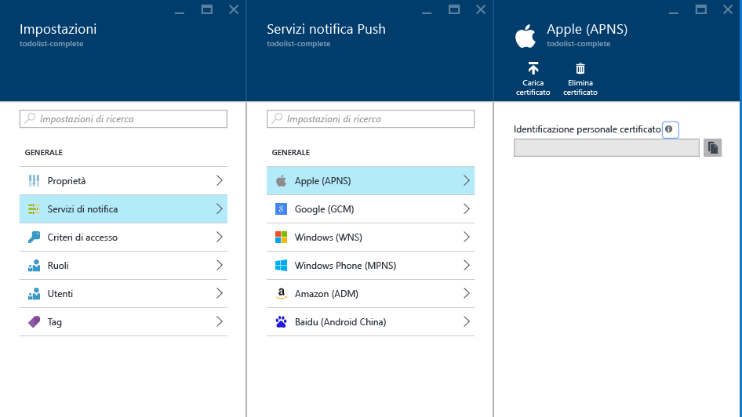

# Invio di notifiche push a iOS con Hub di notifica di Azure
[!INCLUDE [notification-hubs-selector-get-started](../../includes/notification-hubs-selector-get-started.md)]

## Panoramica
> [!NOTE]
> Per completare l'esercitazione, è necessario disporre di un account Azure attivo. Se non si dispone di un account, è possibile creare un account di valutazione gratuita in pochi minuti. Per informazioni dettagliate, vedere la pagina relativa alla [versione di valutazione gratuita di Azure](https://azure.microsoft.com/pricing/free-trial/?WT.mc_id=A0E0E5C02&amp;returnurl=http%3A%2F%2Fazure.microsoft.com%2Fen-us%2Fdocumentation%2Farticles%2Fnotification-hubs-ios-get-started).
> 
> 

Questa esercitazione illustra come usare Hub di notifica di Azure per inviare notifiche push a un'applicazione per iOS. Si creerà un'app iOS vuota che riceve notifiche push tramite [Apple Push Notification Service (servizio APN)](https://developer.apple.com/library/ios/documentation/NetworkingInternet/Conceptual/RemoteNotificationsPG/Chapters/ApplePushService.html). 

Al termine, sarà possibile usare l’hub di notifica per trasmettere le notifiche push a tutti i dispositivi che eseguono l'app.

## Prima di iniziare
[!INCLUDE [notification-hubs-hero-slug](../../includes/notification-hubs-hero-slug.md)]

Il codice completo per questa esercitazione è disponibile in [GitHub](https://github.com/Azure/azure-notificationhubs-samples/tree/master/iOS/GetStartedNH/GetStarted). 

## Prerequisiti
Per completare questa esercitazione, è necessario disporre di:

* [Mobile Services iOS SDK versione 1.2.4]
* Ultima versione di [Xcode]
* Un dispositivo con iOS 8 o versione successiva.
* [Apple Developer Program](https://developer.apple.com/programs/) .
  
  > [!NOTE]
  > Considerati i requisiti di configurazione delle notifiche push, è necessario distribuire e testare le notifiche push in un dispositivo fisico con iOS, iPhone o iPad, anziché in un simulatore iOS.
  > 
  > 

Il completamento di questa esercitazione costituisce un prerequisito per tutte le altre esercitazioni di Hub di notifica relative ad app per iOS.

[!INCLUDE [Notification Hubs Enable Apple Push Notifications](../../includes/notification-hubs-enable-apple-push-notifications.md)]

## Configurare l'hub di notifica per l'invio di notifiche push di iOS
Questa sezione illustra come creare un nuovo hub di notifica e configurare l'autenticazione con il servizio APN usando il certificato push **.p12** creato in precedenza. Se si vuole usare un hub di notifica che è già stato creato, è possibile ignorare il passaggio 5.

[!INCLUDE [notification-hubs-portal-create-new-hub](../../includes/notification-hubs-portal-create-new-hub.md)]

<ol start="6">

<li>

Fare clic sul pulsante <b>Servizi di notifica</b> nel pannello <b>Impostazioni</b> e quindi selezionare <b>Apple (servizio APN)</b>. Fare clic su <b>Carica certificato</b> e selezionare il file con estensione <b>p12</b> esportato in precedenza. Assicurarsi di specificare anche la password corretta.

Assicurarsi di selezionare la modalità <b>Sandbox</b>, destinata allo sviluppo. Usare la modalità <b>Produzione</b> solo se si vuole inviare notifiche push agli utenti che hanno acquistato l'app dallo Store.

</li>
</ol>
&emsp;&emsp;&emsp;&emsp;

&emsp;&emsp;&emsp;&emsp;

L'hub di notifica è ora configurato per l'uso con il servizio APN e sono disponibili le stringhe di connessione per la registrazione dell'app e l'invio di notifiche push.

## Connettere l'app iOS all'hub di notifica
1. In Xcode creare un nuovo progetto iOS e selezionare il modello **Single View Application** .
   
    ![Xcode - Single View Application][8]
    
2. Quando si configurano le opzioni per il nuovo progetto, assicurarsi di usare gli stessi valori per **Product Name** (Nome prodotto) e **Organization Identifier** (Identificatore organizzazione) specificati in precedenza durante l'impostazione dell'ID del bundle nel portale per sviluppatori Apple.
   
    ![Xcode - Opzioni di progetto][11]
    
3. In **Targets** (Destinazioni) fare clic sul nome del progetto, quindi scegliere la scheda **Build Settings** (Impostazioni compilazione) ed espandere **Code Signing Identity** (Identità di firma del codice) e quindi in **Debug** impostare l'identità di firma del codice. Modificare l'impostazione di **Levels** (Livelli) da **Basic** (Base) a **All** (Tutto) e quindi impostare **Provisioning Profile** (Profili di provisioning) sul profilo di provisioning creato in precedenza.
   
    Se il profilo di provisioning creato in Xcode non viene visualizzato, provare ad aggiornare i profili per l'identità di firma. Fare clic su **Xcode** nella barra dei menu, fare clic su **Preferences** (Preferenze), selezionare la scheda **Account**, fare clic sul pulsante **View Details** (Visualizza dettagli), selezionare la propria identità di firma e infine fare clic sul pulsante di aggiornamento nell'angolo in basso a destra.
   
    ![Xcode - Profilo di provisioning][9]
4. Scaricare la[Mobile Services iOS SDK versione 1.2.4] e decomprimere il file. In Xcode fare clic con il pulsante destro del mouse sul progetto e scegliere l'opzione **Add Files to** (Aggiungi file a) per aggiungere la cartella **WindowsAzureMessaging.framework** al progetto Xcode. Selezionare **Copy items if needed** (Copia elementi se necessario) e fare clic su **Add** (Aggiungi).
   
   > [!NOTE]
   > Notification Hubs SDK non supporta attualmente bitcode Xcode 7.  È necessario impostare **Enable Bitcode** (Abilita Bitcode) su **No** in **Build Options** (Opzioni di compilazione) per il progetto.
   > 
   > 
   
    ![Decomprimere Azure SDK][10]
5. Aggiungere un nuovo file di intestazione al progetto denominato `HubInfo.h`. Questo file includerà le costanti per l'hub di notifica.  Aggiungere le definizioni seguenti e sostituire i segnaposto dei valori letterali stringa con il *nome dell'hub* e il valore *DefaultListenSharedAccessSignature* annotati in precedenza.
   
        #ifndef HubInfo_h
        #define HubInfo_h
   
            #define HUBNAME @"<Enter the name of your hub>"
            #define HUBLISTENACCESS @"<Enter your DefaultListenSharedAccess connection string"
   
        #endif /* HubInfo_h */
6. Aprire il file `AppDelegate.h` e aggiungere le direttive import seguenti:
   
         #import <WindowsAzureMessaging/WindowsAzureMessaging.h> 
         #import "HubInfo.h"
7. Nel file `AppDelegate.m file` aggiungere il codice seguente nel metodo `didFinishLaunchingWithOptions`, in base alla versione di iOS. Questo codice registra l'handle di dispositivo nel servizio APNS:
   
    Per iOS 8:
   
         UIUserNotificationSettings *settings = [UIUserNotificationSettings settingsForTypes:UIUserNotificationTypeSound |
                                                UIUserNotificationTypeAlert | UIUserNotificationTypeBadge categories:nil];
   
        [[UIApplication sharedApplication] registerUserNotificationSettings:settings];
        [[UIApplication sharedApplication] registerForRemoteNotifications];
   
    Per versioni di iOS precedenti alla 8:
   
         [[UIApplication sharedApplication] registerForRemoteNotificationTypes: UIRemoteNotificationTypeAlert | UIRemoteNotificationTypeBadge | UIRemoteNotificationTypeSound];
8. Nello stesso file aggiungere i metodi seguenti. Questo codice si connette all'hub di notifica usando le informazioni di connessione specificate in HubInfo.h. Fornisce il token del dispositivo all'hub di notifica in modo che quest'ultimo possa inviare notifiche:
   
        - (void)application:(UIApplication *)application didRegisterForRemoteNotificationsWithDeviceToken:(NSData *) deviceToken {
            SBNotificationHub* hub = [[SBNotificationHub alloc] initWithConnectionString:HUBLISTENACCESS
                                        notificationHubPath:HUBNAME];
   
            [hub registerNativeWithDeviceToken:deviceToken tags:nil completion:^(NSError* error) {
                if (error != nil) {
                    NSLog(@"Error registering for notifications: %@", error);
                }
                else {
                    [self MessageBox:@"Registration Status" message:@"Registered"];
                }
            }];
        }
   
        -(void)MessageBox:(NSString *)title message:(NSString *)messageText
        {
            UIAlertView *alert = [[UIAlertView alloc] initWithTitle:title message:messageText delegate:self
                cancelButtonTitle:@"OK" otherButtonTitles: nil];
            [alert show];
        }
9. Nello stesso file aggiungere il metodo seguente per visualizzare un avviso **UIAlert** se la notifica viene ricevuta mentre l'app è attiva:

        - (void)application:(UIApplication *)application didReceiveRemoteNotification: (NSDictionary *)userInfo {
            NSLog(@"%@", userInfo);
            [self MessageBox:@"Notification" message:[[userInfo objectForKey:@"aps"] valueForKey:@"alert"]];
        }

1. Compilare ed eseguire l'app sul dispositivo per assicurarsi che non si verifichino errori.

## Inviare notifiche push di prova
È possibile testare la ricezione delle notifiche push nell'app inviandole tramite il [portale di Azure]. Cercare la sezione **Risoluzione dei problemi** nel pannello dell'hub e usare l'opzione *Invio di prova*.

![Portale di Azure - Invio di prova][30]

[!INCLUDE [notification-hubs-sending-notifications-from-the-portal](../../includes/notification-hubs-sending-notifications-from-the-portal.md)]

## (Facoltativo) Inviare notifiche push dall'app
> [!IMPORTANT]
> Questo esempio di invio di notifiche dall'app client è descritto solo a scopo didattico. Essendo necessario l'elemento `DefaultFullSharedAccessSignature` nell'app client, l'hub di notifica viene esposto al rischio che un utente acceda per inviare notifiche non autorizzate ai client.
> 
> 

Questa sezione fornisce un esempio di invio di notifiche push dall'interno di un'app tramite l'interfaccia REST.

1. In Xcode aprire `Main.storyboard` e aggiungere i componenti dell'interfaccia utente riportati di seguito dalla libreria di oggetti, per consentire all'utente di inviare notifiche push nell'app.
   
   * Etichetta senza testo. Sarà usata per segnalare errori di invio di notifiche. La proprietà **Lines** deve essere impostata su **0**, in modo da limitare automaticamente le dimensioni ai margini destro e sinistro e alla parte superiore della visualizzazione.
   * Campo di testo con testo **segnaposto** impostato su **Enter Notification Message** (Immetti messaggio di notifica). Vincolare il campo sotto l'etichetta, come illustrato di seguito. Impostare il controller di visualizzazione come delegato di uscita.
   * Pulsante denominato **Send Notification** vincolato, appena sotto il campo di testo e al centro nell'area orizzontale.
     
     La visualizzazione dovrebbe apparire come segue:
     
     ![Finestra di progettazione Xcode][32]
2. [Aggiungere punti di uscita](https://developer.apple.com/library/ios/recipes/xcode_help-IB_connections/chapters/CreatingOutlet.html) per l'etichetta e i campi di testo connessi alla visualizzazione e aggiornare la definizione di `interface` per supportare `UITextFieldDelegate` e `NSXMLParserDelegate`. Aggiungere le tre dichiarazioni di proprietà riportate di seguito per supportare la chiamata dell'API REST e l'analisi della risposta.
   
    Il file ViewController.h dovrebbe apparire come segue:
   
        #import <UIKit/UIKit.h>
   
        @interface ViewController : UIViewController <UITextFieldDelegate, NSXMLParserDelegate>
        {
            NSXMLParser *xmlParser;
        }
   
        // Make sure these outlets are connected to your UI by ctrl+dragging
        @property (weak, nonatomic) IBOutlet UITextField *notificationMessage;
        @property (weak, nonatomic) IBOutlet UILabel *sendResults;
   
        @property (copy, nonatomic) NSString *statusResult;
        @property (copy, nonatomic) NSString *currentElement;
   
        @end
3. Aprire `HubInfo.h` e aggiungere le costanti seguenti che verranno usate per inviare notifiche all'hub. Sostituire il valore letterale stringa del segnaposto con la stringa di connessione *DefaultFullSharedAccessSignature* effettiva.
   
        #define API_VERSION @"?api-version=2015-01"
        #define HUBFULLACCESS @"<Enter Your DefaultFullSharedAccess Connection string>"
4. Aggiungere le istruzioni `#import` seguenti al file `ViewController.h`.
   
        #import <CommonCrypto/CommonHMAC.h>
        #import "HubInfo.h"
5. In `ViewController.m` aggiungere il codice seguente all'implementazione dell'interfaccia. Questo codice analizzerà la stringa di connessione *DefaultFullSharedAccessSignature* . Come indicato nel [riferimento all'API REST](http://msdn.microsoft.com/library/azure/dn495627.aspx), queste informazioni analizzate verranno usate per generare un token di firma di accesso condiviso per l'intestazione della richiesta **Authorization** .
   
        NSString *HubEndpoint;
        NSString *HubSasKeyName;
        NSString *HubSasKeyValue;
   
        -(void)ParseConnectionString
        {
            NSArray *parts = [HUBFULLACCESS componentsSeparatedByString:@";"];
            NSString *part;
   
            if ([parts count] != 3)
            {
                NSException* parseException = [NSException exceptionWithName:@"ConnectionStringParseException"
                    reason:@"Invalid full shared access connection string" userInfo:nil];
   
                @throw parseException;
            }
   
            for (part in parts)
            {
                if ([part hasPrefix:@"Endpoint"])
                {
                    HubEndpoint = [NSString stringWithFormat:@"https%@",[part substringFromIndex:11]];
                }
                else if ([part hasPrefix:@"SharedAccessKeyName"])
                {
                    HubSasKeyName = [part substringFromIndex:20];
                }
                else if ([part hasPrefix:@"SharedAccessKey"])
                {
                    HubSasKeyValue = [part substringFromIndex:16];
                }
            }
        }
6. In `ViewController.m` aggiornare il metodo `viewDidLoad` per analizzare la stringa di connessione quando viene caricata la visualizzazione. Aggiungere anche i metodi di utilità illustrati di seguito all'implementazione dell'interfaccia.  

        - (void)viewDidLoad
        {
            [super viewDidLoad];
            [self ParseConnectionString];
            [_notificationMessage setDelegate:self];
        }

        -(NSString *)CF_URLEncodedString:(NSString *)inputString
        {
           return (__bridge NSString *)CFURLCreateStringByAddingPercentEscapes(NULL, (CFStringRef)inputString,
                NULL, (CFStringRef)@"!*'();:@&=+$,/?%#[]", kCFStringEncodingUTF8);
        }

        -(void)MessageBox:(NSString *)title message:(NSString *)messageText
        {
            UIAlertView *alert = [[UIAlertView alloc] initWithTitle:title message:messageText delegate:self
                cancelButtonTitle:@"OK" otherButtonTitles: nil];
            [alert show];
        }

1. In `ViewController.m`aggiungere il codice seguente all'implementazione dell'interfaccia per generare il token di autorizzazione della firma di accesso condiviso che verrà fornito nell'intestazione **Authorization** , come indicato nel [riferimento all'API REST](http://msdn.microsoft.com/library/azure/dn495627.aspx).
   
        -(NSString*) generateSasToken:(NSString*)uri
        {
            NSString *targetUri;
            NSString* utf8LowercasedUri = NULL;
            NSString *signature = NULL;
            NSString *token = NULL;
   
            @try
            {
                // Add expiration
                uri = [uri lowercaseString];
                utf8LowercasedUri = [self CF_URLEncodedString:uri];
                targetUri = [utf8LowercasedUri lowercaseString];
                NSTimeInterval expiresOnDate = [[NSDate date] timeIntervalSince1970];
                int expiresInMins = 60; // 1 hour
                expiresOnDate += expiresInMins * 60;
                UInt64 expires = trunc(expiresOnDate);
                NSString* toSign = [NSString stringWithFormat:@"%@\n%qu", targetUri, expires];
   
                // Get an hmac_sha1 Mac instance and initialize with the signing key
                const char *cKey  = [HubSasKeyValue cStringUsingEncoding:NSUTF8StringEncoding];
                const char *cData = [toSign cStringUsingEncoding:NSUTF8StringEncoding];
                unsigned char cHMAC[CC_SHA256_DIGEST_LENGTH];
                CCHmac(kCCHmacAlgSHA256, cKey, strlen(cKey), cData, strlen(cData), cHMAC);
                NSData *rawHmac = [[NSData alloc] initWithBytes:cHMAC length:sizeof(cHMAC)];
                signature = [self CF_URLEncodedString:[rawHmac base64EncodedStringWithOptions:0]];
   
                // Construct authorization token string
                token = [NSString stringWithFormat:@"SharedAccessSignature sig=%@&se=%qu&skn=%@&sr=%@",
                    signature, expires, HubSasKeyName, targetUri];
            }
            @catch (NSException *exception)
            {
                [self MessageBox:@"Exception Generating SaS Token" message:[exception reason]];
            }
            @finally
            {
                if (utf8LowercasedUri != NULL)
                    CFRelease((CFStringRef)utf8LowercasedUri);
                if (signature != NULL)
                CFRelease((CFStringRef)signature);
            }
   
            return token;
        }
2. Premere CTRL e trascinare dal pulsante **Send Notification** (Invia notifica) a `ViewController.m` per aggiungere un'azione denominata **SendNotificationMessage** per l'evento **Touch Down**. Aggiornare il metodo con il codice seguente per inviare la notifica con l'API REST.
   
        - (IBAction)SendNotificationMessage:(id)sender
        {
            self.sendResults.text = @"";
            [self SendNotificationRESTAPI];
        }
   
        - (void)SendNotificationRESTAPI
        {
            NSURLSession* session = [NSURLSession
                             sessionWithConfiguration:[NSURLSessionConfiguration defaultSessionConfiguration]
                             delegate:nil delegateQueue:nil];
   
            // Apple Notification format of the notification message
            NSString *json = [NSString stringWithFormat:@"{\"aps\":{\"alert\":\"%@\"}}",
                                self.notificationMessage.text];
   
            // Construct the message's REST endpoint
            NSURL* url = [NSURL URLWithString:[NSString stringWithFormat:@"%@%@/messages/%@", HubEndpoint,
                                                HUBNAME, API_VERSION]];
   
            // Generate the token to be used in the authorization header
            NSString* authorizationToken = [self generateSasToken:[url absoluteString]];
   
            //Create the request to add the APNs notification message to the hub
            NSMutableURLRequest *request = [NSMutableURLRequest requestWithURL:url];
            [request setHTTPMethod:@"POST"];
            [request setValue:@"application/json;charset=utf-8" forHTTPHeaderField:@"Content-Type"];
   
            // Signify Apple notification format
            [request setValue:@"apple" forHTTPHeaderField:@"ServiceBusNotification-Format"];
   
            //Authenticate the notification message POST request with the SaS token
            [request setValue:authorizationToken forHTTPHeaderField:@"Authorization"];
   
            //Add the notification message body
            [request setHTTPBody:[json dataUsingEncoding:NSUTF8StringEncoding]];
   
            // Send the REST request
            NSURLSessionDataTask* dataTask = [session dataTaskWithRequest:request
                completionHandler:^(NSData *data, NSURLResponse *response, NSError *error)
            {
                NSHTTPURLResponse* httpResponse = (NSHTTPURLResponse*) response;
                if (error || (httpResponse.statusCode != 200 && httpResponse.statusCode != 201))
                {
                    NSLog(@"\nError status: %d\nError: %@", httpResponse.statusCode, error);
                }
                if (data != NULL)
                {
                    xmlParser = [[NSXMLParser alloc] initWithData:data];
                    [xmlParser setDelegate:self];
                       [xmlParser parse];
                }
            }];
            [dataTask resume];
        }
3. In `ViewController.m`aggiungere il metodo delegato seguente per supportare la chiusura della tastiera per il campo di testo. Premere CTRL e trascinare dal campo di testo all'icona del controller di visualizzazione nella finestra di progettazione di interfaccia per impostare il controller di visualizzazione del delegato di uscita.
   
        //===[ Implement UITextFieldDelegate methods ]===
   
        -(BOOL)textFieldShouldReturn:(UITextField *)textField
        {
            [textField resignFirstResponder];
            return YES;
        }
4. In `ViewController.m` aggiungere i metodi delegati seguenti per supportare l'analisi della risposta con `NSXMLParser`.
   
       //===[ Implement NSXMLParserDelegate methods ]===
   
       -(void)parserDidStartDocument:(NSXMLParser *)parser
       {
           self.statusResult = @"";
       }
   
       -(void)parser:(NSXMLParser *)parser didStartElement:(NSString *)elementName
           namespaceURI:(NSString *)namespaceURI qualifiedName:(NSString *)qName
           attributes:(NSDictionary *)attributeDict
       {
           NSString * element = [elementName lowercaseString];
           NSLog(@"*** New element parsed : %@ ***",element);
   
           if ([element isEqualToString:@"code"] | [element isEqualToString:@"detail"])
           {
               self.currentElement = element;
           }
       }
   
       -(void) parser:(NSXMLParser *)parser foundCharacters:(NSString *)parsedString
       {
           self.statusResult = [self.statusResult stringByAppendingString:
               [NSString stringWithFormat:@"%@ : %@\n", self.currentElement, parsedString]];
       }
   
       -(void)parserDidEndDocument:(NSXMLParser *)parser
       {
           // Set the status label text on the UI thread
           dispatch_async(dispatch_get_main_queue(),
           ^{
               [self.sendResults setText:self.statusResult];
           });
       }
5. Compilare il progetto e verificare che non siano presenti errori.

> [!NOTE]
> Se si verifica un errore di compilazione in Xcode7 relativo al supporto per Bitcode, è necessario modificare **Build Settings** (Impostazioni compilazione) > **Enable Bitcode (ENABLE_BITCODE)** (Abilita Bitcode) impostandolo su **NO** in Xcode. Notification Hubs SDK non supporta attualmente bitcode. 
> 
> 

È possibile trovare tutti i payload di notifica disponibili nella [guida alla programmazione di notifiche push e locali]di Apple.

## Verifica della ricezione di notifiche push nell'app
Per testare le notifiche push in iOS, è necessario distribuire l'app in un dispositivo fisico iOS. Non è possibile inviare notifiche push Apple con il simulatore iOS.

1. Eseguire l'app e verificare che la registrazione riesca e quindi scegliere **OK**.
   
    ![Test di registrazione notifica push per app iOS][33]
2. È possibile inviare una notifica push di prova dal [portale di Azure], come illustrato in precedenza. Se è stato aggiunto codice per l'invio delle notifiche push nell'app, toccare nel campo di testo per immettere un messaggio di notifica. Usare il pulsante **Send** (Invia) sulla tastiera o il pulsante **Send Notification** (Invia notifica) nella visualizzazione per inviare il messaggio di notifica.
   
    ![Test di invio notifica push per app iOS][34]
3. La notifica push viene inviata a tutti i dispositivi registrati per la ricezione di notifiche dall'hub di notifica specifico.
   
    ![Test di ricezione notifica push per app iOS][35]

## Passaggi successivi
In questo semplice esempio le notifiche push sono state trasmesse a tutti i dispositivi iOS registrati. Come passaggio successivo nella formazione, vedere l'esercitazione [Uso di Hub di notifica di Azure per inviare notifiche agli utenti per iOS con back-end .NET] , che illustra la creazione di un back-end per l'invio di notifiche push tramite tag. 

Per segmentare gli utenti per gruppi di interesse, è possibile vedere anche l'esercitazione [Usare Hub di notifica per inviare le ultime notizie] . 

Per informazioni generali su Hub di notifica, vedere [Panoramica dell'Hub di notifica].

<!-- Images. -->

[6]: ./media/notification-hubs-ios-get-started/notification-hubs-configure-ios.png
[8]: ./media/notification-hubs-ios-get-started/notification-hubs-create-ios-app.png
[9]: ./media/notification-hubs-ios-get-started/notification-hubs-create-ios-app2.png
[10]: ./media/notification-hubs-ios-get-started/notification-hubs-create-ios-app3.png
[11]: ./media/notification-hubs-ios-get-started/notification-hubs-xcode-product-name.png

[30]: ./media/notification-hubs-ios-get-started/notification-hubs-test-send.png

[31]: ./media/notification-hubs-ios-get-started/notification-hubs-ios-ui.png
[32]: ./media/notification-hubs-ios-get-started/notification-hubs-storyboard-view.png
[33]: ./media/notification-hubs-ios-get-started/notification-hubs-test1.png
[34]: ./media/notification-hubs-ios-get-started/notification-hubs-test2.png
[35]: ./media/notification-hubs-ios-get-started/notification-hubs-test3.png

<!-- URLs. -->
[Mobile Services iOS SDK versione 1.2.4]: http://aka.ms/kymw2g
[Mobile Services iOS SDK]: http://go.microsoft.com/fwLink/?LinkID=266533
[Submit an app page]: http://go.microsoft.com/fwlink/p/?LinkID=266582
[My Applications]: http://go.microsoft.com/fwlink/p/?LinkId=262039
[Live SDK for Windows]: http://go.microsoft.com/fwlink/p/?LinkId=262253

[Get started with Mobile Services]: /develop/mobile/tutorials/get-started-ios
[Azure Classic Portal]: https://manage.windowsazure.com/
[Panoramica dell'Hub di notifica]: http://msdn.microsoft.com/library/jj927170.aspx
[Xcode]: https://go.microsoft.com/fwLink/p/?LinkID=266532
[iOS Provisioning Portal]: http://go.microsoft.com/fwlink/p/?LinkId=272456

[Get started with push notifications in Mobile Services]: ../mobile-services-javascript-backend-ios-get-started-push.md
[Uso di Hub di notifica di Azure per inviare notifiche agli utenti per iOS con back-end .NET]: notification-hubs-aspnet-backend-ios-apple-apns-notification.md
[Usare Hub di notifica per inviare le ultime notizie]: notification-hubs-ios-xplat-segmented-apns-push-notification.md

[guida alla programmazione di notifiche push e locali]: http://developer.apple.com/library/mac/#documentation/NetworkingInternet/Conceptual/RemoteNotificationsPG/Chapters/ApplePushService.html#//apple_ref/doc/uid/TP40008194-CH100-SW1
[portale di Azure]: https://portal.azure.com
