# Notifiche push basate su recinto virtuale con Hub di notifica di Azure e dati spaziali di Bing
> [!NOTE]
> Per completare l'esercitazione, è necessario disporre di un account Azure attivo. Se non si dispone di un account, è possibile creare un account di valutazione gratuita in pochi minuti. Per informazioni dettagliate, vedere la pagina relativa alla [versione di valutazione gratuita di Azure](https://azure.microsoft.com/pricing/free-trial/?WT.mc_id=A0E0E5C02).
> 
> 

In questa esercitazione si apprenderà come recapitare le notifiche push in base alla posizione con Hub di notifica di Azure e i dati spaziali di Bing, sfruttando un'applicazione della piattaforma UWP (Universal Windows Platform).

## Prerequisiti
Prima di tutto è necessario assicurarsi di avere tutti i prerequisiti software e relativi ai servizi:

* [Visual Studio 2015 Update 1](https://www.visualstudio.com/it-IT/downloads/download-visual-studio-vs.aspx) o versione successiva (è accettabile anche [Community Edition](https://go.microsoft.com/fwlink/?LinkId=691978&clcid=0x409)). 
* Versione più recente di [Azure SDK](https://azure.microsoft.com/downloads/). 
* [Account Bing Maps Dev Center](https://www.bingmapsportal.com/) (è possibile crearne uno gratuitamente e associarlo all'account Microsoft). 

## Introduzione
Si potrà quindi iniziare con la creazione del progetto. In Visual Studio avviare un nuovo progetto di tipo **App vuota (Windows universale)**.

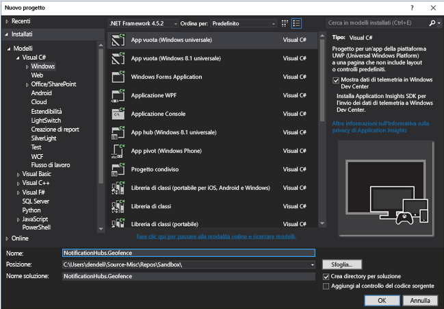

Una volta completata la creazione del progetto, saranno disponibili tutte le potenzialità per l'app stessa. Ora si procederà alla configurazione dell'intera struttura del recinto virtuale. Poiché a questo scopo si vogliono usare i servizi di Bing, è disponibile un endpoint API REST pubblico che consente di eseguire query su frame di posizione specifici:

    http://spatial.virtualearth.net/REST/v1/data/

Per renderlo funzionante, è necessario specificare i parametri seguenti:

* **ID origine dati** e **Nome origine dati**: nell'API Bing Maps le origini dati contengono diversi metadati suddivisi in bucket, ad esempio posizioni e orario di ufficio dell'operazione. Altre informazioni sono disponibili qui. 
* **Nome entità**: l'entità che si vuole usare come punto di riferimento per la notifica. 
* **Chiave API di Bing Maps**: questa è la chiave ottenuta in precedenza durante la creazione dell'account Bing Dev Center.

Di seguito si esaminerà in dettaglio la configurazione per ognuno degli elementi precedenti.

## Configurazione dell'origine dati
È possibile eseguire questa operazione in Bing Maps Dev Center. Basta fare clic su **Data sources** sulla barra di spostamento in alto e selezionare **Manage Data Sources**.

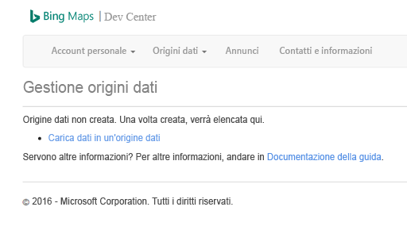

Se l'API Bing Maps non è mai stata usata prima, molto probabilmente non saranno presenti origini dati, quindi è possibile crearne una nuova facendo clic su Upload data source. Assicurarsi di compilare tutti i campi obbligatori:

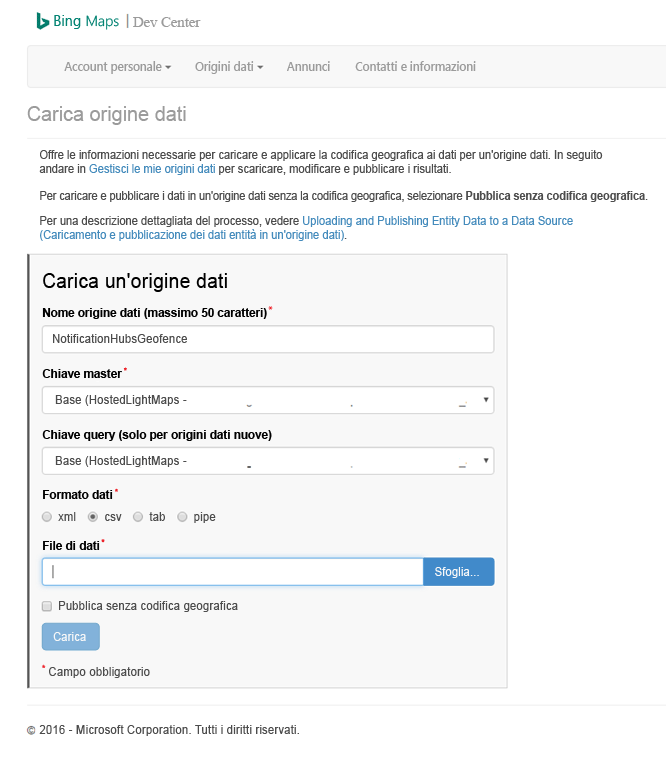

Ci si potrebbe chiedere che cos'è il file di dati e cosa si deve caricare. Ai fini di questo test, è possibile usare semplicemente l'esempio basato su pipe che delimita un'area del porto di San Francisco:

    Bing Spatial Data Services, 1.0, TestBoundaries
    EntityID(Edm.String,primaryKey)|Name(Edm.String)|Longitude(Edm.Double)|Latitude(Edm.Double)|Boundary(Edm.Geography)
    1|SanFranciscoPier|||POLYGON ((-122.389825 37.776598,-122.389438 37.773087,-122.381885 37.771849,-122.382186 37.777022,-122.389825 37.776598))

Il codice precedente rappresenta questa entità:

Basta copiare e incollare la stringa sopra in un nuovo file e salvarlo come **NotificationHubsGeofence.pipe**, quindi caricarlo in Bing Dev Center.

> [!NOTE]
> Potrebbe essere richiesto di specificare una nuova chiave per **Master Key** diversa da **Query Key**. Creare semplicemente una nuova chiave tramite il dashboard e aggiornare la pagina di caricamento dell'origine dati.
> 
> 

Dopo aver caricato il file di dati, è necessario assicurarsi di pubblicare l'origine dati.

Passare a **Manage Data Sources**, come fatto in precedenza, trovare l'origine dati nell'elenco e fare clic su **Publish** nella colonna **Actions**. Dopo un attimo l'origine dati verrà visualizzata nella scheda **Published Data Sources**:

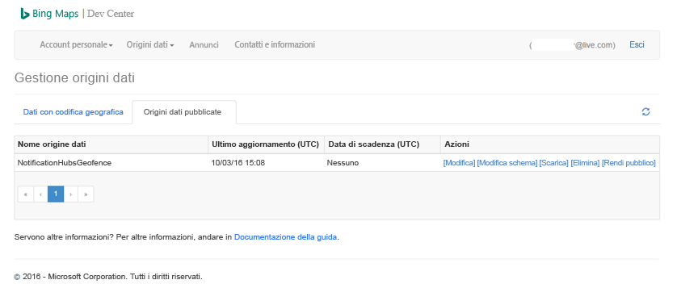

Se si fa clic su **Edit**, si potrà vedere un riepilogo delle posizioni inserite:

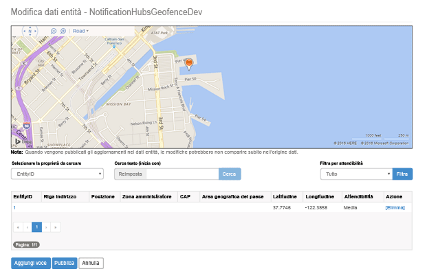

A questo punto, il portale non visualizza i limiti del recinto virtuale creato. Tutto ciò che serve è avere una conferma che la posizione specificata è in prossimità del punto corretto.

Ora sono disponibili tutti i requisiti per l'origine dati. Per altre informazioni sull'URL della richiesta per la chiamata API, in Bing Maps Dev Center fare clic su **Data sources** e selezionare **Data Source Information**.

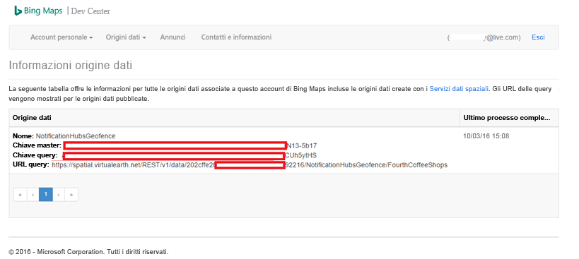

L'opzione da esaminare è **Query URL**. Si tratta dell'endpoint su cui è possibile eseguire query per verificare se il dispositivo si trova o meno entro i limiti di una posizione. Per eseguire questa verifica, è sufficiente eseguire una chiamata GET con l'URL della query, aggiungendo i parametri seguenti:

    ?spatialFilter=intersects(%27POINT%20LONGITUDE%20LATITUDE)%27)&$format=json&key=QUERY_KEY

In questo modo si specifica un punto di destinazione ottenuto dal dispositivo e Bing Maps esegue automaticamente i calcoli per vedere se si trova all'interno del recinto virtuale. Dopo l'esecuzione della richiesta tramite un browser (o cURL), si otterrà una risposta JSON standard:

Questa risposta viene restituita solo quando il punto è effettivamente entro i limiti designati. In caso contrario, si otterrà un bucket **results** vuoto:

## Configurazione dell'applicazione UWP
Ora che l'origine dati è pronta, è possibile iniziare a utilizzare l'applicazione UWP avviata in precedenza.

Prima di tutto è necessario abilitare i servizi di posizione per l'applicazione. A questo scopo, fare doppio clic sul file `Package.appxmanifest` in **Esplora soluzioni**.

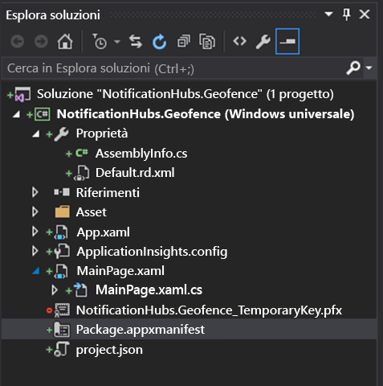

Nella scheda delle proprietà del pacchetto aperta fare clic su **Funzionalità** e assicurarsi di selezionare **Posizione**:

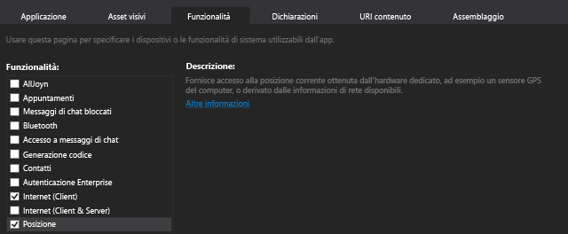

Dopo avere dichiarato la funzionalità Posizione, creare una nuova cartella denominata `Core` nella soluzione e aggiungervi un nuovo file denominato `LocationHelper.cs`:

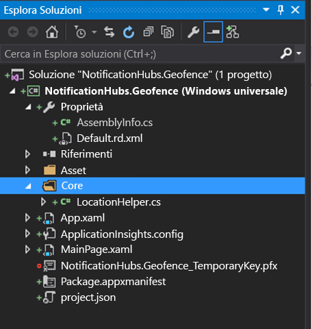

La classe `LocationHelper` stessa a questo punto è abbastanza semplice: consente solo di ottenere la posizione dell'utente tramite l'API di sistema:

    using System;
    using System.Threading.Tasks;
    using Windows.Devices.Geolocation;

    namespace NotificationHubs.Geofence.Core
    {
        public class LocationHelper
        {
            private static readonly uint AppDesiredAccuracyInMeters = 10;

            public async static Task<Geoposition> GetCurrentLocation()
            {
                var accessStatus = await Geolocator.RequestAccessAsync();
                switch (accessStatus)
                {
                    case GeolocationAccessStatus.Allowed:
                        {
                            Geolocator geolocator = new Geolocator { DesiredAccuracyInMeters = AppDesiredAccuracyInMeters };

                            return await geolocator.GetGeopositionAsync();
                        }
                    default:
                        {
                            return null;
                        }
                }
            }

        }
    }

Per altre informazioni su come ottenere la posizione dell'utente nelle app UWP, vedere il [documento ufficiale su MSDN](https://msdn.microsoft.com/library/windows/apps/mt219698.aspx).

Per verificare che l'acquisizione della posizione funzioni effettivamente, aprire il lato del codice della pagina principale (`MainPage.xaml.cs`). Creare un nuovo gestore eventi per l'evento `Loaded` nel costruttore `MainPage`:

    public MainPage()
    {
        this.InitializeComponent();
        this.Loaded += MainPage_Loaded;
    }

Ecco l'implementazione del gestore eventi:

    private async void MainPage_Loaded(object sender, RoutedEventArgs e)
    {
        var location = await LocationHelper.GetCurrentLocation();

        if (location != null)
        {
            Debug.WriteLine(string.Concat(location.Coordinate.Longitude,
                " ", location.Coordinate.Latitude));
        }
    }

Si noti che il gestore è dichiarato come async, perché `GetCurrentLocation` è di tipo awaitable e quindi richiede l'esecuzione in un contesto asincrono. Poiché in alcuni casi è possibile che venga restituita una posizione Null, ad esempio i servizi di posizione sono disabilitati o all'applicazione sono state negate le autorizzazioni per l'accesso alla posizione, è necessario assicurarsi che sia gestito correttamente con un controllo Null.

Eseguire l'applicazione. Accertarsi di consentire l'accesso alla posizione:

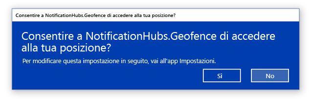

Una volta avviata l'applicazione, sarà possibile visualizzare le coordinate nella finestra **Output**:

Dopo aver stabilito che l'acquisizione della posizione funziona, è possibile rimuovere il gestore dell'evento test per Loaded, perché non verrà più usato.

Il passaggio successivo consiste nell'acquisire le modifiche della posizione. A questo scopo, tornare alla classe `LocationHelper` e aggiungere il gestore eventi per `PositionChanged`:

    geolocator.PositionChanged += Geolocator_PositionChanged;

L'implementazione mostrerà le coordinate della posizione nella finestra **Output**:

    private static async void Geolocator_PositionChanged(Geolocator sender, PositionChangedEventArgs args)
    {
        await CoreApplication.MainView.CoreWindow.Dispatcher.RunAsync(CoreDispatcherPriority.Normal, () =>
        {
            Debug.WriteLine(string.Concat(args.Position.Coordinate.Longitude, " ", args.Position.Coordinate.Latitude));
        });
    }

## Configurazione del back-end
Scaricare l'[esempio di back-end .NET da GitHub](https://github.com/Azure/azure-notificationhubs-samples/tree/master/dotnet/NotifyUsers). Una volta completato il download, aprire la cartella `NotifyUsers` e successivamente il file `NotifyUsers.sln`.

Impostare il progetto `AppBackend` come **Progetto di avvio** e avviarlo.

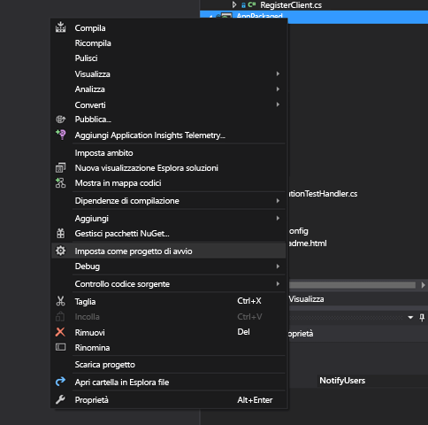

Il progetto è già configurato per l'invio di notifiche push ai dispositivi di destinazione, quindi sarà necessario eseguire solo due operazioni, ovvero sostituire la stringa di connessione con quella corretta per l'hub di notifica e aggiungere l'identificazione del limite per inviare la notifica solo quando l'utente si trova all'interno del recinto virtuale.

Per configurare la stringa di connessione, nella cartella `Models` aprire `Notifications.cs`. La funzione `NotificationHubClient.CreateClientFromConnectionString` deve contenere le informazioni sull'hub di notifica che è possibile ottenere dal [portale di Azure](https://portal.azure.com), ovvero in **Impostazioni** nel pannello **Criteri di accesso**. Salvare il file di configurazione aggiornato.

A questo punto è necessario creare un modello per il risultato dell'API Bing Maps. Il modo più semplice è fare clic sulla cartella `Models`, su **Aggiungi** > **Classe**. Denominarlo `GeofenceBoundary.cs`. Al termine, copiare il codice JSON dalla risposta dell'API descritta nella prima sezione e in Visual Studio usare **Modifica** > **Incolla speciale** > **Incolla JSON come classi**.

In questo modo si assicura che l'oggetto verrà deserializzato esattamente nel modo previsto. Il set di classi risultante sarà analogo al seguente:

    namespace AppBackend.Models
    {
        public class Rootobject
        {
            public D d { get; set; }
        }

        public class D
        {
            public string __copyright { get; set; }
            public Result[] results { get; set; }
        }

        public class Result
        {
            public __Metadata __metadata { get; set; }
            public string EntityID { get; set; }
            public string Name { get; set; }
            public float Longitude { get; set; }
            public float Latitude { get; set; }
            public string Boundary { get; set; }
            public string Confidence { get; set; }
            public string Locality { get; set; }
            public string AddressLine { get; set; }
            public string AdminDistrict { get; set; }
            public string CountryRegion { get; set; }
            public string PostalCode { get; set; }
        }

        public class __Metadata
        {
            public string uri { get; set; }
        }
    }

Aprire quindi `Controllers` > `NotificationsController.cs`. È necessario modificare la chiamata Post per tenere conto della longitudine e latitudine della destinazione. A questo scopo, è sufficiente aggiungere due stringhe alla firma della funzione: `latitude` e `longitude`.

    public async Task<HttpResponseMessage> Post(string pns, [FromBody]string message, string to_tag, string latitude, string longitude)

Creare una nuova classe all'interno del progetto chiamata `ApiHelper.cs`. Verrà usata per connettersi a Bing per controllare le intersezioni dei limiti del punto. Implementare una funzione `IsPointWithinBounds` simile alla seguente:

    public class ApiHelper
    {
        public static readonly string ApiEndpoint = "{YOUR_QUERY_ENDPOINT}?spatialFilter=intersects(%27POINT%20({0}%20{1})%27)&$format=json&key={2}";
        public static readonly string ApiKey = "{YOUR_API_KEY}";

        public static bool IsPointWithinBounds(string longitude,string latitude)
        {
            var json = new WebClient().DownloadString(string.Format(ApiEndpoint, longitude, latitude, ApiKey));
            var result = JsonConvert.DeserializeObject<Rootobject>(json);
            if (result.d.results != null && result.d.results.Count() > 0)
            {
                return true;
            }
            else
            {
                return false;
            }
        }
    }

> [!NOTE]
> Assicurarsi di sostituire l'endpoint API con l'URL della query ottenuto in precedenza da Bing Dev Center (lo stesso vale per la chiave API).
> 
> 

Se sono presenti risultati per la query, significa che il punto specificato si trova entro i limiti del recinto virtuale, quindi viene restituito `true`. Se non sono presenti risultati, significa che il punto è all'esterno del frame di ricerca, quindi viene restituito `false`.

Tornare a `NotificationsController.cs` e creare un controllo prima dell'istruzione switch:

    if (ApiHelper.IsPointWithinBounds(longitude, latitude))
    {
        switch (pns.ToLower())
        {
            case "wns":
                //// Windows 8.1 / Windows Phone 8.1
                var toast = @"<toast><visual><binding template=""ToastText01""><text id=""1"">" +
                            "From " + user + ": " + message + "</text></binding></visual></toast>";
                outcome = await Notifications.Instance.Hub.SendWindowsNativeNotificationAsync(toast, userTag);

                // Windows 10 specific Action Center support
                toast = @"<toast><visual><binding template=""ToastGeneric""><text id=""1"">" +
                            "From " + user + ": " + message + "</text></binding></visual></toast>";
                outcome = await Notifications.Instance.Hub.SendWindowsNativeNotificationAsync(toast, userTag);

                break;
        }
    }

In questo modo la notifica viene inviata solo se il punto si trova entro i limiti.

## Test delle notifiche push nell'app UWP
Tornando all'app UWP si sarà in grado di testare le notifiche. Nella classe `LocationHelper` creare una nuova funzione `SendLocationToBackend`:

    public static async Task SendLocationToBackend(string pns, string userTag, string message, string latitude, string longitude)
    {
        var POST_URL = "http://localhost:8741/api/notifications?pns=" +
            pns + "&to_tag=" + userTag + "&latitude=" + latitude + "&longitude=" + longitude;

        using (var httpClient = new HttpClient())
        {
            try
            {
                await httpClient.PostAsync(POST_URL, new StringContent(""" + message + """,
                    System.Text.Encoding.UTF8, "application/json"));
            }
            catch (Exception ex)
            {
                Debug.WriteLine(ex.Message);
            }
        }
    }

> [!NOTE]
> Scambiare `POST_URL` con il percorso dell'applicazione Web distribuita creata nella sezione precedente. Per ora è possibile eseguirla in locale, ma quando si lavora alla distribuzione di una versione pubblica, sarà necessario ospitarla presso un provider esterno.
> 
> 

È importante, a questo punto, accertarsi di registrare l'app UWP per le notifiche push. In Visual Studio fare clic su **Progetto** > **Store** > **Associa applicazione a Store**.

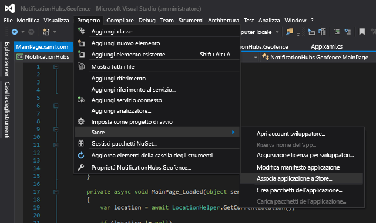

Dopo l'accesso con l'account per sviluppatore, assicurarsi di selezionare un'app esistente o crearne una nuova a cui si deve associare il pacchetto.

Usare Dev Center e aprire l'app appena creata. Fare clic su **Servizi** > **Notifiche Push** > **Sito dei servizi Live**.

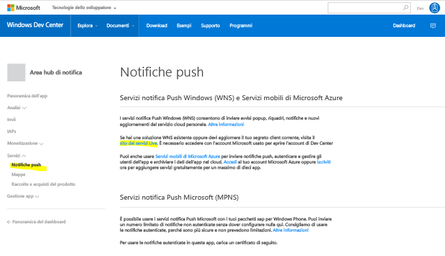

Nel sito prendere nota del **segreto applicazione** e del **SID pacchetto**. Saranno necessari entrambi nel portale di Azure. Aprire l'hub di notifica, fare clic su **Impostazioni** > **Servizi di notifica** > **Windows (WNS)** e immettere le informazioni nei campi obbligatori.

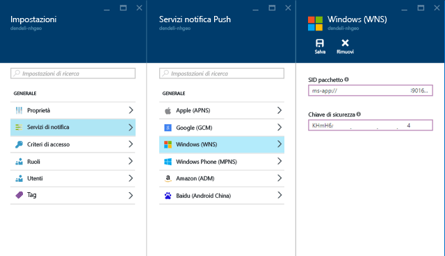

Fare clic su **Save**.

In **Esplora soluzioni** fare clic con il pulsante destro del mouse su **Riferimenti** e scegliere **Gestisci pacchetti NuGet**. Sarà necessario aggiungere un riferimento alla **libreria gestita del bus di servizio di Microsoft Azure**. Cercare semplicemente `WindowsAzure.Messaging.Managed` e aggiungerlo al progetto.

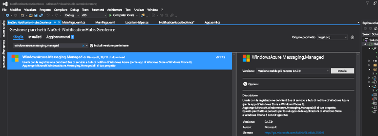

A scopo di test, è possibile creare di nuovo il gestore eventi `MainPage_Loaded` e aggiungervi questo frammento di codice:

    var channel = await PushNotificationChannelManager.CreatePushNotificationChannelForApplicationAsync();

    var hub = new NotificationHub("HUB_NAME", "HUB_LISTEN_CONNECTION_STRING");
    var result = await hub.RegisterNativeAsync(channel.Uri);

    // Displays the registration ID so you know it was successful
    if (result.RegistrationId != null)
    {
        Debug.WriteLine("Reg successful.");
    }

Il codice precedente registra l'app con l'hub di notifica. Ora si è pronti per iniziare.

In `LocationHelper`, all'interno del gestore `Geolocator_PositionChanged`, è possibile aggiungere un frammento di codice di test che inserirà la posizione all'interno del recinto virtuale in modo forzato:

    await LocationHelper.SendLocationToBackend("wns", "TEST_USER", "TEST", "37.7746", "-122.3858");

Poiché non vengono passate le coordinate reali (è possibile che al momento non ci si trovi entro i limiti) e si usano valori di test predefiniti, al momento dell'aggiornamento verrà visualizzata una notifica:

## Passaggi successivi
È possibile eseguire un paio di passaggi oltre a quelli descritti per assicurarsi che la soluzione sia pronta per la produzione.

Prima di tutto è necessario assicurarsi che i recinti virtuali siano dinamici. A questo scopo è necessario eseguire altre operazioni con l'API Bing per poter caricare nuovi limiti nell'origine dati esistente. Per altre informazioni sull'argomento, vedere la [documentazione dell'API dei servizi dati spaziali di Bing](https://msdn.microsoft.com/library/ff701734.aspx).

Dato che lo scopo è assicurarsi che le notifiche siano recapitate ai partecipanti corretti, è consigliabile usare l'[assegnazione di tag](notification-hubs-tags-segment-push-message.md).

La soluzione illustrata sopra descrive uno scenario in cui è possibile avere un'ampia gamma di piattaforme di destinazione, quindi il recinto virtuale non è stato limitato alle funzionalità specifiche del sistema. Ciò premesso, la piattaforma UWP (Universal Windows Platform) offre funzionalità per [rilevare automaticamente i recinti virtuali](https://msdn.microsoft.com/windows/uwp/maps-and-location/set-up-a-geofence).

Per altri dettagli relativi alle funzionalità di Hub di notifica, vedere il [portale di documentazione](https://azure.microsoft.com/documentation/services/notification-hubs/).

<!---HONumber=AcomDC_0622_2016-->