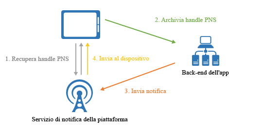
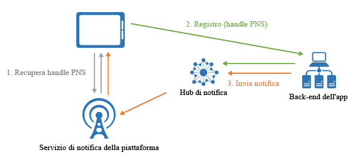

# Informazioni su Hub di notifica

Hub di notifica di Azure offre un motore di push di facile uso e con scalabilità orizzontale che consente di inviare notifiche a qualsiasi piattaforma (iOS, Android, Windows, Kindle, Baidu e così via) da qualsiasi back-end (cloud o locale). Hub di notifica funziona perfettamente per scenari aziendali e di consumo. Di seguito vengono forniti alcuni scenari di esempio:

- Invio di notifiche sulle ultime notizie a milioni di utenti con bassa latenza.
- Invio di coupon in base alla posizione a segmenti di utenti interessati.
- Invio di notifiche sugli eventi a utenti o gruppi per applicazioni di media, sport, finanza e gioco.
- Push di contenuti promozionali alle applicazioni per coinvolgere e offrire prodotti ai clienti.
- Notifiche agli utenti su eventi aziendali, come nuovi messaggi ed elementi di lavoro.
- Invio di codici per l'autenticazione a più fattori.

## Informazioni sulle notifiche push

Le notifiche push sono una forma di comunicazione tra l'app e l'utente in cui gli utenti delle app per dispositivi mobili vengono informati di determinate notizie desiderate, in genere con una finestra popup o con una finestra di dialogo su un dispositivo mobile. Gli utenti scelgono in genere di visualizzare o chiudere il messaggio; la prima opzione consente di aprire l'app per dispositivi mobili che ha comunicato la notifica. Alcune notifiche sono silenziose, inviate in background per consentire all'app di elaborarle e decidere cosa fare.

Le notifiche push sono fondamentali per le app di consumo perché aumentano l'interesse e l'uso delle app, mentre per le app aziendali favoriscono la comunicazione di informazioni aziendali aggiornate. Sono la migliore forma di comunicazione tra app e utente perché consentono un notevole risparmio energetico per i dispositivi mobili, sono flessibili per i mittenti di notifiche e disponibili anche quando le applicazioni corrispondenti non sono attive.

Per altre informazioni sulle notifiche push per alcune piattaforme più comuni, vedere gli argomenti seguenti:

- [Android](https://developer.android.com/guide/topics/ui/notifiers/notifications.html)
- [iOS](https://developer.apple.com/notifications/)
- [Windows](https://msdn.microsoft.com/library/windows/apps/hh779725.aspx)

## Funzionamento delle notifiche push

Le notifiche push vengono recapitate attraverso infrastrutture specifiche della piattaforma denominate *Platform Notification System* (PNS). Offrono funzionalità push essenziali per il recapito di un messaggio a un dispositivo con handle e non hanno un'interfaccia comune. Per inviare una notifica a tutti i clienti delle versioni di un'app per iOS, Android e Windows, lo sviluppatore deve usare il servizio APNS (Apple Push Notification Service), il servizio FCM (Firebase Cloud Messaging) e il servizio WNS (servizio di notifica Windows) separatamente.

In particolare, ecco come funziona un push:

1. Un'applicazione decide di voler ricevere una notifica, quindi contatta Platform Notification System per la piattaforma di destinazione dove l'applicazione è in esecuzione e richiede un handle di esecuzione push univoco e temporaneo. Il tipo di handle dipende dal sistema, ad esempio WNS usa URI mentre per APNS usa i token.
2. L'app client archivia l'handle nel provider o nel back-end dell'app.
3. Per inviare una notifica push, il back-end dell'app contatta il PNS usando l'handle per individuare una specifica app client.
4. Il PNS inoltra quindi la notifica al dispositivo specificato dall'handle.

## Difficoltà associate alle notifiche push

I PNS sono potenti. Richiedono tuttavia un grande impegno da parte degli sviluppatori di app per implementare anche i più comuni scenari di notifica push, come la trasmissione di notifiche push a utenti segmentati.

Il push delle notifiche richiede un'infrastruttura complessa che non è correlata alla logica di business principale dell'applicazione. Di seguito sono riportate alcune delle difficoltà infrastrutturali:

- **Dipendenza dalla piattaforma**
  - Il back-end richiede una logica dipendente dalla piattaforma complessa e difficile da gestire per inviare notifiche a dispositivi su diverse piattaforme perché i PNS non sono unificati.
- **Ridimensionare**
  - In base alle linee guida dei sistemi PNS,è necessario aggiornare i token di dispositivo a ogni avvio dell'app. Il back-end si occupa di una grande quantità di traffico e dell'accesso al database solo per mantenere aggiornati i token. Se il numero di dispositivi cresce fino a raggiungere centinaia, migliaia o milioni di unità, i costi per la creazione e la gestione dell'infrastruttura diventano significativi.
  - La maggior parte dei sistemi PNS non supporta la trasmissione a più dispositivi. Una semplice trasmissione a un milione di dispositivi causa un milione di chiamate ai PNS. La scalabilità di questa quantità di traffico con latenza minima è molto complessa.
- **Routing**
  - Benché i PNS siano un modo per inviare messaggi ai dispositivi, la maggior parte delle notifiche app sono destinate a utenti o a gruppi di interesse. Il back-end deve mantenere un registro per associare i dispositivi ai gruppi, agli utenti, alle proprietà e così via. Questo aumento del carico di lavoro contribuisce inevitabilmente ad aumentare i tempi di produzione e i costi di manutenzione di un'app.

## Vantaggi di Hub di notifica di Azure

Hub di notifica elimina tutte le complessità associate al push delle notifiche dal back-end dell'app. La sua infrastruttura di notifiche push multipiattaforma e con scalabilità orizzontale riduce la codifica correlata al push e semplifica il back-end. Con Hub di notifica, i dispositivi devono eseguire soltanto la registrazione dei propri handle PNS su un hub, mentre il back-end è responsabile dell'invio di messaggi a utenti o gruppi di interesse, come mostrato nella figura seguente:

Hub di notifica è un motore di push pronto all'uso e presenta i vantaggi seguenti:

- **Multipiattaforma**
  - Supporta tutte le principali piattaforme push tra cui iOS, Android, Window, Kindle e Baidu.
  - È dotato di un'interfaccia comune per effettuare il push a tutte le piattaforme in formati specifici o indipendenti dalla piattaforma senza un processo specifico per la piattaforma.
  - Consente di gestire l'handle di dispositivo in un solo posto.
- **Multi back-end**
  - Cloud o in locale
  - .NET, Node.js, Java, Python e così via
- **Insieme completo di modelli di recapito**
  - Trasmissione a una o più piattaforme: è possibile trasmettere immediatamente a milioni di dispositivi in più piattaforme con una singola chiamata API.
  - Push a dispositivo: è possibile inviare notifiche ai singoli dispositivi.
  - Push a utente: le funzionalità di tag e modelli consentono di raggiungere tutti i dispositivi multipiattaforma di un utente.
  - Push a segmento con tag dinamici: la funzionalità dei tag consente di segmentare i dispositivi e di inviarvi push in base alle esigenze, sia a un segmento o a un'espressione di segmenti (ad esempio active AND lives in Seattle NOT new user). Anziché essere limitati a pubblicazione-sottoscrizione, è possibile aggiornare i tag del dispositivo ovunque e in qualsiasi momento.
  - Push localizzato: la funzionalità dei modelli consente di ottenere la localizzazione senza influire sul codice di back-end.
  - Push non interattivo: è possibile abilitare il modello push-to-pull inviando notifiche automatiche ai dispositivi, attivandoli in modo da completare determinati pull o azioni.
  - Push pianificato: è possibile pianificare l'invio delle notifiche in qualsiasi momento.
  - Push diretto: è possibile ignorare la registrazione dei dispositivi nel servizio Hub di notifica ed eseguire direttamente push in batch per un elenco di handle di dispositivo.
  - Push personalizzato: le variabili push del dispositivo consentono di inviare notifiche push personalizzate specifiche per il dispositivo con coppie chiave-valore personalizzate.
- **Telemetria avanzata**
  - Dati di telemetria generali di push, dispositivi, errori e operazioni sono disponibili nel portale di Azure e a livello di codice.
  - La telemetria per messaggio tiene traccia di ogni push dalla chiamata della richiesta iniziale al corretto invio di push in batch da parte del servizio Hub di notifica.
  - Il feedback di Platform Notification System comunica tutto il feedback di Platform Notification System per facilitare il debug.
- **Scalabilità**
  - Invia messaggi veloci a milioni di dispositivi senza riprogettazione o partizionamento orizzontale del dispositivo.
- **Sicurezza**
  - Firma di accesso condiviso (SAS) o autenticazione federata.

## Passaggi successivi

Introduzione alla creazione e all'uso di un hub di notifica con l'[Esercitazione: Effettuare il push di notifiche ad applicazioni per dispositivi mobili](notification-hubs-android-push-notification-google-fcm-get-started.md).

[0]: ./media/notification-hubs-overview/registration-diagram.png
[1]: ./media/notification-hubs-overview/notification-hub-diagram.png

[How customers are using Notification Hubs]: https://azure.microsoft.com/services/notification-hubs
[Notification Hubs tutorials and guides]: https://azure.microsoft.com/documentation/services/notification-hubs
[iOS]: https://azure.microsoft.com/documentation/articles/notification-hubs-ios-get-started
[Android]: https://azure.microsoft.com/documentation/articles/notification-hubs-android-get-started
[Windows Universal]: https://azure.microsoft.com/documentation/articles/notification-hubs-windows-store-dotnet-get-started
[Windows Phone]: https://azure.microsoft.com/documentation/articles/notification-hubs-windows-phone-get-started
[Kindle]: https://azure.microsoft.com/documentation/articles/notification-hubs-kindle-get-started
[Xamarin.iOS]: https://azure.microsoft.com/documentation/articles/partner-xamarin-notification-hubs-ios-get-started
[Xamarin.Android]: https://azure.microsoft.com/documentation/articles/partner-xamarin-notification-hubs-android-get-started
[Microsoft.WindowsAzure.Messaging.NotificationHub]: https://msdn.microsoft.com/library/microsoft.windowsazure.messaging.notificationhub.aspx
[Microsoft.ServiceBus.Notifications]: https://msdn.microsoft.com/library/microsoft.servicebus.notifications.aspx
[App Service Mobile Apps]: https://azure.microsoft.com/documentation/articles/app-service-mobile-value-prop/
[templates]: notification-hubs-templates-cross-platform-push-messages.md
[Azure portal]: https://portal.azure.com
[tags]: (https://msdn.microsoft.com/library/azure/dn530749.aspx)
