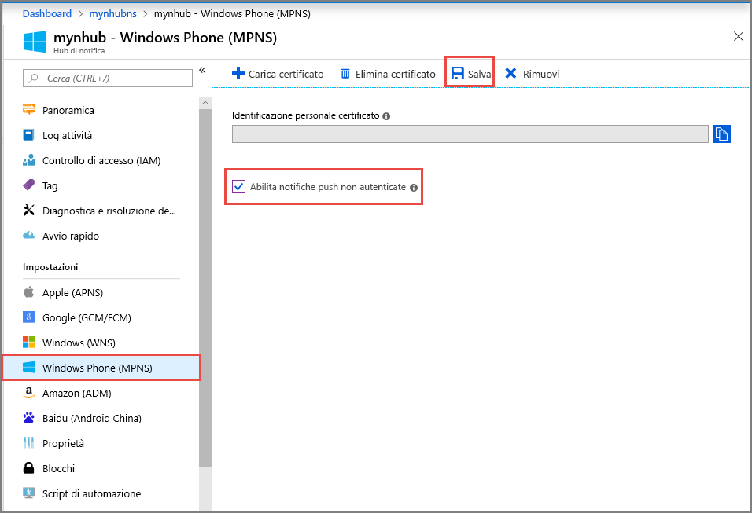

<properties
	pageTitle="Invio di notifiche push con Hub di notifica di Azure in Windows Phone | Microsoft Azure"
	description="Questa esercitazione descrive come usare Hub di notifica di Azure per inviare notifiche push a un'applicazione per Windows Phone 8 o Windows Phone 8.1 Silverlight."
	services="notification-hubs"
	documentationCenter="windows"
    keywords="notifica push, inviare notifiche push, push per windows phone"
	authors="wesmc7777"
	manager="erikre"
	editor="erikre"/>

<tags
	ms.service="notification-hubs"
	ms.workload="mobile"
	ms.tgt_pltfrm="mobile-windows-phone"
	ms.devlang="dotnet"
	ms.topic="hero-article"
	ms.date="10/03/2016"
	ms.author="wesmc"/>

# Invio di notifiche push con Hub di notifica di Azure in Windows Phone

[AZURE.INCLUDE [notification-hubs-selector-get-started](../../includes/notification-hubs-selector-get-started.md)]

##Overview

> [AZURE.NOTE] Per completare l'esercitazione, è necessario disporre di un account Azure attivo. Se non si dispone di un account, è possibile creare un account di valutazione gratuita in pochi minuti. Per informazioni dettagliate, vedere la pagina relativa alla [versione di valutazione gratuita di Azure](https://azure.microsoft.com/pricing/free-trial/?WT.mc_id=A0E0E5C02&amp;returnurl=http%3A%2F%2Fazure.microsoft.com%2Fit-IT%2Fdocumentation%2Farticles%2Fnotification-hubs-windows-phone-get-started%2F).

Questa esercitazione descrive come usare Hub di notifica di Azure per inviare notifiche push a un'applicazione per Windows Phone 8 o Windows Phone 8.1 Silverlight. Se si usa Windows Phone 8.1 (non Silverlight), fare riferimento alla versione [Windows Universal](notification-hubs-windows-store-dotnet-get-started-wns-push-notification.md). In questa esercitazione si creerà un'app per Windows Phone 8 vuota che riceve notifiche push tramite il Servizio di notifica Push di Microsoft. Al termine, sarà possibile usare l’hub di notifica per trasmettere le notifiche push a tutti i dispositivi che eseguono l'app.

> [AZURE.NOTE] L’SDK Hub di notifica per Windows Phone [AZURE.NOTE] non supporta l'uso di Windows Push Notification Service (WNS) con app per Windows Phone 8.1 Silverlight. Per usare WNS (invece di MPNS) con le app di Windows Phone 8.1 Silverlight, completare la seguente [Esercitazione su Hub di notifica - Windows Phone Silverlight] che usa le API REST.

In questa esercitazione viene illustrato uno scenario di trasmissione semplice tramite hub di notifica.

##Prerequisiti

Per completare questa esercitazione, è necessario disporre di:

+ [Visual Studio 2012 Express per Windows Phone] o versione successiva

Il completamento di questa esercitazione costituisce un prerequisito per tutte le altre esercitazioni di Hub notifica relative ad app per Windows Phone 8.

##Creare l'hub di notifica

[AZURE.INCLUDE [notification-hubs-portal-create-new-hub](../../includes/notification-hubs-portal-create-new-hub.md)]

<ol start="6">
<li>
Fare clic sulla sezione <b>Servizi di notifica</b> in <i>Impostazioni</i>, fare clic su <b>Windows Phone (MPNS)</b> e quindi selezionare la casella di controllo <b>Abilita notifiche push non autenticate</b>.

</li>
</ol>

&emsp;&emsp;

L'hub viene creato e configurato per l'invio di notifiche autenticate per Windows Phone.

> [AZURE.NOTE] In questa esercitazione verrà usato il Servizio notifica Push Microsoft in modalità senza autenticazione. Tale modalità prevede restrizioni in relazione alle notifiche che è possibile inviare a ciascun canale. Hub di notifica supporta la [modalità di autenticazione con Servizio notifica push Microsoft ](http://msdn.microsoft.com/library/windowsphone/develop/ff941099.aspx) consentendo di caricare il certificato.

##Connessione dell'app all'hub di notifica

1. In Visual Studio creare una nuova applicazione per Windows Phone 8.

   	![Visual Studio - Nuovo progetto - App di Windows Phone][13]

	In Visual Studio 2013 Update 2 o versioni successive verrà invece creata un'applicazione per Windows Phone Silverlight.

	![Visual Studio - Nuovo progetto - App vuota - Windows Phone Silverlight][11]

2. In Visual Studio fare clic con il pulsante destro del mouse sulla soluzione e quindi scegliere **Gestisci pacchetti NuGet**.

	Verrà visualizzata la finestra di dialogo **Gestisci pacchetti NuGet**.

3. Cercare `WindowsAzure.Messaging.Managed`, quindi fare clic su **Installa** e accettare le condizioni per l'utilizzo.

	![Visual Studio - Gestione pacchetti NuGet][20]

	Verrà scaricato, installato e aggiunto un riferimento alla libreria di Messaggistica di Azure per Windows tramite il <a href="http://nuget.org/packages/WindowsAzure.Messaging.Managed/">pacchetto WindowsAzure.Messaging.Managed NuGet</a>.

4. Aprire il file App.xaml.cs e aggiungere le istruzioni `using` seguenti:

        using Microsoft.Phone.Notification;
        using Microsoft.WindowsAzure.Messaging;

5. Aggiungere il codice seguente all'inizio del metodo **Application\_Launching** in App.xaml.cs:

	    var channel = HttpNotificationChannel.Find("MyPushChannel");
        if (channel == null)
        {
            channel = new HttpNotificationChannel("MyPushChannel");
            channel.Open();
            channel.BindToShellToast();
        }

        channel.ChannelUriUpdated += new EventHandler<NotificationChannelUriEventArgs>(async (o, args) =>
        {
            var hub = new NotificationHub("<hub name>", "<connection string>");
            var result = await hub.RegisterNativeAsync(args.ChannelUri.ToString());

            System.Windows.Deployment.Current.Dispatcher.BeginInvoke(() =>
            {
                MessageBox.Show("Registration :" + result.RegistrationId, "Registered", MessageBoxButton.OK);
            });
        });

    >[AZURE.NOTE] Il valore **MyPushChannel** è un indice che viene usato per cercare un canale esistente nella raccolta [HttpNotificationChannel](https://msdn.microsoft.com/library/windows/apps/microsoft.phone.notification.httpnotificationchannel.aspx). Se non è disponibile, creare una nuova voce con lo stesso nome.
    
    Assicurarsi di inserire il nome dell'hub e la stringa di connessione denominata **DefaultListenSharedAccessSignature** e ottenuta nella sezione precedente. Questo codice consente di recuperare il valore di ChannelURI per l'app dal Servizio di notifica Push di Microsoft e quindi di registrarlo con l'hub di notifica. Garantisce inoltre che il valore di ChannelURI venga registrato nell'hub di notifica a ogni avvio dell'applicazione.

	>[AZURE.NOTE]In questa esercitazione viene inviata una notifica di tipo avviso popup al dispositivo. Quando si invia una notifica di tipo riquadro, è invece necessario chiamare il metodo **BindToShellTile** sul canale. Per supportare sia la notifica di tipo riquadro che quella di tipo avviso popup, chiamare sia **BindToShellTile** che **BindToShellToast**.

6. In Esplora soluzioni espandere **Proprietà**, aprire il file `WMAppManifest.xml`, fare clic sulla scheda **Funzionalità** e assicurarsi che la funzionalità **ID\_\_CAP\_\_PUSH\_NOTIFICATION** sia selezionata.

   	![Visual Studio - Funzionalità delle app di Windows Phone][14]

   	In questo modo si garantirà che l'app sia in grado di ricevere notifiche push. In caso contrario, qualsiasi tentativo di inviare una notifica push all'app non riuscirà.

7. Premere `F5` per eseguire l'app.

	Nell'app verrà visualizzato un messaggio di registrazione.

8. Chiudere l'app.

   >[AZURE.NOTE] Per ricevere una notifica push di tipo avviso popup, l'applicazione non deve essere in esecuzione in primo piano.

##Inviare notifiche push dal back-end

È possibile inviare notifiche push usando Hub di notifica da qualsiasi back-end tramite l'<a href="http://msdn.microsoft.com/library/windowsazure/dn223264.aspx">interfaccia REST</a> pubblica. In questa esercitazione vengono inviate notifiche push con un'applicazione console .NET.

Per un esempio di come inviare notifiche push da un back-end WebAPI ASP.NET integrato con Hub di notifica, vedere [Uso di Hub di notifica di Azure per inviare notifiche agli utenti con back-end .NET](./notification-hubs-aspnet-backend-windows-dotnet-wns-notification.md).

Per un esempio di invio di notifiche push con le [API REST](https://msdn.microsoft.com/library/azure/dn223264.aspx), vedere [Come usare Hub di notifica da Java](./notification-hubs-java-push-notification-tutorial.md) e [Come usare Hub di notifica da PHP](./notification-hubs-php-push-notification-tutorial.md).

1. Fare clic con il pulsante destro del mouse sulla soluzione, scegliere **Aggiungi** e **Nuovo progetto**, quindi in **Visual C#** fare clic su **Windows**, su **Applicazione console** e infine su **OK**.

   	![Visual Studio Nuovo progetto - Applicazione console][6]

	Alla soluzione viene aggiunta una nuova applicazione console in Visual C#: Questa operazione può essere eseguita anche in una soluzione separata.

4. Fare clic su **Strumenti**, su **Gestione pacchetti libreria** e quindi su **Console di Gestione Pacchetti**.

	Verrà visualizzata la console di Gestione pacchetti.

5.  Nella finestra **Console di Gestione pacchetti** impostare **Progetto predefinito** sul nuovo progetto di applicazione console e quindi eseguire il comando seguente nella finestra della console:

        Install-Package Microsoft.Azure.NotificationHubs

	Verrà aggiunto un riferimento all’SDK dell’Hub di notifica di Azure mediante il <a href="http://www.nuget.org/packages/Microsoft.Azure.NotificationHubs/">pacchetto NuGet Microsoft.Azure.NotificationHubs</a>.

6. Aprire il file `Program.cs` e aggiungere l'istruzione `using` seguente:

        using Microsoft.Azure.NotificationHubs;

6. Nella classe `Program` aggiungere il metodo seguente.

        private static async void SendNotificationAsync()
        {
            NotificationHubClient hub = NotificationHubClient
				.CreateClientFromConnectionString("<connection string with full access>", "<hub name>");
            string toast = "<?xml version="1.0" encoding="utf-8"?>" +
                "<wp:Notification xmlns:wp="WPNotification">" +
                   "<wp:Toast>" +
                        "<wp:Text1>Hello from a .NET App!</wp:Text1>" +
                   "</wp:Toast> " +
                "</wp:Notification>";
            await hub.SendMpnsNativeNotificationAsync(toast);
        }

	Assicurarsi di sostituire il segnaposto `<hub name>` con il nome dell'hub di notifica visualizzato nel portale. Sostituire anche il segnaposto relativo alla stringa di connessione con la stringa di connessione denominata **DefaultFullSharedAccessSignature** ottenuta nella sezione "Configurazione dell'hub di notifica".

	>[AZURE.NOTE]Assicurarsi di usare la stringa di connessione con accesso **Full**, non con accesso **Listen**. La stringa con accesso di tipo attesa non ha infatti le autorizzazioni per l'invio di notifiche push.

4. Aggiungere la riga seguente nel metodo `Main`:

         SendNotificationAsync();
		 Console.ReadLine();

5. Con l'emulatore di Windows Phone in esecuzione e l'app chiusa, impostare il progetto di applicazione console come progetto di avvio predefinito, quindi premere `F5` per eseguire l'app.

	Verrà visualizzata una notifica push di tipo avviso popup. Se si tocca il bannner dell'avviso popup, verrà caricata l'app.

Tutti i possibili payload sono disponibili negli argomenti relativi al [catalogo degli avvisi popup] e al [catalogo dei riquadri] in MSDN.

##Passaggi successivi

In questo semplice esempio le notifiche push sono state trasmesse a tutti i dispositivi Windows Phone 8.

Per rivolgersi a utenti specifici, vedere l'esercitazione [Usare Hub di notifica per inviare notifiche agli utenti].

Se si desidera segmentare gli utenti per gruppi di interesse, consultare [Utilizzo di Hub di notifica per inviare le ultime notizie].

Per ulteriori informazioni sull'utilizzo di Hub di notifica, vedere la pagina delle [linee guida su Hub di notifica].

<!-- Images. -->
[6]: ./media/notification-hubs-windows-phone-get-started/notification-hub-create-console-app.png
[7]: ./media/notification-hubs-windows-phone-get-started/notification-hub-create-from-portal.png
[8]: ./media/notification-hubs-windows-phone-get-started/notification-hub-create-from-portal2.png
[9]: ./media/notification-hubs-windows-phone-get-started/notification-hub-select-from-portal.png
[10]: ./media/notification-hubs-windows-phone-get-started/notification-hub-select-from-portal2.png
[11]: ./media/notification-hubs-windows-phone-get-started/notification-hub-create-wp-silverlight-app.png
[12]: ./media/notification-hubs-windows-phone-get-started/notification-hub-connection-strings.png

[13]: ./media/notification-hubs-windows-phone-get-started/notification-hub-create-wp-app.png
[14]: ./media/notification-hubs-windows-phone-get-started/mobile-app-enable-push-wp8.png
[15]: ./media/notification-hubs-windows-phone-get-started/notification-hub-pushauth.png
[20]: ./media/notification-hubs-windows-phone-get-started/notification-hub-windows-universal-app-install-package.png
[213]: ./media/notification-hubs-windows-phone-get-started/notification-hub-create-console-app.png

<!-- URLs. -->
[Visual Studio 2012 Express per Windows Phone]: https://go.microsoft.com/fwLink/p/?LinkID=268374
[linee guida su Hub di notifica]: http://msdn.microsoft.com/library/jj927170.aspx
[MPNS authenticated mode]: http://msdn.microsoft.com/library/windowsphone/develop/ff941099(v=vs.105).aspx
[Usare Hub di notifica per inviare notifiche agli utenti]: notification-hubs-aspnet-backend-windows-dotnet-wns-notification.md
[Utilizzo di Hub di notifica per inviare le ultime notizie]: notification-hubs-windows-phone-push-xplat-segmented-mpns-notification.md
[catalogo degli avvisi popup]: http://msdn.microsoft.com/library/windowsphone/develop/jj662938(v=vs.105).aspx
[catalogo dei riquadri]: http://msdn.microsoft.com/library/windowsphone/develop/hh202948(v=vs.105).aspx
[Esercitazione su Hub di notifica - Windows Phone Silverlight]: https://github.com/Azure/azure-notificationhubs-samples/tree/master/PushToSLPhoneApp

<!---HONumber=AcomDC_1005_2016-->