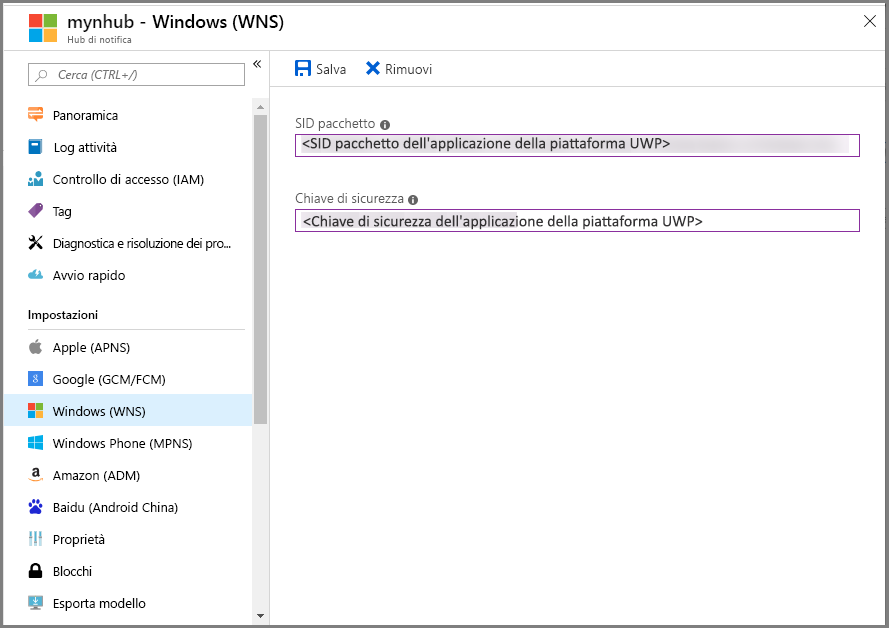

# Introduzione a Hub di notifica per le app UWP

[!INCLUDE [notification-hubs-selector-get-started](../../includes/notification-hubs-selector-get-started.md)]

## Panoramica
Questo articolo illustra come usare Hub di notifica di Azure per inviare notifiche push a un'app UWP (Universal Windows Platform).

In questo articolo si crea un'app di Windows Store vuota che riceve notifiche push tramite Servizi notifica Push Windows (WNS). Al termine, sarà possibile usare l'hub di notifica per trasmettere notifiche push a tutti i dispositivi che eseguono l'app.

## Prima di iniziare
[!INCLUDE [notification-hubs-hero-slug](../../includes/notification-hubs-hero-slug.md)]

Il codice completo per questa esercitazione è disponibile in [GitHub](https://github.com/Azure/azure-notificationhubs-samples/tree/master/dotnet/GetStartedWindowsUniversal).

## prerequisiti
Per completare questa esercitazione, è necessario disporre di:

* [Microsoft Visual Studio Community 2015](https://www.visualstudio.com/products/visual-studio-community-vs) o versione successiva
* [Strumenti per lo sviluppo di app UWP installati](https://msdn.microsoft.com/windows/uwp/get-started/get-set-up)
* Account Azure attivo   
    Se non si dispone di un account Azure, è possibile creare un account di valutazione gratuito in pochi minuti. Per altre informazioni, vedere [Versione di valutazione gratuita di Azure](https://azure.microsoft.com/pricing/free-trial/?WT.mc_id=A0E0E5C02&amp;returnurl=http%3A%2F%2Fazure.microsoft.com%2Fen-us%2Fdocumentation%2Farticles%2Fnotification-hubs-windows-store-dotnet-get-started%2F).
* Account di Windows Store attivo

Il completamento di questa esercitazione è un prerequisito per tutte le altre esercitazioni relative a Hub di notifica per le app UWP.

## Registrare l'app di Windows Store
Per inviare notifiche push ad app UWP, associare l'app a Windows Store. Configurare quindi l'hub di notifica per l'integrazione con WNS.

1. Se l'app non è ancora stata registrata, passare a [Windows Dev Center](https://dev.windows.com/overview), accedere con il proprio account Microsoft e quindi selezionare **Crea una nuova app**.

2. Digitare un nome per l'app e quindi selezionare **Riserva nome dell'app**. Verrà così creata una nuova registrazione a Windows Store per l'app.

3. In Visual Studio creare un nuovo progetto di app di Windows Store in Visual C# usando il modello **App vuota** per la piattaforma UWP e quindi selezionare **OK**.

4. Accettare le impostazioni predefinite per le versioni minima e di destinazione della piattaforma.

5. In Esplora soluzioni fare clic con il pulsante destro del mouse sul progetto di app di Windows Store, scegliere **Store** e quindi selezionare **Associa applicazione a Store**.  
    Viene visualizzata la procedura guidata **Associa l'applicazione con Windows Store** .

6. Nella procedura guidata accedere con il proprio account Microsoft.

7. Selezionare l'app registrata nel passaggio 2, quindi **Avanti** e infine **Associa**. Le informazioni di registrazione a Windows Store necessarie verranno così aggiunte al manifesto dell'applicazione.

8. Nella pagina di [Windows Dev Center](http://dev.windows.com/overview) per la nuova app selezionare **Servizi**, quindi **Notifiche push** e infine **WNS/MPNS**.

9. Selezionare **Nuova notifica**.

10. Selezionare il modello **Blank (Toast)** (Vuoto - Avviso popup) e quindi **OK**.

11. Immettere un **nome** per la notifica e un messaggio di **contesto** visivo e quindi selezionare **Salva come bozza**.

12. Passare al [portale di registrazione delle applicazioni](http://apps.dev.microsoft.com) ed eseguire l'accesso.

13. Selezionare il nome dell'applicazione. Nelle impostazioni della piattaforma **Windows Store** prendere nota della password di **Segreto dell'applicazione** e dell'**ID di sicurezza (SID) del pacchetto**.

    >[!WARNING]
    >Il segreto applicazione e il SID di pacchetto sono importanti credenziali di sicurezza. Non condividere questi valori con altri utenti né distribuirli con l'app.

## Configurare l'hub di notifica
[!INCLUDE [notification-hubs-portal-create-new-hub](../../includes/notification-hubs-portal-create-new-hub.md)]

<ol start="6">
<li>
In <b>Servizi di notifica</b> selezionare <b>Windows (WNS)</b>, quindi immettere la password segreta dell'applicazione nella casella <b>Chiave di sicurezza</b>. Nella casella <b>SID pacchetto</b> immettere il valore ottenuto da WNS nella sezione precedente e quindi selezionare <b>Salva</b>.

</li>
</ol>

L'hub di notifica è ora configurato per l'uso di WNS. Sono disponibili le stringhe di connessione per la registrazione dell'app e l'invio di notifiche.

## Connettere l'app all'hub di notifica
1. In Visual Studio fare clic con il pulsante destro del mouse sulla soluzione e quindi scegliere **Gestisci pacchetti NuGet**.  
    Verrà visualizzata la finestra **Gestisci pacchetti NuGet**.

2. Nella casella di ricerca immettere **WindowsAzure.Messaging.Managed**, selezionare **Installa** e accettare le condizioni per l'utilizzo.
   
    ![Finestra Gestisci pacchetti NuGet][20]
   
    Questa azione esegue il download, l'installazione e l'aggiunta di un riferimento alla libreria di messaggistica di Azure per Windows con il [pacchetto NuGet WindowsAzure.Messaging.Managed](http://nuget.org/packages/WindowsAzure.Messaging).

3. Aprire il file di progetto App.xaml.cs e aggiungere le istruzioni `using` seguenti: 
   
        using Windows.Networking.PushNotifications;
        using Microsoft.WindowsAzure.Messaging;
        using Windows.UI.Popups;

4. In App.xaml.cs, aggiungere alla classe **App** la definizione del metodo **InitNotificationsAsync** seguente:
   
        private async void InitNotificationsAsync()
        {
            var channel = await PushNotificationChannelManager.CreatePushNotificationChannelForApplicationAsync();
   
            var hub = new NotificationHub("<your hub name>", "<Your DefaultListenSharedAccessSignature connection string>");
            var result = await hub.RegisterNativeAsync(channel.Uri);
   
            // Displays the registration ID so you know it was successful
            if (result.RegistrationId != null)
            {
                var dialog = new MessageDialog("Registration successful: " + result.RegistrationId);
                dialog.Commands.Add(new UICommand("OK"));
                await dialog.ShowAsync();
            }
   
        }
   
    Questo codice recupera il valore di ChannelURI per l'app da Servizi notifica Push Windows e quindi lo registra con l'hub di notifica.
   
    >[!NOTE]
    >* Sostituire il segnaposto **hub name** con il nome dell'hub di notifica visualizzato nel portale di Azure. 
    >* Sostituire anche il segnaposto relativo alla stringa di connessione con la stringa di connessione **DefaultListenSharedAccessSignature** ottenuta nella pagina **Criteri di accesso** dell'hub di notifica in una sezione precedente.
   > 
   > 
5. All'inizio del gestore dell'evento **OnLaunched** in App.xaml.cs, aggiungere la chiamata seguente al nuovo metodo **InitNotificationsAsync**:
   
        InitNotificationsAsync();
   
    Questa azione garantisce la registrazione dell'URI di canale nell'hub di notifica a ogni avvio dell'applicazione.

6. Per eseguire l'app, premere **F5**. Verrà visualizzata una finestra di dialogo contenente la chiave di registrazione.

L'app è ora pronta per ricevere notifiche di tipo avviso popup.

## Inviare notifiche
È possibile testare rapidamente la ricezione di notifiche nell'app inviando notifiche nel [portale di Azure](https://portal.azure.com/). Usare il pulsante **Invio di prova** nell'hub di notifica, come illustrato nell'immagine seguente:

Le notifiche push vengono in genere inviate in un servizio back-end come Servizi mobili o ASP.NET usando una libreria compatibile. Se non è disponibile una libreria per il back-end, è anche possibile inviare messaggi di notifica usando direttamente l'API REST. 

Questa esercitazione illustra come testare l'app client inviando semplicemente notifiche che usano .NET SDK per gli hub di notifica in un'applicazione console, anziché in un servizio back-end. Come passaggio successivo per l'invio di notifiche da un back-end ASP.NET, è consigliabile vedere l'esercitazione relativa all'[uso di Hub di notifica per eseguire il push di notifiche agli utenti]. È comunque possibile inviare notifiche usando gli approcci seguenti.

* **Interfaccia REST**: è possibile supportare notifiche in qualsiasi piattaforma back-end usando l'[interfaccia REST](http://msdn.microsoft.com/library/windowsazure/dn223264.aspx).

* **.NET SDK per Hub di notifica di Microsoft Azure**: in Gestione pacchetti NuGet per Visual Studio eseguire [Install-Package Microsoft.Azure.NotificationHubs](https://www.nuget.org/packages/Microsoft.Azure.NotificationHubs/).

* **Node.js**: vedere l'articolo su [come usare Hub di notifica da Node.js](notification-hubs-nodejs-push-notification-tutorial.md).
* **App per dispositivi mobili di Azure**: per un esempio di come inviare notifiche da un'app per dispositivi mobili di Azure integrata con Hub di notifica, vedere l'articolo su come [aggiungere notifiche push per le app per dispositivi mobili](../app-service-mobile/app-service-mobile-windows-store-dotnet-get-started-push.md).

* **Java o PHP**: per esempi di come inviare notifiche usando le API REST, vedere:
    * [Java](notification-hubs-java-push-notification-tutorial.md)
    * [PHP](notification-hubs-php-push-notification-tutorial.md)

## Passaggi successivi
In questo semplice esempio sono state inviate notifiche di trasmissione a tutti i dispositivi Windows usando il portale o un'app console. Per il passaggio successivo, è consigliabile vedere l'esercitazione relativa all'[uso di Hub di notifica per eseguire il push di notifiche agli utenti], che illustra come inviare notifiche da un back-end ASP.NET usando tag per specificare come destinazione utenti specifici.

Se si desidera segmentare gli utenti per gruppi di interesse, vedere [Utilizzo di Hub di notifica per inviare le ultime notizie]. 

Per altre informazioni generali, vedere le [indicazioni su Hub di notifica](notification-hubs-push-notification-overview.md).

<!-- Images. -->
[13]: ./media/notification-hubs-windows-store-dotnet-get-started/notification-hub-create-console-app.png
[14]: ./media/notification-hubs-windows-store-dotnet-get-started/notification-hub-windows-toast.png
[19]: ./media/notification-hubs-windows-store-dotnet-get-started/notification-hub-windows-reg.png
[20]: ./media/notification-hubs-windows-store-dotnet-get-started/notification-hub-windows-universal-app-install-package.png

<!-- URLs. -->

[uso di Hub di notifica per eseguire il push di notifiche agli utenti]: notification-hubs-aspnet-backend-windows-dotnet-wns-notification.md
[Utilizzo di Hub di notifica per inviare le ultime notizie]: notification-hubs-windows-notification-dotnet-push-xplat-segmented-wns.md

[toast catalog]: http://msdn.microsoft.com/library/windows/apps/hh761494.aspx
[tile catalog]: http://msdn.microsoft.com/library/windows/apps/hh761491.aspx
[badge overview]: http://msdn.microsoft.com/library/windows/apps/hh779719.aspx
 
