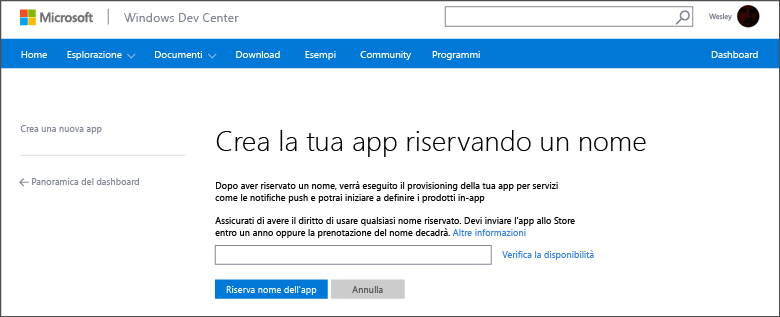
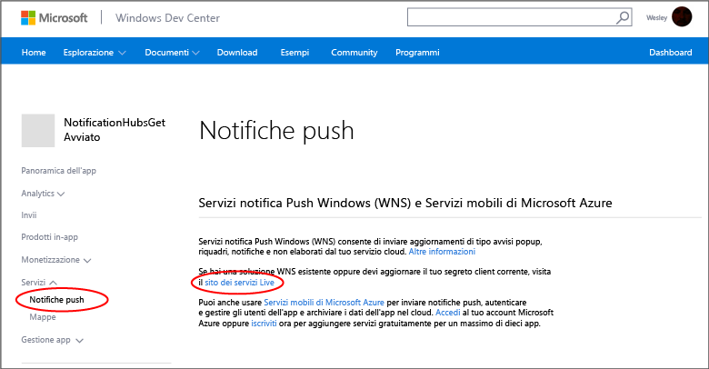
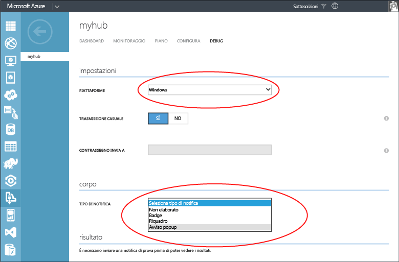

<properties
	pageTitle="Introduzione ad Hub di notifica di Azure per le app di Windows Store | Microsoft Azure"
	description="Questa esercitazione descrive come usare Hub di notifica di Azure per inviare notifiche push a un'applicazione di Windows Store o per Windows Phone 8.1 o (non Silverlight)."
	services="notification-hubs"
	documentationCenter="windows"
	authors="wesmc7777"
	manager="dwrede"
	editor="dwrede"/>

<tags
	ms.service="notification-hubs"
	ms.workload="mobile"
	ms.tgt_pltfrm="mobile-windows"
	ms.devlang="dotnet"
	ms.topic="hero-article"
	ms.date="11/23/2015"
	ms.author="wesmc"/>

# Introduzione ad Hub di notifica per le app di Windows Store

[AZURE.INCLUDE [notification-hubs-selector-get-started](../../includes/notification-hubs-selector-get-started.md)]

##Panoramica

Questa esercitazione illustra come usare Hub di notifica di Azure per inviare notifiche push a un'applicazione di Windows Store o per Windows Phone 8.1 (non Silverlight). Se si sviluppano app per Windows Phone 8.1 Silverlight, fare riferimento alla versione [Windows Phone](notification-hubs-windows-phone-get-started.md). In questa esercitazione si creerà un'app di Windows Store vuota che riceve notifiche push tramite Servizi notifica Push Windows (WNS). Al termine, sarà possibile usare l’hub di notifica per trasmettere le notifiche push a tutti i dispositivi che eseguono l'app.

## Prima di iniziare

[AZURE.INCLUDE [notification-hubs-hero-slug](../../includes/notification-hubs-hero-slug.md)]

Il codice completo per questa esercitazione è disponibile su GitHub [qui](https://github.com/Azure/azure-notificationhubs-samples/tree/master/dotnet/GetStartedWindowsUniversal).

##Prerequisiti

Per completare questa esercitazione, è necessario disporre di:

+ Microsoft Visual Studio Express 2013 per Windows con Update 2 o versione successiva Per creare un progetto di app universale è necessaria questa versione di Visual Studio. Se si desidera solo creare un'app di Windows Store, è necessario Visual Studio Express 2012 per Windows 8.

+ Account di Windows Store attivo

+ Account Azure attivo  Se non si ha un account, è possibile crearne uno di prova gratuito in pochi minuti. Per informazioni dettagliate, vedere la pagina relativa alla [versione di valutazione gratuita di Azure](http://azure.microsoft.com/pricing/free-trial/?WT.mc_id=A0E0E5C02&amp;returnurl=http%3A%2F%2Fazure.microsoft.com%2Fit-IT%2Fdocumentation%2Farticles%2Fnotification-hubs-windows-store-dotnet-get-started%2F).

Il completamento di questa esercitazione costituisce un prerequisito per tutte le altre esercitazioni di Hub notifica relative ad app di Windows Store.

##Registrare l'app di Windows Store

Per inviare notifiche push ad app di Windows Store, è necessario associare l'app a Windows Store e quindi configurare l'hub di notifica per l'integrazione con Servizi notifica Push Windows.

1. Se l'app non è ancora stata registrata, passare a <a href="http://go.microsoft.com/fwlink/p/?LinkID=266582" target="_blank">Windows Dev Center</a>, accedere con il proprio account Microsoft e quindi fare clic su **Crea una nuova app**.

2. Digitare un nome per l'app e fare clic su **Riserva nome dell'app**.

   	

   	Verrà creata una nuova registrazione a Windows Store per l'app.

3. In Visual Studio creare un nuovo progetto di app di Windows Store in Visual C# usando il modello **Applicazione vuota**.

   	![][2]

4. In Esplora soluzioni fare clic con il pulsante destro del mouse sul progetto di app di Windows Store, scegliere **Store**, quindi fare clic su **Associa applicazione a Store**.

   	![][3]

   	Viene visualizzata la procedura guidata **Associa l'applicazione con Windows Store**.

5. Nella procedura guidata fare clic su **Accedi** e quindi accedere con il proprio account Microsoft.

6. Fare clic sull'app registrata nel passaggio 2, fare clic su **Avanti** e quindi su **Associa**.

   	![][4]

   	Le informazioni di registrazione a Windows Store necessarie verranno aggiunte al manifesto dell'applicazione.

7. (Facoltativo) Ripetere i passaggi da 4 a 6 per il progetto di app di Windows Phone Store.

8. Nella pagina di Windows Dev Center della nuova app fare clic su **Servizi**, **Notifiche push** e quindi su **Sito di servizi Live** in **Servizi notifica Push Windows (WNS) e Servizi mobili di Microsoft Azure**.

   	

9. Nella scheda **Impostazioni app** prendere nota dei valori specificati nei campi **Chiave privata client** e **Identificatore di sicurezza del pacchetto (SID)**.

   	![][6]

 	> [AZURE.WARNING]Il segreto client e il SID di pacchetto sono importanti credenziali di sicurezza. Non condividere questi valori con altri utenti né distribuirli con l'app.

##Configurare l'hub di notifica

[AZURE.INCLUDE [notification-hubs-portal-create-new-hub](../../includes/notification-hubs-portal-create-new-hub.md)]

<ol start="7">
<li>
Fare clic sulla scheda <b>Configura</b> in alto, immettere i valori per <b>Segreto client</b> e <b>SID pacchetto</b> ottenuti da Servizi notifica Push Windows nella sezione precedente e quindi fare clic su <b>Salva</b>.

</li>
</ol>

&emsp;&emsp;

L'hub di notifica è ora configurato per l'uso con Servizi notifica Push Windows e si dispone delle stringhe di connessione per registrare l'app e inviare le notifiche.

##Connettere l'app all'hub di notifica

1. In Visual Studio fare clic con il pulsante destro del mouse sulla soluzione e quindi scegliere **Gestisci pacchetti NuGet**.

	Verrà visualizzata la finestra di dialogo **Gestisci pacchetti NuGet**.

2. Cercare `WindowsAzure.Messaging.Managed` e fare clic su **Installa**, selezionare tutti i progetti inclusi nella soluzione e accettare le condizioni per l'utilizzo.

	![][20]

	In tutti i progetti viene scaricato, installato e aggiunto un riferimento alla libreria di messaggistica di Azure per Windows usando il <a href="http://nuget.org/packages/WindowsAzure.Messaging.Managed/">pacchetto NuGet WindowsAzure.Messaging.Managed</a>.

3. Aprire il file di progetto App.xaml.cs e aggiungere le istruzioni `using` seguenti. In un progetto universale questo file si trova nella cartella `<project_name>.Shared`.

        using Windows.Networking.PushNotifications;
        using Microsoft.WindowsAzure.Messaging;
		using Windows.UI.Popups;

4. In App.xaml.cs aggiungere inoltre alla classe **App** la definizione del metodo **InitNotificationsAsync** seguente:

	    private async void InitNotificationsAsync()
        {
            var channel = await PushNotificationChannelManager.CreatePushNotificationChannelForApplicationAsync();

            var hub = new NotificationHub("<hub name>", "<connection string with listen access>");
			var result = await hub.RegisterNativeAsync(channel.Uri);

            // Displays the registration ID so you know it was successful
            if (result.RegistrationId != null)
            {
                var dialog = new MessageDialog("Registration successful: " + result.RegistrationId);
                dialog.Commands.Add(new UICommand("OK"));
                await dialog.ShowAsync();
            }

        }

    Questo codice recupera il valore di ChannelURI per l'app da Servizi notifica Push Windows e quindi lo registra con l'hub di notifica.

    >[AZURE.NOTE]Assicurarsi di sostituire il segnaposto relativo al nome dell'hub con il nome dell'hub di notifica visualizzato nel [portale di Azure classico] nella scheda **Hub di notifica**, ad esempio **mynotificationhub2** nell'esempio precedente: Sostituire inoltre il segnaposto relativo alla stringa di connessione con la stringa di connessione **DefaultListenSharedAccessSignature** ottenuta nella sezione precedente.

5. All'inizio del gestore dell'evento **OnLaunched** in App.xaml.cs, aggiungere la chiamata seguente al nuovo metodo **InitNotificationsAsync**:

        InitNotificationsAsync();

    In questo modo si garantisce che il valore di ChannelURI venga registrato nell'hub di notifica a ogni avvio dell'applicazione.

6. In Esplora soluzioni fare doppio clic sul file **Package.appxmanifest** dell'app di Windows Store e quindi in **Notifiche** impostare **Popup supportati** su **Sì**:

   	![][18]

   	Scegliere **Salva tutto** dal menu **File**.

7. (Facoltativo) Ripetere il passaggio precedente nel progetto di app di Windows Phone Store.

8. Premere **F5** per eseguire l'app. Verrà visualizzata una finestra di dialogo popup contenente la chiave di registrazione.

   	![][19]

9. (Facoltativo) Ripetere il passaggio precedente per eseguire il progetto Windows Phone e registrare l'app in un dispositivo Windows Phone.

L'app è ora pronta per ricevere notifiche di tipo avviso popup.

##Inviare notifiche 

È possibile testare la ricezione delle notifiche nell'app inviando notifiche nel [portale di Azure classico] tramite la scheda Debug nell'hub di notifica, come illustrato nella schermata seguente.

Le notifiche push vengono in genere inviate in un servizio back-end come Servizi mobili o ASP.NET usando una libreria compatibile. È anche possibile utilizzare l'API REST direttamente per inviare messaggi di notifica se una libreria non è disponibile per il back-end.

In questa esercitazione verrà usata un'app semplice e verrà illustrato solo il test dell'app client mediante l'invio di notifiche tramite .NET SDK per gli hub di notifica in un'applicazione console, invece che in un servizio back-end. Come passaggio successivo per l'invio di notifiche da un back-end ASP.NET, è consigliabile vedere l'esercitazione [Uso di Hub di notifica di Azure per inviare notifiche agli utenti]. Si possono tuttavia usare gli approcci seguenti per l'invio di notifiche:

* **Interfaccia REST**: è possibile supportare la notifica su qualsiasi piattaforma back-end tramite l'[interfaccia REST](http://msdn.microsoft.com/library/windowsazure/dn223264.aspx).

* **Microsoft Azure Notification Hubs .NET SDK**: in Gestione pacchetti NuGet per Visual Studio eseguire [Install-Package Microsoft.Azure.NotificationHubs](https://www.nuget.org/packages/Microsoft.Azure.NotificationHubs/).

* **Node.js**: [Come usare Hub di notifica da Node.js](notification-hubs-nodejs-how-to-use-notification-hubs.md).

* **Servizi mobili di Azure**: per un esempio di invio di notifiche da un back-end di Servizi mobili di Azure integrato con Hub di notifica, vedere "Introduzione alle notifiche push in Servizi mobili" ([Back-end .NET](../mobile-services/mobile-services-javascript-backend-windows-store-dotnet-get-started-push.md) | [Back-end JavaScript](../mobile-services/mobile-services-javascript-backend-windows-store-dotnet-get-started-push.md)).

* **Java/PHP**: per un esempio di invio di notifiche con le API REST, vedere "Come usare Hub di notifica da Java/PHP" ([Java](notification-hubs-java-backend-how-to.md) | [PHP](notification-hubs-php-backend-how-to.md)).

## (Facoltativo) Inviare notifiche da un'app console

Per inviare notifiche tramite un'applicazione console .NET seguire questa procedura.

1. Fare clic con il pulsante destro del mouse sulla soluzione, scegliere **Aggiungi** e **Nuovo progetto**, quindi in **Visual C#** fare clic su **Windows**, su **Applicazione console** e infine su **OK**.

   	![][13]

	Una nuova applicazione console Visual C# viene aggiunta alla soluzione. Questa operazione può essere eseguita anche in una soluzione separata.

2. In Visual Studio fare clic su **Strumenti**, selezionare **Gestione pacchetti NuGet** e quindi **Console di Gestione pacchetti**.

	In questo modo viene visualizzata la console di Gestione pacchetti in Visual Studio.

3. Nella finestra Console di Gestione pacchetti impostare **Progetto predefinito** sul nuovo progetto di applicazione console e quindi eseguire il comando seguente nella finestra della console:

        Install-Package Microsoft.Azure.NotificationHubs

	Verrà aggiunto un riferimento ad Azure Notification Hubs SDK usando il <a href="http://www.nuget.org/packages/Microsoft.Azure.NotificationHubs/">pacchetto NuGet Microsoft.Azure.Notification Hubs</a>.

	

4. Aprire il file Program.cs e aggiungere l'istruzione `using` seguente:

        using Microsoft.Azure.NotificationHubs;

5. Nella classe **Program** aggiungere il metodo seguente:

        private static async void SendNotificationAsync()
        {
            NotificationHubClient hub = NotificationHubClient
				.CreateClientFromConnectionString("<connection string with full access>", "<hub name>");
            var toast = @"<toast><visual><binding template=""ToastText01""><text id=""1"">Hello from a .NET App!</text></binding></visual></toast>";
            await hub.SendWindowsNativeNotificationAsync(toast);
        }

   	Assicurarsi di sostituire il segnaposto relativo al nome dell'hub con il nome dell'hub di notifica visualizzato nel [portale di Azure classico] nella scheda **Hub di notifica**. Sostituire anche il segnaposto relativo alla stringa di connessione con la stringa di connessione denominata **DefaultFullSharedAccessSignature** ottenuta nella sezione "Configurare l'hub di notifica".

	>[AZURE.NOTE]Assicurarsi di usare la stringa di connessione con accesso **Completo**, non **Attesa**. La stringa con accesso di tipo Attesa non dispone infatti delle autorizzazioni per l'invio di notifiche.

6. Aggiungere le righe seguenti nel metodo **Main**:

         SendNotificationAsync();
		 Console.ReadLine();

7. Fare clic con il pulsante destro del mouse sul progetto di applicazione console in Visual Studio e scegliere **Imposta come progetto di avvio** per impostarlo come progetto di avvio. Premere quindi **F5** per eseguire l'applicazione.

   	![][14]

	Tutti i dispositivi registrati riceveranno una notifica di tipo avviso popup. Facendo clic o toccando il banner dell'avviso popup l'app viene caricata.

Per trovare tutti i payload supportati, è possibile consultare gli argomenti relativi al [catalogo degli avvisi popup], al [catalogo dei riquadri] e alla [panoramica delle notifiche] su MSDN.

##Passaggi successivi

In questo semplice esempio le notifiche di trasmissione sono state inviate a tutti i dispositivi Windows tramite il portale o un'app console. Come passaggio successivo è consigliabile vedere l'esercitazione [Uso di Hub di notifica di Azure per inviare notifiche agli utenti]. Verrà illustrato come inviare notifiche da un back-end ASP.NET destinate a utenti specifici.

Se si desidera segmentare gli utenti per gruppi di interesse, vedere [Utilizzo di Hub di notifica per inviare le ultime notizie].

Per informazioni generali su Hub di notifica, vedere [Panoramica dell'Hub di notifica].

<!-- Images. -->
[2]: ./media/notification-hubs-windows-store-dotnet-get-started/notification-hub-create-windows-universal-app.png
[3]: ./media/notification-hubs-windows-store-dotnet-get-started/notification-hub-associate-win8-app.png
[4]: ./media/notification-hubs-windows-store-dotnet-get-started/mobile-services-select-app-name.png
[6]: ./media/notification-hubs-windows-store-dotnet-get-started/mobile-services-win8-app-push-auth.png
[11]: ./media/notification-hubs-windows-store-dotnet-get-started/notification-hub-configure-wns.png
[13]: ./media/notification-hubs-windows-store-dotnet-get-started/notification-hub-create-console-app.png
[14]: ./media/notification-hubs-windows-store-dotnet-get-started/notification-hub-windows-toast.png
[15]: ./media/notification-hubs-windows-store-dotnet-get-started/notification-hub-scheduler1.png
[16]: ./media/notification-hubs-windows-store-dotnet-get-started/notification-hub-scheduler2.png
[18]: ./media/notification-hubs-windows-store-dotnet-get-started/notification-hub-win8-app-toast.png
[19]: ./media/notification-hubs-windows-store-dotnet-get-started/notification-hub-windows-reg.png
[20]: ./media/notification-hubs-windows-store-dotnet-get-started/notification-hub-windows-universal-app-install-package.png

<!-- URLs. -->
[portale di Azure classico]: https://manage.windowsazure.com/
[Panoramica dell'Hub di notifica]: http://msdn.microsoft.com/library/jj927170.aspx

[Uso di Hub di notifica di Azure per inviare notifiche agli utenti]: notification-hubs-aspnet-backend-windows-dotnet-notify-users.md
[Utilizzo di Hub di notifica per inviare le ultime notizie]: notification-hubs-windows-store-dotnet-send-breaking-news.md

[catalogo degli avvisi popup]: http://msdn.microsoft.com/library/windows/apps/hh761494.aspx
[catalogo dei riquadri]: http://msdn.microsoft.com/library/windows/apps/hh761491.aspx
[panoramica delle notifiche]: http://msdn.microsoft.com/library/windows/apps/hh779719.aspx

<!---HONumber=AcomDC_1210_2015-->